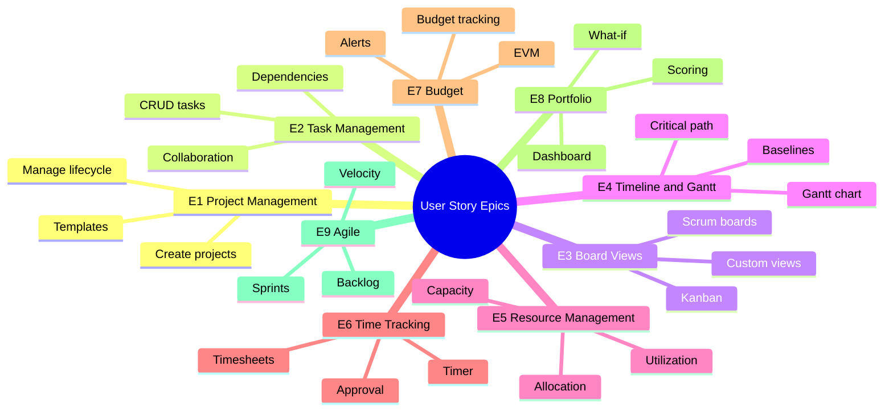

# ERP-Projects -- User Stories

## Document Control

| Field         | Value                                          |
|---------------|------------------------------------------------|
| Module        | ERP-Projects                                   |
| Version       | 1.0                                            |
| Date          | 2026-02-23                                     |

---

## 1. Epic Overview

---

## 2. Epic E1: Project Management

### US-101: Create a New Project
**As a** Project Manager,
**I want to** create a new project with name, dates, budget, and client information,
**So that** I can begin planning and tracking work for a client engagement.

**Acceptance Criteria:**
- Given I am on the projects page, when I click "New Project," then a creation form appears
- Given I fill in required fields (name, start date, end date, budget, client name, owner), when I submit, then the project is created with status "PLANNING"
- Given the project is created, when I view the project list, then the new project appears with health score 100 and completion 0%
- Given I omit required fields, when I submit, then validation errors are displayed

**Story Points:** 5

### US-102: Change Project Status
**As a** Project Manager,
**I want to** transition project status through the defined lifecycle,
**So that** stakeholders have accurate visibility into project phase.

**Acceptance Criteria:**
- Given a project in PLANNING, when I click "Start Project," then status changes to ACTIVE
- Given a project in ACTIVE, when I click "Put On Hold," then status changes to ON_HOLD
- Given a project in ON_HOLD, when I click "Resume," then status changes to ACTIVE
- Given a project in ACTIVE with all tasks complete, when I click "Complete," then status changes to COMPLETED
- Invalid transitions (e.g., PLANNING to COMPLETED directly) are prevented

**Story Points:** 3

### US-103: Use Project Templates
**As a** Project Manager,
**I want to** create a project from a template with pre-defined milestones, tasks, and resource roles,
**So that** I can quickly set up standard project types without rebuilding from scratch.

**Acceptance Criteria:**
- Given templates exist, when I click "New from Template," then I see available templates
- Given I select a template, when I confirm, then a project is created with template's milestones and tasks
- Given the project is created from template, then I can customize any template-provided elements

**Story Points:** 8

### US-104: Archive and Restore Projects
**As a** PMO Director,
**I want to** archive completed projects and restore them if needed,
**So that** the active project list stays clean while retaining historical data.

**Acceptance Criteria:**
- Given a project in COMPLETED or CANCELLED status, when I click "Archive," then it moves to archived state
- Archived projects do not appear in default project list
- Given an archived project, when I click "Restore," then it returns to its previous status

**Story Points:** 3

### US-105: Track Project Health Automatically
**As a** Project Manager,
**I want the** system to automatically calculate project health based on schedule, budget, and risk factors,
**So that** I can quickly identify projects needing attention without manual assessment.

**Acceptance Criteria:**
- Health score (0-100) recalculates when tasks, budget, or risks change
- Health status maps: 80-100 = EXCELLENT, 60-79 = GOOD, 40-59 = WARNING, 0-39 = CRITICAL
- Health factors include: schedule adherence, budget utilization, open risks, task completion rate

**Story Points:** 5

---

## 3. Epic E2: Task Management

### US-201: Create and Assign Tasks
**As a** Team Lead,
**I want to** create tasks with descriptions, estimates, and assign them to team members,
**So that** work is clearly defined and distributed.

**Acceptance Criteria:**
- Task requires title and project association
- Task supports multiple assignees with roles (Assignee, Reviewer)
- Assigned users receive notifications
- Estimated hours field is available for planning

**Story Points:** 5

### US-202: Define Task Dependencies
**As a** Project Manager,
**I want to** define Finish-to-Start, Start-to-Start, Finish-to-Finish, and Start-to-Finish dependencies between tasks,
**So that** the schedule accurately reflects workflow sequencing.

**Acceptance Criteria:**
- All four dependency types are supported
- Circular dependency detection prevents invalid links
- Dependencies visualize as arrows on Gantt chart
- Optional lag time in days between linked tasks

**Story Points:** 8

### US-203: Create Subtasks
**As a** Team Member,
**I want to** break down tasks into subtasks,
**So that** complex work items can be tracked at a granular level.

**Acceptance Criteria:**
- Any task can have child subtasks
- Subtask nesting supports at least 5 levels
- Parent task completion percentage auto-calculates from children
- Subtask inherits project and tags from parent if not overridden

**Story Points:** 5

### US-204: Add Comments with @Mentions
**As a** Team Member,
**I want to** comment on tasks and @mention colleagues,
**So that** task-specific discussions are captured in context and relevant people are notified.

**Acceptance Criteria:**
- Comments support markdown formatting
- @mention auto-completes user names
- Mentioned users receive in-app and email notification
- Comments display with user avatar, timestamp, and edit history

**Story Points:** 5

### US-205: Manage Task Checklists
**As a** Team Member,
**I want to** add checklist items to a task,
**So that** I can track sub-steps within a task without creating formal subtasks.

**Acceptance Criteria:**
- Multiple checklist items per task
- Each item has text and completed/incomplete toggle
- Checklist progress shown as "3/5 complete" on task card
- Items can be reordered via drag-and-drop

**Story Points:** 3

### US-206: Create Recurring Tasks
**As a** Project Manager,
**I want to** set up tasks that recur on a schedule,
**So that** repetitive activities (weekly reports, monthly reviews) are automatically created.

**Acceptance Criteria:**
- Recurrence patterns: daily, weekly, bi-weekly, monthly, custom RRULE
- System creates next occurrence when current is completed
- Recurring tasks display a recurring icon
- Recurrence can be stopped at any time

**Story Points:** 5

### US-207: Bulk Task Operations
**As a** Project Manager,
**I want to** select multiple tasks and perform bulk operations,
**So that** I can efficiently manage large numbers of tasks.

**Acceptance Criteria:**
- Multi-select via checkboxes or shift-click
- Supported operations: change status, assign, set priority, move to sprint, delete
- Confirmation dialog before destructive operations
- Operation results shown with success/failure count

**Story Points:** 5

---

## 4. Epic E3: Board Views

### US-301: Kanban Board View
**As a** Team Member,
**I want to** view my project tasks in a Kanban board layout,
**So that** I can visualize workflow and identify bottlenecks.

**Acceptance Criteria:**
- Board displays columns mapped to task statuses
- Cards show title, assignee avatar, priority badge, due date
- Drag-and-drop moves cards between columns (updates task status)
- Card count displayed per column

**Story Points:** 8

### US-302: Configure WIP Limits
**As a** Scrum Master,
**I want to** set Work-In-Progress limits on board columns,
**So that** the team does not take on more work than they can handle.

**Acceptance Criteria:**
- WIP limit configurable per column
- Column header turns red when limit exceeded
- Warning shown when dragging card into full column (not blocked, just warned)
- WIP violations visible in team metrics

**Story Points:** 3

### US-303: Swimlane Configuration
**As a** Team Lead,
**I want to** configure swimlanes on my board by priority, assignee, or epic,
**So that** cards are visually grouped for easier management.

**Acceptance Criteria:**
- Swimlane grouping options: Priority, Assignee, Epic, Type, None
- Swimlane rows are collapsible
- Card count displayed per swimlane
- Drag-and-drop works across swimlanes

**Story Points:** 5

---

## 5. Epic E4: Timeline and Gantt

### US-401: Interactive Gantt Chart
**As a** Project Manager,
**I want to** view an interactive Gantt chart showing all tasks with dates and dependencies,
**So that** I can visually manage the project schedule.

**Acceptance Criteria:**
- Task bars rendered with start/end dates and progress overlay
- Dependency arrows connect related tasks
- Zoom levels: day, week, month, quarter, year
- Drag task bar edges to adjust dates
- Milestones displayed as diamonds
- Critical path tasks highlighted in red

**Story Points:** 13

### US-402: Save and Compare Baselines
**As a** Project Manager,
**I want to** save schedule baselines and compare current plan against original,
**So that** I can measure schedule slippage objectively.

**Acceptance Criteria:**
- "Save Baseline" creates a snapshot of all task dates
- Baseline bars appear as gray shadows on Gantt
- Multiple baselines supported (Original, Re-baselined, etc.)
- Variance report shows days slipped per task

**Story Points:** 8

### US-403: Auto-Schedule Tasks
**As a** Project Manager,
**I want to** auto-schedule tasks based on dependencies, resource availability, and working calendar,
**So that** the schedule is optimized without manual date calculations.

**Acceptance Criteria:**
- Respects all dependency types and lag times
- Considers working days calendar (excludes weekends, holidays)
- Optionally levels resources to prevent over-allocation
- Shows before/after comparison before applying

**Story Points:** 13

---

## 6. Epic E5: Resource Management

### US-501: View Resource Availability
**As a** Resource Manager,
**I want to** see each team member's allocation across all projects,
**So that** I can identify who has available capacity for new work.

**Story Points:** 5

### US-502: Detect Over-Allocation
**As a** Resource Manager,
**I want to** be alerted when a team member is allocated more than 100%,
**So that** I can rebalance assignments before burnout or delays occur.

**Story Points:** 3

### US-503: Skill-Based Assignment
**As a** Resource Manager,
**I want to** search for team members by skill set and availability,
**So that** I can match the right people to project needs.

**Story Points:** 8

---

## 7. Epic E6: Time Tracking

### US-601: Start/Stop Timer
**As a** Team Member,
**I want to** start and stop a timer while working on a task,
**So that** my time is tracked accurately without manual calculation.

**Story Points:** 5

### US-602: Submit Weekly Timesheet
**As a** Team Member,
**I want to** review and submit my weekly timesheet,
**So that** my manager can approve my logged hours.

**Story Points:** 5

### US-603: Approve or Reject Timesheets
**As a** Manager,
**I want to** approve or reject submitted timesheets with comments,
**So that** time data is validated before payroll processing.

**Story Points:** 5

---

## 8. Epic E7: Budget Management

### US-701: View Budget Dashboard
**As a** Finance Controller,
**I want to** see planned vs actual budget with variance analysis,
**So that** I can proactively manage project financials.

**Story Points:** 8

### US-702: Configure Budget Alerts
**As a** Finance Controller,
**I want to** set budget threshold alerts (e.g., 75%, 90%, 100%),
**So that** stakeholders are notified before budget overruns.

**Story Points:** 3

---

## 9. Epic E8: Portfolio Management

### US-801: Portfolio Health Dashboard
**As a** PMO Director,
**I want to** view a portfolio dashboard showing all project health scores, budgets, and schedules,
**So that** I can prioritize executive attention on at-risk projects.

**Story Points:** 8

### US-802: What-If Scenario Modeling
**As a** PMO Director,
**I want to** model hypothetical changes and see their impact on the portfolio,
**So that** I can make informed strategic decisions.

**Story Points:** 13

---

## 10. Epic E9: Agile Management

### US-901: Manage Sprints
**As a** Scrum Master,
**I want to** create, start, and complete sprints,
**So that** the team works in time-boxed iterations.

**Story Points:** 5

### US-902: Track Burndown
**As a** Scrum Master,
**I want to** view a burndown chart showing remaining work in the current sprint,
**So that** I can assess whether the team will meet the sprint goal.

**Story Points:** 5

### US-903: Conduct Retrospective
**As a** Scrum Master,
**I want to** create a retrospective board with "Went Well," "To Improve," and "Action Items,"
**So that** the team continuously improves.

**Story Points:** 5

---

## 11. Story Point Summary

| Epic                    | Stories | Total Points |
|-------------------------|---------|-------------|
| E1: Project Management  | 5       | 24          |
| E2: Task Management     | 7       | 36          |
| E3: Board Views         | 3       | 16          |
| E4: Timeline & Gantt    | 3       | 34          |
| E5: Resource Management | 3       | 16          |
| E6: Time Tracking       | 3       | 15          |
| E7: Budget Management   | 2       | 11          |
| E8: Portfolio Management| 2       | 21          |
| E9: Agile Management    | 3       | 15          |
| **Total**               | **31**  | **188**     |
