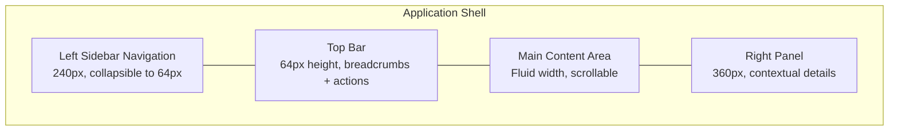
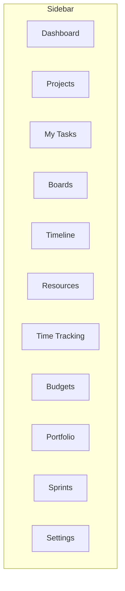

# ERP-Projects -- UI/UX Specification

## Document Control

| Field         | Value                                          |
|---------------|------------------------------------------------|
| Module        | ERP-Projects                                   |
| Version       | 1.0                                            |
| Date          | 2026-02-23                                     |

---

## 1. Design System

### 1.1 Layout Architecture



### 1.2 Color Palette

| Token               | Value     | Usage                              |
|----------------------|-----------|------------------------------------|
| `--primary`          | #2563EB   | Primary actions, links             |
| `--primary-dark`     | #1D4ED8   | Hover states                       |
| `--success`          | #16A34A   | Health excellent, on track         |
| `--warning`          | #EAB308   | Health warning, at risk            |
| `--danger`           | #DC2626   | Health critical, overdue, blockers |
| `--neutral-50`       | #F9FAFB   | Background                         |
| `--neutral-100`      | #F3F4F6   | Card backgrounds                   |
| `--neutral-200`      | #E5E7EB   | Borders                            |
| `--neutral-700`      | #374151   | Body text                          |
| `--neutral-900`      | #111827   | Headings                           |

### 1.3 Typography

| Element        | Font         | Size   | Weight |
|----------------|--------------|--------|--------|
| H1             | Inter        | 28px   | 700    |
| H2             | Inter        | 22px   | 600    |
| H3             | Inter        | 18px   | 600    |
| Body           | Inter        | 14px   | 400    |
| Caption        | Inter        | 12px   | 400    |
| Monospace      | JetBrains Mono| 13px  | 400    |

### 1.4 Priority Badge Colors

| Priority   | Background | Text    | Icon  |
|------------|------------|---------|-------|
| CRITICAL   | #FEE2E2    | #991B1B | flame |
| HIGH       | #FEF3C7    | #92400E | arrow-up |
| MEDIUM     | #DBEAFE    | #1E40AF | minus |
| LOW        | #F3F4F6    | #6B7280 | arrow-down |

### 1.5 Status Badge Colors

| Status       | Background | Text    |
|-------------|------------|---------|
| TODO        | #F3F4F6    | #6B7280 |
| IN_PROGRESS | #DBEAFE    | #1E40AF |
| IN_REVIEW   | #F3E8FF    | #6B21A8 |
| BLOCKED     | #FEE2E2    | #991B1B |
| DONE        | #DCFCE7    | #166534 |

---

## 2. Navigation Structure

### 2.1 Sidebar Navigation



| Menu Item     | Icon              | Route                    | Role Access         |
|---------------|-------------------|--------------------------|---------------------|
| Dashboard     | layout-dashboard  | /dashboard               | All                 |
| Projects      | folder            | /projects                | All                 |
| My Tasks      | check-square      | /tasks                   | All                 |
| Boards        | columns           | /boards                  | All                 |
| Timeline      | gantt-chart       | /timeline                | Manager+            |
| Resources     | users             | /resources               | Manager+            |
| Time Tracking | clock             | /time-tracking           | All                 |
| Budgets       | wallet            | /budgets                 | Manager+            |
| Portfolio     | pie-chart         | /portfolio               | Admin/PMO           |
| Sprints       | zap               | /sprints                 | All                 |
| Settings      | settings          | /settings                | Admin               |

---

## 3. Screen Specifications

### 3.1 Dashboard

**Layout:** 2-column grid with metric cards and charts

**Components:**
- Row 1: KPI cards (Active Projects, Open Tasks, Hours This Week, Budget Health)
- Row 2: My Upcoming Tasks (table), Project Health Overview (doughnut chart)
- Row 3: Activity Feed (timeline), Overdue Items (alert list)

```
+-------------------------------------------------------+
|  Active Projects: 12  | Open Tasks: 47  | Hours: 32.5 |
|  Budget Health: 82%   |                                |
+-------------------------------------------------------+
|  My Upcoming Tasks          | Project Health           |
|  [ ] Design wireframes      | [Doughnut Chart]         |
|  [ ] Review PR #234         |   Green: 8               |
|  [ ] Sprint planning        |   Yellow: 3              |
|  [ ] Budget review          |   Red: 1                 |
+-------------------------------------------------------+
|  Recent Activity            | Overdue Items            |
|  Jane created task...       | ! API docs - 2 days      |
|  Bob logged 3.5 hrs...      | ! Test plan - 1 day      |
|  Sprint 12 completed...     |                          |
+-------------------------------------------------------+
```

### 3.2 Project List View

**Layout:** Table with filters and actions

**Columns:** Name, Status, Priority, Health, Completion %, Owner, Start Date, End Date, Budget

**Actions:** New Project, Filter, Sort, Search, Export

### 3.3 Project Detail View

**Layout:** Tabbed interface within project context

**Tabs:** Overview | Tasks | Board | Timeline | Resources | Budget | Time | Settings

```
+-------------------------------------------------------+
|  [Breadcrumb: Projects > Website Redesign]             |
|  Health: 78 [====----] GOOD                           |
|  Status: ACTIVE  Priority: HIGH  Budget: $75K / $85K  |
+-------------------------------------------------------+
|  [Overview] [Tasks] [Board] [Timeline] [Resources] ... |
+-------------------------------------------------------+
|  [Tab Content Area]                                    |
|                                                        |
+-------------------------------------------------------+
```

### 3.4 Task List View

**Layout:** Filterable table with inline editing

**Features:**
- Column visibility toggle
- Inline status change via dropdown
- Inline priority change via dropdown
- Expandable subtask rows
- Multi-select for bulk operations
- Search and filter bar

### 3.5 Kanban Board View

**Layout:** Horizontal scrolling columns with cards

```
+--------+--------+---------+--------+------+
| TO DO  | IN     | IN      | BLOCKED| DONE |
|   (5)  | PROG   | REVIEW  |  (1)   | (12) |
|        | (3)    |  (2)    |        |      |
| +----+ | +----+ | +----+  | +----+ | +--+ |
| |Card| | |Card| | |Card|  | |Card| | |  | |
| |    | | |    | | |    |  | |    | | |  | |
| +----+ | +----+ | +----+  | +----+ | +--+ |
| +----+ | +----+ |         |        |      |
| |Card| | |Card| |         |        |      |
| +----+ | +----+ |         |        |      |
+--------+--------+---------+--------+------+
```

**Card Component:**
- Title (truncated to 2 lines)
- Priority badge (colored left border)
- Assignee avatars (stacked, max 3 + "+N")
- Due date (red if overdue)
- Story points badge (if agile)
- Tag chips
- Checklist progress bar
- Comment count icon

### 3.6 Gantt Chart View

**Layout:** Split view with task list (left) and timeline bars (right)

```
+-------------------+----------------------------------------+
| Task List         | Mar 2026                               |
|                   | W1  | W2  | W3  | W4  |               |
+-------------------+------+-----+-----+-----+               |
| v Phase 1 Design  | [==========]                           |
|   Wireframes      |  [====]                                |
|   Mockups         |      [====]-->                          |
|   Prototypes      |           [====]                       |
| * Milestone: Done |               <>                       |
| v Phase 2 Dev     |               [===================]   |
|   Backend API     |               [==========]             |
|   Frontend UI     |                    [==========]        |
+-------------------+----------------------------------------+
Legend: [===] task bar  <> milestone  --> dependency arrow
        Red bar = critical path  Gray bar = baseline
```

### 3.7 Resource Planner View

**Layout:** Heatmap grid with team members as rows and dates as columns

```
+----------------+------+------+------+------+------+
| Team Member    | W10  | W11  | W12  | W13  | W14  |
+----------------+------+------+------+------+------+
| Jane Smith     | 100% | 100% | 80%  | 60%  | 60%  |
|                | RED  | RED  | GRN  | GRN  | GRN  |
+----------------+------+------+------+------+------+
| Bob Johnson    | 60%  | 80%  | 120% | 100% | 40%  |
|                | GRN  | GRN  | RED  | YEL  | BLU  |
+----------------+------+------+------+------+------+
| Alice Chen     | 40%  | 40%  | 40%  | 80%  | 100% |
|                | BLU  | BLU  | BLU  | GRN  | YEL  |
+----------------+------+------+------+------+------+
```

Color coding: Blue (<50%) | Green (50-80%) | Yellow (80-100%) | Red (>100%)

### 3.8 Portfolio Dashboard

**Layout:** Multi-panel executive dashboard

```
+-------------------------------------------------------+
|  Portfolio: Engineering Programs                       |
|  12 projects | $2.4M total budget | 156 resources     |
+-------------------------------------------------------+
|  Health Distribution    | Budget Summary               |
|  [Doughnut]             | Planned: $2.4M              |
|  Excellent: 5           | Actual:  $1.8M              |
|  Good: 4                | Remaining: $600K            |
|  Warning: 2             | [Bar Chart]                 |
|  Critical: 1            |                             |
+-------------------------------------------------------+
|  Project Status Grid                                   |
|  | Project | Health | CPI  | SPI  | Completion |      |
|  | Proj A  |  92    | 1.02 | 0.98 | 78%        |      |
|  | Proj B  |  45    | 0.82 | 0.75 | 34%        | WARN |
|  | Proj C  |  88    | 1.10 | 1.05 | 62%        |      |
+-------------------------------------------------------+
|  Resource Demand vs Capacity                           |
|  [Stacked Bar Chart by Role]                          |
+-------------------------------------------------------+
```

### 3.9 Sprint Board

**Layout:** Scrum-specific board with sprint header

```
+-------------------------------------------------------+
|  Sprint 12: Authentication Rework  |  8 days left     |
|  Goal: Complete OAuth2 + SSO integration               |
|  [Burndown Chart Mini]  34/50 pts (68%)               |
+-------------------------------------------------------+
|  Columns: Stories | To Do | In Progress | Done         |
|  [Board same as Kanban with sprint-specific cards]     |
+-------------------------------------------------------+
```

### 3.10 Time Tracker View

**Layout:** Weekly timesheet grid with timer

```
+-------------------------------------------------------+
|  [Active Timer: 01:23:45  |  Task: API Integration]   |
|  [Stop] [Discard]                                      |
+-------------------------------------------------------+
|  Week of Mar 9-13, 2026     Total: 38.5 hrs           |
|                                                        |
| Project/Task    | Mon | Tue | Wed | Thu | Fri | Total |
| ERP Migration   |     |     |     |     |     |       |
|   Backend API   | 4.0 | 3.5 | 4.0 | 2.0 | 3.0 | 16.5 |
|   Code Review   | 1.0 | 0.5 | 1.0 | 1.0 | 0.5 | 4.0  |
| Website Redesign|     |     |     |     |     |       |
|   Wireframes    | 3.0 | 4.0 | 3.0 | 0   | 0   | 10.0 |
|   Meetings      | 0.5 | 0.5 | 0.5 | 0.5 | 0.5 | 2.5  |
|                 |     |     |     |     |     |       |
| Daily Total     | 8.5 | 8.5 | 8.5 | 3.5 | 4.0 | 33.0 |
+-------------------------------------------------------+
|  [Submit Timesheet]   Status: Draft                    |
+-------------------------------------------------------+
```

### 3.11 Budget View

**Layout:** Financial dashboard with charts

```
+-------------------------------------------------------+
|  Project Budget: Website Redesign                      |
|  Total: $75,000  |  Spent: $32,400  |  Remaining: $42,600 |
+-------------------------------------------------------+
|  Budget by Category    | Earned Value S-Curve          |
|  [Horizontal Bar]      | [Line Chart]                  |
|  Labor:    $25K/$40K   |  PV ---                       |
|  Design:   $5K/$15K    |  EV - - -                     |
|  Software: $2K/$10K    |  AC .....                      |
|  Travel:   $0.4K/$5K   |                               |
+-------------------------------------------------------+
|  EVM Metrics                                           |
|  CPI: 0.95  SPI: 0.88  EAC: $78,947  ETC: $46,547    |
|  Status: WARNING - Behind schedule, slightly over budget|
+-------------------------------------------------------+
```

### 3.12 Backlog View

**Layout:** Ordered list with drag-and-drop prioritization

```
+-------------------------------------------------------+
|  Product Backlog  |  47 items  |  312 total points     |
|  [Search] [Filter by Epic] [Filter by Ready status]   |
+-------------------------------------------------------+
|  # | Title                    | Epic    | Pts | Ready  |
|  1 | User authentication      | Auth    | 8   | Yes    |
|  2 | Profile settings page    | Profile | 5   | Yes    |
|  3 | Email notifications      | Notif   | 8   | Yes    |
|  4 | Dashboard widgets        | Dash    | 13  | No     |
|  5 | Export to CSV             | Reports | 3   | No     |
|  ...                                                   |
+-------------------------------------------------------+
```

### 3.13 Retrospective Board

**Layout:** Three-column board (Went Well, To Improve, Action Items)

```
+------------------+------------------+------------------+
| Went Well        | To Improve       | Action Items     |
| (Keep doing)     | (Change)         | (Next sprint)    |
+------------------+------------------+------------------+
| + Great team     | - Sprint planning| [ ] Add story    |
|   collaboration  |   was rushed     |   estimation     |
|   [5 votes]      |   [8 votes]      |   calibration    |
|                  |                  |   @Jane, Sprint 13|
| + CI/CD pipeline | - Code review    |                  |
|   caught bugs    |   turnaround was | [ ] Set code     |
|   [3 votes]      |   slow [4 votes] |   review SLA     |
|                  |                  |   @Bob, Sprint 13|
+------------------+------------------+------------------+
```

### 3.14 Calendar View

**Layout:** Monthly calendar grid with task bars

```
+-------------------------------------------------------+
|  << March 2026 >>                                      |
+------+------+------+------+------+------+------+------+
| Mon  | Tue  | Wed  | Thu  | Fri  | Sat  | Sun  |
+------+------+------+------+------+------+------+
| 2    | 3    | 4    | 5    | 6    | 7    | 8    |
| [Wireframes ===============]                    |
|      | [Code Review]                            |
+------+------+------+------+------+------+------+
| 9    | 10   | 11   | 12   | 13   | 14   | 15   |
|      | [Mockups ===========]                     |
|      |      | [Sprint Planning]                  |
|      |      |      | <> Milestone: Design Done   |
+------+------+------+------+------+------+------+
```

---

## 4. Responsive Breakpoints

| Breakpoint | Width     | Layout Changes                          |
|------------|-----------|----------------------------------------|
| Desktop    | >= 1280px | Full sidebar + content + right panel   |
| Laptop     | 1024px    | Collapsible sidebar + content          |
| Tablet     | 768px     | Collapsed sidebar (icons only)         |
| Mobile     | < 768px   | Bottom navigation, stacked layout      |

---

## 5. Accessibility Requirements

| Requirement          | Implementation                                |
|----------------------|----------------------------------------------|
| Keyboard navigation  | All interactive elements focusable with Tab  |
| Screen reader        | ARIA labels on all components                |
| Color contrast       | WCAG AA minimum (4.5:1 for text)             |
| Focus indicators     | Visible focus ring on all interactive elements|
| Motion reduction     | Respect prefers-reduced-motion setting       |
| High contrast mode   | System high contrast theme support           |
