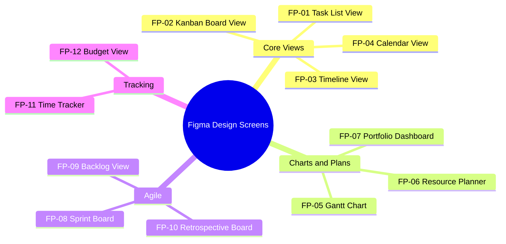

# ERP-Projects -- Figma Design Prompts

## Document Control

| Field         | Value                                          |
|---------------|------------------------------------------------|
| Module        | ERP-Projects                                   |
| Version       | 1.0                                            |
| Date          | 2026-02-23                                     |

---

## 1. Design Prompt Index

---

## FP-01: Task List View

**Prompt for Figma / AI Design Tool:**

> Design a **project task list view** for an enterprise project management SaaS application. The interface uses a left sidebar navigation (240px, dark navy #1E293B) with icons for Dashboard, Projects, My Tasks, Boards, Timeline, Resources, Time Tracking, Budgets, Portfolio, Sprints, and Settings. The main content area has a white background.
>
> **Top bar:** Breadcrumb "Projects > Website Redesign > Tasks". On the right: search input, filter button (funnel icon), "Group By" dropdown, "New Task" primary blue button (#2563EB).
>
> **Filter bar below top bar:** Horizontal pill filters for Status (All, To Do, In Progress, In Review, Blocked, Done), Priority (All, Critical, High, Medium, Low), and Assignee multi-select. Active filters highlighted in blue.
>
> **Task table:** Full-width table with columns: Checkbox, Title (with left-indented subtasks using tree expand/collapse icons), Status (colored badge), Priority (colored icon), Assignee (avatar circles, stacked for multiple), Due Date (red text if overdue), Estimated Hours, Actual Hours, Tags (chips), and a "..." actions menu.
>
> **Show 15+ rows** of realistic project data: "Design homepage wireframes", "Build REST API endpoints", "Write unit tests", "Configure CI/CD pipeline", "Create user documentation", etc. Show 2-3 tasks with expanded subtasks indented below their parents.
>
> **Bottom:** Pagination: "Showing 1-50 of 127 tasks" with page navigation. Bulk actions bar appears when checkboxes are selected: "3 selected: [Change Status v] [Assign v] [Set Priority v] [Delete]"
>
> Use Inter font family, 14px body text, 4px border radius on cards and inputs. Modern SaaS aesthetic matching Linear, Notion, or Asana design language.

---

## FP-02: Kanban Board View

**Prompt for Figma / AI Design Tool:**

> Design a **Kanban board** for project task management. Same left sidebar navigation and top bar as the task list view.
>
> **Board header:** Project name "Website Redesign", view toggles (List | Board | Timeline | Calendar) with Board active. Filter and search controls on the right.
>
> **Board columns (5 columns, horizontal scroll):**
> - **TO DO** (6 cards) - gray header
> - **IN PROGRESS** (4 cards) - blue header
> - **IN REVIEW** (2 cards) - purple header
> - **BLOCKED** (1 card) - red header with "WIP: 1/2" badge
> - **DONE** (8 cards) - green header
>
> **Each card (200px wide, variable height):**
> - Left colored border indicating priority (red=Critical, orange=High, blue=Medium, gray=Low)
> - Title text (max 2 lines, 14px semibold)
> - Tags row: small colored chips ("frontend", "design", "api")
> - Bottom row: assignee avatar (28px circle), due date text (small, red if overdue), story points badge (circle with number), comment count (chat icon + number)
> - Checklist progress: thin progress bar "3/5"
>
> Show **swimlanes** enabled, grouped by Priority. "HIGH" swimlane header (collapsible) contains 3 cards, "MEDIUM" swimlane contains 5 cards. Each swimlane shows card count.
>
> **Drag ghost:** Show one card mid-drag with subtle shadow and 3-degree rotation, with a drop target indicator (blue dashed border) in the target column.
>
> Color palette: white card backgrounds, #F9FAFB board background, subtle shadows (0 1px 3px rgba(0,0,0,0.1)). Modern, clean aesthetic.

---

## FP-03: Timeline View

**Prompt for Figma / AI Design Tool:**

> Design a **timeline view** (simplified Gantt-like) for project management. Same application shell with sidebar navigation.
>
> **Left panel (300px):** Hierarchical task list showing project phases as collapsible groups. Phase 1: Design (3 subtasks), Phase 2: Development (5 subtasks), Phase 3: Testing (3 subtasks), Phase 4: Deployment (2 subtasks). Each row shows task title, assignee avatar, and start-end dates.
>
> **Right panel (scrollable timeline):** Date headers showing months (March, April, May 2026) with week markers. Horizontal bars for each task aligned to their dates:
> - Regular task bars: rounded rectangles, colored by status (blue=in progress, green=done, gray=not started)
> - Progress overlay: darker shade filling percentage of the bar
> - Milestone markers: diamond shapes on the timeline
> - Dependency arrows: curved lines connecting task bars (end of one to start of another)
> - Critical path tasks: bars with red border/outline
> - Baseline bars: thin gray bars below current bars showing original planned dates
>
> **Zoom controls** in top-right: "Day | Week | Month | Quarter" toggle buttons. Current: Week view.
>
> **Today marker:** Vertical red dashed line at today's date with "Today" label.
>
> Show approximately 15 tasks in the timeline with realistic scheduling. Some tasks overlapping, some sequential with dependency arrows.

---

## FP-04: Calendar View

**Prompt for Figma / AI Design Tool:**

> Design a **calendar view** for project task management. Same application shell.
>
> **Calendar header:** Month navigation (< March 2026 >), view mode toggle (Day | Week | Month) with Month active. "Today" button. Color legend for task types.
>
> **Monthly grid:** Standard 7-column (Mon-Sun) calendar grid. Each day cell contains small task indicators:
> - Task bars spanning multiple days shown as horizontal colored strips across cells
> - Single-day tasks shown as colored dots or small cards
> - Milestone diamonds on their due dates
> - Day numbers in top-left of each cell
> - "+" button in each cell corner for quick task creation
>
> **Show tasks:** 8-10 tasks distributed across the month, some multi-day (spanning 3-5 cells), some single-day. Different colors for different projects or priorities. One overdue task highlighted in red.
>
> **Right sidebar (optional, toggled):** Day detail panel showing tasks for clicked date with full titles, times, assignees.
>
> Weekends slightly grayed out. Today's date highlighted with blue border. Clean, Google Calendar-inspired aesthetic.

---

## FP-05: Gantt Chart (Full-Featured)

**Prompt for Figma / AI Design Tool:**

> Design a **full-featured Gantt chart** for enterprise project management. This is the primary planning view for project managers.
>
> **Toolbar above chart:** Project selector dropdown, baseline comparison toggle, "Auto-Schedule" button, "Save Baseline" button, "Show Critical Path" toggle (on), zoom level selector (Day/Week/Month/Quarter/Year), "Fit to Screen" button, "Export" dropdown (PDF, PNG, MS Project).
>
> **Left table panel (400px, resizable):**
> Headers: WBS #, Task Name, Duration, Start, Finish, Predecessors, Resources, % Complete
> Show 20+ rows of realistic WBS data:
> - 1.0 Project Initiation (summary task, bold)
>   - 1.1 Kickoff Meeting (2d, 100%)
>   - 1.2 Stakeholder Analysis (5d, 80%)
>   - 1.3 Project Charter (3d, 100%)
> - 2.0 Requirements (summary task)
>   - 2.1 Gather Requirements (10d, 60%)
>   - 2.2 Requirements Review (2d, 0%, predecessor: 2.1FS)
> - 3.0 Design (summary task)
>   - etc.
>
> **Right timeline panel:**
> - Summary task bars: black bars with diamond endpoints
> - Regular task bars: blue rounded rectangles with progress fill (darker blue)
> - Critical path tasks: red bars
> - Milestone markers: black diamonds
> - Dependency arrows: black lines with arrowheads connecting task end to next task start
> - Baseline bars: thin gray bars below each current bar (slightly shorter/longer to show variance)
> - Resource names displayed next to task bars
> - Today line: vertical red line
>
> **Bottom panel (collapsible):** Resource histogram showing resource allocation per time period as stacked bar chart. Over-allocated periods highlighted in red.
>
> Show realistic scheduling with some tasks running in parallel, some sequential, a clear critical path through the project, and visible baseline variance on 3-4 tasks.

---

## FP-06: Resource Planner

**Prompt for Figma / AI Design Tool:**

> Design a **resource planning heatmap** for enterprise project management.
>
> **Top section:** Team selector dropdown, date range picker, "Show: All / Over-allocated Only / Under-utilized Only" filter.
>
> **Main grid (heatmap style):**
> - Rows: Team members (show 10 people with avatar, name, role, department)
> - Columns: Weeks (show 12 weeks: W10 through W21)
> - Each cell shows allocation percentage
> - Cell coloring: Blue (<50% - under-utilized), Green (50-80% - optimal), Yellow (80-100% - fully loaded), Red (>100% - over-allocated)
>
> **Cell detail on hover:** Popup showing breakdown of allocations by project:
> "Jane Smith - W12 (120%): ERP Migration 60%, Website Redesign 40%, Internal Tools 20%"
>
> **Right summary column:** Average utilization per person for the displayed period.
>
> **Bottom summary row:** Team capacity totals per week. "Available FTEs: 2.4" / "Demand: 3.1" / "Gap: -0.7"
>
> **Side panel (right, 360px):** When a person is clicked, show their detailed allocation timeline as a horizontal stacked bar chart, with each project as a different color segment per week.
>
> Show realistic data with 2-3 people over-allocated, 1-2 under-utilized, and the rest in the green zone.

---

## FP-07: Portfolio Dashboard

**Prompt for Figma / AI Design Tool:**

> Design an **executive portfolio dashboard** for PMO leadership. This is a data-rich dashboard with multiple chart panels.
>
> **Header:** "Engineering Portfolio" with date range "Q1 2026". Summary KPIs: "12 Active Projects | $2.4M Budget | 156 Resources | 78% Avg Health"
>
> **Row 1 (3 panels):**
> - **Health Distribution** (doughnut chart): Excellent (5 projects, green), Good (4, blue), Warning (2, yellow), Critical (1, red). Center number: "78% avg"
> - **Budget Overview** (horizontal stacked bar): Planned vs Actual vs Remaining for top 6 projects. Color: planned=light blue, actual=dark blue, remaining=gray
> - **Schedule Status** (bubble chart): Each project as a bubble, X-axis=SPI, Y-axis=CPI, bubble size=budget. Quadrants labeled: "On Track" (top-right), "Over Budget" (bottom-right), "Behind Schedule" (top-left), "At Risk" (bottom-left)
>
> **Row 2 (full width):**
> - **Project Status Table:** Columns: Project Name, Health Score (progress ring), Status (badge), CPI, SPI, Completion %, Budget Used, Owner, Risk Count. 12 rows of data. Sortable columns. Row with Critical health highlighted in light red background.
>
> **Row 3 (2 panels):**
> - **Resource Demand vs Capacity** (grouped bar chart): By role (Developer, Designer, PM, QA, DevOps). Bars: Demand (blue), Capacity (green). Roles with demand > capacity highlighted.
> - **Strategic Alignment Scores** (radar chart): For top 5 projects, showing scores on axes: Strategic Fit, ROI, Risk, Feasibility, Resource Availability.
>
> Modern executive dashboard aesthetic with subtle card shadows, clean typography, and professional color palette.

---

## FP-08: Sprint Board

**Prompt for Figma / AI Design Tool:**

> Design a **Scrum sprint board** for agile teams. Same application shell.
>
> **Sprint header section:**
> - Sprint name: "Sprint 12: Authentication Overhaul"
> - Sprint goal: "Complete OAuth2 integration and SSO setup"
> - Date range: "Mar 4 - Mar 18, 2026" with days remaining badge "8 days left"
> - Mini burndown chart (sparkline, 100px wide) showing current sprint burndown
> - Progress: "34/50 story points completed (68%)"
> - Sprint actions: "Complete Sprint" button, "Sprint Report" link
>
> **Board area:** Four columns: "Stories" (backlog items pulled into sprint), "To Do", "In Progress", "Done"
>
> **Cards are enhanced for Scrum:**
> - Story point badge (circle with number in top-right)
> - Epic label (colored chip: "Auth" in purple, "UX" in green)
> - Acceptance criteria count: "AC: 3/5"
> - Linked PR/branch indicator (git branch icon)
>
> Show 12-15 cards distributed across columns. Include one "BLOCKED" card with a red warning icon and a blocking reason tooltip.
>
> **Bottom bar:** Sprint metrics: Committed: 50pts | Completed: 34pts | Remaining: 16pts | Velocity (avg): 42pts

---

## FP-09: Backlog View

**Prompt for Figma / AI Design Tool:**

> Design a **product backlog grooming view** for agile project management.
>
> **Top bar:** "Product Backlog - ERP Migration" | Items: 47 | Total Points: 312 | Estimated Sprints: 7.4 (based on avg velocity 42)
>
> **Filter bar:** Epic filter dropdown, "Ready" toggle, search input, "Size: Unsized Only" filter
>
> **Main list (drag-and-drop reorderable):**
> Numbered list with drag handles on the left. Each item shows:
> - Rank number (#1, #2, #3...)
> - Epic label chip (colored by epic)
> - Story title (medium weight text)
> - Story points badge (or "Unestimated" gray badge)
> - "Ready" green checkmark if estimated and acceptance criteria defined
> - Assignee avatar (if pre-assigned)
> - Sprint assignment (if planned): "Sprint 13" chip
>
> Show 20+ items. First 8 marked "Ready" with story points. Remaining items unestimated.
>
> **Right panel (360px, on item click):** Story detail: Title, Description (user story format: "As a... I want... So that..."), Acceptance Criteria (checkboxes), Story Points selector (Fibonacci: 1,2,3,5,8,13,21), Epic assignment, Sprint assignment, Attachments area, Comment thread.
>
> **Bottom section:** "Sprint Planning" area showing next sprint capacity (42 pts available), with ability to drag items from backlog into sprint bucket.

---

## FP-10: Retrospective Board

**Prompt for Figma / AI Design Tool:**

> Design a **sprint retrospective board** with a warm, collaborative feel, slightly different from the standard project management aesthetic.
>
> **Header:** "Sprint 11 Retrospective - Authentication Team" | Date: "Feb 28, 2026" | Participants: 6 avatar circles
>
> **Three columns on a subtle off-white/cream background (#FFFBEB):**
>
> 1. **"What Went Well"** (green header #16A34A, light green cards #DCFCE7):
>    - Sticky-note style cards with rounded corners (8px) and subtle shadow
>    - Each card: text content, author avatar+name, vote count (thumbs up icon + number)
>    - 5 cards with content like "Great pair programming sessions", "CI/CD pipeline caught 3 critical bugs"
>
> 2. **"What to Improve"** (orange header #EA580C, light orange cards #FFF7ED):
>    - Similar sticky-note style
>    - 4 cards: "Sprint planning was only 30 minutes", "Code review turnaround > 2 days"
>
> 3. **"Action Items"** (blue header #2563EB, light blue cards #EFF6FF):
>    - Action items with checkbox, description, assignee avatar, and due date
>    - 3 items: "Schedule 1-hour sprint planning", "Set 24-hour code review SLA", "Add automated performance tests"
>
> **Bottom toolbar:** "Add Card" buttons for each column, "Start Voting" toggle, "Export Summary" button, "Previous Retros" dropdown to review past retrospectives.
>
> **Voting overlay (when active):** Each card shows vote buttons, users have limited votes (e.g., 5 votes to distribute).

---

## FP-11: Time Tracker

**Prompt for Figma / AI Design Tool:**

> Design a **time tracking and timesheet** interface for project team members.
>
> **Active timer bar (top, full width, blue gradient background #2563EB to #1D4ED8):**
> - Left: Currently running timer "01:23:45" in large monospace font (white)
> - Middle: Task context "Building REST API endpoints" | Project: "ERP Migration"
> - Right: [Pause] button (white outline), [Stop] button (red), [Discard] link
>
> **Tab navigation below timer:** "Timesheet" | "Timer History" | "Reports"
>
> **Weekly timesheet grid (active tab):**
> - Week selector: "< Week of Mar 9, 2026 >" with navigation arrows
> - Submit status badge: "Draft" (gray), "Submitted" (blue), "Approved" (green)
>
> | Column headers: Project/Task | Mon 9 | Tue 10 | Wed 11 | Thu 12 | Fri 13 | Total |
> - Rows grouped by project (collapsible):
>   - "ERP Migration" (bold, summary row with totals)
>     - "Backend API Development" | 4.0 | 3.5 | 4.0 | 2.0 | 3.0 | 16.5
>     - "Code Review" | 1.0 | 0.5 | 1.0 | 1.0 | 0.5 | 4.0
>   - "Website Redesign"
>     - "Wireframes" | 3.0 | 4.0 | 3.0 | - | - | 10.0
> - Each cell: editable input, click to enter hours
> - Billable indicator: small "$" icon next to billable entries
> - Daily totals row at bottom
> - Weekly total in bold: "38.5 hours"
>
> **Action bar:** [Submit Timesheet] primary button, [Save Draft] secondary, total billable: "30.5 hrs ($3,050.00)", total non-billable: "8.0 hrs"

---

## FP-12: Budget View

**Prompt for Figma / AI Design Tool:**

> Design a **project budget management dashboard** for finance controllers and project managers.
>
> **Header:** "Budget - Website Redesign" | Total Budget: $85,000 | Spent: $38,200 (44.9%) | Remaining: $46,800
>
> **Progress bar (full width):** Large horizontal bar showing budget consumption. Green section (0-75%), Yellow section (75-90%), Red section (90-100%). Current marker at 44.9% with label.
>
> **Row 1 (2 panels):**
> - **Budget by Category** (horizontal bar chart):
>   - Labor: $25,100 / $45,000 (55.8%)
>   - Design Tools: $4,800 / $10,000 (48%)
>   - Software Licenses: $3,200 / $8,000 (40%)
>   - Cloud Infrastructure: $2,600 / $12,000 (21.7%)
>   - Travel & Meetings: $1,500 / $5,000 (30%)
>   - Contingency: $1,000 / $5,000 (20%)
>   Each bar shows planned (light) vs actual (dark) with percentage label.
>
> - **Earned Value S-Curve** (line chart):
>   - Three lines: PV (Planned Value, solid blue), EV (Earned Value, dashed green), AC (Actual Cost, dotted red)
>   - X-axis: project timeline (months), Y-axis: cumulative value ($)
>   - Current date vertical marker
>   - Show EV slightly below PV (behind schedule) and AC slightly above EV (over budget)
>
> **Row 2 (EVM metrics panel, full width):**
> - Four large metric cards in a row:
>   - CPI: 0.95 (yellow indicator, "Slightly over budget")
>   - SPI: 0.88 (red indicator, "Behind schedule")
>   - EAC: $89,474 (text: "$4,474 over original budget")
>   - ETC: $51,274 (text: "Estimated cost to complete")
>
> **Row 3 (recent expenses table):**
> | Date | Category | Description | Amount | Billable | Approved |
> 10 rows of recent expense entries.
>
> **Alert banner (if applicable):** Yellow warning: "Budget utilization at 75% threshold reached. Review spending with stakeholders."
