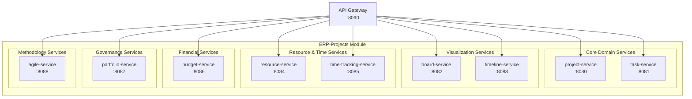
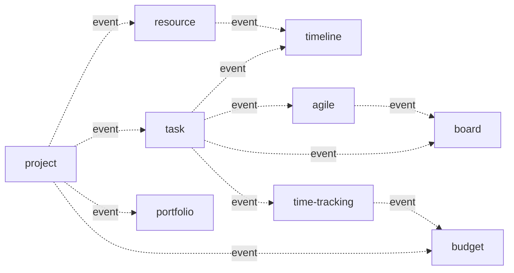

# ERP-Projects -- Service Catalog

## Document Control

| Field         | Value                                          |
|---------------|------------------------------------------------|
| Module        | ERP-Projects                                   |
| Version       | 1.0                                            |
| Date          | 2026-02-23                                     |

---

## 1. Service Landscape



---

## 2. Service Details

### 2.1 project-service

| Attribute        | Value                                       |
|------------------|---------------------------------------------|
| **Name**         | project-service                             |
| **Port**         | 8080                                        |
| **Language**     | Go 1.22+                                    |
| **Base Path**    | `/v1/project`                               |
| **Source**       | `services/project-service/main.go`          |
| **Responsibility** | Project CRUD, lifecycle management, health scoring, templates, archival, program hierarchy |
| **Dependencies** | PostgreSQL, Redis, NATS                     |
| **Events Published** | `erp.projects.project.{created,updated,deleted,listed,read}` |
| **Events Consumed** | `erp.projects.task.updated` (health recalc), `erp.projects.budget.updated` (spend tracking) |

**Endpoints:**

| Method | Path                          | Description                    |
|--------|-------------------------------|--------------------------------|
| GET    | `/v1/project`                 | List projects (paginated)      |
| POST   | `/v1/project`                 | Create project                 |
| GET    | `/v1/project/:id`             | Get project details            |
| PUT    | `/v1/project/:id`             | Update project                 |
| DELETE | `/v1/project/:id`             | Delete project                 |
| GET    | `/v1/project/:id/health`      | Get health score breakdown     |
| POST   | `/v1/project/:id/archive`     | Archive project                |
| POST   | `/v1/project/:id/restore`     | Restore archived project       |
| GET    | `/v1/project/templates`       | List project templates         |
| POST   | `/v1/project/from-template`   | Create project from template   |

### 2.2 task-service

| Attribute        | Value                                       |
|------------------|---------------------------------------------|
| **Name**         | task-service                                |
| **Port**         | 8081                                        |
| **Language**     | Go 1.22+                                    |
| **Base Path**    | `/v1/task`                                  |
| **Source**       | `services/task-service/main.go`             |
| **Responsibility** | Task CRUD, subtask hierarchy, assignments, dependencies (FS/FF/SS/SF), checklists, attachments, comments, @mentions, recurring tasks, bulk operations |
| **Dependencies** | PostgreSQL, Redis, NATS, Object Storage     |
| **Events Published** | `erp.projects.task.{created,updated,deleted,listed,read}` |

**Endpoints:**

| Method | Path                              | Description                   |
|--------|-----------------------------------|-------------------------------|
| GET    | `/v1/task`                        | List tasks (filtered)         |
| POST   | `/v1/task`                        | Create task                   |
| GET    | `/v1/task/:id`                    | Get task details              |
| PUT    | `/v1/task/:id`                    | Update task                   |
| DELETE | `/v1/task/:id`                    | Delete task                   |
| POST   | `/v1/task/:id/assign`             | Assign user to task           |
| DELETE | `/v1/task/:id/assign/:userId`     | Remove assignment             |
| POST   | `/v1/task/:id/dependencies`       | Add dependency                |
| DELETE | `/v1/task/:id/dependencies/:depId`| Remove dependency             |
| GET    | `/v1/task/:id/checklist`          | Get checklist items           |
| POST   | `/v1/task/:id/checklist`          | Add checklist item            |
| PUT    | `/v1/task/:id/checklist/:itemId`  | Toggle/update checklist item  |
| POST   | `/v1/task/:id/attachments`        | Upload attachment             |
| GET    | `/v1/task/:id/comments`           | Get comments                  |
| POST   | `/v1/task/:id/comments`           | Add comment with @mentions    |
| POST   | `/v1/task/bulk`                   | Bulk operations               |

### 2.3 board-service

| Attribute        | Value                                       |
|------------------|---------------------------------------------|
| **Name**         | board-service                               |
| **Port**         | 8082                                        |
| **Language**     | Go 1.22+                                    |
| **Base Path**    | `/v1/board`                                 |
| **Source**       | `services/board-service/main.go`            |
| **Responsibility** | Kanban boards, sprint boards, custom views, column configuration, swimlanes, WIP limits, drag-and-drop state, board templates |
| **Dependencies** | PostgreSQL, Redis, NATS                     |
| **Events Published** | `erp.projects.board.{created,updated,deleted,listed,read}` |

**Endpoints:**

| Method | Path                                  | Description                   |
|--------|---------------------------------------|-------------------------------|
| GET    | `/v1/board/:projectId`                | Get board layout              |
| PUT    | `/v1/board/:projectId/layout`         | Update board layout           |
| POST   | `/v1/board/:projectId/columns`        | Add column                    |
| PUT    | `/v1/board/:projectId/columns/:colId` | Update column (name, WIP)     |
| DELETE | `/v1/board/:projectId/columns/:colId` | Remove column                 |
| PUT    | `/v1/board/:projectId/card/:taskId`   | Move card (column, position)  |
| PUT    | `/v1/board/:projectId/swimlanes`      | Configure swimlanes           |

### 2.4 timeline-service

| Attribute        | Value                                       |
|------------------|---------------------------------------------|
| **Name**         | timeline-service                            |
| **Port**         | 8083                                        |
| **Language**     | Go 1.22+                                    |
| **Base Path**    | `/v1/timeline`                              |
| **Source**       | `services/timeline-service/main.go`         |
| **Responsibility** | Gantt chart data, critical path calculation, baseline management, resource leveling, auto-scheduling, milestone visualization, dependency visualization |
| **Dependencies** | PostgreSQL, Redis, NATS                     |
| **Events Published** | `erp.projects.timeline.{created,updated,deleted,listed,read}` |

**Endpoints:**

| Method | Path                                      | Description                   |
|--------|-------------------------------------------|-------------------------------|
| GET    | `/v1/timeline/:projectId`                 | Get timeline data             |
| GET    | `/v1/timeline/:projectId/critical-path`   | Calculate critical path       |
| POST   | `/v1/timeline/:projectId/baseline`        | Save baseline snapshot        |
| GET    | `/v1/timeline/:projectId/baselines`       | List saved baselines          |
| GET    | `/v1/timeline/:projectId/baseline/:blId`  | Compare against baseline      |
| POST   | `/v1/timeline/:projectId/auto-schedule`   | Auto-schedule tasks           |
| POST   | `/v1/timeline/:projectId/level-resources` | Resource leveling             |

### 2.5 resource-service

| Attribute        | Value                                       |
|------------------|---------------------------------------------|
| **Name**         | resource-service                            |
| **Port**         | 8084                                        |
| **Language**     | Go 1.22+                                    |
| **Base Path**    | `/v1/resource`                              |
| **Source**       | `services/resource-service/main.go`         |
| **Responsibility** | Resource allocation (%), availability calendar, workload balancing, capacity planning, utilization reports, skill-based assignment, cost rates |
| **Dependencies** | PostgreSQL, Redis, NATS                     |
| **Events Published** | `erp.projects.resource.{created,updated,deleted,listed,read}` |

**Endpoints:**

| Method | Path                                  | Description                   |
|--------|---------------------------------------|-------------------------------|
| GET    | `/v1/resource/allocations`            | List all allocations          |
| POST   | `/v1/resource/allocations`            | Create allocation             |
| PUT    | `/v1/resource/allocations/:id`        | Update allocation             |
| DELETE | `/v1/resource/allocations/:id`        | Remove allocation             |
| GET    | `/v1/resource/availability/:userId`   | User availability calendar    |
| GET    | `/v1/resource/workload`               | Team workload summary         |
| GET    | `/v1/resource/capacity`               | Capacity planning view        |
| GET    | `/v1/resource/utilization`            | Utilization report            |
| GET    | `/v1/resource/skills-match`           | Skill-based recommendations   |

### 2.6 time-tracking-service

| Attribute        | Value                                       |
|------------------|---------------------------------------------|
| **Name**         | time-tracking-service                       |
| **Port**         | 8085                                        |
| **Language**     | Go 1.22+                                    |
| **Base Path**    | `/v1/time-tracking`                         |
| **Source**       | `services/time-tracking-service/main.go`    |
| **Responsibility** | Timer start/stop, manual time entry, timesheet aggregation, approval workflow, billable/non-billable tracking, project cost calculation, ERP-HCM payroll integration |
| **Dependencies** | PostgreSQL, Redis, NATS                     |
| **Events Published** | `erp.projects.time-tracking.{created,updated,deleted,listed,read}` |
| **External Integration** | ERP-HCM (payroll sync)               |

### 2.7 budget-service

| Attribute        | Value                                       |
|------------------|---------------------------------------------|
| **Name**         | budget-service                              |
| **Port**         | 8086                                        |
| **Language**     | Go 1.22+                                    |
| **Base Path**    | `/v1/budget`                                |
| **Source**       | `services/budget-service/main.go`           |
| **Responsibility** | Budget planning, planned vs actual tracking, cost categories, expense management, EVM calculations (CPI/SPI/EAC/ETC), budget alerts, forecasting |
| **Dependencies** | PostgreSQL, Redis, NATS                     |
| **Events Published** | `erp.projects.budget.{created,updated,deleted,listed,read}` |
| **External Integration** | ERP-Finance (GL posting)             |

### 2.8 portfolio-service

| Attribute        | Value                                       |
|------------------|---------------------------------------------|
| **Name**         | portfolio-service                           |
| **Port**         | 8087                                        |
| **Language**     | Go 1.22+                                    |
| **Base Path**    | `/v1/portfolio`                             |
| **Source**       | `services/portfolio-service/main.go`        |
| **Responsibility** | Portfolio dashboard aggregation, strategic alignment scoring, resource demand vs capacity, health rollup, weighted scoring prioritization, what-if scenario modeling |
| **Dependencies** | PostgreSQL, Redis, NATS                     |
| **Events Published** | `erp.projects.portfolio.{created,updated,deleted,listed,read}` |

### 2.9 agile-service

| Attribute        | Value                                       |
|------------------|---------------------------------------------|
| **Name**         | agile-service                               |
| **Port**         | 8088                                        |
| **Language**     | Go 1.22+                                    |
| **Base Path**    | `/v1/agile`                                 |
| **Source**       | `services/agile-service/main.go`            |
| **Responsibility** | Sprint lifecycle, product backlog management, story points, velocity tracking, burndown/burnup charts, sprint retrospectives, epic management, release planning |
| **Dependencies** | PostgreSQL, Redis, NATS                     |
| **Events Published** | `erp.projects.agile.{created,updated,deleted,listed,read}` |

---

## 3. Service Communication Matrix



| Source            | Target           | Protocol | Pattern  | Data Exchanged              |
|-------------------|-----------------|----------|----------|-----------------------------|
| project-service   | task-service     | NATS     | Pub/Sub  | Project status changes      |
| task-service      | board-service    | NATS     | Pub/Sub  | Task status/position updates|
| task-service      | timeline-service | NATS     | Pub/Sub  | Task date/dependency changes|
| task-service      | agile-service    | NATS     | Pub/Sub  | Task sprint assignment      |
| time-tracking-svc | budget-service   | NATS     | Pub/Sub  | Cost accruals from time     |
| resource-service  | timeline-service | NATS     | Pub/Sub  | Allocation changes          |
| agile-service     | board-service    | NATS     | Pub/Sub  | Sprint start/complete       |
| All services      | portfolio-service| NATS     | Pub/Sub  | Health/budget/schedule data |

---

## 4. Health Check Endpoints

All services expose a `/healthz` endpoint returning:

```json
{
  "status": "healthy",
  "module": "ERP-Projects",
  "service": "<service-name>",
  "version": "1.0.0",
  "uptime": "72h14m33s",
  "checks": {
    "database": "ok",
    "redis": "ok",
    "nats": "ok"
  }
}
```

---

## 5. Service SLAs

| Service              | Availability | Latency P95 | Latency P99 | Error Rate |
|----------------------|-------------|-------------|-------------|------------|
| project-service      | 99.95%      | 100ms       | 250ms       | < 0.1%     |
| task-service         | 99.95%      | 80ms        | 200ms       | < 0.1%     |
| board-service        | 99.95%      | 50ms        | 150ms       | < 0.1%     |
| timeline-service     | 99.9%       | 200ms       | 500ms       | < 0.5%     |
| resource-service     | 99.95%      | 100ms       | 250ms       | < 0.1%     |
| time-tracking-service| 99.95%      | 80ms        | 200ms       | < 0.1%     |
| budget-service       | 99.95%      | 150ms       | 350ms       | < 0.1%     |
| portfolio-service    | 99.9%       | 300ms       | 800ms       | < 0.5%     |
| agile-service        | 99.95%      | 100ms       | 250ms       | < 0.1%     |
