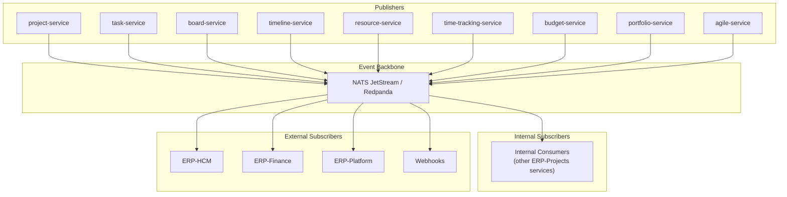
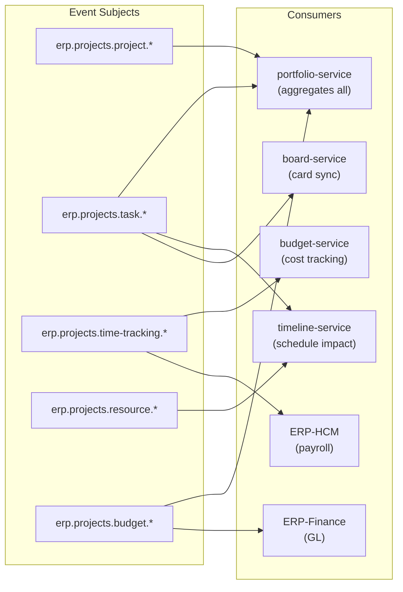

# ERP-Projects -- Event Catalog

## Document Control

| Field         | Value                                          |
|---------------|------------------------------------------------|
| Module        | ERP-Projects                                   |
| Version       | 1.0                                            |
| Date          | 2026-02-23                                     |

---

## 1. Event Architecture



---

## 2. Event Naming Convention

```
erp.projects.<entity>.<action>
```

| Segment      | Description                          | Examples                    |
|-------------|--------------------------------------|-----------------------------|
| `erp`       | Product prefix                       | Always `erp`                |
| `projects`  | Module identifier                    | Always `projects`           |
| `<entity>`  | Domain entity in kebab-case          | `project`, `task`, `board`  |
| `<action>`  | Verb describing the event            | `created`, `updated`, `deleted` |

---

## 3. CloudEvents Envelope

All events follow the CloudEvents 1.0 specification:

```json
{
  "specversion": "1.0",
  "type": "erp.projects.task.created",
  "source": "/erp-projects/task-service",
  "id": "evt-a1b2c3d4-e5f6-7890-abcd-ef1234567890",
  "time": "2026-02-23T10:30:00Z",
  "datacontenttype": "application/json",
  "subject": "task-uuid-here",
  "tenantid": "tenant-uuid-here",
  "correlationid": "req-uuid-here",
  "causationid": "prev-evt-uuid",
  "data": {
    // Entity-specific payload
  }
}
```

### Extension Attributes

| Attribute       | Type   | Required | Description                         |
|----------------|--------|----------|-------------------------------------|
| `tenantid`     | string | Yes      | Tenant UUID for multi-tenant routing|
| `correlationid`| string | Yes      | Request correlation ID for tracing  |
| `causationid`  | string | No       | ID of the event that caused this one|
| `userid`       | string | Yes      | ID of the user who triggered the event|

---

## 4. Event Catalog

### 4.1 Project Events

| Event Type                        | Publisher        | Description                              |
|-----------------------------------|------------------|------------------------------------------|
| `erp.projects.project.created`    | project-service  | New project created                      |
| `erp.projects.project.updated`    | project-service  | Project details modified                 |
| `erp.projects.project.deleted`    | project-service  | Project deleted                          |
| `erp.projects.project.archived`   | project-service  | Project moved to archive                 |
| `erp.projects.project.restored`   | project-service  | Project restored from archive            |
| `erp.projects.project.status_changed` | project-service | Project status transition             |
| `erp.projects.project.health_changed` | project-service | Health score threshold crossed        |

**Payload -- `project.created`:**
```json
{
  "id": "proj-uuid",
  "name": "Website Redesign",
  "status": "PLANNING",
  "priority": "HIGH",
  "type": "DESIGN",
  "ownerId": "user-uuid",
  "clientName": "Acme Corp",
  "startDate": "2026-03-01",
  "endDate": "2026-07-31",
  "budget": 85000.00,
  "currency": "USD"
}
```

**Payload -- `project.health_changed`:**
```json
{
  "id": "proj-uuid",
  "previousHealthScore": 72,
  "currentHealthScore": 38,
  "previousHealthStatus": "GOOD",
  "currentHealthStatus": "CRITICAL",
  "factors": {
    "scheduleAdherence": 0.65,
    "budgetUtilization": 0.92,
    "openRisks": 5,
    "taskCompletionRate": 0.45
  }
}
```

### 4.2 Task Events

| Event Type                          | Publisher      | Description                            |
|-------------------------------------|----------------|----------------------------------------|
| `erp.projects.task.created`         | task-service   | New task created                       |
| `erp.projects.task.updated`         | task-service   | Task details modified                  |
| `erp.projects.task.deleted`         | task-service   | Task deleted                           |
| `erp.projects.task.assigned`        | task-service   | User assigned to task                  |
| `erp.projects.task.unassigned`      | task-service   | User removed from task                 |
| `erp.projects.task.status_changed`  | task-service   | Task status transition                 |
| `erp.projects.task.dependency_added`| task-service   | Dependency link created                |
| `erp.projects.task.overdue`         | task-service   | Task passed due date without completion|
| `erp.projects.task.completed`       | task-service   | Task marked as Done                    |
| `erp.projects.task.comment_added`   | task-service   | Comment posted on task                 |
| `erp.projects.task.mentioned`       | task-service   | User @mentioned in comment             |

### 4.3 Board Events

| Event Type                        | Publisher       | Description                             |
|-----------------------------------|-----------------|-----------------------------------------|
| `erp.projects.board.created`      | board-service   | Board configuration created             |
| `erp.projects.board.updated`      | board-service   | Board layout modified                   |
| `erp.projects.board.card_moved`   | board-service   | Card moved between columns              |
| `erp.projects.board.wip_exceeded` | board-service   | WIP limit exceeded on column            |

### 4.4 Timeline Events

| Event Type                             | Publisher         | Description                         |
|----------------------------------------|-------------------|-------------------------------------|
| `erp.projects.timeline.baseline_saved` | timeline-service  | Schedule baseline snapshot taken    |
| `erp.projects.timeline.auto_scheduled` | timeline-service  | Auto-scheduling completed           |
| `erp.projects.timeline.critical_path_changed` | timeline-service | Critical path recalculated   |
| `erp.projects.timeline.resource_leveled` | timeline-service | Resource leveling applied         |

### 4.5 Resource Events

| Event Type                              | Publisher         | Description                        |
|-----------------------------------------|-------------------|------------------------------------|
| `erp.projects.resource.created`         | resource-service  | New allocation created             |
| `erp.projects.resource.updated`         | resource-service  | Allocation modified                |
| `erp.projects.resource.deleted`         | resource-service  | Allocation removed                 |
| `erp.projects.resource.over_allocated`  | resource-service  | Resource exceeds 100% allocation   |
| `erp.projects.resource.under_utilized`  | resource-service  | Resource below 50% utilization     |

### 4.6 Time Tracking Events

| Event Type                                | Publisher               | Description                      |
|-------------------------------------------|-------------------------|----------------------------------|
| `erp.projects.time-tracking.entry_created`| time-tracking-service   | Time entry logged                |
| `erp.projects.time-tracking.entry_updated`| time-tracking-service   | Time entry modified              |
| `erp.projects.time-tracking.timer_started`| time-tracking-service   | Timer started                    |
| `erp.projects.time-tracking.timer_stopped`| time-tracking-service   | Timer stopped, entry created     |
| `erp.projects.time-tracking.timesheet_submitted` | time-tracking-service | Timesheet submitted for approval |
| `erp.projects.time-tracking.timesheet_approved`  | time-tracking-service | Timesheet approved by manager    |
| `erp.projects.time-tracking.timesheet_rejected`  | time-tracking-service | Timesheet rejected with comments |

### 4.7 Budget Events

| Event Type                             | Publisher       | Description                           |
|----------------------------------------|-----------------|---------------------------------------|
| `erp.projects.budget.updated`          | budget-service  | Budget values modified                |
| `erp.projects.budget.threshold_reached`| budget-service  | Budget utilization hit threshold      |
| `erp.projects.budget.overrun`          | budget-service  | Actual spend exceeded planned budget  |
| `erp.projects.budget.evm_alert`        | budget-service  | CPI or SPI fell below threshold       |

### 4.8 Portfolio Events

| Event Type                            | Publisher          | Description                          |
|---------------------------------------|--------------------|--------------------------------------|
| `erp.projects.portfolio.created`      | portfolio-service  | Portfolio created                    |
| `erp.projects.portfolio.updated`      | portfolio-service  | Portfolio configuration changed      |
| `erp.projects.portfolio.scored`       | portfolio-service  | Strategic scoring completed          |
| `erp.projects.portfolio.scenario_run` | portfolio-service  | What-if scenario executed            |

### 4.9 Agile Events

| Event Type                              | Publisher      | Description                           |
|-----------------------------------------|----------------|---------------------------------------|
| `erp.projects.agile.sprint_created`     | agile-service  | Sprint created                        |
| `erp.projects.agile.sprint_started`     | agile-service  | Sprint activated                      |
| `erp.projects.agile.sprint_completed`   | agile-service  | Sprint completed with velocity        |
| `erp.projects.agile.backlog_reordered`  | agile-service  | Backlog priority changed              |
| `erp.projects.agile.retrospective_created` | agile-service | Retrospective recorded             |
| `erp.projects.agile.story_pointed`      | agile-service  | Story points assigned to task         |

---

## 5. Event Routing and Subscription



---

## 6. Event Processing Guarantees

| Property             | Guarantee                               |
|----------------------|-----------------------------------------|
| Delivery             | At-least-once via NATS JetStream        |
| Ordering             | Per-subject ordered delivery            |
| Idempotency          | Consumer-side dedup via event ID        |
| Retention            | 72 hours in NATS, archived to cold store|
| Max payload size     | 1 MB                                    |
| Processing SLA       | < 500ms from publish to consumer ack    |
