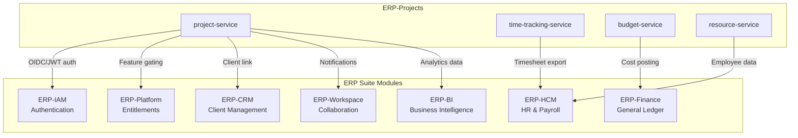
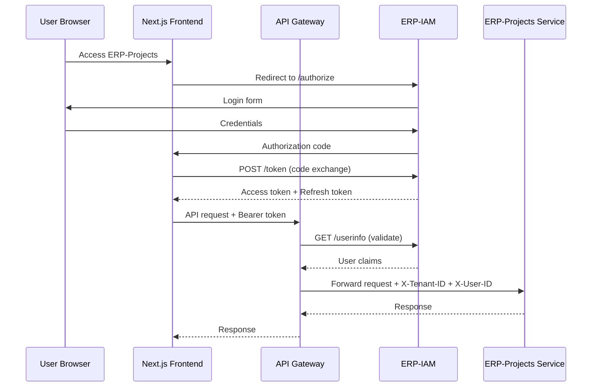
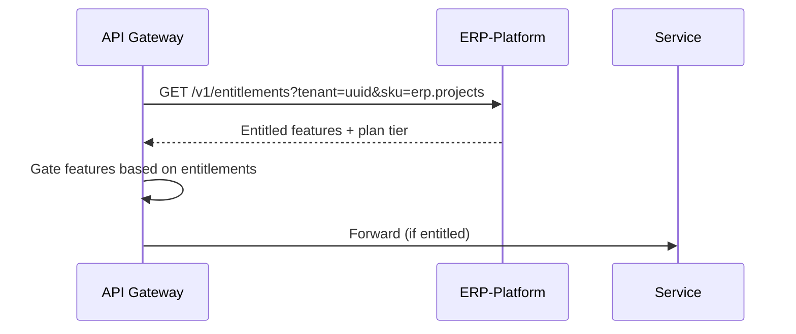
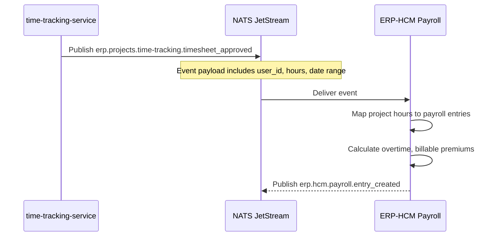
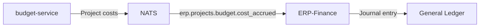
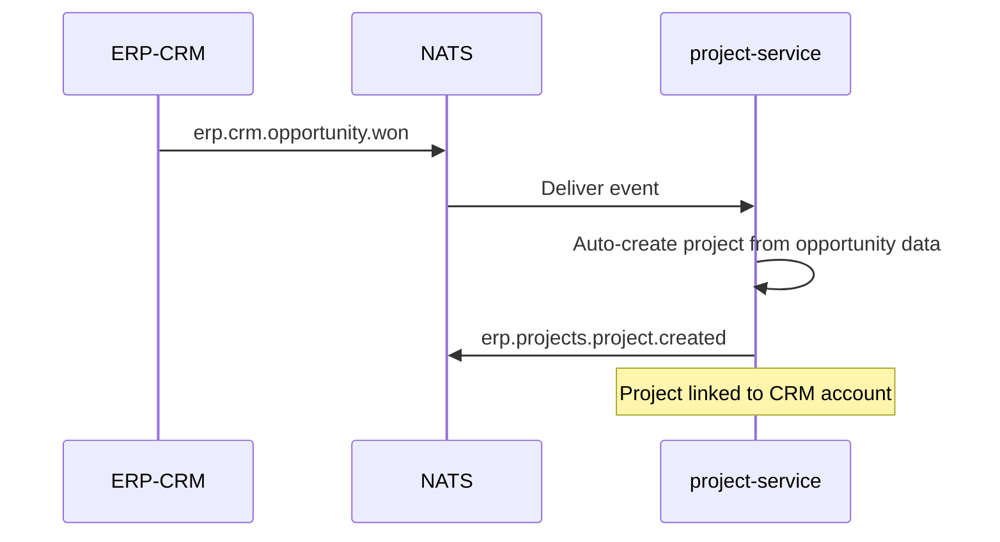
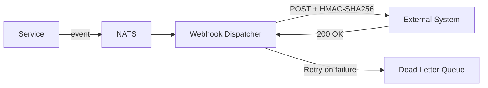
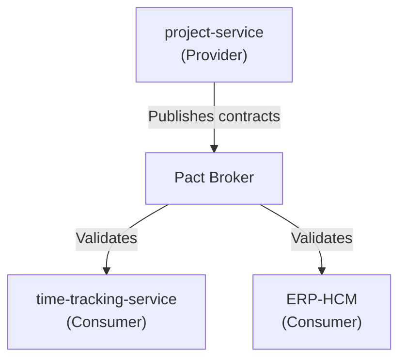

# ERP-Projects -- Integration Guide

## Document Control

| Field         | Value                                          |
|---------------|------------------------------------------------|
| Module        | ERP-Projects                                   |
| Version       | 1.0                                            |
| Date          | 2026-02-23                                     |

---

## 1. Integration Overview



---

## 2. ERP-IAM Integration

### 2.1 Authentication Flow



### 2.2 JWT Claims Structure

```json
{
  "sub": "user-uuid",
  "email": "jane@example.com",
  "name": "Jane Smith",
  "tenant_id": "tenant-uuid",
  "roles": ["MANAGER"],
  "permissions": [
    "projects:read",
    "projects:write",
    "tasks:read",
    "tasks:write",
    "budget:read",
    "resources:read",
    "resources:write"
  ],
  "iss": "https://iam.erp.example.com",
  "aud": "erp-projects",
  "exp": 1740326400,
  "iat": 1740322800
}
```

### 2.3 Permission Mapping

| Permission            | Description                        | Default Roles        |
|----------------------|-------------------------------------|----------------------|
| `projects:read`     | View projects                       | All                  |
| `projects:write`    | Create/update/delete projects       | ADMIN, MANAGER       |
| `tasks:read`        | View tasks                          | All                  |
| `tasks:write`       | Create/update tasks                 | ADMIN, MANAGER, MEMBER|
| `budget:read`       | View budget data                    | ADMIN, MANAGER       |
| `budget:write`      | Modify budgets                      | ADMIN                |
| `resources:read`    | View resource allocations           | ADMIN, MANAGER       |
| `resources:write`   | Manage resource allocations         | ADMIN, MANAGER       |
| `timesheets:approve`| Approve team timesheets             | ADMIN, MANAGER       |
| `portfolio:read`    | View portfolio data                 | ADMIN                |
| `portfolio:write`   | Manage portfolios                   | ADMIN                |

---

## 3. ERP-Platform Integration

### 3.1 Entitlement Check



### 3.2 Feature Gating by Plan

| Feature                 | Starter | Professional | Business | Enterprise |
|------------------------|---------|-------------|----------|------------|
| Projects (max)         | 10      | 50          | Unlimited| Unlimited  |
| Tasks per project      | 500     | 5,000       | Unlimited| Unlimited  |
| Gantt chart            | No      | Yes         | Yes      | Yes        |
| Critical path          | No      | Yes         | Yes      | Yes        |
| EVM metrics            | No      | No          | Yes      | Yes        |
| Portfolio management   | No      | No          | Yes      | Yes        |
| What-if scenarios      | No      | No          | No       | Yes        |
| AI insights            | No      | No          | Basic    | Full       |
| Custom fields          | 5       | 20          | 50       | Unlimited  |
| API rate limit (rpm)   | 100     | 500         | 2,000    | 10,000     |

---

## 4. ERP-HCM Integration

### 4.1 Timesheet to Payroll Sync



### 4.2 Employee Data Sync

| Direction    | Data                              | Frequency  | Trigger              |
|-------------|-----------------------------------|------------|----------------------|
| HCM -> Projects | Employee profiles, departments | Real-time  | Employee created/updated |
| HCM -> Projects | Working calendar, holidays     | Daily      | Calendar update      |
| HCM -> Projects | Skill profiles                 | On change  | Skill assessment     |
| Projects -> HCM | Approved timesheets            | On approval| Timesheet approval   |
| Projects -> HCM | Project allocation hours       | Weekly     | Scheduled sync       |

### 4.3 Payroll Data Format

```json
{
  "type": "erp.projects.time-tracking.timesheet_approved",
  "data": {
    "userId": "user-uuid",
    "employeeId": "emp-12345",
    "weekStartDate": "2026-03-09",
    "weekEndDate": "2026-03-13",
    "entries": [
      {
        "date": "2026-03-09",
        "projectId": "proj-uuid",
        "projectName": "Website Redesign",
        "hours": 8.0,
        "billable": true,
        "hourlyRate": 150.00,
        "costCenter": "CC-1001"
      }
    ],
    "totalHours": 40.0,
    "totalBillableHours": 32.0,
    "totalNonBillableHours": 8.0,
    "approvedBy": "manager-uuid",
    "approvedAt": "2026-03-14T09:00:00Z"
  }
}
```

---

## 5. ERP-Finance Integration

### 5.1 Project Cost Posting



### 5.2 GL Mapping

| Project Cost Type  | GL Account       | Debit/Credit |
|-------------------|------------------|--------------|
| Labor cost        | 5100-Labor       | Debit        |
| Software licenses | 5200-Software    | Debit        |
| Travel expenses   | 5300-Travel      | Debit        |
| Contractor fees   | 5400-Contractors | Debit        |
| Project revenue   | 4100-Revenue     | Credit       |

### 5.3 Invoice Sync

When project invoices are created in ERP-Projects, they sync to ERP-Finance for accounts receivable tracking:

```json
{
  "type": "erp.projects.invoice.created",
  "data": {
    "invoiceId": "inv-uuid",
    "invoiceNumber": "INV-2026-0042",
    "projectId": "proj-uuid",
    "clientName": "Acme Corp",
    "totalAmount": 12500.00,
    "currency": "USD",
    "issueDate": "2026-03-15",
    "dueDate": "2026-04-14",
    "lineItems": [
      {
        "description": "Website Design - March 2026",
        "quantity": 80,
        "unitPrice": 150.00,
        "amount": 12000.00
      },
      {
        "description": "Design tool licenses",
        "quantity": 1,
        "unitPrice": 500.00,
        "amount": 500.00
      }
    ]
  }
}
```

---

## 6. ERP-CRM Integration

### 6.1 Client-Project Linkage

| CRM Entity    | Projects Entity | Relationship                      |
|--------------|-----------------|-----------------------------------|
| Account      | Project.clientName | Client associated with project  |
| Contact      | Project.clientEmail| Primary contact for project     |
| Opportunity  | Project          | Won opportunity creates project  |
| Deal         | Project.budget   | Deal value maps to project budget|

### 6.2 Opportunity-to-Project Flow



---

## 7. Third-Party Integrations

### 7.1 Webhook Configuration

```json
{
  "webhooks": [
    {
      "id": "wh-uuid",
      "url": "https://external-system.com/webhook",
      "events": [
        "erp.projects.task.created",
        "erp.projects.task.completed"
      ],
      "secret": "hmac-sha256-secret",
      "active": true,
      "retryPolicy": {
        "maxRetries": 3,
        "backoff": "exponential"
      }
    }
  ]
}
```

### 7.2 Webhook Delivery



### 7.3 Supported Import/Export Formats

| Format              | Import | Export | Use Case                          |
|---------------------|--------|--------|-----------------------------------|
| Microsoft Project XML | Yes  | Yes    | MS Project interoperability       |
| CSV                 | Yes    | Yes    | Spreadsheet import/export         |
| JSON                | Yes    | Yes    | API data exchange                 |
| iCalendar (.ics)    | No     | Yes    | Calendar export                   |
| PDF                 | No     | Yes    | Report export                     |
| JIRA JSON           | Yes    | No     | JIRA migration                    |

---

## 8. Integration Testing

### 8.1 Contract Testing



### 8.2 Integration Test Matrix

| Integration           | Test Type         | Frequency  | Environment |
|----------------------|-------------------|------------|-------------|
| ERP-IAM Auth         | Contract + E2E    | Per commit | Staging     |
| ERP-Platform Entitle | Contract          | Per commit | Staging     |
| ERP-HCM Timesheet    | Contract + E2E    | Daily      | Integration |
| ERP-Finance GL       | Contract + E2E    | Daily      | Integration |
| ERP-CRM Client       | Contract          | Weekly     | Integration |
| Webhooks             | Integration       | Per commit | Staging     |
