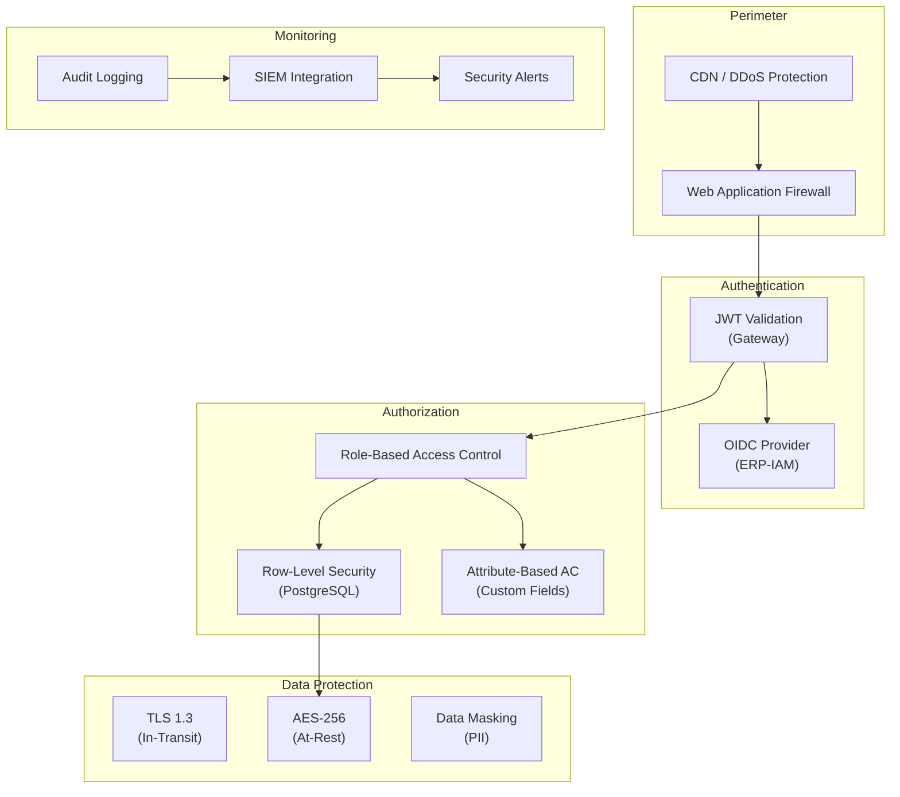
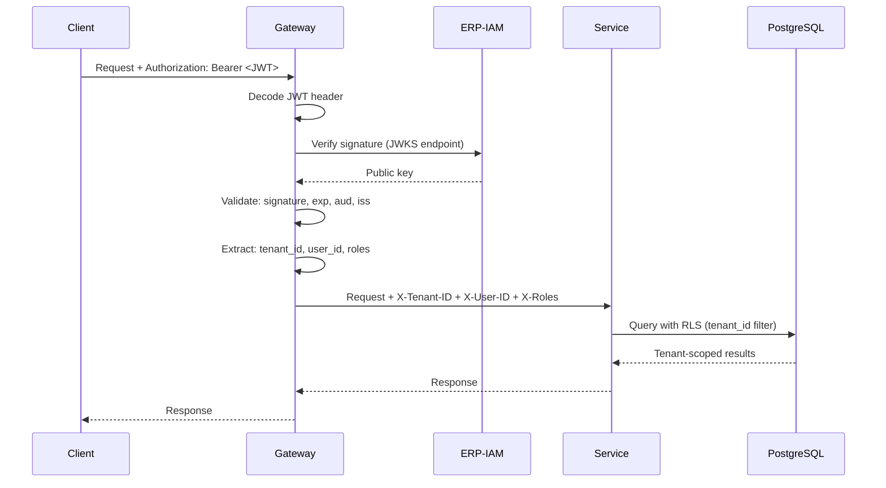
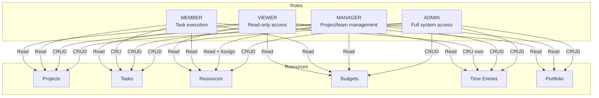
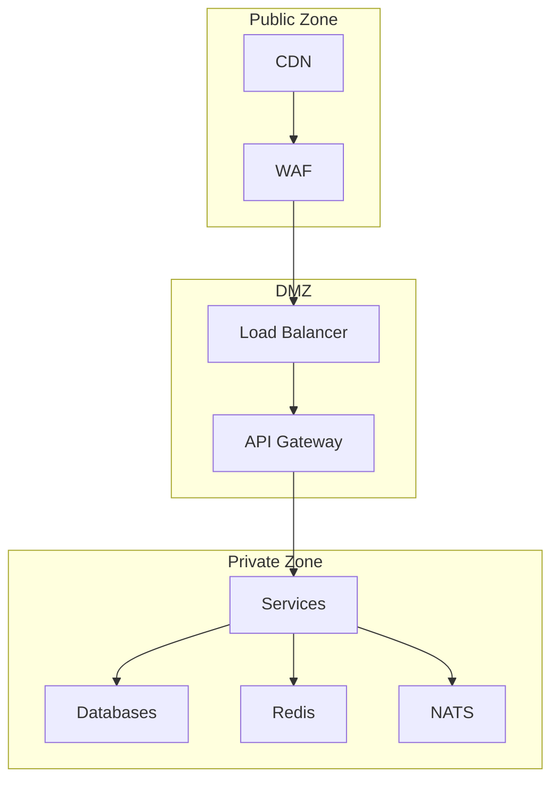

# ERP-Projects -- Security Architecture

## Document Control

| Field         | Value                                          |
|---------------|------------------------------------------------|
| Module        | ERP-Projects                                   |
| Version       | 1.0                                            |
| Date          | 2026-02-23                                     |

---

## 1. Security Architecture Overview



---

## 2. Authentication

### 2.1 OIDC/JWT Flow

All API requests must include a valid JWT token issued by ERP-IAM. The API gateway validates tokens before forwarding requests to services.



### 2.2 Token Specifications

| Property         | Value                              |
|------------------|------------------------------------|
| Algorithm        | RS256 (RSA-SHA256)                 |
| Token lifetime   | 15 minutes (access token)          |
| Refresh lifetime | 7 days (refresh token)             |
| JWKS rotation    | Every 30 days                      |
| Audience         | `erp-projects`                     |
| Issuer           | `https://iam.erp.example.com`      |

---

## 3. Authorization

### 3.1 RBAC Model



### 3.2 Permission Matrix

| Action                     | ADMIN | MANAGER | MEMBER | VIEWER |
|----------------------------|-------|---------|--------|--------|
| Create project             | Yes   | Yes     | No     | No     |
| Update project             | Yes   | Yes (own)| No    | No     |
| Delete project             | Yes   | No      | No     | No     |
| View project               | Yes   | Yes     | Yes    | Yes    |
| Create task                | Yes   | Yes     | Yes    | No     |
| Assign task                | Yes   | Yes     | No     | No     |
| Update own tasks           | Yes   | Yes     | Yes    | No     |
| Delete task                | Yes   | Yes     | No     | No     |
| Log time (own)             | Yes   | Yes     | Yes    | No     |
| Approve timesheets         | Yes   | Yes     | No     | No     |
| Modify budget              | Yes   | No      | No     | No     |
| View budget                | Yes   | Yes     | Yes    | Yes    |
| Manage portfolio           | Yes   | No      | No     | No     |
| View portfolio             | Yes   | Yes     | No     | No     |
| Manage resource allocation | Yes   | Yes     | No     | No     |
| View audit logs            | Yes   | No      | No     | No     |
| Manage settings            | Yes   | No      | No     | No     |

---

## 4. Multi-Tenant Isolation

### 4.1 Row-Level Security

```sql
-- Enable RLS on all business tables
ALTER TABLE projects ENABLE ROW LEVEL SECURITY;

-- Policy: Users can only access their tenant's data
CREATE POLICY tenant_isolation ON projects
    USING (tenant_id = current_setting('app.current_tenant_id')::uuid);

-- Set tenant context per request
SET app.current_tenant_id = '<tenant-uuid-from-jwt>';
```

### 4.2 Isolation Guarantees

| Layer          | Mechanism                              |
|----------------|----------------------------------------|
| Network        | Tenant ID in request headers           |
| Application    | Middleware extracts and validates tenant|
| Database       | RLS policies on all business tables    |
| Cache          | Tenant-scoped Redis key prefixes       |
| Events         | Tenant ID in CloudEvents envelope      |
| Storage        | Tenant-specific S3 prefixes            |

---

## 5. Data Protection

### 5.1 Encryption Standards

| Context          | Standard      | Implementation                    |
|------------------|---------------|-----------------------------------|
| In-transit       | TLS 1.3       | All HTTP, database, cache, event connections |
| At-rest (DB)     | AES-256       | PostgreSQL TDE or volume encryption |
| At-rest (files)  | AES-256-GCM   | Object storage SSE                |
| Secrets          | Vault/KMS     | HashiCorp Vault or cloud KMS      |
| JWT signing      | RS256          | Asymmetric key pair               |
| Webhook signing  | HMAC-SHA256    | Per-webhook secret                |
| Password hashing | bcrypt         | Cost factor 12                    |

### 5.2 PII Handling

| Data Field      | Classification | Protection                      |
|-----------------|---------------|----------------------------------|
| User email      | PII           | Encrypted at rest, masked in logs|
| User name       | PII           | Encrypted at rest                |
| Client email    | PII           | Encrypted at rest, masked in logs|
| IP address      | PII           | Not stored beyond audit logs     |
| Passwords       | Secret        | bcrypt hashed, never logged      |
| API keys        | Secret        | Encrypted, rotatable             |

---

## 6. Audit Logging

### 6.1 Audit Event Structure

```json
{
  "timestamp": "2026-02-23T10:30:00Z",
  "tenantId": "tenant-uuid",
  "userId": "user-uuid",
  "userEmail": "jane@example.com",
  "action": "UPDATE",
  "entityType": "PROJECT",
  "entityId": "proj-uuid",
  "service": "project-service",
  "ipAddress": "192.168.1.100",
  "userAgent": "Mozilla/5.0...",
  "requestId": "req-uuid",
  "changes": {
    "status": { "from": "PLANNING", "to": "ACTIVE" },
    "budget": { "from": 75000, "to": 85000 }
  },
  "result": "SUCCESS"
}
```

### 6.2 Audited Actions

| Category        | Actions Logged                                |
|-----------------|----------------------------------------------|
| Authentication  | Login, logout, token refresh, failed auth    |
| Projects        | Create, update, delete, archive, restore     |
| Tasks           | Create, update, delete, assign, status change|
| Budget          | Create, modify, approve expenses             |
| Time Tracking   | Entry create/update, timesheet submit/approve|
| Resources       | Allocate, deallocate, rate changes           |
| Settings        | Permission changes, config updates           |
| Data Export      | Any data export or report generation         |

---

## 7. Network Security

### 7.1 Network Architecture



### 7.2 Firewall Rules

| Source       | Destination      | Port | Protocol | Purpose            |
|-------------|------------------|------|----------|--------------------|
| CDN/WAF     | Load Balancer    | 443  | HTTPS    | Client traffic     |
| LB          | API Gateway      | 8090 | HTTP     | Internal routing   |
| Gateway     | Services         | 8080-8088 | HTTP | Service calls      |
| Services    | PostgreSQL       | 5432 | TCP      | Database access    |
| Services    | Redis            | 6379 | TCP      | Cache access       |
| Services    | NATS             | 4222 | TCP      | Event messaging    |

---

## 8. Vulnerability Management

### 8.1 Security Scanning

| Scan Type          | Tool            | Frequency  | Threshold        |
|--------------------|-----------------|------------|------------------|
| SAST               | Semgrep         | Per commit | No critical/high |
| Dependency scan    | Snyk / Trivy    | Daily      | No known CVEs    |
| Container scan     | Trivy           | Per build  | No critical      |
| DAST               | OWASP ZAP       | Weekly     | No high severity |
| Secret detection   | Gitleaks        | Per commit | Zero secrets     |
| Infrastructure     | Checkov         | Per deploy | No misconfiguration|

### 8.2 Incident Response

| Severity   | Response Time | Escalation          | Resolution SLA |
|------------|--------------|---------------------|----------------|
| Critical   | 15 minutes   | Security team + CTO | 4 hours        |
| High       | 1 hour       | Security team       | 24 hours       |
| Medium     | 4 hours      | Engineering lead    | 7 days         |
| Low        | 24 hours     | Engineering team    | 30 days        |

---

## 9. Compliance

| Standard      | Status    | Controls Implemented                    |
|---------------|-----------|----------------------------------------|
| SOC 2 Type II | In progress | Access controls, audit logging, encryption |
| GDPR          | Compliant | Data residency, right to erasure, DPO  |
| ISO 27001     | Planned   | ISMS framework alignment               |
| OWASP Top 10  | Addressed | Input validation, auth, encryption, logging |
