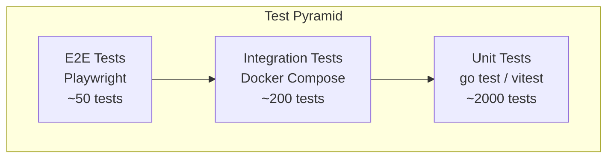
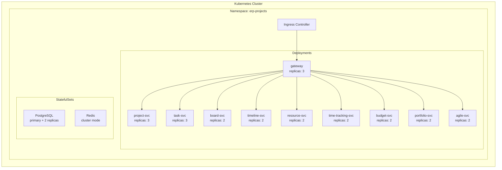
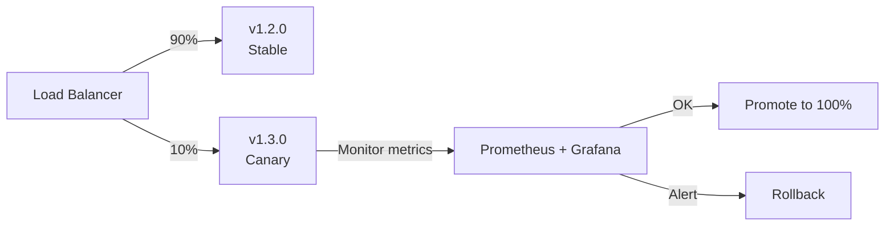
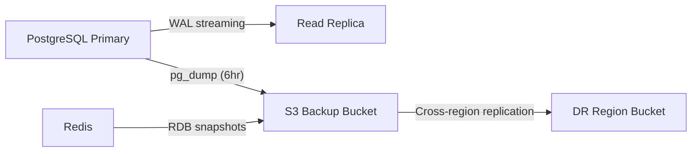

# ERP-Projects -- DevOps & CI/CD

## Document Control

| Field         | Value                                          |
|---------------|------------------------------------------------|
| Module        | ERP-Projects                                   |
| Version       | 1.0                                            |
| Date          | 2026-02-23                                     |

---

## 1. CI/CD Pipeline Architecture

```mermaid
flowchart LR
    subgraph "Source"
        GH["GitHub Repository<br/>ERP-Projects"]
    end

    subgraph "CI Pipeline"
        LINT["Lint & Format<br/>golangci-lint, eslint"]
        TEST["Unit Tests<br/>go test, vitest"]
        SEC["Security Scan<br/>Semgrep, Trivy"]
        BUILD["Build<br/>Docker images"]
        INT["Integration Tests<br/>Contract tests"]
    end

    subgraph "CD Pipeline"
        STG["Deploy Staging"]
        E2E["E2E Tests<br/>Playwright"]
        PERF["Performance Tests<br/>k6"]
        PROD["Deploy Production"]
    end

    GH -->|"push / PR"| LINT --> TEST --> SEC --> BUILD --> INT
    INT -->|"main branch"| STG --> E2E --> PERF --> PROD
```



---

## 2. Build Configuration

### 2.1 Go Service Build

```dockerfile
# Multi-stage build for each service
FROM golang:1.22-alpine AS builder
WORKDIR /app
COPY go.mod go.sum ./
RUN go mod download
COPY . .
RUN CGO_ENABLED=0 GOOS=linux go build -ldflags="-s -w" -o /service ./services/${SERVICE_NAME}/main.go

FROM alpine:3.19
RUN apk --no-cache add ca-certificates
COPY --from=builder /service /service
EXPOSE 8080
CMD ["/service"]
```

### 2.2 Next.js Frontend Build

```dockerfile
FROM node:20-alpine AS builder
WORKDIR /app
COPY package.json pnpm-lock.yaml ./
RUN corepack enable && pnpm install --frozen-lockfile
COPY . .
RUN pnpm build

FROM node:20-alpine
WORKDIR /app
COPY --from=builder /app/.next/standalone ./
COPY --from=builder /app/.next/static ./.next/static
COPY --from=builder /app/public ./public
EXPOSE 3000
CMD ["node", "server.js"]
```

### 2.3 Service Build Matrix

| Service               | Dockerfile         | Image Tag Pattern             | Port |
|-----------------------|--------------------|------------------------------ |------|
| project-service       | `services/project-service/Dockerfile` | `erp-projects/project-svc:$SHA` | 8080 |
| task-service          | `services/task-service/Dockerfile`    | `erp-projects/task-svc:$SHA`    | 8081 |
| board-service         | `services/board-service/Dockerfile`   | `erp-projects/board-svc:$SHA`   | 8082 |
| timeline-service      | `services/timeline-service/Dockerfile`| `erp-projects/timeline-svc:$SHA`| 8083 |
| resource-service      | `services/resource-service/Dockerfile`| `erp-projects/resource-svc:$SHA`| 8084 |
| time-tracking-service | `services/time-tracking-service/Dockerfile` | `erp-projects/time-svc:$SHA` | 8085 |
| budget-service        | `services/budget-service/Dockerfile`  | `erp-projects/budget-svc:$SHA`  | 8086 |
| portfolio-service     | `services/portfolio-service/Dockerfile`| `erp-projects/portfolio-svc:$SHA`| 8087 |
| agile-service         | `services/agile-service/Dockerfile`   | `erp-projects/agile-svc:$SHA`   | 8088 |
| api-gateway           | `cmd/server/Dockerfile`               | `erp-projects/gateway:$SHA`     | 8090 |
| web-frontend          | `frontend/Dockerfile`                 | `erp-projects/web:$SHA`         | 3000 |

---

## 3. Testing Strategy

### 3.1 Test Pyramid



### 3.2 Test Coverage Targets

| Layer          | Tool        | Coverage Target | Threshold (fail) |
|----------------|-------------|-----------------|-------------------|
| Go unit tests  | go test     | 80%             | < 70%             |
| Frontend tests | vitest      | 75%             | < 65%             |
| Integration    | testcontainers | N/A          | All pass          |
| E2E            | Playwright  | N/A             | All pass          |
| Contract       | Pact        | N/A             | All pass          |

### 3.3 Performance Testing

| Test            | Tool | Scenarios                          | Pass Criteria         |
|-----------------|------|------------------------------------|-----------------------|
| API load        | k6   | 1000 concurrent users, CRUD ops  | P95 < 200ms          |
| Gantt render    | k6   | 1000-task project Gantt load      | Render < 500ms       |
| Board load      | k6   | 500-card board load               | Render < 300ms       |
| Bulk operations | k6   | 100-task bulk status update       | Complete < 2s        |
| Search          | k6   | Full-text search across 100K tasks| P95 < 300ms          |

---

## 4. Deployment Strategy

### 4.1 Environments

| Environment | Purpose             | Infra                | Deploy Trigger       |
|-------------|---------------------|----------------------|----------------------|
| Development | Developer testing   | Local Docker Compose | Manual               |
| Staging     | Pre-production      | Kubernetes (shared)  | Push to main         |
| Production  | Live traffic        | Kubernetes (dedicated)| Manual approval      |

### 4.2 Kubernetes Deployment



### 4.3 Rolling Update Strategy

| Parameter                    | Value   |
|------------------------------|---------|
| Strategy                     | RollingUpdate |
| Max surge                    | 25%     |
| Max unavailable              | 0       |
| Min ready seconds            | 30      |
| Readiness probe initial delay| 10s     |
| Readiness probe period       | 5s      |
| Liveness probe initial delay | 30s     |
| Liveness probe period        | 15s     |

### 4.4 Canary Deployment



---

## 5. Infrastructure as Code

### 5.1 Terraform Module Structure

```
infrastructure/
  modules/
    database/          # PostgreSQL provisioning
    cache/             # Redis provisioning
    messaging/         # NATS JetStream setup
    kubernetes/        # K8s namespace, RBAC, network policies
    monitoring/        # Prometheus, Grafana, alerting
  environments/
    staging/
    production/
```

### 5.2 Resource Requirements

| Service               | CPU Request | CPU Limit | Memory Request | Memory Limit |
|-----------------------|-------------|-----------|----------------|-------------|
| project-service       | 100m        | 500m      | 128Mi          | 512Mi       |
| task-service          | 200m        | 1000m     | 256Mi          | 1Gi         |
| board-service         | 100m        | 500m      | 128Mi          | 512Mi       |
| timeline-service      | 200m        | 1000m     | 256Mi          | 1Gi         |
| resource-service      | 100m        | 500m      | 128Mi          | 512Mi       |
| time-tracking-service | 100m        | 500m      | 128Mi          | 512Mi       |
| budget-service        | 100m        | 500m      | 128Mi          | 512Mi       |
| portfolio-service     | 200m        | 1000m     | 256Mi          | 1Gi         |
| agile-service         | 100m        | 500m      | 128Mi          | 512Mi       |
| api-gateway           | 200m        | 500m      | 256Mi          | 512Mi       |
| PostgreSQL            | 1000m       | 4000m     | 2Gi            | 8Gi         |
| Redis                 | 100m        | 500m      | 256Mi          | 1Gi         |

---

## 6. Monitoring and Alerting

### 6.1 Key Alerts

| Alert                          | Condition                | Severity | Action            |
|--------------------------------|--------------------------|----------|-------------------|
| Service down                   | healthz fails 3x         | Critical | Page on-call      |
| API latency P95 > 500ms       | 5-minute window          | Warning  | Slack notification|
| Error rate > 1%                | 5-minute window          | Critical | Page on-call      |
| CPU utilization > 80%         | 10-minute window         | Warning  | Auto-scale        |
| Memory utilization > 85%       | 5-minute window          | Warning  | Alert + investigate|
| Database connection pool full  | Available = 0            | Critical | Page on-call      |
| Event processing lag > 5s      | NATS consumer lag        | Warning  | Slack notification|
| Disk usage > 80%               | Any PV                   | Warning  | Alert + plan      |

---

## 7. Disaster Recovery

| Metric           | Target          |
|------------------|-----------------|
| RPO              | < 1 hour        |
| RTO              | < 4 hours       |
| Backup frequency | Every 6 hours   |
| Backup retention | 30 days         |
| Geo-redundancy   | Cross-region    |

### 7.1 Backup Strategy


