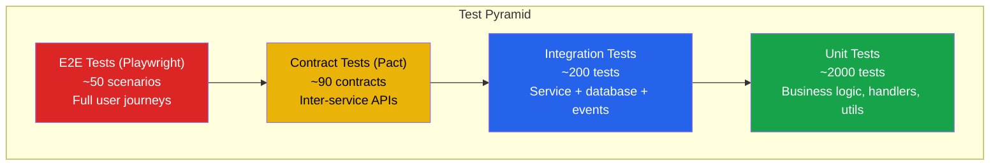
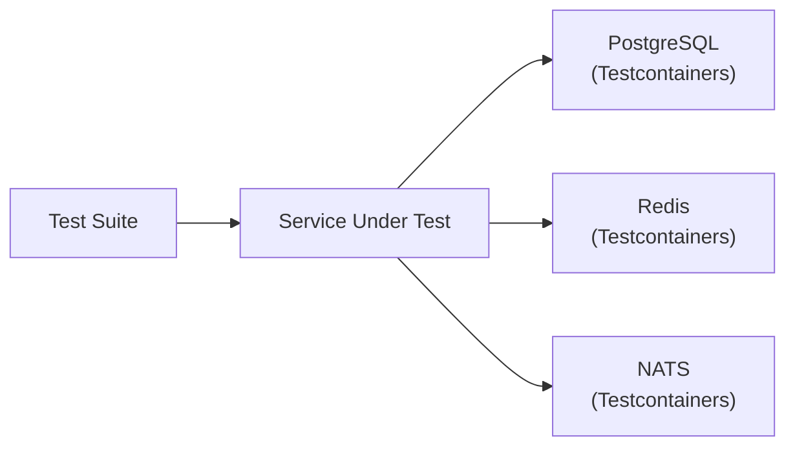
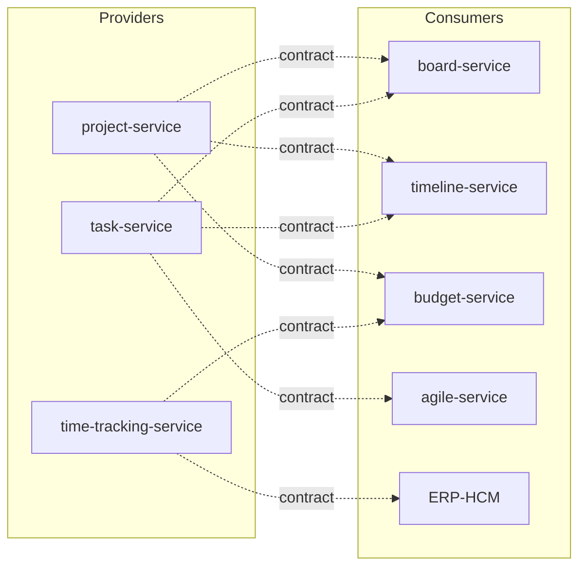
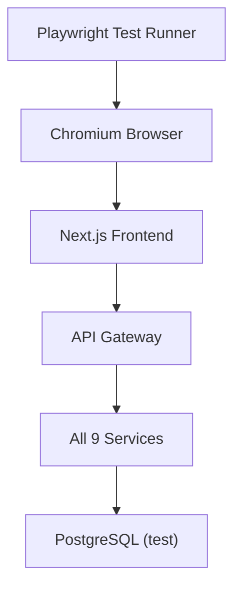
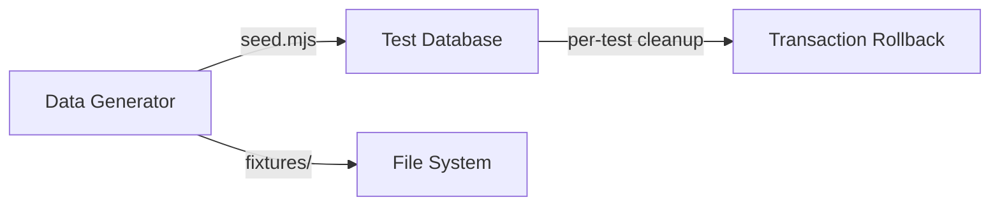
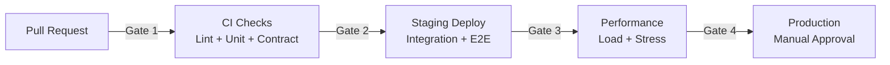

# ERP-Projects -- Testing Strategy

## Document Control

| Field         | Value                                          |
|---------------|------------------------------------------------|
| Module        | ERP-Projects                                   |
| Version       | 1.0                                            |
| Date          | 2026-02-23                                     |

---

## 1. Testing Philosophy

ERP-Projects adopts a multi-layered testing strategy aligned with the test pyramid principle: a broad base of fast unit tests, a middle layer of integration tests, and a focused set of end-to-end tests. Given the nine-service architecture, contract testing between services is a critical additional layer.



---

## 2. Unit Testing

### 2.1 Go Backend Unit Tests

| Area                  | Examples                                  | Coverage Target |
|-----------------------|-------------------------------------------|-----------------|
| Request handlers      | HTTP method routing, input validation     | 85%             |
| Business logic        | Health score calculation, EVM formulas    | 90%             |
| Data access layer     | Query builders, row mapping               | 80%             |
| Event publishers      | CloudEvents envelope construction         | 85%             |
| Middleware            | Auth extraction, tenant validation        | 90%             |
| Utilities             | Date math, currency formatting            | 95%             |

**Example -- EVM Calculation Test:**
```go
func TestCalculateCPI(t *testing.T) {
    tests := []struct {
        name     string
        ev       float64
        ac       float64
        expected float64
    }{
        {"under budget", 100000, 90000, 1.111},
        {"on budget", 100000, 100000, 1.0},
        {"over budget", 100000, 120000, 0.833},
        {"zero actual cost", 100000, 0, 0}, // guard against div by zero
    }
    for _, tt := range tests {
        t.Run(tt.name, func(t *testing.T) {
            got := CalculateCPI(tt.ev, tt.ac)
            assert.InDelta(t, tt.expected, got, 0.001)
        })
    }
}
```

### 2.2 Frontend Unit Tests

| Area            | Tool    | Coverage Target |
|-----------------|---------|-----------------|
| React components| vitest  | 75%             |
| Custom hooks    | vitest  | 85%             |
| Utility functions| vitest | 95%             |
| State management| vitest  | 80%             |
| API client      | vitest  | 80%             |

---

## 3. Integration Testing

### 3.1 Service Integration Tests



| Test Category           | Description                                    | Count |
|-------------------------|------------------------------------------------|-------|
| API endpoint tests      | Full HTTP request/response with real DB         | 80    |
| Database migration tests| Verify all migrations run cleanly               | 27    |
| Event publishing tests  | Verify events published on CRUD operations      | 45    |
| Cross-service queries   | Verify data joins across service boundaries     | 30    |
| Cache behavior tests    | Verify cache hit/miss/invalidation              | 20    |

### 3.2 Critical Path Integration Tests

| Scenario                                     | Services Involved            |
|----------------------------------------------|------------------------------|
| Create project with tasks and dependencies   | project-service, task-service|
| Auto-schedule with resource constraints      | timeline-service, resource-service |
| Time entry to budget cost tracking           | time-tracking-service, budget-service |
| Sprint lifecycle with velocity tracking      | agile-service, task-service  |
| Timesheet approval to payroll sync           | time-tracking-service, ERP-HCM |

---

## 4. Contract Testing

### 4.1 Provider-Consumer Contracts



### 4.2 Contract Definitions

| Provider          | Consumer         | Contract Scope                      |
|-------------------|------------------|-------------------------------------|
| project-service   | timeline-service | Project dates, status, task list    |
| project-service   | budget-service   | Budget amount, currency, spend      |
| task-service      | board-service    | Task status, position, assignments  |
| task-service      | timeline-service | Task dates, dependencies, progress  |
| task-service      | agile-service    | Sprint assignment, story points     |
| time-tracking-svc | budget-service   | Hours, rates, billable flag         |
| time-tracking-svc | ERP-HCM          | Approved timesheet payload          |

---

## 5. End-to-End Testing

### 5.1 E2E Test Scenarios

| ID    | Scenario                                    | Priority |
|-------|---------------------------------------------|----------|
| E2E-01| Create project, add tasks, view on board    | P0       |
| E2E-02| Create task with dependencies, view Gantt   | P0       |
| E2E-03| Log time via timer, submit timesheet        | P0       |
| E2E-04| Approve timesheet, verify cost update       | P0       |
| E2E-05| Create sprint, move cards, complete sprint  | P0       |
| E2E-06| View portfolio dashboard with multiple projects | P1   |
| E2E-07| Resource allocation and workload view       | P1       |
| E2E-08| Budget threshold alert triggered            | P1       |
| E2E-09| Bulk task status update                     | P1       |
| E2E-10| Project template creation and use           | P2       |

### 5.2 E2E Test Architecture



---

## 6. Performance Testing

### 6.1 Load Test Scenarios

| Scenario                    | VUs  | Duration | Target                    |
|-----------------------------|------|----------|---------------------------|
| API CRUD baseline           | 100  | 5 min    | P95 < 100ms, 0% errors   |
| Peak load simulation        | 1000 | 15 min   | P95 < 200ms, < 0.1% err  |
| Gantt chart data fetch      | 200  | 5 min    | P95 < 500ms for 1K tasks |
| Board card movement         | 500  | 10 min   | P95 < 150ms              |
| Concurrent time entries     | 300  | 5 min    | P95 < 100ms              |
| Bulk operations             | 50   | 5 min    | 100-task bulk < 2s       |
| Search across 100K tasks    | 200  | 5 min    | P95 < 300ms              |

### 6.2 Stress Test Boundaries

| Resource        | Normal | Stress | Breaking Point |
|-----------------|--------|--------|----------------|
| Concurrent users| 1,000  | 5,000  | 10,000+        |
| Tasks per project| 1,000 | 10,000 | 50,000+        |
| Projects per tenant| 100 | 1,000  | 10,000+        |
| API requests/sec| 500    | 2,000  | 5,000+         |

---

## 7. Test Data Management

### 7.1 Test Fixtures

| Fixture               | Contents                                  |
|------------------------|-------------------------------------------|
| `small_project`        | 1 project, 10 tasks, 3 users              |
| `medium_project`       | 1 project, 100 tasks, 10 users, dependencies |
| `large_project`        | 1 project, 1000 tasks, 50 users, full WBS |
| `portfolio`            | 10 projects, 500 tasks, 30 users          |
| `agile_project`        | 1 project, 5 sprints, backlog, velocity data |

### 7.2 Data Generation



---

## 8. Quality Gates

| Gate          | Criteria                                | Enforcement |
|---------------|----------------------------------------|-------------|
| Pre-commit    | Linting passes, unit tests pass         | Git hooks   |
| PR merge      | All CI checks pass, review approved     | Branch protection |
| Staging deploy| Integration + contract tests pass       | Pipeline gate |
| Production    | E2E + performance tests pass, manual approval | Pipeline gate |


