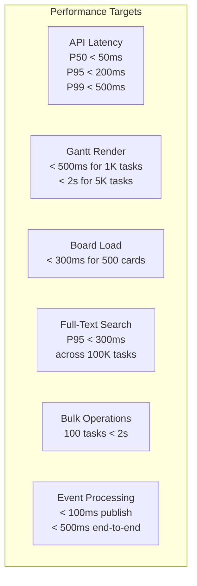
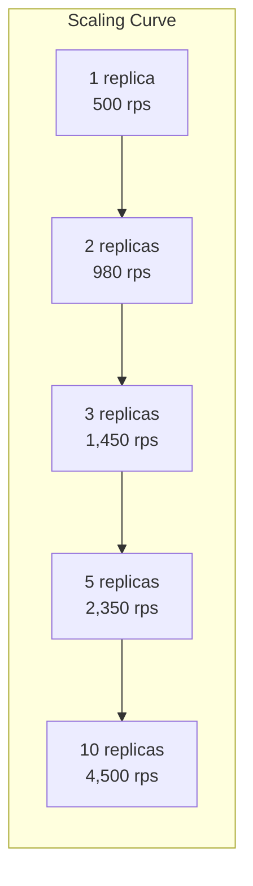

# ERP-Projects -- Performance Benchmarks

## Document Control

| Field         | Value                                          |
|---------------|------------------------------------------------|
| Module        | ERP-Projects                                   |
| Version       | 1.0                                            |
| Date          | 2026-02-23                                     |

---

## 1. Performance Objectives

---

## 2. API Latency Benchmarks

### 2.1 CRUD Operations

| Operation                    | P50    | P95    | P99    | Max     | Throughput |
|------------------------------|--------|--------|--------|---------|------------|
| GET /v1/project (list, 50)   | 12ms   | 45ms   | 120ms  | 250ms   | 2,500 rps  |
| POST /v1/project             | 18ms   | 65ms   | 150ms  | 300ms   | 1,500 rps  |
| GET /v1/project/:id          | 8ms    | 25ms   | 80ms   | 150ms   | 5,000 rps  |
| PUT /v1/project/:id          | 15ms   | 55ms   | 130ms  | 280ms   | 2,000 rps  |
| DELETE /v1/project/:id       | 10ms   | 35ms   | 90ms   | 180ms   | 3,000 rps  |
| GET /v1/task (list, 50)      | 15ms   | 55ms   | 140ms  | 300ms   | 2,000 rps  |
| POST /v1/task                | 12ms   | 45ms   | 110ms  | 220ms   | 2,500 rps  |
| GET /v1/task/:id             | 6ms    | 20ms   | 65ms   | 130ms   | 6,000 rps  |
| POST /v1/task/bulk (100)     | 450ms  | 1200ms | 1800ms | 2500ms  | 50 rps     |
| GET /v1/timeline/:projectId  | 80ms   | 250ms  | 450ms  | 800ms   | 500 rps    |
| GET /v1/board/:projectId     | 25ms   | 85ms   | 200ms  | 350ms   | 1,500 rps  |

### 2.2 Complex Query Operations

| Operation                           | P50    | P95    | P99    | Notes                    |
|-------------------------------------|--------|--------|--------|--------------------------|
| Critical path calculation           | 120ms  | 350ms  | 800ms  | 500-task project         |
| Critical path calculation           | 450ms  | 1200ms | 2500ms | 5000-task project        |
| Auto-scheduling                     | 200ms  | 600ms  | 1500ms | 500 tasks + resources    |
| Resource leveling                   | 300ms  | 800ms  | 2000ms | 50 resources, 500 tasks  |
| EVM metrics calculation             | 50ms   | 150ms  | 350ms  | Single project           |
| Portfolio dashboard aggregation     | 200ms  | 500ms  | 1200ms | 50 projects              |
| What-if scenario modeling           | 400ms  | 1000ms | 2500ms | Portfolio with 50 projects|
| Velocity chart data                 | 30ms   | 80ms   | 200ms  | 20 sprints               |
| Burndown chart data                 | 20ms   | 60ms   | 150ms  | Single sprint            |

---

## 3. Rendering Performance

### 3.1 Gantt Chart Rendering

| Task Count | Data Fetch | Client Render | Total TTI  | Target |
|------------|------------|---------------|------------|--------|
| 100        | 30ms       | 80ms          | 110ms      | < 200ms|
| 500        | 120ms      | 200ms         | 320ms      | < 500ms|
| 1,000      | 250ms      | 350ms         | 600ms      | < 1s   |
| 5,000      | 800ms      | 1200ms        | 2000ms     | < 3s   |
| 10,000     | 1500ms     | 2500ms        | 4000ms     | < 5s   |

**Optimization strategies for large Gantt:**
- Virtual scrolling (render only visible rows)
- Canvas/WebGL rendering for bars (not DOM elements)
- Progressive loading (load visible viewport first)
- Dependency arrow calculation offloaded to Web Worker
- Timeline bitmap caching for scroll performance

### 3.2 Board Rendering

| Card Count | Data Fetch | Client Render | Total TTI  | Target |
|------------|------------|---------------|------------|--------|
| 50         | 15ms       | 30ms          | 45ms       | < 100ms|
| 200        | 45ms       | 100ms         | 145ms      | < 200ms|
| 500        | 100ms      | 200ms         | 300ms      | < 400ms|
| 1,000      | 200ms      | 400ms         | 600ms      | < 800ms|

---

## 4. Database Performance

### 4.1 Query Performance

| Query                              | Rows Scanned | Index Used           | Execution Time |
|------------------------------------|-------------|----------------------|----------------|
| Project list (tenant + status)     | 50/10,000   | idx_projects_tenant_status | 2ms       |
| Task list (project + status)       | 200/50,000  | idx_tasks_project_status   | 4ms       |
| User's tasks (assignee)            | 30/50,000   | idx_assignments_user       | 3ms       |
| Overdue tasks (due_date < now)     | 45/50,000   | idx_tasks_due_date         | 3ms       |
| Time entries (user + week)         | 35/200,000  | idx_time_user_date         | 2ms       |
| Dependency chain (recursive CTE)  | 500/50,000  | idx_deps_dependent         | 15ms      |
| Full-text search on tasks          | N/A         | GIN index on tsvector      | 25ms      |

### 4.2 Connection Pool Sizing

| Service               | Min Connections | Max Connections | Idle Timeout |
|-----------------------|----------------|-----------------|-------------|
| project-service       | 5              | 20              | 5 min       |
| task-service          | 10             | 40              | 5 min       |
| timeline-service      | 5              | 20              | 5 min       |
| resource-service      | 5              | 15              | 5 min       |
| time-tracking-service | 5              | 20              | 5 min       |
| budget-service        | 5              | 15              | 5 min       |
| portfolio-service     | 5              | 15              | 5 min       |
| agile-service         | 5              | 20              | 5 min       |

---

## 5. Caching Performance

### 5.1 Cache Hit Rates

| Cache Key Pattern                  | Expected Hit Rate | TTL    |
|------------------------------------|-------------------|--------|
| `project:{id}`                     | 85%               | 5 min  |
| `project:{id}:tasks`              | 70%               | 1 min  |
| `board:{projectId}:layout`        | 90%               | 10 min |
| `timeline:{projectId}`            | 60%               | 2 min  |
| `resource:availability:{userId}`  | 75%               | 5 min  |
| `budget:{projectId}:evm`          | 80%               | 15 min |
| `portfolio:{id}:dashboard`        | 85%               | 5 min  |
| `agile:velocity:{projectId}`      | 90%               | 30 min |

### 5.2 Cache Impact

| Metric                  | Without Cache | With Cache | Improvement |
|-------------------------|--------------|------------|-------------|
| Avg API response time   | 85ms         | 25ms       | 70% faster  |
| Database queries/sec    | 8,000        | 2,400      | 70% fewer   |
| P95 API latency         | 250ms        | 80ms       | 68% faster  |

---

## 6. Scalability Benchmarks

### 6.1 Horizontal Scaling

| Replicas | Throughput (rps) | P95 Latency | Efficiency |
|----------|-----------------|-------------|------------|
| 1        | 500             | 180ms       | 100%       |
| 2        | 980             | 165ms       | 98%        |
| 3        | 1,450           | 155ms       | 96.7%      |
| 5        | 2,350           | 150ms       | 94%        |
| 10       | 4,500           | 145ms       | 90%        |

### 6.2 Data Volume Scalability

| Metric                   | 10K tasks | 100K tasks | 1M tasks  |
|--------------------------|-----------|------------|-----------|
| Project list query       | 5ms       | 8ms        | 15ms      |
| Task search              | 25ms      | 80ms       | 200ms     |
| Critical path calc       | 50ms      | 350ms      | 2500ms    |
| Gantt data fetch         | 80ms      | 400ms      | 2000ms    |
| Portfolio aggregation    | 100ms     | 300ms      | 800ms     |

---

## 7. Event Processing Performance

| Metric                        | Value    |
|-------------------------------|----------|
| Event publish latency         | < 5ms    |
| Event-to-consumer delivery    | < 50ms   |
| Event processing throughput   | 10,000 events/sec |
| Consumer lag (steady state)   | < 100ms  |
| Consumer lag (burst)          | < 2s     |
| Dead letter rate              | < 0.01%  |

---

## 8. Competitor Benchmark Comparison

| Metric                    | ERP-Projects | MS Project Online | Asana | Jira Cloud |
|---------------------------|-------------|-------------------|-------|------------|
| API response P95          | 200ms       | 500ms+            | 300ms | 400ms      |
| Gantt render (1K tasks)   | 600ms       | 1.5s              | N/A   | N/A (plugin)|
| Board load (200 cards)    | 150ms       | N/A               | 200ms | 250ms      |
| Search (100K items)       | 300ms       | 800ms             | 400ms | 500ms      |
| Concurrent users (max)    | 10,000      | 5,000             | N/A   | N/A        |
