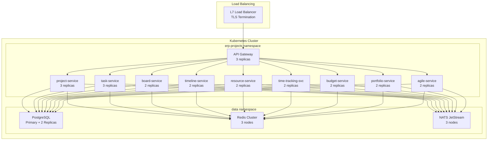
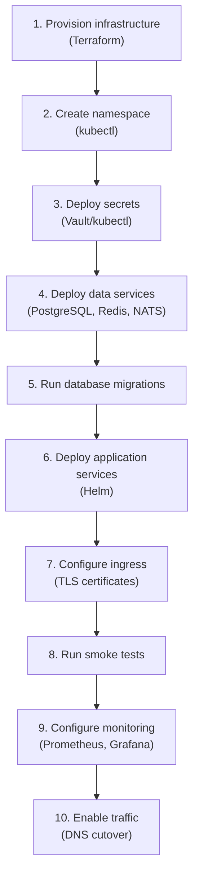
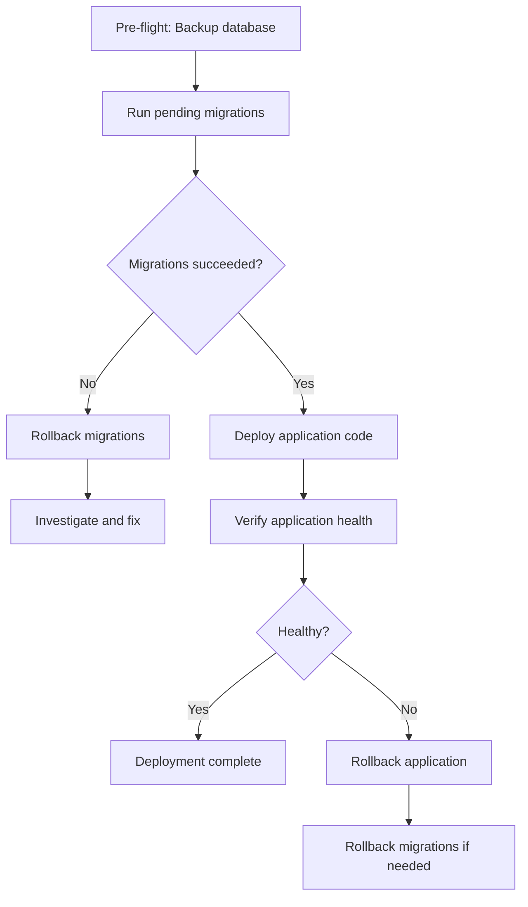

# ERP-Projects -- Deployment Guide

## Document Control

| Field         | Value                                          |
|---------------|------------------------------------------------|
| Module        | ERP-Projects                                   |
| Version       | 1.0                                            |
| Date          | 2026-02-23                                     |

---

## 1. Deployment Architecture



---

## 2. Prerequisites

| Component            | Version    | Purpose                          |
|----------------------|------------|----------------------------------|
| Kubernetes           | 1.28+      | Container orchestration          |
| Helm                 | 3.14+      | Package management               |
| PostgreSQL           | 16+        | Primary database                 |
| Redis                | 7.2+       | Caching and sessions             |
| NATS JetStream       | 2.10+      | Event messaging                  |
| Docker               | 24+        | Container runtime                |
| kubectl              | 1.28+      | Cluster management               |
| Terraform            | 1.7+       | Infrastructure provisioning      |

---

## 3. Environment Configuration

### 3.1 Environment Variables

| Variable               | Required | Default    | Description                       |
|------------------------|----------|------------|-----------------------------------|
| `PORT`                 | No       | 8080       | Service listen port               |
| `MODULE_NAME`          | No       | ERP-Projects| Module identifier                |
| `DATABASE_URL`         | Yes      |            | PostgreSQL connection string      |
| `REDIS_URL`            | Yes      |            | Redis connection string           |
| `NATS_URL`             | Yes      |            | NATS server URL                   |
| `IAM_JWKS_URL`         | Yes      |            | ERP-IAM JWKS endpoint             |
| `IAM_ISSUER`           | Yes      |            | JWT issuer URL                    |
| `PLATFORM_URL`         | Yes      |            | ERP-Platform API URL              |
| `LOG_LEVEL`            | No       | info       | Logging level                     |
| `LOG_FORMAT`           | No       | json       | Log format (json/text)            |
| `OTEL_ENDPOINT`        | No       |            | OpenTelemetry collector endpoint  |
| `S3_BUCKET`            | No       |            | Object storage for attachments    |
| `S3_REGION`            | No       |            | Object storage region             |

### 3.2 Secrets Management

| Secret                | Storage         | Rotation       |
|----------------------|-----------------|----------------|
| DATABASE_URL         | Kubernetes Secret/Vault | 90 days  |
| REDIS_URL            | Kubernetes Secret/Vault | 90 days  |
| NATS_URL             | Kubernetes Secret/Vault | 90 days  |
| S3 credentials       | IAM Role (IRSA)        | Automatic|
| JWT signing keys     | ERP-IAM                | 30 days  |

---

## 4. Deployment Procedures

### 4.1 First-Time Deployment



### 4.2 Rolling Update Deployment

```bash
# Update service image
helm upgrade erp-projects ./charts/erp-projects \
  --set image.tag=$NEW_SHA \
  --set strategy.type=RollingUpdate \
  --set strategy.rollingUpdate.maxSurge=25% \
  --set strategy.rollingUpdate.maxUnavailable=0 \
  --namespace erp-projects \
  --wait --timeout=10m

# Verify deployment
kubectl rollout status deployment/project-service -n erp-projects
kubectl rollout status deployment/task-service -n erp-projects
# ... repeat for all services

# Run post-deploy smoke tests
./scripts/smoke-test.sh
```

### 4.3 Database Migration Procedure



---

## 5. Rollback Procedures

### 5.1 Application Rollback

```bash
# Rollback to previous revision
helm rollback erp-projects <revision> -n erp-projects

# Or rollback specific deployment
kubectl rollout undo deployment/project-service -n erp-projects
```

### 5.2 Database Rollback

```bash
# Run down migration
migrate -path ./migrations -database $DATABASE_URL down 1

# Restore from backup (last resort)
pg_restore -h $DB_HOST -U $DB_USER -d erp_projects backup_YYYYMMDD.dump
```

---

## 6. Health Verification

### 6.1 Post-Deployment Checks

| Check                         | Command                                     | Expected       |
|-------------------------------|---------------------------------------------|----------------|
| All pods running              | `kubectl get pods -n erp-projects`          | All Running     |
| Health endpoints              | `curl /healthz` for each service            | `{"status":"healthy"}` |
| Database connectivity         | Health check includes DB check              | OK              |
| Redis connectivity            | Health check includes Redis check           | OK              |
| NATS connectivity             | Health check includes NATS check            | OK              |
| API smoke test                | `POST /v1/project` + `GET /v1/project`      | 201 + 200       |
| Frontend loads                | Browser test of web app                     | Page renders    |

### 6.2 Monitoring Dashboard Verification

| Dashboard                | Key Metrics to Verify                      |
|--------------------------|-------------------------------------------|
| Service Health           | All 9 services green, no restarts         |
| API Latency              | P95 < 200ms within 5 minutes of deploy    |
| Error Rate               | < 0.1% within 5 minutes of deploy        |
| Database Connections     | Pool utilization < 80%                    |
| Event Processing         | Consumer lag < 100ms                      |

---

## 7. Scaling Configuration

### 7.1 Horizontal Pod Autoscaler

| Service               | Min Replicas | Max Replicas | CPU Target | Memory Target |
|-----------------------|-------------|-------------|------------|---------------|
| api-gateway           | 3           | 10          | 70%        | 80%           |
| project-service       | 3           | 8           | 70%        | 80%           |
| task-service          | 3           | 12          | 70%        | 80%           |
| board-service         | 2           | 6           | 70%        | 80%           |
| timeline-service      | 2           | 6           | 70%        | 80%           |
| resource-service      | 2           | 6           | 70%        | 80%           |
| time-tracking-service | 2           | 8           | 70%        | 80%           |
| budget-service        | 2           | 6           | 70%        | 80%           |
| portfolio-service     | 2           | 4           | 70%        | 80%           |
| agile-service         | 2           | 8           | 70%        | 80%           |

---

## 8. Disaster Recovery

### 8.1 Backup Schedule

| Component          | Method               | Frequency  | Retention |
|--------------------|---------------------|------------|-----------|
| PostgreSQL         | pg_dump + WAL archival| 6 hours   | 30 days   |
| Redis              | RDB snapshots        | 1 hour    | 7 days    |
| NATS JetStream     | Stream snapshots     | 12 hours  | 14 days   |
| Object storage     | Versioned bucket     | N/A       | Indefinite|
| Configuration      | Git repository       | N/A       | Indefinite|

### 8.2 Recovery Procedures

| Scenario                    | RTO      | RPO      | Procedure                         |
|-----------------------------|----------|----------|-----------------------------------|
| Single pod failure          | 30s      | 0        | Kubernetes auto-restart           |
| Service degradation         | 5 min    | 0        | Rolling restart + autoscale       |
| Database primary failure    | 15 min   | < 1 min  | Promote read replica              |
| Full cluster failure        | 4 hours  | < 1 hour | Restore from backup in new cluster|
| Region outage               | 4 hours  | < 1 hour | Failover to DR region             |
