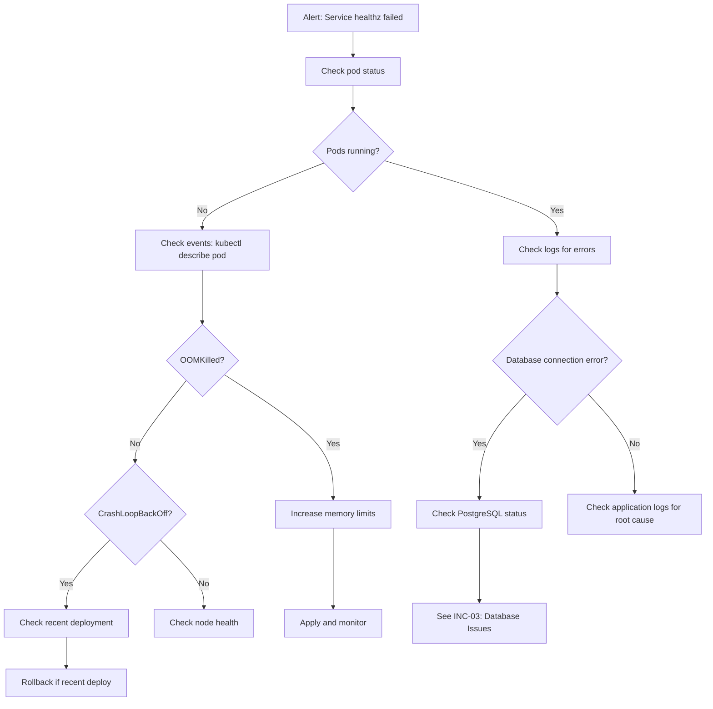

# ERP-Projects -- Operational Runbook

## Document Control

| Field         | Value                                          |
|---------------|------------------------------------------------|
| Module        | ERP-Projects                                   |
| Version       | 1.0                                            |
| Date          | 2026-02-23                                     |

---

## 1. On-Call Quick Reference

### 1.1 Service Ports and Endpoints

| Service               | Port | Health Check         | Log Label                |
|-----------------------|------|----------------------|--------------------------|
| api-gateway           | 8090 | GET /healthz         | `service=gateway`        |
| project-service       | 8080 | GET /healthz         | `service=project-svc`    |
| task-service          | 8081 | GET /healthz         | `service=task-svc`       |
| board-service         | 8082 | GET /healthz         | `service=board-svc`      |
| timeline-service      | 8083 | GET /healthz         | `service=timeline-svc`   |
| resource-service      | 8084 | GET /healthz         | `service=resource-svc`   |
| time-tracking-service | 8085 | GET /healthz         | `service=time-tracking`  |
| budget-service        | 8086 | GET /healthz         | `service=budget-svc`     |
| portfolio-service     | 8087 | GET /healthz         | `service=portfolio-svc`  |
| agile-service         | 8088 | GET /healthz         | `service=agile-svc`      |

### 1.2 Escalation Matrix

| Severity | Response Time | Notify            | Escalate After |
|----------|--------------|-------------------|----------------|
| SEV-1    | 15 min       | On-call + manager | 1 hour         |
| SEV-2    | 1 hour       | On-call           | 4 hours        |
| SEV-3    | 4 hours      | On-call           | 24 hours       |
| SEV-4    | Next business day | Ticket only   | 1 week         |

---

## 2. Common Incident Procedures

### 2.1 INC-01: Service Not Responding



**Commands:**
```bash
# Check pod status
kubectl get pods -n erp-projects -l app=<service-name>

# Check pod events
kubectl describe pod <pod-name> -n erp-projects

# Check logs
kubectl logs <pod-name> -n erp-projects --tail=100

# Restart service
kubectl rollout restart deployment/<service-name> -n erp-projects
```

### 2.2 INC-02: High API Latency

**Diagnosis steps:**
1. Check Grafana dashboard for latency spike timing
2. Identify affected service(s) via distributed tracing
3. Check database query performance (slow query log)
4. Check Redis cache hit rates
5. Check for connection pool exhaustion
6. Check for resource contention (CPU/memory)

```bash
# Check resource utilization
kubectl top pods -n erp-projects

# Check database connections
psql -c "SELECT count(*) FROM pg_stat_activity WHERE datname='erp_projects';"

# Check Redis info
redis-cli INFO memory
redis-cli INFO stats
```

### 2.3 INC-03: Database Issues

**PostgreSQL connection pool exhaustion:**
```bash
# Check active connections
psql -c "SELECT state, count(*) FROM pg_stat_activity GROUP BY state;"

# Kill idle connections if needed
psql -c "SELECT pg_terminate_backend(pid) FROM pg_stat_activity WHERE state = 'idle' AND query_start < NOW() - INTERVAL '10 minutes';"

# Check for long-running queries
psql -c "SELECT pid, now() - pg_stat_activity.query_start AS duration, query FROM pg_stat_activity WHERE state != 'idle' ORDER BY duration DESC LIMIT 10;"
```

### 2.4 INC-04: Event Processing Lag

```bash
# Check NATS consumer lag
nats consumer info erp-projects <consumer-name>

# Check for dead letter messages
nats stream info erp-projects-dlq

# Restart consumer
kubectl rollout restart deployment/<affected-service> -n erp-projects
```

### 2.5 INC-05: Disk Space Issues

```bash
# Check PV usage
kubectl exec -n erp-projects <postgres-pod> -- df -h /var/lib/postgresql/data

# Identify large tables
psql -c "SELECT relname, pg_size_pretty(pg_total_relation_size(relid)) FROM pg_catalog.pg_statio_user_tables ORDER BY pg_total_relation_size(relid) DESC LIMIT 10;"

# Vacuum if needed
psql -c "VACUUM ANALYZE;"
```

---

## 3. Maintenance Procedures

### 3.1 Database Maintenance

| Task                      | Frequency  | Command/Action                    |
|---------------------------|------------|-----------------------------------|
| VACUUM ANALYZE            | Daily      | Automated via pg_cron             |
| Index rebuild             | Weekly     | REINDEX CONCURRENTLY              |
| Partition maintenance     | Monthly    | Create new partitions, drop old   |
| Statistics update         | Daily      | ANALYZE on high-churn tables      |
| Connection pool check     | Daily      | Monitor via Grafana               |

### 3.2 Cache Maintenance

| Task                      | Frequency  | Action                            |
|---------------------------|------------|-----------------------------------|
| Monitor memory usage      | Continuous | Grafana alert at 80%              |
| Review eviction rates     | Weekly     | Adjust maxmemory if needed        |
| Clear stale keys          | As needed  | Targeted key deletion             |

### 3.3 Log Management

| Task                      | Frequency  | Action                            |
|---------------------------|------------|-----------------------------------|
| Log rotation              | Daily      | Automated via log shipper         |
| Log retention cleanup     | Weekly     | Delete logs older than 30 days    |
| Audit log archival        | Monthly    | Archive to cold storage           |

---

## 4. Operational Dashboards

### 4.1 Primary Dashboard Panels

| Panel                     | Metrics                                   |
|---------------------------|-------------------------------------------|
| Service Health Matrix     | All 9 services up/down status             |
| API Latency (P50/P95/P99)| Per-service response time heatmap         |
| Error Rate                | 5xx errors per service per 5min           |
| Request Volume            | Requests/sec per service                  |
| Database Performance      | Query duration, connection pool, replication lag |
| Redis Performance         | Hit rate, memory, evictions               |
| Event Processing          | Publish rate, consumer lag, DLQ size      |
| Resource Utilization      | CPU/Memory per pod                        |

---

## 5. Capacity Management

### 5.1 Growth Projections

| Metric                | Current | 6-Month | 12-Month | Capacity Plan       |
|----------------------|---------|---------|----------|---------------------|
| Active tenants       | 50      | 200     | 1,000    | Database partitioning|
| Total projects       | 500     | 5,000   | 50,000   | Read replicas       |
| Total tasks          | 50,000  | 500,000 | 5,000,000| Table partitioning  |
| Time entries/day     | 5,000   | 50,000  | 500,000  | Monthly partitions  |
| Events/sec           | 100     | 1,000   | 10,000   | NATS cluster scaling|
| API requests/sec     | 200     | 2,000   | 20,000   | Service replicas    |

### 5.2 Scaling Triggers

| Metric                     | Threshold      | Action                      |
|----------------------------|----------------|-----------------------------|
| CPU utilization            | > 70% avg      | Add replicas (HPA)          |
| Memory utilization         | > 80%          | Increase limits or replicas |
| Database connections       | > 80% pool     | Increase pool or add replica|
| API latency P95            | > 200ms        | Investigate, scale if needed|
| Disk usage                 | > 75%          | Expand PV or archive data   |
| Event consumer lag         | > 5s sustained | Scale consumers             |
