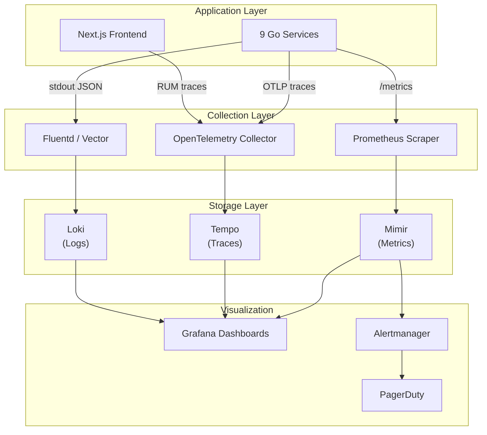
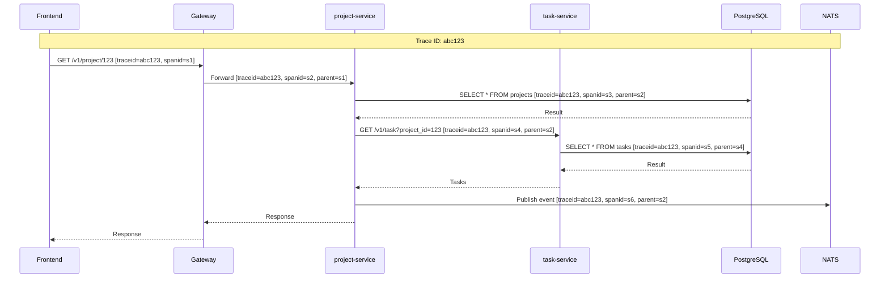
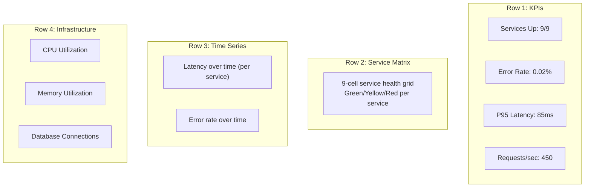
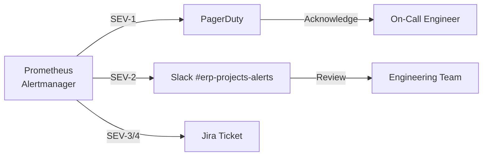

# ERP-Projects -- Monitoring & Observability

## Document Control

| Field         | Value                                          |
|---------------|------------------------------------------------|
| Module        | ERP-Projects                                   |
| Version       | 1.0                                            |
| Date          | 2026-02-23                                     |

---

## 1. Observability Architecture



---

## 2. Metrics

### 2.1 Service-Level Indicators (SLIs)

| SLI                        | Metric Name                                | Type      |
|----------------------------|--------------------------------------------|-----------|
| Availability               | `erp_projects_healthz_up`                  | Gauge     |
| Request latency            | `erp_projects_http_request_duration_seconds`| Histogram|
| Error rate                 | `erp_projects_http_requests_total{status="5xx"}` | Counter |
| Throughput                 | `erp_projects_http_requests_total`          | Counter  |

### 2.2 Service-Level Objectives (SLOs)

| SLO                                    | Target   | Window  |
|----------------------------------------|----------|---------|
| Availability (all services)            | 99.95%   | 30 days |
| API latency P95                        | < 200ms  | 5 min   |
| API latency P99                        | < 500ms  | 5 min   |
| Error rate                             | < 0.1%   | 5 min   |
| Gantt data endpoint P95                | < 500ms  | 5 min   |
| Event processing end-to-end           | < 500ms  | 5 min   |

### 2.3 Business Metrics

| Metric                                 | Label                                    |
|----------------------------------------|------------------------------------------|
| Active projects count                  | `erp_projects_active_count`              |
| Tasks created per hour                 | `erp_projects_tasks_created_total`       |
| Time entries per hour                  | `erp_projects_time_entries_total`        |
| Board card moves per hour              | `erp_projects_card_moves_total`          |
| Sprint completions                     | `erp_projects_sprints_completed_total`   |
| Projects by health status              | `erp_projects_by_health{status="..."}`   |
| Avg project health score              | `erp_projects_avg_health_score`          |
| Timesheet approval rate               | `erp_projects_timesheet_approval_rate`   |
| Budget utilization percentage          | `erp_projects_budget_utilization`        |

### 2.4 Infrastructure Metrics

| Metric                                 | Source                                   |
|----------------------------------------|------------------------------------------|
| CPU utilization per pod                | Kubernetes metrics-server                |
| Memory utilization per pod             | Kubernetes metrics-server                |
| Database connections (active/idle)     | PostgreSQL pg_stat_activity              |
| Database query duration                | PostgreSQL pg_stat_statements            |
| Redis hit/miss ratio                   | Redis INFO stats                         |
| Redis memory usage                     | Redis INFO memory                        |
| NATS message rate                      | NATS server metrics                      |
| NATS consumer lag                      | NATS consumer info                       |
| Disk IOPS                              | Cloud provider metrics                   |

---

## 3. Distributed Tracing

### 3.1 Trace Propagation



### 3.2 Span Naming Convention

| Format                          | Example                                  |
|---------------------------------|------------------------------------------|
| `HTTP {method} {route}`         | `HTTP GET /v1/project/:id`               |
| `DB {operation} {table}`        | `DB SELECT projects`                     |
| `NATS publish {subject}`        | `NATS publish erp.projects.task.created` |
| `NATS consume {subject}`        | `NATS consume erp.projects.task.created` |
| `Redis {operation} {key_pattern}`| `Redis GET project:*`                   |

---

## 4. Logging

### 4.1 Structured Log Format

```json
{
  "timestamp": "2026-02-23T10:30:00.000Z",
  "level": "info",
  "service": "project-service",
  "trace_id": "abc123",
  "span_id": "s2",
  "tenant_id": "tenant-uuid",
  "user_id": "user-uuid",
  "request_id": "req-uuid",
  "method": "GET",
  "path": "/v1/project/123",
  "status_code": 200,
  "duration_ms": 45,
  "message": "request completed"
}
```

### 4.2 Log Levels

| Level   | Usage                                    | Retention |
|---------|------------------------------------------|-----------|
| ERROR   | Unexpected failures, unhandled errors    | 90 days   |
| WARN    | Recoverable issues, deprecation notices  | 30 days   |
| INFO    | Request lifecycle, business events       | 14 days   |
| DEBUG   | Detailed diagnostic information          | 3 days    |

### 4.3 Sensitive Data Redaction

| Field             | Redaction Rule                            |
|-------------------|------------------------------------------|
| Authorization     | Replace with `Bearer [REDACTED]`         |
| Password fields   | Never logged                             |
| Email addresses   | Mask: `j***@example.com`                 |
| API keys          | Show last 4 characters only              |
| Request bodies    | Log structure only, not values for PII   |

---

## 5. Alerting Rules

### 5.1 Critical Alerts (SEV-1)

| Alert Name                    | Condition                              | Action          |
|-------------------------------|----------------------------------------|-----------------|
| `ServiceDown`                 | healthz fails for > 2 minutes          | Page on-call    |
| `HighErrorRate`               | 5xx rate > 5% for 3 minutes            | Page on-call    |
| `DatabaseUnreachable`         | DB connection fails for > 1 minute     | Page on-call    |
| `DiskFull`                    | Disk usage > 95%                       | Page on-call    |

### 5.2 Warning Alerts (SEV-2)

| Alert Name                    | Condition                              | Action          |
|-------------------------------|----------------------------------------|-----------------|
| `HighLatency`                 | P95 > 500ms for 5 minutes             | Slack notify    |
| `ElevatedErrorRate`           | 5xx rate > 1% for 5 minutes           | Slack notify    |
| `HighCPU`                     | CPU > 80% for 10 minutes              | Auto-scale + notify |
| `HighMemory`                  | Memory > 85% for 5 minutes            | Slack notify    |
| `EventProcessingLag`          | Consumer lag > 5s for 5 minutes        | Slack notify    |
| `CacheEvictionSpike`          | Redis evictions > 100/min             | Slack notify    |
| `DatabaseConnectionPoolHigh`  | Pool usage > 80%                       | Slack notify    |

### 5.3 Informational Alerts (SEV-3/4)

| Alert Name                    | Condition                              | Action          |
|-------------------------------|----------------------------------------|-----------------|
| `DiskUsageWarning`            | Disk usage > 75%                       | Ticket          |
| `CertificateExpiring`         | TLS cert expires in < 30 days         | Ticket          |
| `HighTraffic`                 | Request rate > 2x normal               | Dashboard flag  |
| `BudgetThresholdAlert`        | Project budget > 90%                   | Email PM        |

---

## 6. Dashboards

### 6.1 Dashboard Inventory

| Dashboard                      | Audience        | Refresh Rate |
|--------------------------------|-----------------|-------------|
| Service Health Overview        | SRE / On-call   | 10s         |
| API Performance                | SRE / Dev       | 30s         |
| Database Performance           | DBA / SRE       | 30s         |
| Event Processing               | SRE / Dev       | 15s         |
| Business Metrics               | Product / PM    | 5 min       |
| Tenant Usage                   | Support / Sales | 5 min       |
| SLO Compliance                 | Management      | 1 hour      |

### 6.2 Service Health Dashboard Layout



---

## 7. Incident Response Integration

### 7.1 Alert Routing


