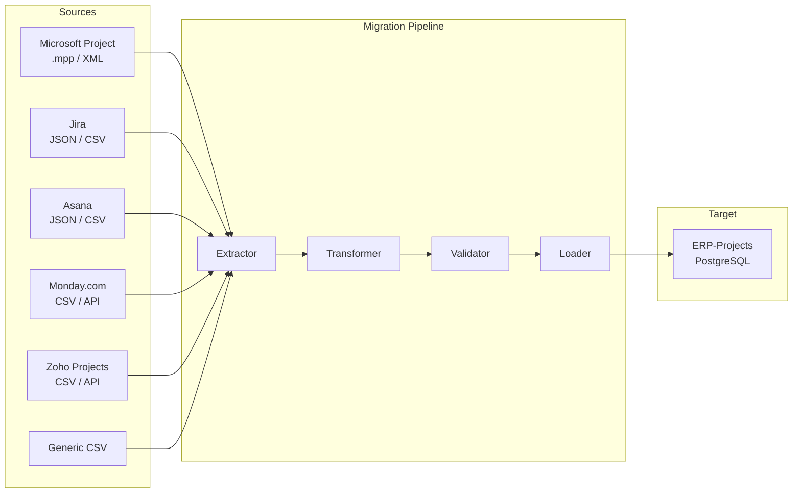
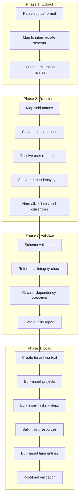
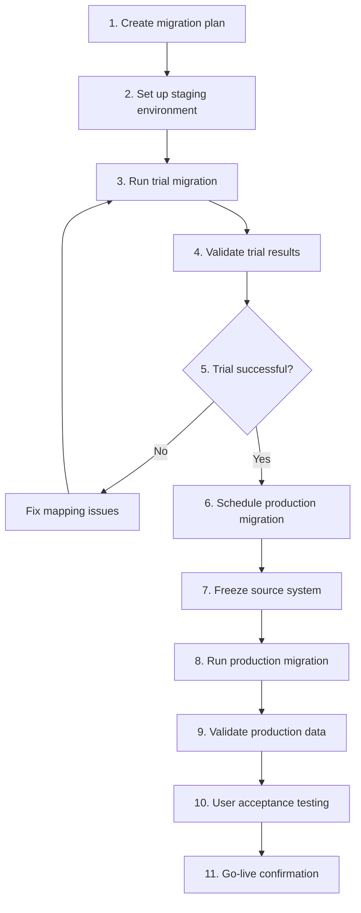
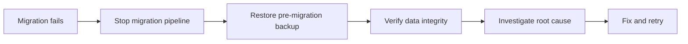

# ERP-Projects -- Data Migration Guide

## Document Control

| Field         | Value                                          |
|---------------|------------------------------------------------|
| Module        | ERP-Projects                                   |
| Version       | 1.0                                            |
| Date          | 2026-02-23                                     |

---

## 1. Migration Overview

ERP-Projects supports data migration from five major competitive platforms and common data formats. This document covers the migration architecture, supported sources, field mapping, and validation procedures.



---

## 2. Migration Pipeline Architecture



---

## 3. Source-Specific Migration

### 3.1 Microsoft Project (.mpp / XML)

**Field Mapping:**

| MS Project Field   | ERP-Projects Field  | Transformation                    |
|--------------------|---------------------|-----------------------------------|
| Name               | project.name        | Direct map                        |
| Start              | project.startDate   | Date format conversion            |
| Finish             | project.endDate     | Date format conversion            |
| Task Name          | task.title          | Direct map                        |
| Duration           | task.estimatedHours | Work days to hours conversion     |
| % Complete         | task.completionPct  | Direct map                        |
| Predecessors       | taskDependency      | Parse "3FS+2d" format            |
| Baseline Start     | baseline.startDate  | Date format conversion            |
| Baseline Finish    | baseline.endDate    | Date format conversion            |
| Resource Names     | resourceAllocation  | Name-to-user matching             |
| Cost               | budget              | Currency normalization            |
| WBS                | task hierarchy       | Outline level to parent-child     |
| Critical           | task.isCriticalPath | Boolean flag                      |

### 3.2 Jira Migration

**Field Mapping:**

| Jira Field          | ERP-Projects Field  | Transformation                    |
|---------------------|---------------------|-----------------------------------|
| Project Name        | project.name        | Direct map                        |
| Issue Type (Epic)   | epic                | Map to ERP epic                   |
| Issue Type (Story)  | task                | Map to task                       |
| Issue Type (Sub-task)| subtask            | Map to child task                 |
| Status              | task.status         | Custom mapping per workflow       |
| Priority            | task.priority       | Map Jira priorities to 4-level    |
| Story Points        | task.storyPoints    | Direct map                        |
| Sprint              | sprint              | Map sprint name + dates           |
| Assignee            | taskAssignment      | Email-based user matching         |
| Labels              | task.tags           | Comma-separated                   |
| Linked Issues       | taskDependency      | "blocks" -> FS, "is blocked by" -> FS |
| Time Logged         | timeEntry           | Hours + date extraction           |

### 3.3 Asana Migration

| Asana Field         | ERP-Projects Field  | Transformation                    |
|---------------------|---------------------|-----------------------------------|
| Project Name        | project.name        | Direct map                        |
| Section             | milestone           | Map sections to milestones        |
| Task Name           | task.title          | Direct map                        |
| Assignee            | taskAssignment      | Email matching                    |
| Due Date            | task.dueDate        | Date format                       |
| Completed           | task.status         | true -> DONE, false -> TODO       |
| Subtasks            | child tasks         | Maintain hierarchy                |
| Dependencies        | taskDependency      | "waiting on" -> FS                |
| Tags                | task.tags           | Direct map                        |
| Custom Fields       | task.customFields   | JSON mapping                      |

---

## 4. Migration Validation

### 4.1 Pre-Migration Checks

| Check                           | Description                              |
|---------------------------------|------------------------------------------|
| Source data accessibility       | Verify API/file access credentials       |
| User mapping completeness       | All source users mapped to ERP users    |
| Status mapping verification     | All source statuses have target mapping |
| Data volume estimation          | Estimate rows, time, and space needed   |
| Dependency cycle detection      | Check for circular dependencies         |

### 4.2 Post-Migration Validation

| Check                           | Method                                   |
|---------------------------------|------------------------------------------|
| Record count reconciliation     | Source count = target count per entity   |
| Project count                   | Query count comparison                   |
| Task count                      | Query count comparison                   |
| Dependency integrity            | All referenced tasks exist              |
| Date consistency                | No end dates before start dates         |
| Budget totals                   | Sum matches source totals               |
| User assignments                | All assignments valid                   |

### 4.3 Validation Report Template

```json
{
  "migrationId": "mig-uuid",
  "source": "Jira",
  "timestamp": "2026-02-23T10:00:00Z",
  "summary": {
    "projectsMigrated": 12,
    "tasksMigrated": 1547,
    "dependenciesMigrated": 234,
    "usersMapped": 45,
    "timeEntriesMigrated": 8920
  },
  "warnings": [
    "3 users could not be matched by email - assigned to default user",
    "15 tasks had invalid date ranges - dates adjusted"
  ],
  "errors": [],
  "status": "SUCCESS"
}
```

---

## 5. Migration Execution

### 5.1 Step-by-Step Procedure



### 5.2 Rollback Procedure



---

## 6. Performance Considerations

| Data Volume        | Estimated Duration | Recommended Approach      |
|--------------------|--------------------|---------------------------|
| < 1,000 tasks      | < 5 minutes        | Online migration          |
| 1,000 - 10,000     | 5 - 30 minutes     | Batch during low traffic  |
| 10,000 - 100,000   | 30 min - 2 hours   | Off-hours batch           |
| > 100,000 tasks    | 2 - 8 hours        | Maintenance window        |
