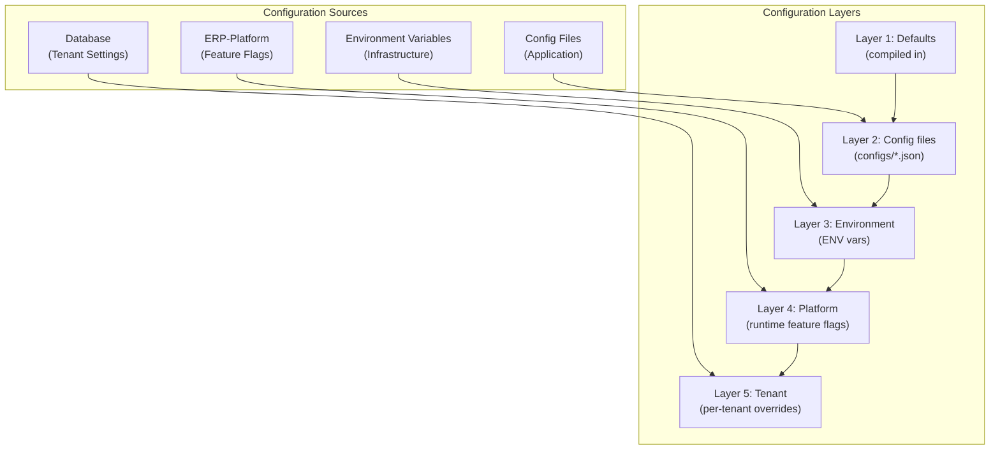

# ERP-Projects -- Configuration Guide

## Document Control

| Field         | Value                                          |
|---------------|------------------------------------------------|
| Module        | ERP-Projects                                   |
| Version       | 1.0                                            |
| Date          | 2026-02-23                                     |

---

## 1. Configuration Architecture



---

## 2. Module Configuration

### 2.1 Capabilities Configuration

**File:** `configs/capabilities.json`

```json
{
  "module": "ERP-Projects",
  "capabilities": [
    "tasks",
    "gantt",
    "resource_planning",
    "timesheets",
    "project_costing"
  ],
  "version": "1.0.0",
  "features": {
    "ai_insights": true,
    "portfolio_management": true,
    "agile_management": true,
    "resource_leveling": true,
    "what_if_scenarios": true
  }
}
```

### 2.2 Module Manifest

**File:** `erp/module.manifest.yaml`

```yaml
api_version: v1
module_id: erp_projects
repository: ERP-Projects
sku: erp.projects
subscription:
  standalone: true
  suite: true
integration:
  control_plane: ERP-Platform
  identity_provider: ERP-Directory
  event_backbone: NATS
aidd:
  guardrails_file: erp/aidd.guardrails.yaml
```

---

## 3. Service Configuration

### 3.1 Project Service Configuration

| Setting                     | Type    | Default          | Description                       |
|-----------------------------|---------|------------------|-----------------------------------|
| `project.max_per_tenant`    | integer | 1000             | Max projects per tenant           |
| `project.health.schedule_weight` | float | 0.35          | Weight of schedule in health calc |
| `project.health.budget_weight`   | float | 0.30          | Weight of budget in health calc   |
| `project.health.risk_weight`     | float | 0.20          | Weight of risks in health calc    |
| `project.health.task_weight`     | float | 0.15          | Weight of task completion         |
| `project.archive_after_days`     | integer | 90           | Auto-archive completed after N days|
| `project.statuses`          | list    | See below        | Allowed status values             |
| `project.priorities`        | list    | [LOW, MEDIUM, HIGH, CRITICAL] | Priority levels     |

### 3.2 Task Service Configuration

| Setting                          | Type    | Default       | Description                    |
|----------------------------------|---------|---------------|--------------------------------|
| `task.max_per_project`           | integer | 50000         | Max tasks per project          |
| `task.max_nesting_depth`         | integer | 10            | Max subtask nesting levels     |
| `task.max_assignees`             | integer | 10            | Max users per task             |
| `task.max_dependencies`          | integer | 50            | Max dependencies per task      |
| `task.max_attachments`           | integer | 20            | Max file attachments           |
| `task.max_attachment_size_mb`    | integer | 50            | Max single file size           |
| `task.overdue_escalation_days`   | integer | 3             | Days before auto-escalation    |
| `task.statuses`                  | list    | [TODO, IN_PROGRESS, IN_REVIEW, BLOCKED, DONE] | Status values |
| `task.dependency_types`          | list    | [FS, SS, FF, SF] | Allowed dependency types     |

### 3.3 Board Service Configuration

| Setting                     | Type    | Default  | Description                       |
|-----------------------------|---------|----------|-----------------------------------|
| `board.default_type`        | string  | KANBAN   | Default board type                |
| `board.max_columns`         | integer | 20       | Max columns per board             |
| `board.default_wip_limit`   | integer | 0        | Default WIP limit (0 = unlimited) |
| `board.swimlane_options`    | list    | [PRIORITY, ASSIGNEE, EPIC, TYPE, NONE] | Swimlane group-by options |

### 3.4 Timeline Service Configuration

| Setting                          | Type    | Default  | Description                    |
|----------------------------------|---------|----------|--------------------------------|
| `timeline.max_baselines`         | integer | 10       | Max baselines per project      |
| `timeline.working_days`          | list    | [1,2,3,4,5] | Working days (Mon=1)       |
| `timeline.hours_per_day`         | float   | 8.0      | Working hours per day          |
| `timeline.auto_schedule_timeout_ms` | integer | 5000  | Max calculation time           |
| `timeline.zoom_levels`           | list    | [DAY, WEEK, MONTH, QUARTER, YEAR] | Zoom options |

### 3.5 Time Tracking Configuration

| Setting                          | Type    | Default  | Description                    |
|----------------------------------|---------|----------|--------------------------------|
| `time.max_hours_per_day`         | float   | 24.0     | Max hours per person per day   |
| `time.min_entry_hours`           | float   | 0.25     | Minimum time entry (15 min)    |
| `time.default_billable`          | boolean | true     | Default billable flag          |
| `time.timesheet_day`             | string  | FRIDAY   | Weekly submission day          |
| `time.approval_required`         | boolean | true     | Require manager approval       |
| `time.auto_timer_stop_hours`     | float   | 12.0     | Auto-stop forgotten timers     |

### 3.6 Budget Configuration

| Setting                          | Type    | Default  | Description                    |
|----------------------------------|---------|----------|--------------------------------|
| `budget.alert_thresholds`        | list    | [75, 90, 100] | Budget utilization alerts (%) |
| `budget.default_currency`        | string  | USD      | Default currency               |
| `budget.supported_currencies`    | list    | [USD, EUR, GBP, NGN, KES, ZAR, GHS] | Supported currencies |
| `budget.evm_recalc_interval_min` | integer | 15       | EVM recalculation frequency    |

### 3.7 Agile Configuration

| Setting                          | Type    | Default  | Description                    |
|----------------------------------|---------|----------|--------------------------------|
| `agile.default_sprint_days`      | integer | 14       | Default sprint duration        |
| `agile.velocity_window_sprints`  | integer | 6        | Sprints for rolling avg velocity|
| `agile.story_point_scale`        | list    | [1,2,3,5,8,13,21] | Fibonacci scale        |
| `agile.max_sprint_items`         | integer | 50       | Max items per sprint           |

---

## 4. Tenant-Level Configuration

### 4.1 Configurable Settings per Tenant

| Setting                          | UI Location        | Description                   |
|----------------------------------|--------------------|-------------------------------|
| Working calendar                 | Settings > Calendar| Custom holidays, work days    |
| Default project type             | Settings > Projects| Pre-selected project type     |
| Custom fields                    | Settings > Fields  | Tenant-specific custom fields |
| Notification preferences         | Settings > Notifications | Email/in-app toggles   |
| Theme and branding               | Settings > Appearance | Logo, colors, name         |
| Integration credentials          | Settings > Integrations | API keys, webhook URLs  |
| Data retention period            | Settings > Data    | Custom retention policies     |

### 4.2 Custom Fields Schema

```json
{
  "customFields": [
    {
      "id": "cf-001",
      "name": "Department",
      "type": "SELECT",
      "options": ["Engineering", "Marketing", "Sales", "Operations"],
      "required": false,
      "entityTypes": ["PROJECT"]
    },
    {
      "id": "cf-002",
      "name": "Complexity Score",
      "type": "NUMBER",
      "min": 1,
      "max": 10,
      "required": false,
      "entityTypes": ["TASK"]
    },
    {
      "id": "cf-003",
      "name": "Client PO Number",
      "type": "TEXT",
      "required": true,
      "entityTypes": ["PROJECT"]
    }
  ]
}
```

---

## 5. Feature Flags

| Flag                              | Default | Description                         |
|-----------------------------------|---------|-------------------------------------|
| `ff_ai_insights`                  | false   | Enable AI-powered project insights  |
| `ff_what_if_scenarios`            | false   | Enable what-if scenario modeling    |
| `ff_resource_leveling`            | true    | Enable resource leveling algorithm  |
| `ff_auto_scheduling`              | true    | Enable auto-scheduling              |
| `ff_retrospective_boards`         | true    | Enable sprint retrospective boards  |
| `ff_custom_fields`                | true    | Enable custom field definitions     |
| `ff_bulk_operations`              | true    | Enable bulk task operations         |
| `ff_ms_project_import`            | false   | Enable MS Project file import       |
| `ff_jira_import`                  | false   | Enable Jira import                  |
| `ff_webhook_delivery`             | true    | Enable webhook event delivery       |
