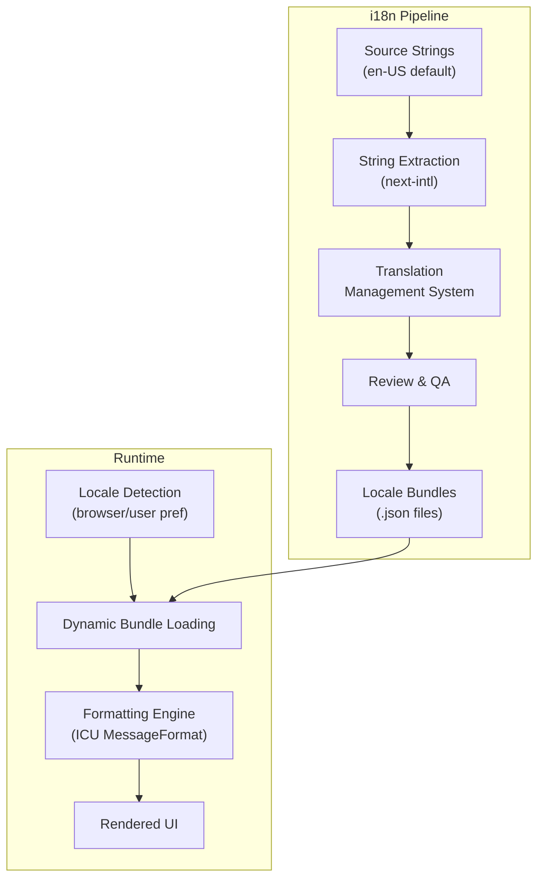
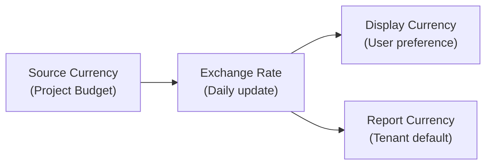

# ERP-Projects -- Internationalization (i18n) & Localization (l10n)

## Document Control

| Field         | Value                                          |
|---------------|------------------------------------------------|
| Module        | ERP-Projects                                   |
| Version       | 1.0                                            |
| Date          | 2026-02-23                                     |

---

## 1. Internationalization Architecture



---

## 2. Supported Locales

| Locale  | Language            | Region         | Status      |
|---------|---------------------|----------------|-------------|
| en-US   | English             | United States  | Default     |
| en-GB   | English             | United Kingdom | Supported   |
| fr-FR   | French              | France         | Supported   |
| es-ES   | Spanish             | Spain          | Supported   |
| pt-BR   | Portuguese          | Brazil         | Supported   |
| ar-SA   | Arabic              | Saudi Arabia   | Planned (RTL)|
| sw-KE   | Swahili             | Kenya          | Planned     |
| yo-NG   | Yoruba              | Nigeria        | Planned     |
| ha-NG   | Hausa               | Nigeria        | Planned     |
| zh-CN   | Chinese (Simplified)| China          | Planned     |

---

## 3. Localization Domains

### 3.1 Date and Time

| Format          | en-US           | fr-FR           | ar-SA             |
|-----------------|-----------------|-----------------|-------------------|
| Date short      | 02/23/2026      | 23/02/2026      | 23/02/2026        |
| Date long       | February 23, 2026| 23 fevrier 2026 | 23 febbraio 2026  |
| Time            | 2:30 PM         | 14:30           | 2:30 م            |
| Date-time       | Feb 23, 2:30 PM | 23 fev., 14:30  | 23 فبراير, 2:30 م |
| Duration        | 3h 30m          | 3h 30min        | 3 سا 30 د         |
| Week start      | Sunday          | Monday          | Saturday          |

### 3.2 Number and Currency

| Format          | en-US           | fr-FR           | yo-NG             |
|-----------------|-----------------|-----------------|-------------------|
| Number          | 1,234,567.89    | 1 234 567,89    | 1,234,567.89      |
| Currency (USD)  | $1,234.56       | 1 234,56 $US    | $1,234.56         |
| Currency (NGN)  | NGN 1,234.56    | 1 234,56 NGN    | N1,234.56         |
| Percentage      | 85.5%           | 85,5 %          | 85.5%             |

### 3.3 Project Management Terms

| English Term      | French              | Spanish             | Portuguese         |
|-------------------|---------------------|---------------------|--------------------|
| Project           | Projet              | Proyecto            | Projeto            |
| Task              | Tache               | Tarea               | Tarefa             |
| Milestone         | Jalon               | Hito                | Marco              |
| Sprint            | Sprint              | Sprint              | Sprint             |
| Backlog           | Backlog             | Backlog             | Backlog            |
| Burndown          | Burndown            | Burndown            | Burndown           |
| Critical Path     | Chemin critique     | Ruta critica        | Caminho critico    |
| Gantt Chart       | Diagramme de Gantt  | Diagrama de Gantt   | Grafico de Gantt   |
| Resource          | Ressource           | Recurso             | Recurso            |
| Timesheet         | Feuille de temps    | Hoja de tiempo      | Planilha de horas  |
| Budget            | Budget              | Presupuesto         | Orcamento          |
| Portfolio         | Portefeuille        | Portafolio          | Portfolio          |

---

## 4. RTL Support

For Arabic and other RTL languages:

| Component           | RTL Adaptation                              |
|---------------------|---------------------------------------------|
| Sidebar navigation  | Moves to right side                         |
| Kanban board        | Columns flow right-to-left                  |
| Gantt chart         | Timeline direction remains LTR (standard)   |
| Text alignment      | Right-aligned by default                    |
| Icons               | Directional icons mirrored                  |
| Progress bars       | Fill direction reversed                     |
| Breadcrumbs         | Right-to-left ordering                      |

---

## 5. Multi-Currency Support

### 5.1 Supported Currencies

| Currency | Code | Symbol | Decimal Places |
|----------|------|--------|----------------|
| US Dollar| USD  | $      | 2              |
| Euro     | EUR  | EUR    | 2              |
| British Pound | GBP | GBP | 2             |
| Nigerian Naira | NGN | N   | 2              |
| Kenyan Shilling | KES | KSh | 2            |
| South African Rand | ZAR | R | 2           |
| Ghanaian Cedi | GHS | GHS  | 2              |

### 5.2 Currency Conversion



---

## 6. Timezone Handling

| Rule                         | Implementation                              |
|------------------------------|---------------------------------------------|
| Storage                      | All timestamps in UTC                       |
| Display                      | Converted to user's timezone preference     |
| Due dates                    | Stored as DATE (no timezone)                |
| Scheduled events             | Stored with timezone identifier             |
| Cross-timezone teams         | Show relative time ("2 hours ago")          |

---

## 7. String Management

### 7.1 Translation File Structure

```
locales/
  en-US/
    common.json
    projects.json
    tasks.json
    boards.json
    timeline.json
    resources.json
    time-tracking.json
    budget.json
    portfolio.json
    agile.json
  fr-FR/
    common.json
    projects.json
    ...
```

### 7.2 Translation Key Convention

```
{domain}.{screen}.{component}.{element}
```

Example: `projects.detail.header.healthScore` = "Health Score"

### 7.3 Pluralization

Using ICU MessageFormat for plural rules:

```json
{
  "tasks.count": "{count, plural, =0 {No tasks} one {1 task} other {{count} tasks}}",
  "sprint.daysRemaining": "{days, plural, =0 {Sprint ends today} one {1 day remaining} other {{days} days remaining}}"
}
```
