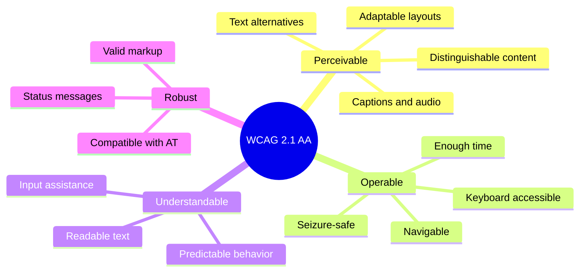

# ERP-Projects -- Accessibility (a11y) Compliance

## Document Control

| Field         | Value                                          |
|---------------|------------------------------------------------|
| Module        | ERP-Projects                                   |
| Version       | 1.0                                            |
| Date          | 2026-02-23                                     |
| Standard      | WCAG 2.1 Level AA                              |

---

## 1. Accessibility Standards

ERP-Projects targets **WCAG 2.1 Level AA** compliance across all user-facing interfaces. This ensures the platform is usable by people with visual, auditory, motor, and cognitive disabilities.

### 1.1 WCAG Principles Coverage

---

## 2. Component-Specific Guidelines

### 2.1 Kanban Board

| Requirement                     | Implementation                              |
|---------------------------------|---------------------------------------------|
| Keyboard drag-and-drop          | Arrow keys to select, Space to pick up, arrows to move, Space to drop |
| Screen reader announcements     | "Card 'Design wireframes' picked up. Column: In Progress. Position 2 of 4" |
| Focus management                | Focus follows card during keyboard movement |
| Color independence              | Status conveyed by text label, not just color|
| High contrast mode              | Card borders thicken, backgrounds adjust    |

### 2.2 Gantt Chart

| Requirement                     | Implementation                              |
|---------------------------------|---------------------------------------------|
| Alternative table view          | Data table view available as Gantt alternative|
| Keyboard navigation             | Tab between tasks, arrow keys to adjust dates|
| Screen reader support           | Task name, dates, progress read aloud       |
| Zoom controls                   | Keyboard accessible (+/- keys)              |
| Color blind support             | Critical path uses pattern + color + label  |

### 2.3 Forms and Inputs

| Requirement                     | Implementation                              |
|---------------------------------|---------------------------------------------|
| Labels                          | Every input has visible label + htmlFor      |
| Error messages                  | Associated with input via aria-describedby  |
| Required fields                 | Marked with aria-required="true" + visual * |
| Focus order                     | Logical top-to-bottom, left-to-right order  |
| Date pickers                    | Keyboard operable, manual text entry option |
| Auto-complete                   | aria-autocomplete, results announced        |

### 2.4 Data Tables

| Requirement                     | Implementation                              |
|---------------------------------|---------------------------------------------|
| Table semantics                 | Proper `<table>`, `<th>`, `<td>` markup    |
| Sort indicators                 | aria-sort on column headers                 |
| Row selection                   | aria-selected on rows, checkbox labeling    |
| Pagination                      | aria-label on page navigation buttons       |
| Expandable rows                 | aria-expanded on toggle buttons             |

### 2.5 Modals and Dialogs

| Requirement                     | Implementation                              |
|---------------------------------|---------------------------------------------|
| Focus trap                      | Focus trapped within modal when open        |
| Escape to close                 | Escape key closes modal                     |
| Return focus                    | Focus returns to trigger element on close   |
| ARIA role                       | role="dialog" + aria-modal="true"           |
| Title                           | aria-labelledby referencing dialog title     |

---

## 3. Keyboard Navigation

### 3.1 Global Keyboard Shortcuts

| Shortcut      | Action                              |
|---------------|--------------------------------------|
| `/`           | Focus search bar                     |
| `N`           | New task (when not in input)         |
| `G` then `P`  | Go to Projects                      |
| `G` then `T`  | Go to My Tasks                      |
| `G` then `B`  | Go to Boards                        |
| `G` then `D`  | Go to Dashboard                     |
| `?`           | Show keyboard shortcuts help         |
| `Esc`         | Close modal/panel/dropdown           |

### 3.2 Board Keyboard Navigation

| Shortcut         | Action                              |
|------------------|--------------------------------------|
| `Tab`            | Move between columns                |
| `Arrow Up/Down`  | Navigate cards within column        |
| `Space/Enter`    | Open card detail                    |
| `M`              | Move card (opens target picker)     |

---

## 4. Color Contrast Requirements

| Element                    | Min Contrast Ratio | Current Ratio |
|----------------------------|--------------------|---------------|
| Normal text (14px)         | 4.5:1              | 7.2:1         |
| Large text (18px+)         | 3:1                | 5.1:1         |
| UI components (borders)    | 3:1                | 3.5:1         |
| Focus indicators           | 3:1                | 4.0:1         |
| Status badge text          | 4.5:1              | 5.8:1         |
| Priority badge text        | 4.5:1              | 6.2:1         |

---

## 5. Screen Reader Support

### 5.1 ARIA Landmarks

| Landmark            | Element               | Label                       |
|--------------------|-----------------------|-----------------------------|
| `<nav>`            | Sidebar               | "Main navigation"           |
| `<main>`           | Content area           | "Project content"           |
| `<aside>`          | Right panel            | "Task details"              |
| `<header>`         | Top bar                | "Application header"        |
| `<search>`         | Search form            | "Search tasks and projects" |

### 5.2 Live Regions

| Region                    | Type          | Usage                          |
|---------------------------|---------------|--------------------------------|
| Toast notifications       | aria-live="polite" | Success/error messages   |
| Timer display             | aria-live="off" (on demand) | Timer value updates |
| Card move confirmation    | aria-live="assertive" | Board card movements    |
| Health score change       | aria-live="polite" | Project health updates   |
| Form validation errors    | aria-live="polite" | Input error messages     |

---

## 6. Testing and Validation

### 6.1 Testing Tools

| Tool               | Type              | Usage                          |
|--------------------|-------------------|--------------------------------|
| axe-core           | Automated         | CI pipeline accessibility scan |
| Lighthouse         | Automated         | Performance + accessibility    |
| NVDA               | Manual            | Windows screen reader testing  |
| VoiceOver          | Manual            | macOS/iOS screen reader testing|
| JAWS               | Manual            | Enterprise screen reader       |
| Keyboard only      | Manual            | Full journey without mouse     |

### 6.2 Testing Checklist

| Test                              | Frequency  | Pass Criteria                |
|-----------------------------------|------------|------------------------------|
| axe-core scan (0 violations)      | Per commit | No critical/serious issues   |
| Keyboard navigation (all views)   | Per sprint | All features keyboard-usable |
| Screen reader walkthrough         | Per release| All content accessible       |
| Color contrast check              | Per PR     | All ratios meet minimum      |
| Focus management check            | Per sprint | Focus visible and logical    |
| Reduced motion check              | Per release| Animations respect preference|
