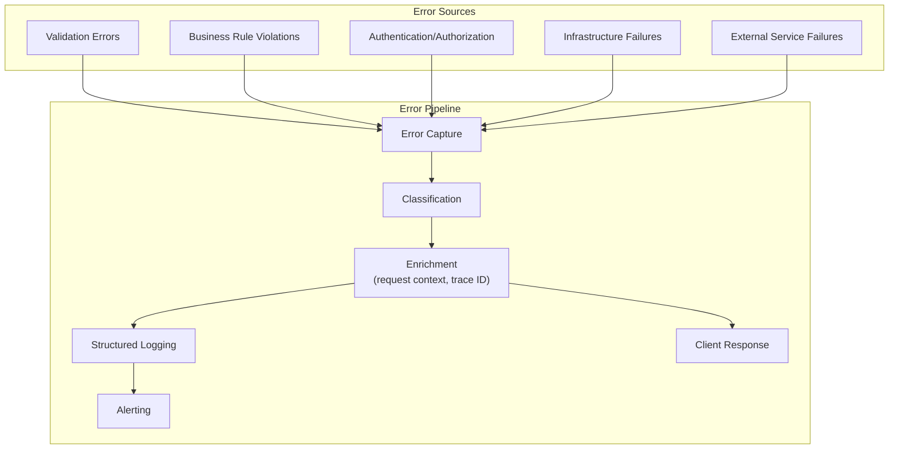
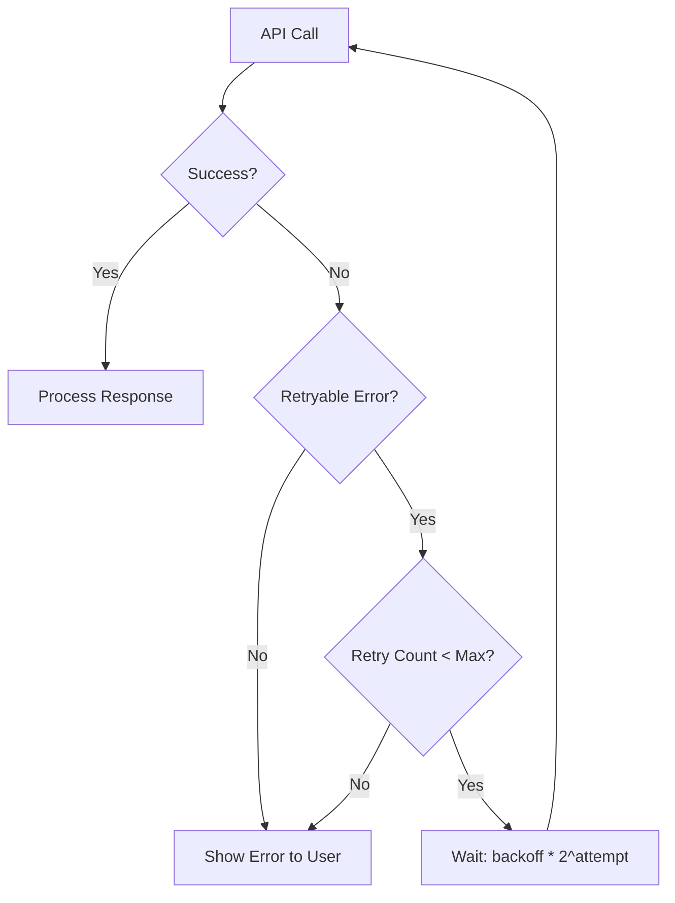
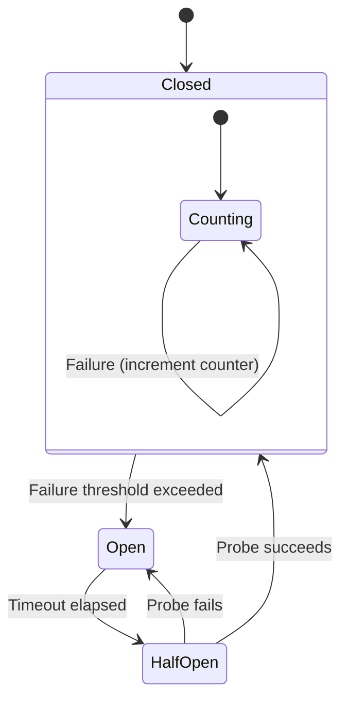

# ERP-Projects -- Error Handling Strategy

## Document Control

| Field         | Value                                          |
|---------------|------------------------------------------------|
| Module        | ERP-Projects                                   |
| Version       | 1.0                                            |
| Date          | 2026-02-23                                     |

---

## 1. Error Handling Architecture



---

## 2. Error Classification

### 2.1 Error Categories

| Category            | HTTP Code | Retryable | Client Action                    |
|---------------------|-----------|-----------|----------------------------------|
| Validation          | 400       | No        | Fix input and resubmit           |
| Authentication      | 401       | Yes       | Refresh token and retry          |
| Authorization       | 403       | No        | Request higher permissions       |
| Not Found           | 404       | No        | Verify resource exists           |
| Conflict            | 409       | No        | Resolve conflict and retry       |
| Business Rule       | 422       | No        | Adjust request per business rules|
| Rate Limited        | 429       | Yes       | Wait per Retry-After header      |
| Server Error        | 500       | Yes       | Retry with exponential backoff   |
| Service Unavailable | 503       | Yes       | Retry with exponential backoff   |
| Gateway Timeout     | 504       | Yes       | Retry once, then report          |

### 2.2 Error Code Registry

| Code                         | HTTP | Description                                |
|------------------------------|------|--------------------------------------------|
| `ERR_VALIDATION`             | 400  | Input validation failed                    |
| `ERR_MISSING_FIELD`          | 400  | Required field missing                     |
| `ERR_INVALID_DATE_RANGE`     | 400  | End date before start date                 |
| `ERR_MISSING_TENANT`         | 400  | X-Tenant-ID header missing                 |
| `ERR_UNAUTHORIZED`           | 401  | Invalid or expired JWT token               |
| `ERR_FORBIDDEN`              | 403  | Insufficient permissions for action        |
| `ERR_NOT_FOUND`              | 404  | Requested resource not found               |
| `ERR_PROJECT_NOT_FOUND`      | 404  | Project with given ID not found            |
| `ERR_TASK_NOT_FOUND`         | 404  | Task with given ID not found               |
| `ERR_DUPLICATE`              | 409  | Resource already exists                    |
| `ERR_CIRCULAR_DEPENDENCY`    | 422  | Dependency would create a cycle            |
| `ERR_INVALID_STATUS_TRANSITION` | 422 | Status transition not allowed            |
| `ERR_OVER_ALLOCATION`        | 422  | Resource allocation exceeds 100%           |
| `ERR_BUDGET_EXCEEDED`        | 422  | Operation would exceed project budget      |
| `ERR_MAX_HOURS_EXCEEDED`     | 422  | Time entry exceeds 24 hours per day        |
| `ERR_BILLED_ENTRY_LOCKED`    | 422  | Cannot modify billed time entry            |
| `ERR_TASK_HAS_BLOCKERS`      | 422  | Cannot complete task with open blockers    |
| `ERR_WIP_LIMIT_EXCEEDED`     | 422  | Board column WIP limit reached             |
| `ERR_RATE_LIMITED`           | 429  | Too many requests                          |
| `ERR_INTERNAL`               | 500  | Unexpected server error                    |
| `ERR_DATABASE`               | 500  | Database operation failed                  |
| `ERR_EVENT_PUBLISH`          | 500  | Event publishing failed                    |
| `ERR_SERVICE_UNAVAILABLE`    | 503  | Downstream service unavailable             |

---

## 3. Error Response Format

### 3.1 Standard Error Envelope

```json
{
  "error": {
    "code": "ERR_VALIDATION",
    "message": "Validation failed for project creation",
    "details": [
      {
        "field": "startDate",
        "rule": "required",
        "message": "Start date is required"
      },
      {
        "field": "endDate",
        "rule": "after_start",
        "message": "End date must be after start date"
      }
    ],
    "requestId": "req-a1b2c3d4",
    "timestamp": "2026-02-23T10:30:00Z",
    "documentation": "https://docs.erp-projects.com/errors/ERR_VALIDATION"
  }
}
```

### 3.2 Business Rule Violation

```json
{
  "error": {
    "code": "ERR_CIRCULAR_DEPENDENCY",
    "message": "Adding this dependency would create a circular reference",
    "details": {
      "cycle": ["task-A", "task-B", "task-C", "task-A"],
      "dependentTaskId": "task-A",
      "dependencyTaskId": "task-C"
    },
    "requestId": "req-e5f6g7h8"
  }
}
```

---

## 4. Retry Strategy

### 4.1 Client-Side Retry Policy



| Error Type        | Max Retries | Initial Delay | Max Delay | Jitter |
|-------------------|-------------|---------------|-----------|--------|
| 429 Rate Limited  | 3           | Retry-After   | 60s       | 10%    |
| 500 Server Error  | 3           | 1s            | 30s       | 20%    |
| 503 Unavailable   | 5           | 2s            | 60s       | 20%    |
| 504 Timeout       | 2           | 5s            | 30s       | 10%    |
| Network Error     | 3           | 1s            | 30s       | 20%    |

### 4.2 Circuit Breaker Pattern



| Circuit Breaker Setting | Value   |
|-------------------------|---------|
| Failure threshold       | 5 failures in 30s |
| Reset timeout           | 30s     |
| Half-open probes        | 3       |
| Probe success threshold | 2/3     |

---

## 5. Error Logging

### 5.1 Error Log Structure

```json
{
  "level": "error",
  "timestamp": "2026-02-23T10:30:00.000Z",
  "service": "task-service",
  "error": {
    "code": "ERR_DATABASE",
    "message": "connection pool exhausted",
    "stack": "main.createTask -> db.Insert -> pgx.Pool.Acquire: ...",
    "cause": "all connections in use"
  },
  "context": {
    "tenantId": "tenant-uuid",
    "userId": "user-uuid",
    "requestId": "req-uuid",
    "traceId": "trace-uuid",
    "method": "POST",
    "path": "/v1/task",
    "duration_ms": 5023
  }
}
```

### 5.2 Error Aggregation Rules

| Error Code              | Aggregation Window | Alert After |
|-------------------------|-------------------|-------------|
| ERR_INTERNAL            | 1 minute          | 5 occurrences |
| ERR_DATABASE            | 1 minute          | 3 occurrences |
| ERR_SERVICE_UNAVAILABLE | 1 minute          | 3 occurrences |
| ERR_UNAUTHORIZED        | 5 minutes         | 50 occurrences (brute force) |
| ERR_RATE_LIMITED        | 5 minutes         | Informational only |

---

## 6. User-Facing Error Messages

### 6.1 Error Message Guidelines

| Principle               | Bad Example                           | Good Example                                   |
|-------------------------|---------------------------------------|------------------------------------------------|
| Use plain language      | "ERR_PQSQL_23505"                    | "A project with this name already exists"      |
| Suggest action          | "Invalid input"                       | "Start date is required. Please select a date" |
| Be specific             | "Something went wrong"                | "Unable to save task. The server is temporarily unavailable. Please try again." |
| Avoid blame             | "You entered an invalid date"         | "The end date must be after the start date"    |
| Provide context         | "Error 422"                           | "This task cannot be completed because it has 2 unresolved blocking tasks" |

### 6.2 Graceful Degradation

| Failure Scenario              | User Experience                          |
|-------------------------------|------------------------------------------|
| Timeline service down         | Show cached Gantt data with stale warning|
| Redis cache unavailable       | Fall back to direct database queries     |
| Event backbone down           | Queue events locally, sync when restored |
| AI insights service down      | Hide insights panel, show manual health  |
| File upload service down      | Disable attachment button with tooltip   |
