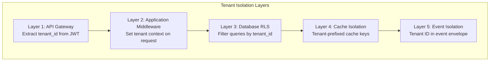
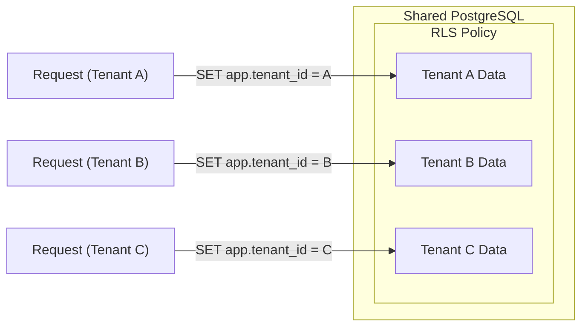
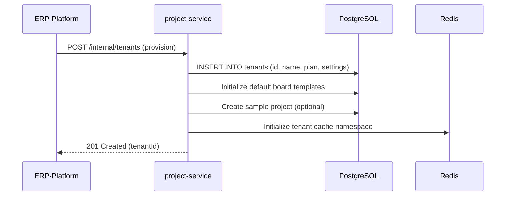
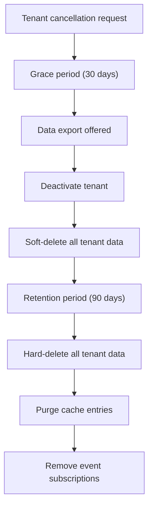
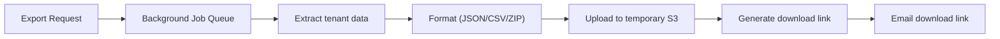
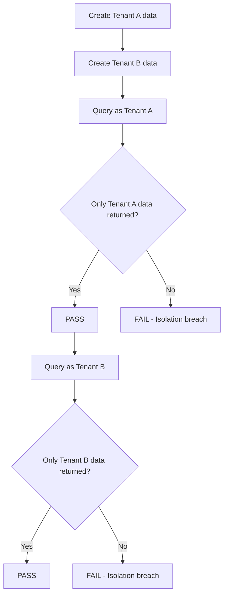

# ERP-Projects -- Multi-Tenancy Architecture

## Document Control

| Field         | Value                                          |
|---------------|------------------------------------------------|
| Module        | ERP-Projects                                   |
| Version       | 1.0                                            |
| Date          | 2026-02-23                                     |

---

## 1. Multi-Tenancy Model

ERP-Projects uses a **shared database, shared schema** multi-tenancy model with PostgreSQL Row-Level Security (RLS) policies providing logical data isolation. Every business table includes a `tenant_id` column that serves as the mandatory partition discriminator.



---

## 2. Data Isolation

### 2.1 Database Layer Isolation



### 2.2 RLS Policy Implementation

```sql
-- Every business table has tenant_id
ALTER TABLE projects ADD COLUMN tenant_id UUID NOT NULL;
ALTER TABLE tasks ADD COLUMN tenant_id UUID NOT NULL;
ALTER TABLE time_entries ADD COLUMN tenant_id UUID NOT NULL;
-- ... for all business tables

-- Enable RLS
ALTER TABLE projects ENABLE ROW LEVEL SECURITY;
ALTER TABLE tasks ENABLE ROW LEVEL SECURITY;
ALTER TABLE time_entries ENABLE ROW LEVEL SECURITY;

-- Create tenant isolation policy
CREATE POLICY tenant_isolation_projects ON projects
    FOR ALL
    USING (tenant_id = current_setting('app.current_tenant_id')::uuid)
    WITH CHECK (tenant_id = current_setting('app.current_tenant_id')::uuid);

-- Application sets context per request
-- In Go middleware:
-- db.Exec("SET LOCAL app.current_tenant_id = $1", tenantID)
```

### 2.3 Cache Isolation

```
Key format: {tenant_id}:{entity}:{id}
Examples:
  tenant-abc:project:proj-123
  tenant-abc:tasks:proj-123
  tenant-def:project:proj-456
  tenant-def:board:proj-456:layout
```

### 2.4 Event Isolation

```json
{
  "specversion": "1.0",
  "type": "erp.projects.task.created",
  "tenantid": "tenant-uuid-here",
  "data": { ... }
}
```

Event consumers filter by tenant_id to ensure cross-tenant event isolation.

---

## 3. Tenant Lifecycle

### 3.1 Tenant Provisioning



### 3.2 Tenant Configuration

| Setting                    | Per-Tenant | Description                         |
|----------------------------|-----------|--------------------------------------|
| Plan tier                  | Yes       | Starter/Professional/Business/Enterprise |
| Max projects               | Yes       | Based on plan tier                   |
| Max users                  | Yes       | Based on plan tier                   |
| Working calendar           | Yes       | Custom holidays and work days        |
| Default currency           | Yes       | Tenant's primary currency            |
| Custom fields              | Yes       | Tenant-specific data fields          |
| Notification preferences   | Yes       | Email/in-app/webhook settings        |
| Data retention policy      | Yes       | Custom retention periods             |
| Theme and branding         | Yes       | Logo, colors, company name           |

### 3.3 Tenant Offboarding



---

## 4. Resource Limits by Tier

| Resource                   | Starter | Professional | Business | Enterprise |
|----------------------------|---------|-------------|----------|------------|
| Projects                   | 10      | 50          | 500      | Unlimited  |
| Tasks per project          | 500     | 5,000       | 50,000   | Unlimited  |
| Users                      | 10      | 50          | 500      | Unlimited  |
| File storage               | 1 GB    | 10 GB       | 100 GB   | 1 TB       |
| API requests/minute        | 100     | 500         | 2,000    | 10,000     |
| Custom fields              | 5       | 20          | 50       | Unlimited  |
| Baselines per project      | 1       | 5           | 10       | Unlimited  |
| Webhooks                   | 0       | 5           | 20       | Unlimited  |

---

## 5. Tenant Data Operations

### 5.1 Data Export



**Export includes:** Projects, tasks, dependencies, milestones, time entries, comments, activity logs, resource allocations, sprints, invoices.

### 5.2 Data Import


---

## 6. Cross-Tenant Isolation Verification

### 6.1 Isolation Tests

| Test                                    | Method                              |
|-----------------------------------------|-------------------------------------|
| Tenant A cannot see Tenant B projects  | API call with Tenant A JWT, query for Tenant B data |
| RLS prevents cross-tenant reads        | Direct SQL with wrong tenant context|
| Cache isolation                        | Attempt to access other tenant's cache keys |
| Event isolation                        | Publish event, verify only correct tenant receives |
| Search isolation                       | Full-text search returns only tenant data |

### 6.2 Automated Verification



---

## 7. Performance Considerations

### 7.1 Noisy Neighbor Prevention

| Strategy                       | Implementation                          |
|--------------------------------|-----------------------------------------|
| Rate limiting per tenant       | Token bucket per tenant_id              |
| Connection pooling             | Shared pool with tenant-aware timeouts  |
| Query timeout                  | Per-tenant query timeout settings       |
| Resource quotas                | CPU/memory limits via plan tier         |
| Background job priority        | Fair scheduling across tenants          |

### 7.2 Indexing Strategy

All business table indexes include `tenant_id` as the leading column:

```sql
CREATE INDEX idx_projects_tenant_status ON projects(tenant_id, status);
CREATE INDEX idx_tasks_tenant_project ON tasks(tenant_id, project_id);
CREATE INDEX idx_time_entries_tenant_user_date ON time_entries(tenant_id, user_id, entry_date);
```
