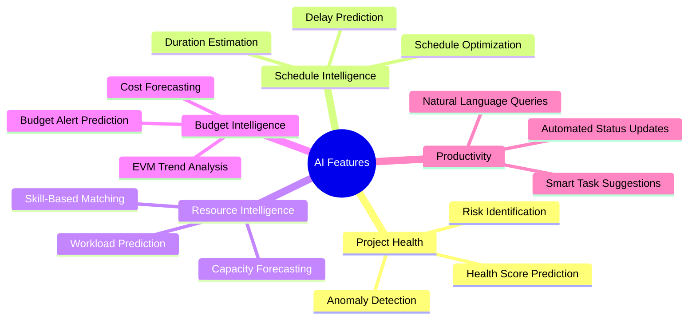
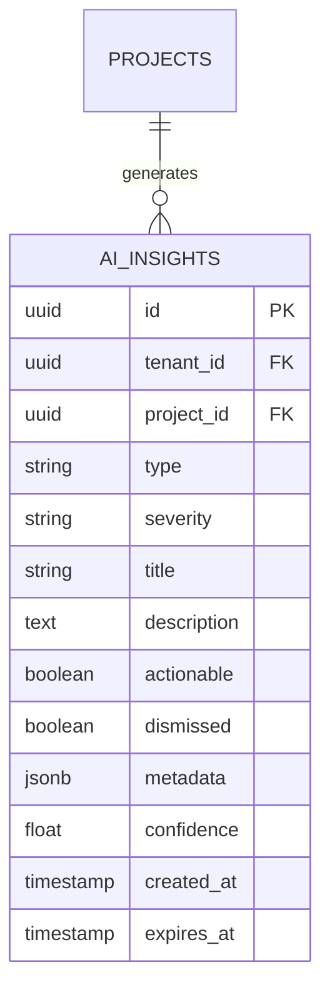
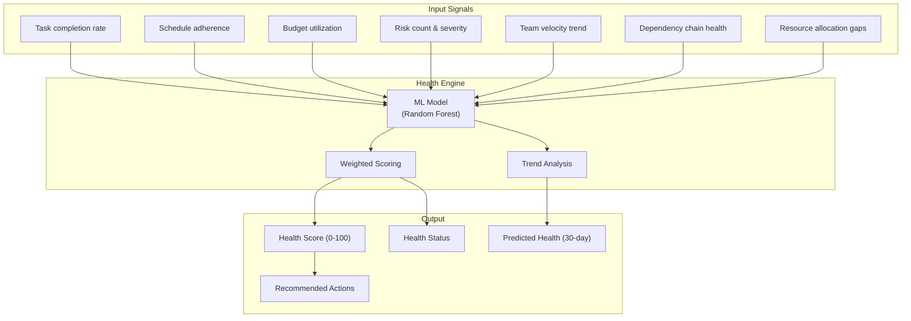
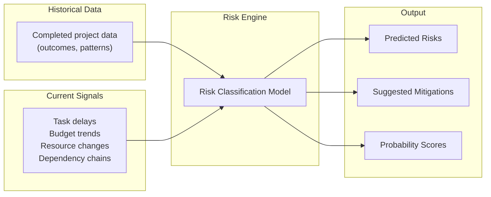
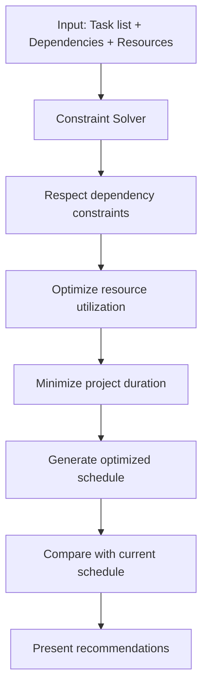
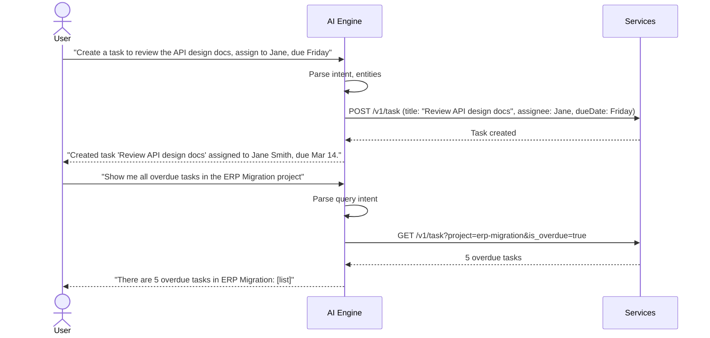
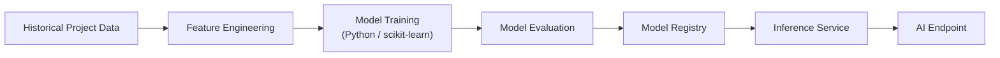

# ERP-Projects -- AI/ML Features

## Document Control

| Field         | Value                                          |
|---------------|------------------------------------------------|
| Module        | ERP-Projects                                   |
| Version       | 1.0                                            |
| Date          | 2026-02-23                                     |

---

## 1. AI Feature Overview



---

## 2. AI Data Model

### 2.1 AI Insights Entity

The `AIInsight` entity stores all AI-generated recommendations and predictions:



### 2.2 Insight Types

| Type            | Description                                      | Severity Levels      |
|-----------------|--------------------------------------------------|----------------------|
| HEALTH          | Project health prediction and analysis           | INFO, WARNING, CRITICAL |
| RISK            | Identified risks based on project patterns       | WARNING, CRITICAL    |
| SCHEDULE        | Schedule delay predictions                       | INFO, WARNING        |
| BUDGET          | Budget overrun predictions                       | INFO, WARNING, CRITICAL |
| RESOURCE        | Resource bottleneck and utilization insights      | INFO, WARNING        |
| RECOMMENDATION  | Actionable suggestions for improvement           | INFO                 |

---

## 3. Feature Details

### 3.1 Intelligent Health Scoring



**Health Score Calculation:**

| Factor                  | Weight | Excellent | Good | Warning | Critical |
|-------------------------|--------|-----------|------|---------|----------|
| Schedule adherence      | 35%    | > 90%     | 70-90%| 50-70% | < 50%   |
| Budget utilization      | 30%    | < 80%     | 80-90%| 90-100%| > 100%  |
| Task completion rate    | 15%    | > 85%     | 60-85%| 40-60% | < 40%   |
| Open risk severity      | 20%    | 0 high    | 1-2   | 3-4    | 5+      |

### 3.2 Risk Prediction



**Risk Categories:**
- Schedule risk: Critical path tasks delayed, resource unavailable
- Budget risk: Cost trend exceeding plan, scope creep indicators
- Resource risk: Key person dependency, over-allocation detected
- Quality risk: Low review coverage, high defect recurrence
- Scope risk: Frequent requirement changes, unestimated tasks

### 3.3 Smart Schedule Optimization



**Optimization objectives (ranked):**
1. Respect all hard dependency constraints (FS/SS/FF/SF)
2. Prevent resource over-allocation (max 100% per person)
3. Minimize total project duration
4. Balance workload across team members
5. Maintain buffer on critical path tasks

### 3.4 Duration Estimation

Using historical data from completed tasks to predict duration for new tasks:

| Input Feature          | Example                              |
|------------------------|--------------------------------------|
| Task type              | "Backend API development"            |
| Story points           | 8                                    |
| Assignee experience    | 3 similar tasks completed            |
| Dependencies count     | 2 predecessors                       |
| Team velocity          | 30 points/sprint average             |

**Model output:**
- Estimated duration: 5 days
- Confidence interval: 3-8 days (80% CI)
- Similar historical tasks: 12 completed tasks in category

### 3.5 Natural Language Project Interaction



---

## 4. AI-Powered Notifications

| Trigger                                  | Insight Type | Example Message                          |
|------------------------------------------|-------------|------------------------------------------|
| Health score drops below 60              | HEALTH      | "Project health declining: schedule adherence fell to 65%" |
| Budget utilization trend toward overrun  | BUDGET      | "At current spend rate, budget will be exhausted 3 weeks before project end" |
| Critical path task delayed               | SCHEDULE    | "Critical path task 'API Integration' delayed 2 days - project end date at risk" |
| Resource over-allocated next week        | RESOURCE    | "Jane Smith allocated 120% next week across 3 projects" |
| Sprint velocity declining               | SCHEDULE    | "Velocity has declined 15% over last 3 sprints" |
| Similar past project had risk            | RISK        | "3 of 5 similar past projects experienced scope creep at this stage" |

---

## 5. AI Architecture

### 5.1 Model Training Pipeline



### 5.2 Model Inventory

| Model                    | Algorithm          | Training Data            | Refresh |
|--------------------------|--------------------|--------------------------|---------|
| Health Score Predictor   | Random Forest      | Historical project outcomes | Weekly |
| Risk Classifier          | Gradient Boosted Trees | Risk register + outcomes | Weekly |
| Duration Estimator       | Linear Regression  | Task completion history   | Daily  |
| Anomaly Detector         | Isolation Forest   | Time series metrics       | Daily  |
| NLP Intent Parser        | LLM (Claude API)   | Pre-trained              | N/A    |

### 5.3 AI Guardrails

```yaml
# erp/aidd.guardrails.yaml
guardrails:
  - name: "Human-in-the-loop for schedule changes"
    rule: "AI recommendations for schedule changes require PM approval"
    enforcement: "soft"
  - name: "Budget threshold for auto-actions"
    rule: "AI cannot auto-approve expenses above $1000"
    enforcement: "hard"
  - name: "Data privacy"
    rule: "AI models do not train on PII or cross-tenant data"
    enforcement: "hard"
  - name: "Confidence threshold"
    rule: "Insights with confidence < 0.6 are not surfaced"
    enforcement: "hard"
```

---

## 6. AI Ethics and Transparency

| Principle               | Implementation                                |
|-------------------------|----------------------------------------------|
| Explainability          | Every insight includes reasoning and factors |
| Dismissibility          | Users can dismiss any AI suggestion          |
| Opt-out                 | Tenants can disable AI features entirely     |
| Data separation         | Models trained per-tenant, no cross-tenant data |
| Bias monitoring         | Regular audits of recommendation fairness    |
| Confidence display      | Confidence percentage shown with predictions |
