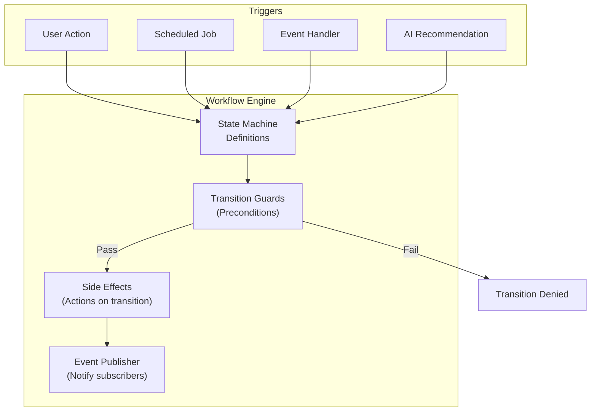
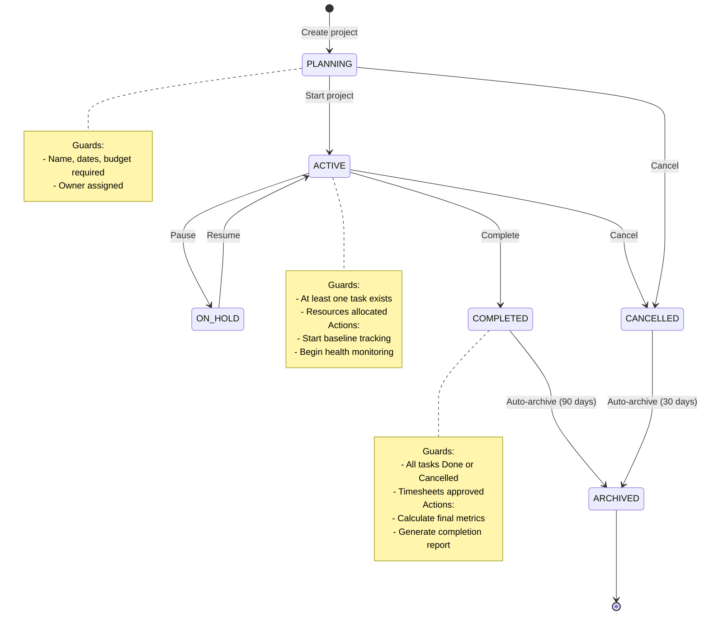
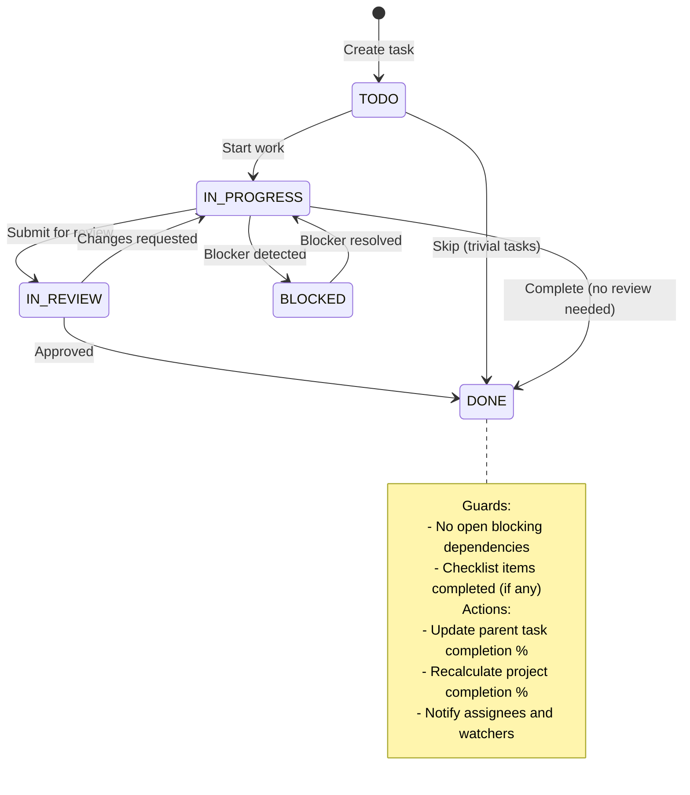
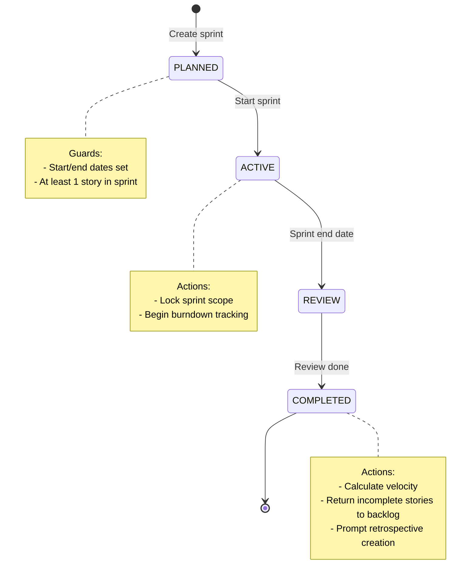
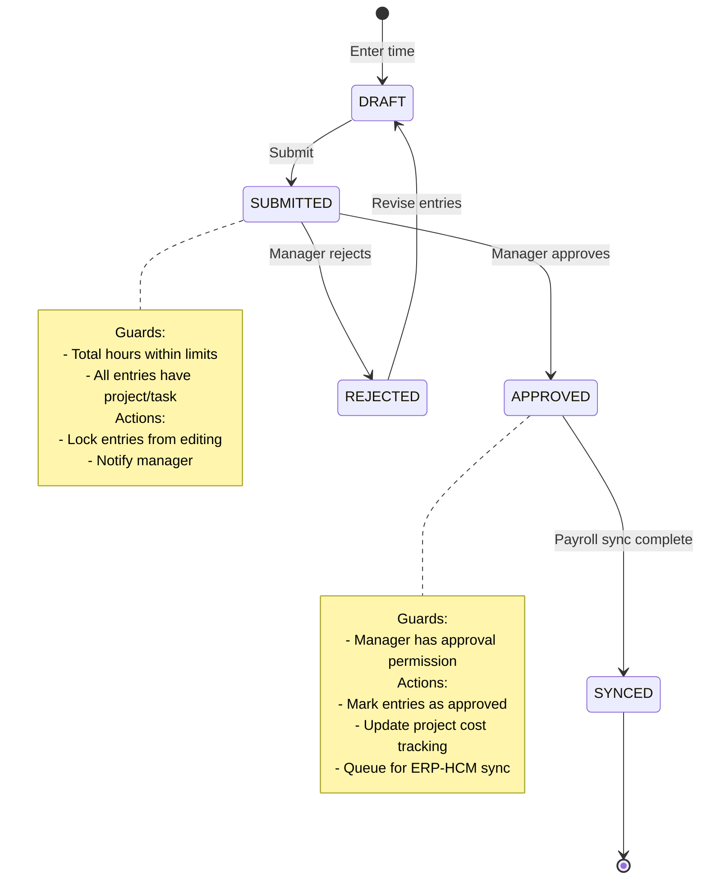
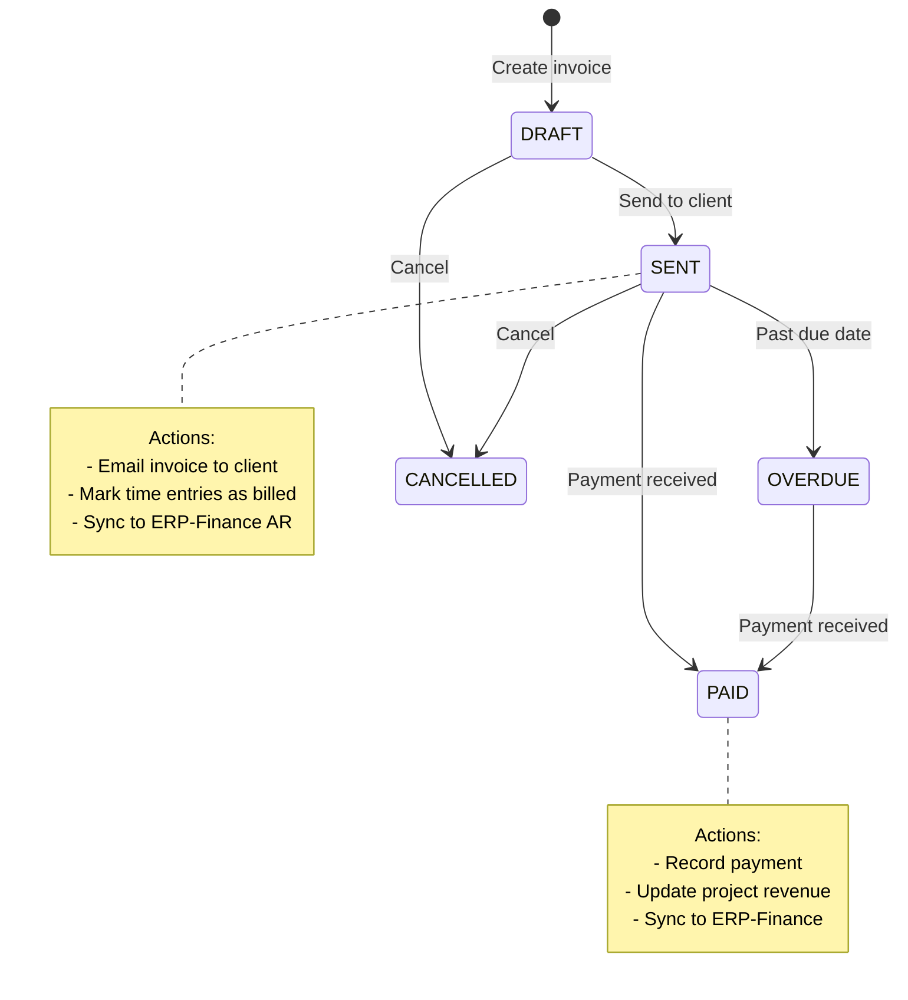

# ERP-Projects -- Workflow Engine

## Document Control

| Field         | Value                                          |
|---------------|------------------------------------------------|
| Module        | ERP-Projects                                   |
| Version       | 1.0                                            |
| Date          | 2026-02-23                                     |

---

## 1. Workflow Architecture

ERP-Projects implements a state-machine-based workflow engine that governs entity lifecycle transitions, approval processes, and automated actions. Each major entity (Project, Task, Sprint, Timesheet, Invoice) has a defined state machine with guarded transitions.



---

## 2. Project Lifecycle State Machine



### 2.1 Project Transition Guards

| From      | To        | Guards                                       | Side Effects                          |
|-----------|-----------|----------------------------------------------|---------------------------------------|
| PLANNING  | ACTIVE    | Owner assigned, at least 1 task, budget > 0  | Save initial baseline, start health monitor |
| ACTIVE    | ON_HOLD   | None                                         | Pause all timers, notify team         |
| ON_HOLD   | ACTIVE    | None                                         | Resume timers, notify team            |
| ACTIVE    | COMPLETED | All tasks Done/Cancelled                     | Generate final report, archive timers |
| *         | CANCELLED | User has ADMIN or MANAGER role               | Cancel active timers, notify team     |
| COMPLETED | ARCHIVED  | 90 days elapsed (auto)                       | Move to cold storage                  |
| CANCELLED | ARCHIVED  | 30 days elapsed (auto)                       | Move to cold storage                  |

---

## 3. Task Lifecycle State Machine



### 3.1 Task Transition Guards

| From        | To           | Guards                                    | Side Effects                       |
|-------------|-------------|-------------------------------------------|------------------------------------|
| TODO        | IN_PROGRESS | All FS predecessors Done                  | Start timer if auto-track enabled  |
| IN_PROGRESS | IN_REVIEW   | At least one reviewer assigned            | Notify reviewers                   |
| IN_REVIEW   | DONE        | Reviewer approves                         | Stop timer, update project metrics |
| *           | BLOCKED     | Blocking dependency identified            | Notify PM, pause timer             |
| BLOCKED     | IN_PROGRESS | Blocker resolved                          | Resume timer, notify assignee      |
| *           | DONE        | No open blockers, checklist 100% (if any) | Cascade: unblock dependent tasks   |

---

## 4. Sprint Lifecycle State Machine



---

## 5. Timesheet Approval Workflow



---

## 6. Invoice Lifecycle



---

## 7. Automated Workflows

### 7.1 Scheduled Automations

| Automation                        | Schedule  | Description                            |
|-----------------------------------|-----------|----------------------------------------|
| Overdue task escalation          | Hourly    | Escalate priority if overdue > 3 days  |
| Health score recalculation       | Every 15m | Recalculate project health scores      |
| Timesheet submission reminder    | Friday PM | Remind users to submit weekly timesheet|
| Sprint auto-close                | Daily     | Complete sprints past end date         |
| Budget alert check               | Hourly    | Check budget thresholds                |
| Recurring task creation          | Daily     | Create instances of recurring tasks    |
| Project auto-archive             | Daily     | Archive completed/cancelled projects   |
| Stale timer cleanup              | Every 12h | Auto-stop timers running > 12 hours   |

### 7.2 Event-Driven Automations

| Trigger Event                    | Automated Action                          |
|----------------------------------|-------------------------------------------|
| Task completed                   | Recalculate parent task completion %      |
| All tasks in project completed   | Prompt project completion                 |
| Time entry created               | Update task actual hours                  |
| Time entry approved              | Update project spent amount               |
| Resource allocation changed      | Recalculate timeline conflicts            |
| Dependency added                 | Check for circular dependencies           |
| Project health drops to CRITICAL | Notify PMO and executive sponsor          |
| Sprint completed                 | Update velocity, prompt retrospective     |

---

## 8. Workflow Configuration

### 8.1 Custom Status Workflows (Planned)

Tenants will be able to define custom task status workflows:

```json
{
  "workflowName": "Software Development",
  "statuses": [
    { "name": "BACKLOG", "category": "TODO" },
    { "name": "READY", "category": "TODO" },
    { "name": "IN_DEVELOPMENT", "category": "IN_PROGRESS" },
    { "name": "CODE_REVIEW", "category": "IN_REVIEW" },
    { "name": "TESTING", "category": "IN_REVIEW" },
    { "name": "DONE", "category": "DONE" }
  ],
  "transitions": [
    { "from": "BACKLOG", "to": ["READY"] },
    { "from": "READY", "to": ["IN_DEVELOPMENT"] },
    { "from": "IN_DEVELOPMENT", "to": ["CODE_REVIEW", "BLOCKED"] },
    { "from": "CODE_REVIEW", "to": ["IN_DEVELOPMENT", "TESTING"] },
    { "from": "TESTING", "to": ["IN_DEVELOPMENT", "DONE"] },
    { "from": "BLOCKED", "to": ["IN_DEVELOPMENT"] }
  ]
}
```
