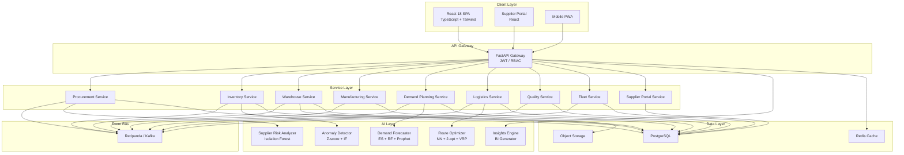

# ERP-SCM Product Requirements Document (PRD)

## 1. Executive Summary

ERP-SCM is an AI-powered, enterprise-grade Supply Chain Management suite that unifies procurement, inventory, warehousing, manufacturing, demand planning, logistics/TMS, quality management, fleet management, and supplier collaboration into a single coherent platform. Built on Python 3.11 (FastAPI) and React 18 (TypeScript) with embedded ML capabilities (scikit-learn, statsmodels), ERP-SCM delivers intelligent automation across the entire supply chain lifecycle -- from demand sensing through last-mile delivery.

The module consolidates what were previously separate standalone systems (ERP-WMS, ERP-Manufacturing-Production, ERP-Procurement, ERP-Quality-Management, ERP-Fleet-Management) into an integrated SCM bundle that shares a common data model, event backbone, and AI inference layer.

---

## 2. Problem Statement

Modern supply chains suffer from:

- **Fragmented visibility** -- procurement, warehouse, logistics, and manufacturing operate in disconnected silos with no single source of truth.
- **Reactive decision-making** -- teams respond to disruptions after they happen rather than predicting and preventing them.
- **Manual optimization** -- reorder points, routes, production schedules, and quality thresholds are set manually and rarely updated.
- **Vendor lock-in** -- incumbent solutions (Oracle SCM Cloud, SAP SCM, Kinaxis RapidResponse, Blue Yonder) carry prohibitive licensing costs and multi-year implementation timelines.

---

## 3. Competitive Landscape

| Capability | ERP-SCM | Oracle SCM Cloud | SAP SCM/IBP | Kinaxis RapidResponse | Blue Yonder |
|---|---|---|---|---|---|
| **AI Demand Forecasting** | Ensemble (ES + RF + Prophet + ARIMA) built-in | Oracle AI Apps (add-on) | SAP IBP ML (add-on) | Concurrent planning engine | ML forecasting suite |
| **Supplier Risk Scoring** | Real-time Isolation Forest + weighted composite | Supplier Qualification Mgmt | SAP Ariba (separate) | Limited | Limited |
| **Route Optimization** | NN + 2-opt heuristic, VRP solver (OR-Tools) | Oracle Transportation Mgmt | SAP TM | Not core | Blue Yonder TMS |
| **Anomaly Detection** | Z-score + Isolation Forest, real-time alerts | Partial (custom) | Custom ML workbench | Concurrent anomaly | Limited |
| **Unified WMS + MFG + Procurement** | Single codebase, shared event bus | Separate modules, separate DBs | Separate modules | Planning-only (no WMS) | WMS strong, MFG weak |
| **Open Source / Self-hosted** | Yes (MIT-compatible) | No | No | No | No |
| **Implementation Time** | 4-8 weeks | 12-24 months | 12-18 months | 6-12 months | 8-16 months |
| **Multi-tenant SaaS** | Native | Yes | Yes | Yes | Yes |
| **Real-time Event Architecture** | Redpanda/Kafka + NATS | Oracle Messaging | SAP Event Mesh | Proprietary | Proprietary |
| **Pricing Model** | Per-user or self-hosted | Per-module, per-user ($$$) | Per-module, per-user ($$$) | Per-user ($$$) | Per-module ($$$) |

### Key Differentiators vs Incumbents

1. **Unified AI layer** -- Unlike Oracle/SAP where AI is an add-on, ERP-SCM embeds ML models (demand forecasting, anomaly detection, supplier risk, route optimization) as first-class citizens in every service.
2. **Sub-second event propagation** -- Changes in any SCM domain (warehouse receipt, production completion, PO approval) propagate across all modules via CloudEvents within milliseconds.
3. **Deployment flexibility** -- Self-hosted, single-tenant cloud, or multi-tenant SaaS; Oracle and SAP force cloud-only for newer features.
4. **Total Cost of Ownership** -- 60-80% lower than Oracle SCM Cloud or SAP IBP at equivalent scale due to open-source foundations and absence of per-module licensing.

---

## 4. Target Users & Personas

| Persona | Role | Key Needs |
|---|---|---|
| **VP Supply Chain** | Executive oversight | S&OP dashboards, health scores, strategic KPIs |
| **Procurement Manager** | Source-to-pay | RFQ workflows, vendor scorecards, spend analytics |
| **Warehouse Manager** | Inbound/outbound execution | Pick/pack/ship, labor management, slotting optimization |
| **Production Planner** | Manufacturing scheduling | BOM explosion, MRP runs, capacity planning, Gantt scheduling |
| **Demand Planner** | Forecast management | ML forecast review, consensus planning, promo lift |
| **Logistics Coordinator** | Transportation management | Carrier selection, route optimization, shipment tracking |
| **Quality Manager** | Inspection & compliance | Quality plans, SPC charts, NCR/CAPA, ISO 9001 |
| **Fleet Manager** | Vehicle & driver management | Maintenance schedules, fuel tracking, DOT compliance |
| **Supplier** | External portal user | PO acknowledgement, ASN submission, invoice/payment status |

---

## 5. Functional Requirements

### 5.1 Procurement (P2P)

| ID | Requirement | Priority |
|---|---|---|
| PROC-001 | Purchase requisition creation, approval workflow | P0 |
| PROC-002 | RFQ/RFP creation and multi-vendor bidding | P0 |
| PROC-003 | Automated vendor selection scoring | P0 |
| PROC-004 | Purchase order lifecycle (create, approve, receive, close) | P0 |
| PROC-005 | Blanket/standing orders with scheduled releases | P1 |
| PROC-006 | Vendor scorecard (quality, delivery, price, responsiveness) | P0 |
| PROC-007 | Contract management with renewal alerts | P1 |
| PROC-008 | 3-way matching (PO, receipt, invoice) | P0 |
| PROC-009 | E-procurement portal for catalog-based ordering | P1 |
| PROC-010 | Spend analytics with category breakdown | P1 |

### 5.2 Inventory Management

| ID | Requirement | Priority |
|---|---|---|
| INV-001 | Multi-location inventory tracking | P0 |
| INV-002 | Min/max/reorder point management (manual + AI-optimized) | P0 |
| INV-003 | ABC/XYZ classification analysis | P1 |
| INV-004 | Safety stock calculation (statistical + ML) | P0 |
| INV-005 | Cycle counting with variance reporting | P1 |
| INV-006 | FIFO/LIFO/weighted average valuation | P0 |
| INV-007 | Inventory aging analysis | P1 |
| INV-008 | Consignment inventory tracking | P2 |
| INV-009 | Serial/batch/lot tracking | P1 |
| INV-010 | Dead stock detection and recommendations | P1 |

### 5.3 Warehouse Management

| ID | Requirement | Priority |
|---|---|---|
| WMS-001 | Warehouse layout (zones, aisles, racks, bins) | P0 |
| WMS-002 | Receiving and putaway with optimization | P0 |
| WMS-003 | Pick strategies: wave, batch, zone, cluster | P0 |
| WMS-004 | Packing station management | P1 |
| WMS-005 | Shipping and carrier integration | P0 |
| WMS-006 | Cross-docking support | P1 |
| WMS-007 | Kitting and assembly operations | P2 |
| WMS-008 | Returns processing (RMA) | P1 |
| WMS-009 | Barcode/RFID scanning integration | P0 |
| WMS-010 | Labor management and productivity metrics | P1 |
| WMS-011 | Slotting optimization | P2 |

### 5.4 Manufacturing

| ID | Requirement | Priority |
|---|---|---|
| MFG-001 | Multi-level BOM management with versioning | P0 |
| MFG-002 | Production orders: discrete, process, repetitive | P0 |
| MFG-003 | Work center definition and capacity management | P0 |
| MFG-004 | Routing and operation sequencing | P0 |
| MFG-005 | CRP (Capacity Requirements Planning) | P1 |
| MFG-006 | MRP (Material Requirements Planning) runs | P0 |
| MFG-007 | Shop floor execution (MES integration) | P1 |
| MFG-008 | Finite and infinite scheduling with Gantt visualization | P0 |
| MFG-009 | WIP tracking and costing | P1 |
| MFG-010 | Scrap, yield, and by-product management | P1 |

### 5.5 Demand Planning

| ID | Requirement | Priority |
|---|---|---|
| DEM-001 | ML forecasting: Prophet, ARIMA, ExpSmoothing, Random Forest | P0 |
| DEM-002 | Consensus planning workflow | P1 |
| DEM-003 | Promotional lift modeling | P1 |
| DEM-004 | New product introduction forecasting | P2 |
| DEM-005 | Forecast accuracy metrics (MAPE, MAD, Bias) | P0 |
| DEM-006 | S&OP (Sales & Operations Planning) process support | P1 |
| DEM-007 | What-if scenario simulation | P2 |

### 5.6 Logistics / TMS

| ID | Requirement | Priority |
|---|---|---|
| LOG-001 | Carrier management and rate tables | P0 |
| LOG-002 | Freight rate calculation (weight, volume, zone) | P0 |
| LOG-003 | Shipment planning and consolidation | P0 |
| LOG-004 | Route optimization (VRP with OR-Tools) | P0 |
| LOG-005 | Load optimization (bin-packing) | P1 |
| LOG-006 | Real-time track and trace | P0 |
| LOG-007 | Freight audit and payment | P1 |
| LOG-008 | Multi-modal transportation support | P2 |
| LOG-009 | Incoterms management | P1 |

### 5.7 Quality Management

| ID | Requirement | Priority |
|---|---|---|
| QMS-001 | Inspection plans: incoming, in-process, final | P0 |
| QMS-002 | AQL sampling tables and plans | P1 |
| QMS-003 | Non-Conformance Reports (NCR) | P0 |
| QMS-004 | CAPA (Corrective and Preventive Action) workflows | P0 |
| QMS-005 | SPC (Statistical Process Control) charts | P1 |
| QMS-006 | Supplier quality management | P1 |
| QMS-007 | ISO 9001 compliance tracking | P1 |
| QMS-008 | Certificate of Analysis (CoA) management | P2 |

### 5.8 Fleet Management

| ID | Requirement | Priority |
|---|---|---|
| FLT-001 | Vehicle registration and lifecycle management | P0 |
| FLT-002 | Driver management (licenses, certifications) | P0 |
| FLT-003 | Preventive maintenance scheduling | P0 |
| FLT-004 | Fuel management and consumption tracking | P1 |
| FLT-005 | GPS real-time tracking | P0 |
| FLT-006 | Trip logging and routing | P0 |
| FLT-007 | Driver behavior scoring (harsh braking, speeding) | P2 |
| FLT-008 | Insurance and compliance (DOT/DVLA) | P1 |
| FLT-009 | Total Cost of Ownership (TCO) analytics | P1 |

### 5.9 Supplier Portal

| ID | Requirement | Priority |
|---|---|---|
| SUP-001 | PO acknowledgement and confirmation | P0 |
| SUP-002 | Advanced Shipping Notice (ASN) submission | P0 |
| SUP-003 | Invoice submission and tracking | P0 |
| SUP-004 | Payment status visibility | P0 |
| SUP-005 | Supplier onboarding self-service | P1 |
| SUP-006 | Document management (certifications, COI) | P1 |

---

## 6. Non-Functional Requirements

| Category | Requirement |
|---|---|
| **Performance** | API p95 latency < 200ms; MRP run < 60s for 10K SKUs |
| **Scalability** | Horizontal scale to 1M+ SKUs, 10K+ concurrent users |
| **Availability** | 99.95% uptime SLA |
| **Security** | OIDC/JWT via ERP-IAM, RBAC, field-level encryption for PII |
| **Compliance** | SOC 2, ISO 27001, GDPR data residency |
| **Auditability** | Full audit trail on all write operations |
| **Extensibility** | Plugin architecture for custom integrations |

---

## 7. Technical Architecture Overview

---

## 8. Success Metrics

| Metric | Target | Measurement |
|---|---|---|
| Forecast accuracy (MAPE) | < 15% | Demand Planning service |
| Order fulfillment rate | > 98% | Order + Inventory services |
| Supplier on-time delivery | > 95% | Procurement + Supplier Performance |
| Warehouse pick accuracy | > 99.5% | WMS service |
| Inventory turnover improvement | +20% in Year 1 | Inventory + Demand services |
| Production schedule adherence | > 92% | Manufacturing service |
| Route optimization savings | 15-25% fuel cost reduction | Logistics + Fleet services |
| Mean time to detect anomaly | < 5 minutes | AI Anomaly Detector |

---

## 9. Release Plan

| Phase | Scope | Timeline |
|---|---|---|
| **MVP (v1.0)** | Procurement, Inventory, Warehouse, Logistics core; AI demand forecasting and anomaly detection | Q1 2026 |
| **v1.5** | Manufacturing, Quality Management, Supplier Portal | Q2 2026 |
| **v2.0** | Fleet Management, Demand Planning (full S&OP), Advanced Analytics | Q3 2026 |
| **v2.5** | E-procurement portal, Advanced WMS (slotting, labor), Multi-modal TMS | Q4 2026 |
| **v3.0** | Digital twin simulation, Generative AI recommendations, Marketplace integrations | Q1 2027 |

---

## 10. Dependencies

- **ERP-IAM**: Identity, authentication (OIDC/JWT), RBAC
- **ERP-Platform**: Tenant provisioning, subscription management, entitlements
- **ERP-Finance**: AP/AR integration for 3-way matching, payment processing
- **ERP-BI**: Advanced analytics dashboards, data warehouse sync
- **ERP-Commerce**: Sales order origination for demand signals

---

## 11. Risks & Mitigations

| Risk | Impact | Mitigation |
|---|---|---|
| ML model drift degrading forecast accuracy | High | Automated retraining pipeline, MAPE monitoring alerts |
| Event bus backpressure during MRP runs | Medium | Dead letter queues, circuit breakers, backpressure controls |
| Data migration from legacy ERP systems | High | ETL toolkit, data validation framework, parallel-run period |
| Regulatory changes (Incoterms, DOT) | Medium | Configurable rule engine, compliance update subscriptions |

---

## 12. Approval

| Stakeholder | Role | Status |
|---|---|---|
| VP Engineering | Technical approval | Pending |
| VP Supply Chain | Business approval | Pending |
| CISO | Security review | Pending |
| Chief Architect | Architecture review | Pending |
