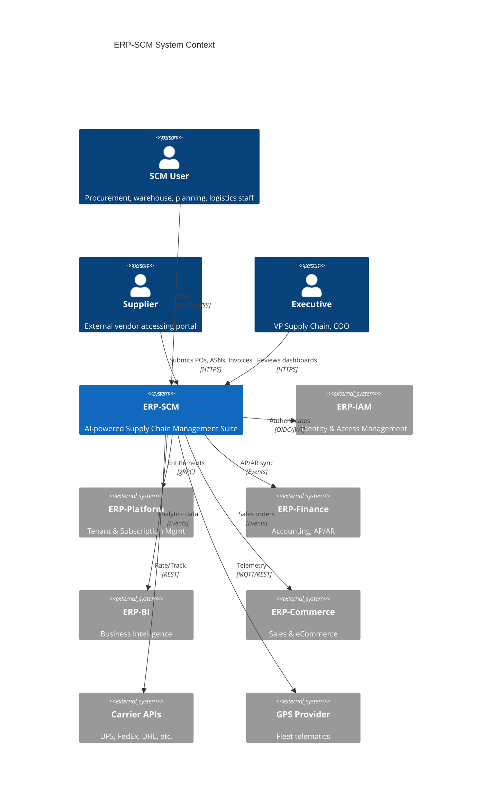
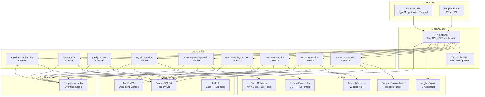
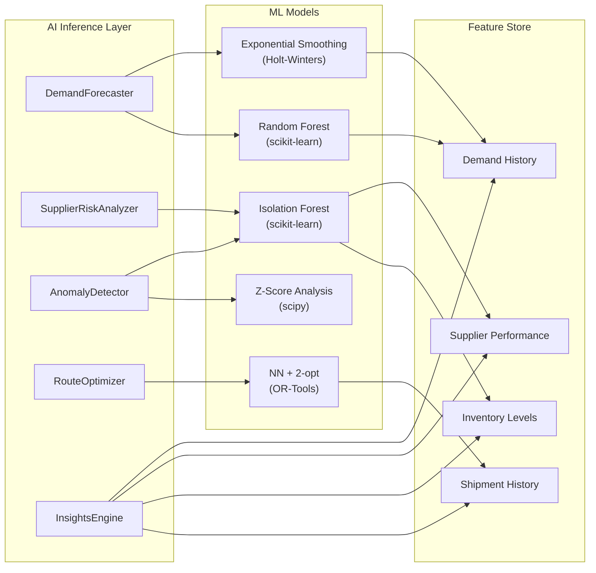
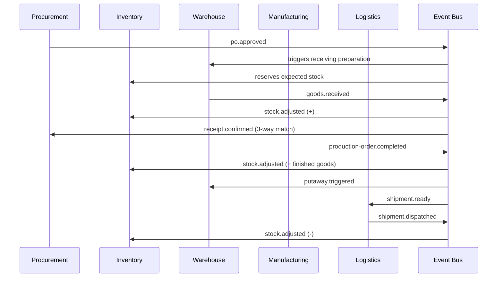
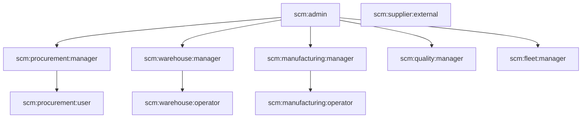
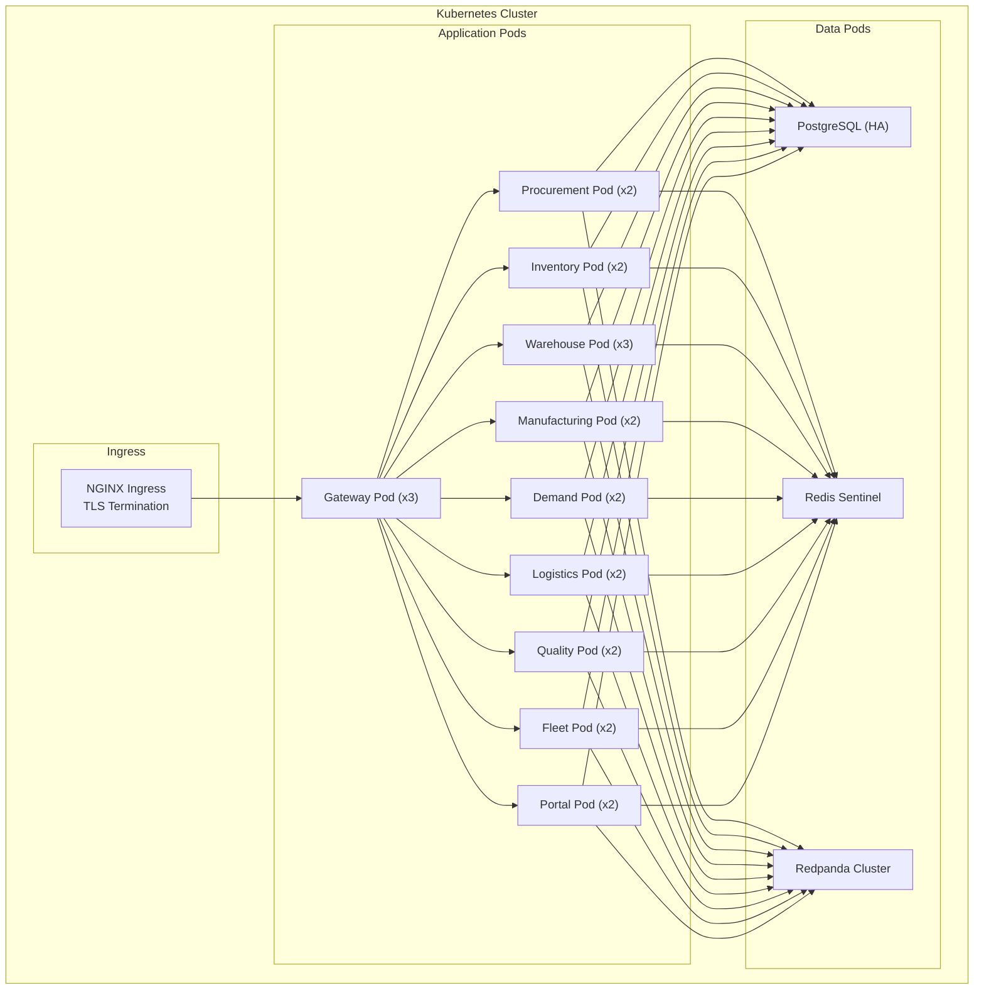

# ERP-SCM Architecture Document

## 1. Overview

ERP-SCM follows a modular microservices architecture where each supply chain domain (procurement, inventory, warehouse, manufacturing, demand planning, logistics, quality, fleet, supplier portal) is encapsulated as an independent service. All services share a common API gateway, event backbone, and AI inference layer. The system operates in `standalone_plus_suite` mode -- it can run independently or as part of the broader ERP platform.

---

## 2. C4 Context Diagram



---

## 3. Container Diagram



---

## 4. Service Inventory

| Service | Responsibility | Port | Database Schema |
|---|---|---|---|
| `procurement-service` | Requisitions, RFQ, POs, vendor scorecards, contracts, 3-way matching | 8001 | `scm_procurement` |
| `inventory-service` | Stock levels, reorder logic, ABC/XYZ, valuation, aging | 8002 | `scm_inventory` |
| `warehouse-service` | Layout, receiving, putaway, picking, packing, shipping, returns | 8003 | `scm_warehouse` |
| `manufacturing-service` | BOM, production orders, work centers, routing, MRP, scheduling | 8004 | `scm_manufacturing` |
| `demand-planning-service` | Forecasting, consensus planning, S&OP, accuracy metrics | 8005 | `scm_demand` |
| `logistics-service` | Carrier management, shipments, route optimization, freight audit | 8006 | `scm_logistics` |
| `quality-service` | Inspections, NCR, CAPA, SPC, ISO compliance | 8007 | `scm_quality` |
| `fleet-service` | Vehicles, drivers, maintenance, fuel, GPS, compliance | 8008 | `scm_fleet` |
| `supplier-portal-service` | External-facing PO ack, ASN, invoices, onboarding | 8009 | `scm_portal` |

---

## 5. Component Diagram (AI Layer)



---

## 6. Data Architecture

### 6.1 Database Strategy

- **Primary**: PostgreSQL 16 with schema-per-service isolation
- **Caching**: Redis 7 for session management, API response caching, and real-time KPI materialization
- **Object Storage**: MinIO (S3-compatible) for documents, labels, COAs, and BOM attachments
- **Search**: Optional Elasticsearch for full-text search across POs, shipments, NCRs

### 6.2 Multi-Tenancy

Each tenant's data is isolated via a `tenant_id` column on every table, enforced at the ORM layer:

```python
class TenantMixin:
    tenant_id = Column(UUID, nullable=False, index=True)

    @declared_attr
    def __table_args__(cls):
        return (
            Index(f'ix_{cls.__tablename__}_tenant', 'tenant_id'),
        )
```

The `X-Tenant-ID` header is required on all business endpoints and validated against the JWT claims.

---

## 7. Event Architecture

### 7.1 Event Convention

All events follow the CloudEvents specification with the naming pattern:

```
erp.scm.<domain>.<entity>.<action>
```

Examples:
- `erp.scm.procurement.po.created`
- `erp.scm.inventory.stock.adjusted`
- `erp.scm.manufacturing.production-order.completed`
- `erp.scm.logistics.shipment.delivered`

### 7.2 Event Flow



---

## 8. Security Architecture

### 8.1 Authentication

- OIDC/JWT tokens issued by ERP-IAM
- Token refresh via sliding window
- Service-to-service: mTLS with short-lived certificates

### 8.2 Authorization

RBAC with the following role hierarchy:



### 8.3 Data Protection

- Field-level encryption for PII (supplier contacts, driver PII)
- TLS 1.3 in transit
- AES-256 at rest (database, object storage)
- Audit log for all write operations (immutable append-only)

---

## 9. Deployment Architecture



---

## 10. Technology Stack Summary

| Layer | Technology | Version |
|---|---|---|
| Frontend | React, TypeScript, Vite, Tailwind CSS, Recharts | 18.x, 5.x |
| Backend | Python, FastAPI, SQLAlchemy, Pydantic | 3.11, 0.109, 2.0, 2.5 |
| AI/ML | scikit-learn, statsmodels, NumPy, pandas, SciPy, OR-Tools | 1.4, 0.14, 1.26, 2.2, 1.12, 9.8 |
| Database | PostgreSQL, Redis | 16, 7 |
| Messaging | Redpanda (Kafka-compatible) | Latest |
| Infrastructure | Docker, Kubernetes, Nginx | Latest |
| CI/CD | GitHub Actions | N/A |
| Observability | OpenTelemetry, Prometheus, Grafana | Latest |

---

## 11. Cross-Cutting Concerns

### 11.1 Observability

- **Distributed tracing**: OpenTelemetry spans across all services
- **Metrics**: Prometheus exporters per service (request latency, error rates, queue depth)
- **Logging**: Structured JSON logs, correlation IDs propagated via headers
- **Dashboards**: Grafana dashboards for SRE and business KPIs

### 11.2 Resilience

- Circuit breakers on all inter-service calls (exponential backoff)
- Dead letter queues for failed event processing
- Graceful degradation: AI features degrade to rule-based fallbacks if ML models are unavailable
- Health checks: `/healthz` (liveness) and `/readyz` (readiness) on every service

### 11.3 Configuration

- Environment variables for runtime configuration
- `pydantic-settings` for typed configuration with `.env` file support
- Feature flags for gradual rollout of new capabilities
