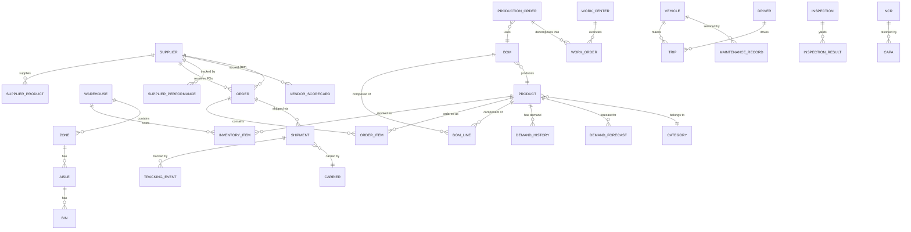
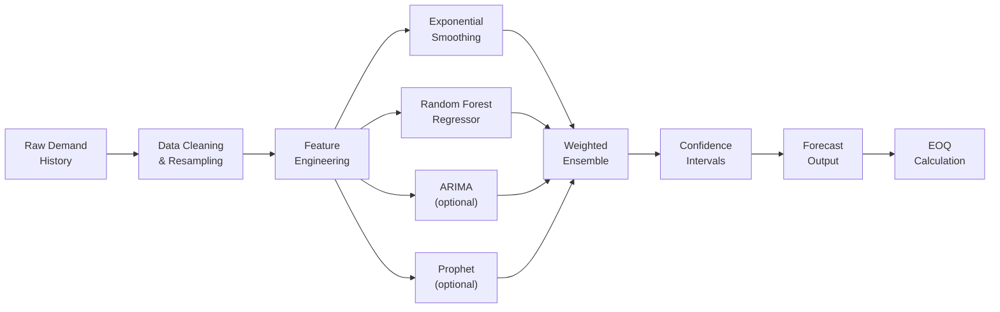
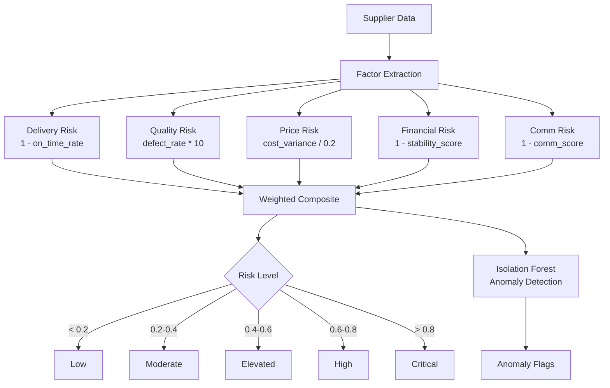
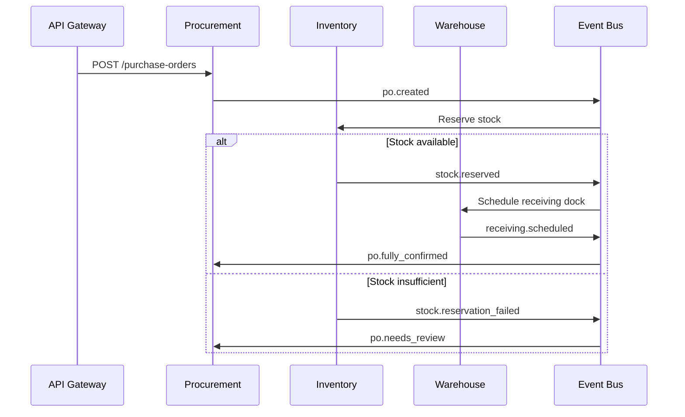

# ERP-SCM Technical Design Document

## 1. Purpose

This document details the internal technical design of ERP-SCM, including data models, service interactions, algorithm specifications, and implementation patterns. It serves as the primary reference for engineers building and maintaining the system.

---

## 2. Core Data Model Design

### 2.1 Entity Relationship Overview

The SCM data model is organized into nine bounded contexts, each with its own set of entities that connect through foreign keys and event-driven references.



### 2.2 Table Design Patterns

All tables follow these conventions:

```python
class BaseModel(Base):
    __abstract__ = True

    id = Column(UUID, primary_key=True, default=uuid4)
    tenant_id = Column(UUID, nullable=False, index=True)
    created_at = Column(DateTime, default=utcnow, nullable=False)
    updated_at = Column(DateTime, default=utcnow, onupdate=utcnow)
    created_by = Column(UUID, ForeignKey("users.id"))
    updated_by = Column(UUID, ForeignKey("users.id"))
    is_deleted = Column(Boolean, default=False)  # soft delete
```

**Indexing strategy**:
- Composite index on `(tenant_id, <business_key>)` for all lookup queries
- Partial indexes on `is_deleted = false` for active records
- GIN indexes on JSONB columns for metadata searches

---

## 3. Service Design Patterns

### 3.1 Repository Pattern

Each service uses a repository layer to abstract database access:

```python
class InventoryRepository:
    def __init__(self, db: Session):
        self.db = db

    def get_by_product_and_warehouse(
        self, tenant_id: UUID, product_id: UUID, warehouse_id: UUID
    ) -> Optional[InventoryItem]:
        return (
            self.db.query(InventoryItem)
            .filter(
                InventoryItem.tenant_id == tenant_id,
                InventoryItem.product_id == product_id,
                InventoryItem.warehouse_id == warehouse_id,
                InventoryItem.is_deleted == False,
            )
            .first()
        )

    def adjust_stock(
        self, item: InventoryItem, qty_delta: int, reason: str
    ) -> StockMovement:
        item.quantity += qty_delta
        movement = StockMovement(
            inventory_item_id=item.id,
            quantity_delta=qty_delta,
            reason=reason,
            resulting_quantity=item.quantity,
        )
        self.db.add(movement)
        return movement
```

### 3.2 Service Layer

Business logic lives in service classes that orchestrate repository calls and emit events:

```python
class InventoryService:
    def __init__(self, db: Session, event_bus: EventBus):
        self.repo = InventoryRepository(db)
        self.events = event_bus

    async def receive_goods(
        self, tenant_id: UUID, po_id: UUID, items: List[ReceiptLineDTO]
    ) -> GoodsReceipt:
        receipt = GoodsReceipt(tenant_id=tenant_id, po_id=po_id)
        for line in items:
            inv_item = self.repo.get_by_product_and_warehouse(
                tenant_id, line.product_id, line.warehouse_id
            )
            movement = self.repo.adjust_stock(inv_item, line.quantity, "PO Receipt")
            receipt.lines.append(movement)

        await self.events.publish("erp.scm.inventory.goods.received", {
            "receipt_id": str(receipt.id),
            "po_id": str(po_id),
            "items": [asdict(line) for line in items],
        })
        return receipt
```

### 3.3 Event Publishing Pattern

All events are CloudEvents-compliant:

```python
class CloudEvent:
    spec_version: str = "1.0"
    id: str = field(default_factory=lambda: str(uuid4()))
    source: str = "erp-scm"
    type: str = ""  # e.g., "erp.scm.inventory.goods.received"
    subject: str = ""  # entity ID
    time: str = field(default_factory=lambda: datetime.utcnow().isoformat())
    data_content_type: str = "application/json"
    data: dict = field(default_factory=dict)
    tenant_id: str = ""
    correlation_id: str = ""
```

---

## 4. Algorithm Specifications

### 4.1 Demand Forecasting Pipeline



**Feature Engineering Details**:

| Feature | Computation | Purpose |
|---|---|---|
| `day_of_week` | Index 0-6 from date | Weekly seasonality |
| `month` | 1-12 | Monthly seasonality |
| `lag_1, lag_7, lag_14, lag_30` | Shifted demand values | Autoregressive signal |
| `rolling_7, rolling_30` | Moving averages | Trend smoothing |
| `rolling_7_std` | 7-day standard deviation | Volatility capture |
| `trend` | Incrementing integer | Long-term direction |

**Ensemble Weights**: 40% Exponential Smoothing + 60% Random Forest (when sufficient data). The weights are determined by cross-validation on historical hold-out periods.

**EOQ Formula**:
```
EOQ = sqrt(2 * D * S / H)
where:
  D = annual demand (avg_daily * 365)
  S = ordering cost ($50 default)
  H = holding cost (unit_cost * 0.25)
```

### 4.2 Supplier Risk Scoring



**Weight Configuration** (from `config.py`):
```python
SUPPLIER_RISK_WEIGHTS = {
    "delivery_reliability": 0.30,
    "quality_score": 0.25,
    "price_competitiveness": 0.20,
    "financial_stability": 0.15,
    "communication": 0.10,
}
```

### 4.3 Route Optimization Algorithm

1. **Distance Matrix**: Haversine formula for all stop pairs
2. **Initial Solution**: Nearest-neighbor heuristic from origin
3. **Improvement**: 2-opt local search until no improving swap found
4. **VRP Extension**: OR-Tools `RoutingModel` for multi-vehicle problems with capacity constraints

```python
def haversine(lat1, lon1, lat2, lon2):
    R = 6371.0  # Earth radius in km
    dlat = radians(lat2 - lat1)
    dlon = radians(lon2 - lon1)
    a = sin(dlat/2)**2 + cos(radians(lat1)) * cos(radians(lat2)) * sin(dlon/2)**2
    return R * 2 * asin(sqrt(a))
```

### 4.4 Anomaly Detection

Three detection strategies run in parallel:

| Strategy | Method | Threshold | Targets |
|---|---|---|---|
| Inventory anomalies | Rule-based (qty vs reorder point) | qty <= reorder_point | Stock levels |
| Demand anomalies | Z-score | abs(z) > 2.5 | 7-day recent demand |
| Delivery anomalies | Rule-based (expected vs actual date) | expected_date < now | Open orders |
| Supplier anomalies | Isolation Forest | contamination=0.1 | Multi-dimensional scores |

---

## 5. API Design Principles

### 5.1 URL Structure

```
/v1/<domain>/<resource>
/v1/<domain>/<resource>/<id>
/v1/<domain>/<resource>/<id>/<sub-resource>
```

Examples:
- `GET /v1/procurement/purchase-orders`
- `POST /v1/procurement/purchase-orders/{id}/approve`
- `GET /v1/inventory/items?warehouse_id=xxx&low_stock=true`
- `POST /v1/demand-planning/forecasts/generate`
- `GET /v1/logistics/shipments/{id}/tracking`

### 5.2 Pagination

All list endpoints support cursor-based pagination:

```json
{
  "items": [...],
  "pagination": {
    "cursor": "eyJpZCI6ICIxMjM0In0=",
    "has_more": true,
    "total_count": 1542
  }
}
```

### 5.3 Error Format

```json
{
  "error": {
    "code": "INVENTORY_INSUFFICIENT",
    "message": "Insufficient stock for product SKU-1234 in warehouse WH-01",
    "details": {
      "available": 50,
      "requested": 100,
      "product_id": "uuid",
      "warehouse_id": "uuid"
    }
  }
}
```

---

## 6. Concurrency and Consistency

### 6.1 Inventory Stock Adjustments

Stock adjustments use optimistic locking with a version column:

```sql
UPDATE inventory_items
SET quantity = quantity + :delta, version = version + 1
WHERE id = :id AND version = :expected_version;
```

If the row count is 0, a `StaleDataError` is raised and the operation is retried.

### 6.2 Idempotency

All write endpoints accept an `Idempotency-Key` header. The key is stored in Redis with a 24-hour TTL, and duplicate requests return the cached response.

### 6.3 Saga Pattern for Cross-Service Operations

Multi-service operations (e.g., "Create PO, Reserve Stock, Schedule Receiving") use a choreography-based saga:



---

## 7. Performance Considerations

| Operation | Target | Design |
|---|---|---|
| Product search | < 50ms | PostgreSQL GIN index + Redis cache |
| MRP explosion | < 60s for 10K SKUs | Batch processing, materialized BOM levels |
| Demand forecast generation | < 5s per SKU | Pre-computed features, cached model artifacts |
| Route optimization (20 stops) | < 2s | NN + 2-opt heuristic; OR-Tools for larger |
| Dashboard KPI load | < 200ms | Pre-materialized KPIs in Redis, updated every 60s |
| Event propagation | < 100ms | Redpanda with in-memory tiered storage |

---

## 8. Testing Strategy

| Level | Scope | Tools | Coverage Target |
|---|---|---|---|
| Unit | Individual functions, models | pytest, pytest-asyncio | 85%+ |
| Integration | Service + DB + events | pytest + testcontainers | 70%+ |
| Contract | API schema compatibility | schemathesis | 100% endpoints |
| E2E | Full user workflows | Playwright | 15 critical paths |
| Performance | Load testing | Locust | p95 < SLA targets |
| ML Validation | Model accuracy | Custom MAPE/MAD tests | MAPE < 15% |
