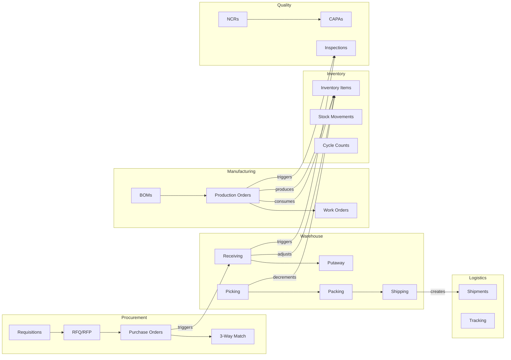

# ERP-SCM Entity Relationship Diagram

## 1. Overview

The ERP-SCM data model spans nine bounded contexts with over 80 tables. This document presents the complete entity-relationship model organized by domain, showing all primary entities, their attributes, and relationships.

---

## 2. Complete ERD

```mermaid
erDiagram
    %% ========== CORE ==========
    users {
        uuid id PK
        uuid tenant_id FK
        string email UK
        string hashed_password
        string full_name
        string role
        boolean is_active
        datetime created_at
        datetime updated_at
    }

    categories {
        uuid id PK
        uuid tenant_id FK
        string name UK
        text description
    }

    products {
        uuid id PK
        uuid tenant_id FK
        string sku UK
        string name
        text description
        uuid category_id FK
        float unit_price
        float unit_cost
        float weight_kg
        string uom
        boolean is_active
        datetime created_at
        datetime updated_at
    }

    %% ========== INVENTORY ==========
    warehouses {
        uuid id PK
        uuid tenant_id FK
        string name
        string code UK
        text address
        string city
        string country
        float latitude
        float longitude
        int capacity
        boolean is_active
        datetime created_at
    }

    inventory_items {
        uuid id PK
        uuid tenant_id FK
        uuid product_id FK
        uuid warehouse_id FK
        int quantity
        int reserved_quantity
        int reorder_point
        int reorder_quantity
        int ai_reorder_point
        int ai_reorder_quantity
        string valuation_method
        float unit_avg_cost
        datetime last_restock_date
        int version
        datetime updated_at
    }

    stock_movements {
        uuid id PK
        uuid tenant_id FK
        uuid inventory_item_id FK
        int quantity_delta
        int resulting_quantity
        string movement_type
        string reason
        uuid reference_id
        string reference_type
        uuid performed_by FK
        datetime created_at
    }

    cycle_counts {
        uuid id PK
        uuid tenant_id FK
        uuid warehouse_id FK
        string status
        datetime planned_date
        datetime completed_date
        uuid assigned_to FK
        int items_counted
        int variances_found
    }

    cycle_count_lines {
        uuid id PK
        uuid cycle_count_id FK
        uuid product_id FK
        uuid bin_id FK
        int system_quantity
        int counted_quantity
        int variance
        string resolution
    }

    %% ========== WAREHOUSE ==========
    zones {
        uuid id PK
        uuid warehouse_id FK
        string name
        string zone_type
        float temperature_min
        float temperature_max
        boolean is_active
    }

    aisles {
        uuid id PK
        uuid zone_id FK
        string code
        int rack_count
    }

    bins {
        uuid id PK
        uuid aisle_id FK
        string code
        string bin_type
        float max_weight_kg
        float max_volume_m3
        boolean is_occupied
        uuid current_product_id FK
    }

    receiving_orders {
        uuid id PK
        uuid tenant_id FK
        uuid po_id FK
        uuid warehouse_id FK
        string status
        uuid dock_door
        datetime expected_arrival
        datetime actual_arrival
        uuid received_by FK
    }

    receiving_lines {
        uuid id PK
        uuid receiving_order_id FK
        uuid product_id FK
        int expected_qty
        int received_qty
        int damaged_qty
        uuid putaway_bin FK
    }

    pick_waves {
        uuid id PK
        uuid tenant_id FK
        uuid warehouse_id FK
        string strategy
        string status
        datetime created_at
        datetime started_at
        datetime completed_at
    }

    pick_tasks {
        uuid id PK
        uuid pick_wave_id FK
        uuid order_item_id FK
        uuid from_bin FK
        uuid product_id FK
        int quantity
        string status
        uuid assigned_to FK
        datetime picked_at
    }

    pack_stations {
        uuid id PK
        uuid warehouse_id FK
        string name
        string status
        uuid assigned_to FK
    }

    shipping_labels {
        uuid id PK
        uuid shipment_id FK
        string carrier
        string tracking_number
        string label_url
        datetime created_at
    }

    %% ========== PROCUREMENT ==========
    purchase_requisitions {
        uuid id PK
        uuid tenant_id FK
        string req_number UK
        uuid requester_id FK
        string status
        string priority
        text justification
        float total_estimated
        datetime needed_by
        datetime approved_at
        uuid approved_by FK
    }

    requisition_lines {
        uuid id PK
        uuid requisition_id FK
        uuid product_id FK
        int quantity
        float estimated_unit_cost
        string specifications
    }

    rfq_events {
        uuid id PK
        uuid tenant_id FK
        string rfq_number UK
        string title
        text description
        string status
        datetime submission_deadline
        datetime decision_date
        uuid created_by FK
    }

    rfq_lines {
        uuid id PK
        uuid rfq_id FK
        uuid product_id FK
        int quantity
        string specifications
    }

    rfq_responses {
        uuid id PK
        uuid rfq_id FK
        uuid supplier_id FK
        float total_price
        int lead_time_days
        text terms
        datetime submitted_at
        float score
    }

    suppliers {
        uuid id PK
        uuid tenant_id FK
        string name
        string code UK
        string contact_name
        string email
        string phone
        text address
        string city
        string country
        float latitude
        float longitude
        int lead_time_days
        float reliability_score
        float quality_score
        float price_competitiveness
        float financial_stability
        float communication_score
        float ai_risk_score
        json ai_risk_factors
        boolean is_active
        datetime created_at
        datetime updated_at
    }

    supplier_products {
        uuid id PK
        uuid supplier_id FK
        uuid product_id FK
        float unit_cost
        int min_order_quantity
        int lead_time_days
        boolean is_preferred
    }

    supplier_performance {
        uuid id PK
        uuid supplier_id FK
        datetime period_start
        datetime period_end
        int orders_placed
        int orders_on_time
        int orders_complete
        float defect_rate
        float avg_lead_time_days
        float cost_variance
        float overall_score
        datetime created_at
    }

    vendor_scorecards {
        uuid id PK
        uuid supplier_id FK
        string period
        float delivery_score
        float quality_score
        float price_score
        float responsiveness_score
        float overall_score
        text comments
        datetime created_at
    }

    orders {
        uuid id PK
        uuid tenant_id FK
        string order_number UK
        string order_type
        string status
        uuid supplier_id FK
        uuid warehouse_id FK
        float total_amount
        string currency
        datetime expected_delivery
        datetime actual_delivery
        text notes
        boolean ai_generated
        datetime created_at
        datetime updated_at
    }

    order_items {
        uuid id PK
        uuid order_id FK
        uuid product_id FK
        int quantity
        float unit_price
        float total_price
    }

    contracts {
        uuid id PK
        uuid tenant_id FK
        uuid supplier_id FK
        string contract_number UK
        string contract_type
        datetime start_date
        datetime end_date
        float total_value
        string status
        json terms
        datetime renewal_alert_date
    }

    blanket_orders {
        uuid id PK
        uuid tenant_id FK
        uuid supplier_id FK
        uuid contract_id FK
        string status
        float total_authorized
        float total_released
        datetime valid_from
        datetime valid_to
    }

    three_way_matches {
        uuid id PK
        uuid tenant_id FK
        uuid po_id FK
        uuid receipt_id FK
        uuid invoice_id FK
        string match_status
        float po_amount
        float receipt_amount
        float invoice_amount
        float variance
        datetime matched_at
    }

    %% ========== LOGISTICS ==========
    carriers {
        uuid id PK
        uuid tenant_id FK
        string name
        string code UK
        string contact_email
        string api_endpoint
        json rate_tables
        boolean is_active
    }

    shipments {
        uuid id PK
        uuid tenant_id FK
        string tracking_number UK
        uuid order_id FK
        uuid carrier_id FK
        string status
        text origin_address
        float origin_lat
        float origin_lng
        text destination_address
        float destination_lat
        float destination_lng
        datetime estimated_delivery
        datetime actual_delivery
        float weight_kg
        float cost
        json ai_optimized_route
        datetime ai_estimated_delivery
        string incoterm
        datetime created_at
        datetime updated_at
    }

    tracking_events {
        uuid id PK
        uuid shipment_id FK
        string status
        string location
        float latitude
        float longitude
        text description
        datetime timestamp
    }

    freight_invoices {
        uuid id PK
        uuid tenant_id FK
        uuid shipment_id FK
        uuid carrier_id FK
        float billed_amount
        float audited_amount
        float variance
        string audit_status
        datetime invoice_date
    }

    %% ========== MANUFACTURING ==========
    boms {
        uuid id PK
        uuid tenant_id FK
        uuid product_id FK
        string bom_number UK
        int version
        string status
        float yield_percentage
        datetime effective_from
        datetime effective_to
    }

    bom_lines {
        uuid id PK
        uuid bom_id FK
        uuid component_product_id FK
        float quantity_per
        string uom
        int sequence
        boolean is_phantom
        float scrap_percentage
    }

    work_centers {
        uuid id PK
        uuid tenant_id FK
        string name
        string code UK
        float capacity_hours_per_day
        float efficiency_percentage
        float cost_per_hour
        string status
    }

    routings {
        uuid id PK
        uuid tenant_id FK
        uuid bom_id FK
        string routing_number UK
        int version
    }

    routing_operations {
        uuid id PK
        uuid routing_id FK
        uuid work_center_id FK
        int sequence
        string operation_name
        float setup_time_hours
        float run_time_hours
        float queue_time_hours
    }

    production_orders {
        uuid id PK
        uuid tenant_id FK
        string po_number UK
        uuid bom_id FK
        uuid routing_id FK
        string production_type
        string status
        int planned_quantity
        int completed_quantity
        int scrapped_quantity
        datetime planned_start
        datetime planned_end
        datetime actual_start
        datetime actual_end
        float total_cost
    }

    work_orders {
        uuid id PK
        uuid production_order_id FK
        uuid routing_operation_id FK
        uuid work_center_id FK
        string status
        datetime scheduled_start
        datetime scheduled_end
        datetime actual_start
        datetime actual_end
        int quantity_in
        int quantity_out
        int quantity_scrapped
    }

    %% ========== DEMAND PLANNING ==========
    demand_history {
        uuid id PK
        uuid tenant_id FK
        uuid product_id FK
        datetime date
        int quantity
        float revenue
        string channel
        string region
    }

    demand_forecasts {
        uuid id PK
        uuid tenant_id FK
        uuid product_id FK
        datetime forecast_date
        float predicted_quantity
        float lower_bound
        float upper_bound
        float confidence
        string model_used
        datetime created_at
    }

    forecast_accuracy {
        uuid id PK
        uuid tenant_id FK
        uuid product_id FK
        string period
        float mape
        float mad
        float bias
        float forecast_value
        float actual_value
        datetime calculated_at
    }

    consensus_plans {
        uuid id PK
        uuid tenant_id FK
        string plan_name
        string status
        datetime period_start
        datetime period_end
        json statistical_forecast
        json sales_override
        json marketing_override
        json final_consensus
        uuid approved_by FK
        datetime approved_at
    }

    %% ========== QUALITY ==========
    quality_plans {
        uuid id PK
        uuid tenant_id FK
        string plan_name
        uuid product_id FK
        string inspection_type
        string sampling_method
        float aql_level
        json inspection_criteria
        boolean is_active
    }

    inspections {
        uuid id PK
        uuid tenant_id FK
        uuid quality_plan_id FK
        uuid reference_id
        string reference_type
        string status
        uuid inspector_id FK
        datetime inspection_date
        int sample_size
        int defects_found
        string disposition
    }

    inspection_results {
        uuid id PK
        uuid inspection_id FK
        string characteristic
        string measurement_type
        float target_value
        float actual_value
        float tolerance_upper
        float tolerance_lower
        boolean is_pass
    }

    ncrs {
        uuid id PK
        uuid tenant_id FK
        string ncr_number UK
        uuid inspection_id FK
        string severity
        text description
        string root_cause
        string disposition
        string status
        uuid assigned_to FK
        datetime created_at
        datetime closed_at
    }

    capas {
        uuid id PK
        uuid tenant_id FK
        string capa_number UK
        uuid ncr_id FK
        string capa_type
        text corrective_action
        text preventive_action
        string status
        datetime due_date
        datetime completed_date
        uuid owner_id FK
    }

    spc_data_points {
        uuid id PK
        uuid tenant_id FK
        uuid product_id FK
        uuid work_center_id FK
        string characteristic
        float value
        float ucl
        float lcl
        float center_line
        boolean out_of_control
        datetime measured_at
    }

    %% ========== FLEET ==========
    vehicles {
        uuid id PK
        uuid tenant_id FK
        string registration_number UK
        string vin
        string make
        string model
        int year
        string vehicle_type
        float capacity_kg
        float capacity_m3
        float odometer_km
        string status
        datetime next_service_date
        datetime insurance_expiry
        datetime registration_expiry
    }

    drivers {
        uuid id PK
        uuid tenant_id FK
        string employee_id FK
        string license_number UK
        string license_class
        datetime license_expiry
        float safety_score
        boolean is_active
        json certifications
    }

    trips {
        uuid id PK
        uuid tenant_id FK
        uuid vehicle_id FK
        uuid driver_id FK
        uuid shipment_id FK
        string status
        datetime planned_departure
        datetime actual_departure
        datetime planned_arrival
        datetime actual_arrival
        float distance_km
        float fuel_consumed_liters
        json route_waypoints
    }

    maintenance_records {
        uuid id PK
        uuid tenant_id FK
        uuid vehicle_id FK
        string maintenance_type
        text description
        float cost
        float odometer_at_service
        datetime scheduled_date
        datetime completed_date
        string performed_by
    }

    fuel_records {
        uuid id PK
        uuid tenant_id FK
        uuid vehicle_id FK
        uuid driver_id FK
        float liters
        float cost_per_liter
        float total_cost
        float odometer_reading
        string fuel_type
        string station
        datetime refueled_at
    }

    %% ========== AI ==========
    ai_alerts {
        uuid id PK
        uuid tenant_id FK
        string alert_type
        string severity
        string title
        text message
        string entity_type
        uuid entity_id
        json metadata
        boolean is_read
        boolean is_resolved
        datetime created_at
        datetime resolved_at
    }

    ai_model_metadata {
        uuid id PK
        uuid tenant_id FK
        string model_name
        string model_type
        json parameters
        json metrics
        datetime trained_at
        boolean is_active
    }

    %% ========== SUPPLIER PORTAL ==========
    portal_users {
        uuid id PK
        uuid supplier_id FK
        string email UK
        string hashed_password
        string full_name
        string role
        boolean is_active
        datetime last_login
    }

    asn_submissions {
        uuid id PK
        uuid tenant_id FK
        uuid supplier_id FK
        uuid po_id FK
        string asn_number UK
        datetime expected_delivery
        json line_items
        string status
        datetime submitted_at
    }

    supplier_invoices {
        uuid id PK
        uuid tenant_id FK
        uuid supplier_id FK
        uuid po_id FK
        string invoice_number UK
        float amount
        string currency
        string status
        datetime invoice_date
        datetime due_date
        datetime paid_date
    }

    %% ========== RELATIONSHIPS ==========
    products }o--|| categories : "belongs to"
    inventory_items }o--|| products : "for"
    inventory_items }o--|| warehouses : "in"
    stock_movements }o--|| inventory_items : "on"
    zones }o--|| warehouses : "in"
    aisles }o--|| zones : "in"
    bins }o--|| aisles : "in"
    receiving_lines }o--|| receiving_orders : "part of"
    pick_tasks }o--|| pick_waves : "part of"
    supplier_products }o--|| suppliers : "from"
    supplier_products }o--|| products : "for"
    supplier_performance }o--|| suppliers : "of"
    orders }o--|| suppliers : "from"
    order_items }o--|| orders : "in"
    order_items }o--|| products : "for"
    shipments }o--|| orders : "ships"
    tracking_events }o--|| shipments : "on"
    bom_lines }o--|| boms : "in"
    production_orders }o--|| boms : "uses"
    work_orders }o--|| production_orders : "from"
    demand_history }o--|| products : "for"
    demand_forecasts }o--|| products : "for"
    inspections }o--|| quality_plans : "uses"
    inspection_results }o--|| inspections : "from"
    ncrs }o--|| inspections : "from"
    capas }o--|| ncrs : "resolves"
    trips }o--|| vehicles : "uses"
    trips }o--|| drivers : "by"
    maintenance_records }o--|| vehicles : "on"
    fuel_records }o--|| vehicles : "for"
```

---

## 3. Domain Relationships Summary



---

## 4. Index Strategy

| Table | Index | Type | Purpose |
|---|---|---|---|
| `products` | `(tenant_id, sku)` | Unique B-tree | SKU lookup |
| `inventory_items` | `(tenant_id, product_id, warehouse_id)` | Unique B-tree | Stock lookup |
| `orders` | `(tenant_id, order_number)` | Unique B-tree | Order lookup |
| `orders` | `(tenant_id, status, created_at)` | B-tree | Status filtering |
| `shipments` | `(tenant_id, tracking_number)` | Unique B-tree | Track & trace |
| `demand_history` | `(tenant_id, product_id, date)` | B-tree | Time-series queries |
| `ai_alerts` | `(tenant_id, is_resolved, severity)` | B-tree | Active alert queries |
| `production_orders` | `(tenant_id, status, planned_start)` | B-tree | Scheduling queries |
| `inspections` | `(tenant_id, reference_type, reference_id)` | B-tree | Inspection lookup |
| `trips` | `(tenant_id, vehicle_id, status)` | B-tree | Active trip queries |

---

## 5. Data Volumes Estimation

| Entity | Expected Volume (Year 1) | Growth Rate |
|---|---|---|
| Products | 10,000 - 100,000 | 10% annually |
| Inventory Items | 50,000 - 500,000 | Linear with products x warehouses |
| Stock Movements | 5M - 50M | Daily high-frequency |
| Orders | 100,000 - 1M | Seasonal peaks |
| Shipments | 50,000 - 500,000 | Tied to orders |
| Demand History | 10M - 100M | Daily per product per region |
| Tracking Events | 5M - 50M | Multiple per shipment |
| Production Orders | 10,000 - 100,000 | Depends on MFG volume |
| Inspections | 50,000 - 500,000 | Tied to receipts + production |
