# ERP-SCM Use Cases

## 1. Overview

This document defines the 30 primary use cases spanning all nine SCM domains. Each use case includes actors, preconditions, main flow, alternative flows, and postconditions.

---

## 2. Use Case Diagram

```mermaid
graph LR
    subgraph "Actors"
        PM["Procurement Manager"]
        WM["Warehouse Manager"]
        WO["Warehouse Operator"]
        PP["Production Planner"]
        DP["Demand Planner"]
        LC["Logistics Coordinator"]
        QM["Quality Manager"]
        FM["Fleet Manager"]
        SUP["Supplier"]
        EXE["Executive"]
        SYS["System (AI)"]
    end

    subgraph "Procurement"
        UC01["UC-01: Create Purchase Requisition"]
        UC02["UC-02: Conduct RFQ Process"]
        UC03["UC-03: Create Purchase Order"]
        UC04["UC-04: Execute 3-Way Match"]
        UC05["UC-05: Manage Vendor Scorecard"]
    end

    subgraph "Inventory"
        UC06["UC-06: Adjust Inventory"]
        UC07["UC-07: Run ABC/XYZ Analysis"]
        UC08["UC-08: Perform Cycle Count"]
    end

    subgraph "Warehouse"
        UC09["UC-09: Receive Goods"]
        UC10["UC-10: Execute Putaway"]
        UC11["UC-11: Create Pick Wave"]
        UC12["UC-12: Pack & Ship Order"]
        UC13["UC-13: Process Return"]
    end

    subgraph "Manufacturing"
        UC14["UC-14: Manage BOM"]
        UC15["UC-15: Create Production Order"]
        UC16["UC-16: Run MRP"]
        UC17["UC-17: Schedule Production"]
        UC18["UC-18: Report Shop Floor Activity"]
    end

    subgraph "Demand Planning"
        UC19["UC-19: Generate AI Forecast"]
        UC20["UC-20: Conduct Consensus Planning"]
        UC21["UC-21: Review Forecast Accuracy"]
    end

    subgraph "Logistics"
        UC22["UC-22: Plan Shipment"]
        UC23["UC-23: Optimize Route"]
        UC24["UC-24: Track Shipment"]
        UC25["UC-25: Audit Freight Invoice"]
    end

    subgraph "Quality"
        UC26["UC-26: Perform Incoming Inspection"]
        UC27["UC-27: Create NCR & CAPA"]
    end

    subgraph "Fleet"
        UC28["UC-28: Schedule Maintenance"]
        UC29["UC-29: Log Trip"]
    end

    subgraph "AI & Cross-cutting"
        UC30["UC-30: AI Anomaly Detection & Alerting"]
    end

    PM --> UC01 & UC02 & UC03 & UC04 & UC05
    WM --> UC09 & UC10 & UC11
    WO --> UC12 & UC13
    PP --> UC14 & UC15 & UC16 & UC17 & UC18
    DP --> UC19 & UC20 & UC21
    LC --> UC22 & UC23 & UC24 & UC25
    QM --> UC26 & UC27
    FM --> UC28 & UC29
    SUP --> UC03 & UC04
    EXE --> UC07 & UC21
    SYS --> UC30
```

---

## 3. Detailed Use Cases

### UC-01: Create Purchase Requisition

**Actors**: Procurement Manager, Department User
**Preconditions**: User is authenticated with `scm:procurement:user` role or higher
**Trigger**: Department identifies need for materials or services

**Main Flow**:
1. User navigates to Procurement > Requisitions > New
2. System displays requisition form with auto-generated REQ number
3. User specifies priority (low/medium/high/urgent), needed-by date, justification
4. User adds line items: product, quantity, estimated unit cost, specifications
5. System calculates total estimated cost
6. User submits requisition
7. System routes to appropriate approver based on amount thresholds
8. Approver reviews and approves/rejects
9. System emits `erp.scm.procurement.requisition.approved` event
10. Approved requisition becomes available for PO conversion

**Alternative Flows**:
- 7a. Amount exceeds threshold: routes to additional approver(s) in chain
- 8a. Approver rejects: requisition returns to requester with comments
- 8b. Approver requests changes: requisition enters revision state

**Postconditions**: Requisition record created with audit trail; approved requisitions available for RFQ or direct PO creation

---

### UC-02: Conduct RFQ Process

**Actors**: Procurement Manager
**Preconditions**: Approved requisition exists; qualified suppliers identified

**Main Flow**:
1. Procurement Manager creates RFQ from approved requisition
2. System generates RFQ document with line items, quantities, specifications
3. Manager selects invited suppliers (minimum 3 recommended)
4. System sends RFQ invitations via supplier portal and email
5. Suppliers submit responses through the portal (price, lead time, terms)
6. System collects all responses by submission deadline
7. AI vendor selection engine scores responses (price 40%, quality 25%, delivery 20%, terms 15%)
8. Manager reviews AI recommendations and selects winner
9. System creates PO from winning bid
10. System notifies all participants of outcome

**Alternative Flows**:
- 5a. Supplier requests clarification: Q&A round opens for all participants
- 6a. Insufficient responses: deadline extended or additional suppliers invited
- 8a. Manager overrides AI recommendation with documented justification

**Postconditions**: Winning supplier selected; PO created; losing bidders notified

---

### UC-03: Create Purchase Order

**Actors**: Procurement Manager, System (auto-generation)
**Preconditions**: Approved requisition or MRP-generated demand exists

**Main Flow**:
1. Manager selects source (requisition, RFQ winner, or manual)
2. System pre-populates PO with supplier, items, prices, delivery terms
3. Manager reviews and adjusts quantities, delivery dates, shipping terms
4. Manager selects Incoterms (EXW, FOB, CIF, DDP, etc.)
5. System calculates total including freight estimates
6. Manager submits PO for approval
7. Approval workflow executes (amount-based thresholds)
8. Approved PO is transmitted to supplier (portal + email)
9. System emits `erp.scm.procurement.po.created` event
10. Inventory service reserves expected quantities

**Postconditions**: PO created, supplier notified, expected inventory reserved

---

### UC-04: Execute 3-Way Match

**Actors**: Accounts Payable Clerk, System
**Preconditions**: PO exists, goods received, supplier invoice submitted

**Main Flow**:
1. Supplier submits invoice through portal
2. System identifies matching PO and goods receipt
3. System compares: PO line amounts vs. receipt quantities vs. invoice amounts
4. If all three match within tolerance (default 2%): auto-approved for payment
5. System creates matched payment record
6. System emits `erp.scm.procurement.match.completed` event
7. AP processes payment per terms

**Alternative Flows**:
- 4a. Quantity mismatch: system flags for manual review
- 4b. Price mismatch: system routes to procurement for verification
- 4c. Partial receipt: system matches received portion, holds remainder

**Postconditions**: Invoice matched and approved for payment, or exception raised

---

### UC-05: Manage Vendor Scorecard

**Actors**: Procurement Manager, System (AI)
**Preconditions**: Supplier has at least one completed order

**Main Flow**:
1. System automatically calculates scores monthly:
   - Delivery score: on-time delivery percentage
   - Quality score: 1 - defect rate
   - Price score: actual vs. quoted price variance
   - Responsiveness: communication turnaround time
2. AI Risk Analyzer generates composite risk score
3. System updates vendor scorecard record
4. Manager reviews scorecard dashboard
5. For high-risk suppliers: system generates improvement action items
6. Manager schedules supplier business review if needed

**Postconditions**: Scorecard updated, risk factors visible, action items tracked

---

### UC-06: Adjust Inventory

**Actors**: Warehouse Manager, System
**Preconditions**: Inventory item exists in at least one location

**Main Flow**:
1. Manager selects product and warehouse location
2. System displays current stock, reserved quantity, available quantity
3. Manager enters adjustment (positive or negative) with reason code
4. System validates: negative adjustment cannot exceed available quantity
5. System creates stock movement record
6. System updates inventory item quantity
7. System emits `erp.scm.inventory.stock.adjusted` event
8. If quantity falls below reorder point: AI triggers low-stock alert

**Postconditions**: Stock adjusted, movement recorded, alerts generated if needed

---

### UC-07: Run ABC/XYZ Analysis

**Actors**: Demand Planner, Executive
**Preconditions**: At least 90 days of demand history exists

**Main Flow**:
1. Planner selects analysis parameters (date range, product scope)
2. System calculates ABC classification:
   - A: Top 20% of products contributing 80% of revenue
   - B: Next 30% contributing 15% of revenue
   - C: Bottom 50% contributing 5% of revenue
3. System calculates XYZ classification:
   - X: Low demand variability (CV < 0.5)
   - Y: Medium variability (0.5 <= CV < 1.0)
   - Z: High variability (CV >= 1.0)
4. System creates 9-cell matrix (AX, AY, AZ, BX, BY, BZ, CX, CY, CZ)
5. System recommends inventory policies per cell
6. Planner reviews and adjusts reorder parameters

**Postconditions**: Products classified, inventory policies recommended

---

### UC-08: Perform Cycle Count

**Actors**: Warehouse Manager, Warehouse Operator
**Preconditions**: Cycle count schedule exists for warehouse

**Main Flow**:
1. Manager creates cycle count for selected zone/products
2. System generates count sheets with expected locations (bin assignments)
3. Operator scans bin barcode, counts physical inventory
4. Operator enters counted quantities via mobile device
5. System calculates variance (counted - system quantity)
6. For variances exceeding threshold (default 5%): flag for recount
7. Manager reviews and approves count results
8. System adjusts inventory to match physical count
9. System generates variance report

**Postconditions**: Inventory reconciled, variances documented, adjustments posted

---

### UC-09: Receive Goods

**Actors**: Warehouse Operator, Receiving Clerk
**Preconditions**: Expected PO with scheduled delivery

**Main Flow**:
1. Truck arrives at receiving dock
2. Operator scans PO barcode or enters PO number
3. System displays expected items and quantities
4. Operator counts and inspects incoming goods
5. Operator records received quantities, notes damages
6. System creates goods receipt record
7. If quality plan exists: system triggers incoming inspection (UC-26)
8. System emits `erp.scm.warehouse.goods.received` event
9. Inventory service adjusts stock levels
10. System suggests putaway locations based on product profile

**Postconditions**: Goods received, inventory updated, inspection triggered if required

---

### UC-10: Execute Putaway

**Actors**: Warehouse Operator
**Preconditions**: Goods received and cleared (inspection passed or not required)

**Main Flow**:
1. System generates putaway tasks with optimized bin assignments
2. Optimization considers: product velocity (ABC class), weight, zone requirements (temperature, hazmat)
3. Operator picks up goods from receiving dock
4. Operator scans destination bin barcode
5. Operator confirms putaway quantity
6. System updates bin occupancy and inventory location
7. System emits `erp.scm.warehouse.putaway.completed` event

**Postconditions**: Goods stored in optimal locations, bin records updated

---

### UC-11: Create Pick Wave

**Actors**: Warehouse Manager
**Preconditions**: Open sales orders awaiting fulfillment

**Main Flow**:
1. Manager reviews pending sales orders
2. Manager selects pick strategy: wave, batch, zone, or cluster
3. System groups orders into pick wave based on strategy:
   - **Wave**: Time-based batches (e.g., all orders received in last 2 hours)
   - **Batch**: Multiple orders combined for efficiency
   - **Zone**: Orders partitioned by warehouse zone
   - **Cluster**: Multi-order picking by proximity
4. System generates pick tasks with optimized pick path
5. Tasks assigned to operators based on zone and availability
6. Operators receive tasks on mobile devices
7. Operators scan products, confirm picks
8. System updates pick task status and inventory allocation

**Postconditions**: Pick wave created, tasks assigned, operators guided

---

### UC-12: Pack and Ship Order

**Actors**: Warehouse Operator
**Preconditions**: All pick tasks for the order are completed

**Main Flow**:
1. Picked items arrive at packing station
2. Operator scans order barcode
3. System displays packing instructions (box size, materials, special handling)
4. Operator packs items, records box dimensions and weight
5. System selects carrier based on rate tables and delivery requirements
6. System generates shipping label and tracking number
7. Operator applies label and moves to outbound staging
8. System emits `erp.scm.warehouse.shipped` event
9. Logistics service creates shipment record
10. Customer notified with tracking information

**Postconditions**: Order packed, labeled, shipped; customer notified

---

### UC-13: Process Return (RMA)

**Actors**: Warehouse Operator, Customer Service
**Preconditions**: Return authorization issued

**Main Flow**:
1. Customer-returned package arrives at returns dock
2. Operator scans RMA number
3. Operator inspects returned items (condition assessment)
4. System determines disposition: restock, refurbish, scrap, or return to vendor
5. For restock: inventory adjusted upward
6. For scrap: inventory written off, cost charged
7. For vendor return: new shipment created to supplier
8. Quality inspection triggered if defect reported
9. System updates RMA record with disposition

**Postconditions**: Return processed, inventory and financials adjusted

---

### UC-14: Manage Bill of Materials

**Actors**: Production Planner, Engineering
**Preconditions**: Parent product and component products exist

**Main Flow**:
1. Planner creates new BOM for finished product
2. System assigns BOM number and version
3. Planner adds component lines: component product, quantity per, UOM, sequence
4. For multi-level BOMs: planner can reference sub-assembly BOMs (phantom components)
5. Planner specifies yield percentage and scrap factors per line
6. System validates BOM for circular references
7. Planner sets effective date range
8. System can explode multi-level BOM to show all raw materials

**Postconditions**: BOM created with all levels, ready for production orders and MRP

---

### UC-15: Create Production Order

**Actors**: Production Planner
**Preconditions**: Active BOM and routing exist for the product

**Main Flow**:
1. Planner selects BOM and planned quantity
2. System explodes BOM to determine material requirements
3. System checks material availability across warehouses
4. Planner selects production type: discrete, process, or repetitive
5. System generates work orders from routing operations
6. Planner schedules start and end dates
7. System reserves materials in inventory
8. System emits `erp.scm.manufacturing.production-order.created` event
9. Work orders appear on shop floor schedule

**Postconditions**: Production order created, materials reserved, shop floor notified

---

### UC-16: Run Material Requirements Planning (MRP)

**Actors**: Production Planner, System
**Preconditions**: Demand forecasts, BOMs, inventory levels, and lead times are current

**Main Flow**:
1. Planner initiates MRP run (or system runs on schedule)
2. System loads: demand forecasts, open sales orders, open POs, current inventory, safety stock
3. System calculates net requirements: demand - on-hand - on-order + safety stock
4. For each shortfall: system generates planned order (purchase or production)
5. System offsets planned orders by lead time
6. System pegs demand to supply sources
7. Planner reviews MRP output: planned purchase orders, planned production orders
8. Planner converts selected planned orders to firm orders
9. System emits events for new POs and production orders

**Postconditions**: Material plan generated, planned orders ready for conversion

---

### UC-17: Schedule Production (Finite Capacity)

**Actors**: Production Planner
**Preconditions**: Production orders exist with work orders and work center assignments

**Main Flow**:
1. Planner opens production scheduler (Gantt view)
2. System displays work centers on Y-axis, time on X-axis
3. System loads all open work orders with estimated durations
4. Planner selects scheduling method: forward (from today) or backward (from due date)
5. System applies finite capacity constraints (work center hours/day, efficiency)
6. System identifies capacity bottlenecks and over-loaded periods
7. Planner manually adjusts: drag work orders, split across work centers
8. System validates: no material conflicts, no capacity violations
9. Schedule saved and work orders updated with scheduled dates

**Postconditions**: Production schedule generated within capacity constraints

---

### UC-18: Report Shop Floor Activity

**Actors**: Production Operator, Shop Floor Supervisor
**Preconditions**: Work order is in "Released" or "In Progress" status

**Main Flow**:
1. Operator logs into MES terminal at work center
2. Operator scans work order barcode to start operation
3. System records actual start time
4. During production: operator reports quantities completed, scrapped, reworked
5. Operator logs material consumption (actual vs. planned)
6. Operator records by-products if applicable
7. On completion: operator ends operation
8. System records actual end time, calculates efficiency
9. System updates WIP (Work-in-Progress) quantities
10. System emits `erp.scm.manufacturing.operation.completed` event

**Postconditions**: Actual production data captured, WIP updated, efficiency calculated

---

### UC-19: Generate AI Demand Forecast

**Actors**: Demand Planner, System (scheduled)
**Preconditions**: At least 7 days of demand history for the product

**Main Flow**:
1. System (or planner manually) triggers forecast generation
2. System loads demand history, cleans and resamples to daily frequency
3. System engineers features: day-of-week, month, lags, rolling averages, trend
4. System runs Exponential Smoothing (Holt-Winters) model
5. System runs Random Forest ensemble model
6. System combines predictions: 40% ES + 60% RF weighted average
7. System calculates 95% confidence intervals
8. System computes forecast accuracy on recent hold-out period
9. System stores forecast records in `demand_forecasts` table
10. System calculates optimal reorder point and EOQ
11. Dashboard updated with forecast visualizations

**Alternative Flows**:
- 2a. Insufficient data (< 7 days): system generates baseline forecast
- 6a. RF training fails: system falls back to ES-only forecast

**Postconditions**: 30-day forecast generated with confidence intervals

---

### UC-20: Conduct Consensus Planning

**Actors**: Demand Planner, Sales, Marketing, Finance
**Preconditions**: Statistical forecast generated for the planning period

**Main Flow**:
1. Demand Planner creates consensus planning session
2. System loads statistical forecast as baseline
3. Sales team reviews and overlays field intelligence (customer commitments, pipeline)
4. Marketing team adds promotional lift adjustments
5. Finance validates against budget and targets
6. Planner reviews all inputs in consolidated view
7. Planner adjusts final consensus numbers
8. Consensus plan approved by VP Supply Chain
9. Approved plan becomes the demand signal for MRP

**Postconditions**: Consensus demand plan finalized and published

---

### UC-21: Review Forecast Accuracy

**Actors**: Demand Planner, Executive
**Preconditions**: At least one completed forecast period with actual data

**Main Flow**:
1. System calculates accuracy metrics per product per period:
   - MAPE (Mean Absolute Percentage Error)
   - MAD (Mean Absolute Deviation)
   - Bias (systematic over/under forecasting)
2. System generates accuracy dashboard with drill-down
3. Planner identifies products with MAPE > 25% (poor accuracy)
4. Planner investigates root causes: promotions not captured, supply disruptions, data quality
5. Planner adjusts model parameters or switches to different algorithm
6. System tracks accuracy improvement over time

**Postconditions**: Forecast accuracy measured and improvement actions identified

---

### UC-22: Plan Shipment

**Actors**: Logistics Coordinator
**Preconditions**: Packed orders ready for shipping

**Main Flow**:
1. Coordinator views shipping queue with pending orders
2. System suggests consolidation opportunities (same destination zone)
3. Coordinator selects orders for shipment
4. System calculates shipment weight and volume
5. System queries carrier rate tables for pricing options
6. Coordinator selects carrier and service level
7. System generates shipment record with estimated delivery
8. System books carrier pickup via API integration
9. System emits `erp.scm.logistics.shipment.planned` event

**Postconditions**: Shipment planned, carrier booked, tracking initiated

---

### UC-23: Optimize Delivery Route

**Actors**: Logistics Coordinator, System (AI)
**Preconditions**: Multiple delivery stops exist for a vehicle/trip

**Main Flow**:
1. Coordinator selects shipments for route optimization
2. System extracts stop coordinates (latitude/longitude)
3. AI Route Optimizer builds distance matrix using Haversine formula
4. System applies nearest-neighbor heuristic for initial route
5. System applies 2-opt improvement iterations
6. For multi-vehicle problems: system uses OR-Tools VRP solver
7. System returns optimized stop sequence, total distance, estimated time
8. Coordinator reviews and approves route
9. Route pushed to fleet service for driver assignment

**Postconditions**: Optimized route calculated with distance/time savings

---

### UC-24: Track Shipment in Real-Time

**Actors**: Logistics Coordinator, Customer
**Preconditions**: Shipment is in transit

**Main Flow**:
1. System polls carrier APIs for tracking updates
2. System receives webhook notifications from carriers
3. Each status change creates a tracking event record
4. System updates shipment status (picked_up, in_transit, out_for_delivery, delivered)
5. GPS coordinates from fleet vehicles update location in real-time
6. System calculates revised ETA based on current position and speed
7. If delay detected: system triggers alert and notifies stakeholders
8. Customer can view tracking via portal or notification link

**Postconditions**: Tracking events recorded, stakeholders informed of status

---

### UC-25: Audit Freight Invoice

**Actors**: Logistics Coordinator, Finance
**Preconditions**: Freight invoice received from carrier

**Main Flow**:
1. Carrier submits freight invoice (EDI or manual upload)
2. System matches invoice to shipment record
3. System compares billed amount vs. contracted rates
4. System checks: weight accuracy, zone correctness, surcharge validity
5. If within tolerance: auto-approved
6. If variance detected: flagged for manual review
7. Coordinator reviews discrepancies, negotiates with carrier
8. Approved amount sent to AP for payment

**Postconditions**: Freight invoice audited, discrepancies resolved, payment authorized

---

### UC-26: Perform Incoming Inspection

**Actors**: Quality Manager, Quality Inspector
**Preconditions**: Goods receipt created, quality plan exists for the product

**Main Flow**:
1. System triggers inspection based on quality plan
2. Inspector selects sample per AQL sampling table
3. Inspector performs measurements/tests per inspection criteria
4. Inspector records results: actual values, pass/fail per characteristic
5. System evaluates: if defects <= acceptance number, lot accepted
6. If lot rejected: system creates NCR (UC-27)
7. System updates inspection record with disposition
8. System emits `erp.scm.quality.inspection.completed` event
9. Disposition determines: accept to inventory, return to supplier, or quarantine

**Postconditions**: Inspection completed, disposition determined, inventory/supplier notified

---

### UC-27: Create NCR and CAPA

**Actors**: Quality Manager
**Preconditions**: Non-conformance identified (from inspection, production, or customer complaint)

**Main Flow**:
1. Quality Manager creates NCR with: description, severity, product, quantity affected
2. Manager identifies root cause using investigation tools (5-Why, Fishbone)
3. Manager documents root cause in NCR
4. Manager determines disposition: rework, scrap, use-as-is, return to vendor
5. Manager creates CAPA:
   - Corrective action (fix the immediate problem)
   - Preventive action (prevent recurrence)
6. CAPA assigned to owner with due date
7. Owner implements actions and records evidence
8. Quality Manager verifies effectiveness
9. CAPA closed when actions verified effective

**Postconditions**: NCR documented, CAPA created and tracked to closure

---

### UC-28: Schedule Preventive Maintenance

**Actors**: Fleet Manager
**Preconditions**: Vehicle registered with maintenance schedule

**Main Flow**:
1. System checks maintenance schedules (time-based and odometer-based)
2. When threshold reached: system creates maintenance work order
3. Fleet Manager reviews upcoming maintenance schedule
4. Manager assigns to service provider (internal or external)
5. Vehicle taken out of service for maintenance
6. Technician performs maintenance, records parts used and labor
7. Manager reviews and approves completed work
8. System updates vehicle record: next service date, odometer at service
9. Vehicle returned to active fleet

**Postconditions**: Maintenance completed, vehicle service history updated

---

### UC-29: Log Fleet Trip

**Actors**: Driver, Fleet Manager
**Preconditions**: Vehicle and driver assigned; trip created

**Main Flow**:
1. Driver starts trip on mobile device
2. System records departure time, odometer reading
3. GPS tracking begins (coordinates logged every 30 seconds)
4. During trip: system monitors driver behavior (speed, harsh braking, idle time)
5. At each delivery stop: driver confirms delivery
6. Driver completes trip at destination or returns to base
7. System records arrival time, final odometer reading
8. System calculates: distance, duration, fuel consumption
9. Fleet Manager reviews trip summary and driver behavior score

**Postconditions**: Trip recorded, fuel/distance tracked, driver behavior scored

---

### UC-30: AI Anomaly Detection and Alerting

**Actors**: System (automated)
**Preconditions**: System is operational with data flowing

**Main Flow**:
1. System runs anomaly detection periodically (default: every 15 minutes)
2. **Inventory scan**: identifies items below reorder point, overstock conditions
3. **Demand scan**: applies Z-score analysis on recent 7-day demand vs. 90-day baseline
4. **Delivery scan**: identifies orders past expected delivery date
5. **Supplier scan**: runs Isolation Forest on supplier performance vectors
6. For each anomaly detected: system checks if alert already exists
7. If new anomaly: system creates alert with severity classification
   - **Critical**: stockout, major supply disruption
   - **High**: low stock, significant demand spike, delivery > 7 days late
   - **Medium**: overstock, moderate demand deviation
   - **Low**: minor variances, informational
8. Alerts published to WebSocket for real-time dashboard updates
9. Critical alerts trigger email/SMS notifications
10. System generates AI insights and recommendations

**Postconditions**: Anomalies detected, alerts created, stakeholders notified
