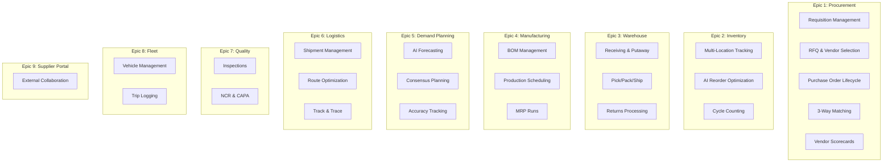

# ERP-SCM User Stories

## 1. Overview

This document captures user stories organized by epic and domain. Stories follow the standard format: "As a [persona], I want to [action], so that [benefit]." Acceptance criteria are included for each story.

---

## 2. Epic Map

---

## 3. User Stories

### Epic 1: Procurement

**SCM-US-001**: As a procurement manager, I want to create purchase requisitions with multi-level approval workflows, so that all material requests are properly authorized before spending.

*Acceptance Criteria*:
- Requisition form includes product, quantity, estimated cost, justification, needed-by date
- System auto-routes to approver based on dollar threshold ($5K, $25K, $100K+)
- Approver can approve, reject, or send back for revision
- Email notification sent on each status change
- Requisition audit trail shows all approvals and timestamps

**SCM-US-002**: As a procurement manager, I want to create RFQs and invite multiple suppliers to bid, so that I can ensure competitive pricing and optimal vendor selection.

*Acceptance Criteria*:
- RFQ can be created from approved requisition or manually
- Minimum 3 suppliers can be invited
- Suppliers receive notifications with RFQ details
- Bidding deadline enforced; late submissions rejected
- All bids visible in comparison view after deadline

**SCM-US-003**: As a procurement manager, I want the AI to score and rank vendor bids automatically, so that I can make data-driven sourcing decisions quickly.

*Acceptance Criteria*:
- AI scoring considers price (40%), quality history (25%), delivery track record (20%), and terms (15%)
- Scores displayed with breakdown per factor
- Manager can override AI recommendation with documented justification
- Winning bid auto-converts to PO upon approval

**SCM-US-004**: As an accounts payable clerk, I want 3-way matching to automatically compare PO, receipt, and invoice, so that payment accuracy is ensured and discrepancies are flagged.

*Acceptance Criteria*:
- System auto-matches within 2% tolerance
- Matched invoices auto-approved for payment
- Mismatches generate exception reports with variance details
- Partial receipts supported with pro-rated matching

**SCM-US-005**: As a procurement manager, I want vendor scorecards updated monthly with AI risk scoring, so that I can proactively manage supplier performance.

*Acceptance Criteria*:
- Scorecards calculated automatically on the 1st of each month
- Scores cover: delivery (30%), quality (25%), price (20%), financial stability (15%), communication (10%)
- Risk level classification: low, moderate, elevated, high, critical
- Trend indicator shows improving/stable/declining
- High/critical suppliers trigger action item creation

---

### Epic 2: Inventory

**SCM-US-006**: As a warehouse manager, I want to view inventory across all locations in real-time, so that I can make informed allocation decisions.

*Acceptance Criteria*:
- Dashboard shows per-warehouse stock levels, reserved quantities, available quantities
- Drill-down from warehouse to zone to bin level
- Color-coded indicators: red (below reorder), yellow (approaching reorder), green (healthy)
- Export to CSV/Excel supported

**SCM-US-007**: As a demand planner, I want the AI to automatically calculate optimal reorder points and EOQ, so that I minimize both stockouts and carrying costs.

*Acceptance Criteria*:
- AI considers: historical demand, lead time, demand variability, service level target (95%)
- Safety stock calculated using statistical formula (Z * sigma * sqrt(lead_time))
- EOQ calculated using Wilson formula
- Current vs. AI-recommended reorder points shown side-by-side
- One-click apply to update inventory parameters

**SCM-US-008**: As a warehouse manager, I want to perform cycle counts with barcode scanning, so that inventory accuracy stays above 99%.

*Acceptance Criteria*:
- Cycle count schedule based on ABC classification (A items: monthly, B: quarterly, C: annually)
- Mobile scanning interface for count entry
- System calculates variance and flags items exceeding 5% threshold
- Recount workflow for flagged items
- Auto-adjustment posting upon manager approval

---

### Epic 3: Warehouse

**SCM-US-009**: As a receiving clerk, I want to scan incoming goods against the PO and receive them into the system, so that inventory is updated immediately upon arrival.

*Acceptance Criteria*:
- PO lookup by barcode scan or number entry
- Line-by-line receiving: expected vs. actual quantity
- Damage recording with photo upload capability
- Automatic quality inspection trigger if quality plan exists
- Putaway suggestions generated within 30 seconds of receipt

**SCM-US-010**: As a warehouse manager, I want to create pick waves using different strategies (wave, batch, zone), so that picking efficiency is maximized.

*Acceptance Criteria*:
- Strategy selection UI with efficiency comparison
- Wave picking: group by time window
- Batch picking: group by shipping zone or carrier
- Zone picking: split across warehouse zones with consolidation point
- Pick path optimization within each strategy
- Estimated completion time shown before wave creation

**SCM-US-011**: As a warehouse operator, I want guided packing instructions with auto-generated shipping labels, so that orders are packed correctly and shipped quickly.

*Acceptance Criteria*:
- Pack station displays order contents, box recommendations
- Weight and dimension recording
- Carrier auto-selection based on service requirements and rates
- Shipping label generated and printed from the system
- Tracking number created and linked to order

---

### Epic 4: Manufacturing

**SCM-US-012**: As a production planner, I want to manage multi-level BOMs with versioning, so that product structures are accurately maintained.

*Acceptance Criteria*:
- Multi-level BOM creation with parent-child hierarchy
- Version control with effective date ranges
- Phantom (sub-assembly) component support
- BOM comparison between versions (diff view)
- Circular reference detection and prevention
- Multi-level explosion showing all raw materials

**SCM-US-013**: As a production planner, I want a Gantt chart scheduler for production orders, so that I can visually plan and adjust the production schedule.

*Acceptance Criteria*:
- Gantt view with work centers on Y-axis, time on X-axis
- Drag-and-drop rescheduling of work orders
- Color coding by production order status
- Capacity utilization bars per work center
- Constraint checking (no double-booking, material availability)
- Forward and backward scheduling options

**SCM-US-014**: As a production planner, I want to run MRP to automatically generate purchase and production orders, so that materials are available when needed.

*Acceptance Criteria*:
- MRP considers: demand forecast, open orders, current stock, safety stock, lead times
- Net requirements calculated per item per period
- Planned orders generated with recommended dates and quantities
- Planner can convert planned orders to firm orders
- MRP run completes within 60 seconds for 10K SKUs

---

### Epic 5: Demand Planning

**SCM-US-015**: As a demand planner, I want the AI to generate demand forecasts using multiple ML models, so that I have accurate predictions for planning.

*Acceptance Criteria*:
- Ensemble forecast using Exponential Smoothing (40%) + Random Forest (60%)
- 30-day forecast horizon with daily granularity
- 95% confidence intervals (upper/lower bounds)
- Confidence score per forecast point
- Model selection fallback (baseline when insufficient data)

**SCM-US-016**: As a demand planner, I want to conduct consensus planning with sales and marketing inputs, so that the final demand plan reflects all business intelligence.

*Acceptance Criteria*:
- Workflow: statistical forecast -> sales overlay -> marketing overlay -> finance review -> approval
- Each participant can adjust quantities with comments
- Side-by-side comparison of all inputs
- Final consensus numbers published as demand signal for MRP
- Approval by VP Supply Chain required

**SCM-US-017**: As a demand planner, I want to track forecast accuracy with MAPE, MAD, and Bias metrics, so that I can continuously improve forecast quality.

*Acceptance Criteria*:
- Accuracy calculated automatically when actual data becomes available
- MAPE, MAD, and Bias per product, per period, per model
- Trend chart showing accuracy improvement over time
- Products with MAPE > 25% flagged for model review
- Dashboard with sortable accuracy rankings

---

### Epic 6: Logistics

**SCM-US-018**: As a logistics coordinator, I want to manage carriers with rate tables, so that I can select the most cost-effective shipping option.

*Acceptance Criteria*:
- Carrier profiles with service levels, transit times, and coverage areas
- Rate tables by weight, zone, and service level
- Rate comparison across carriers for a given shipment
- API integration for real-time rate queries (UPS, FedEx, DHL)

**SCM-US-019**: As a logistics coordinator, I want AI-optimized delivery routes, so that transportation costs and delivery times are minimized.

*Acceptance Criteria*:
- Route optimization for up to 50 stops per vehicle
- Distance reduction of 15-25% vs. unoptimized routes
- Estimated time and distance shown before and after optimization
- Multi-vehicle routing (VRP) for fleet dispatch scenarios
- Route visualization on map

**SCM-US-020**: As a customer, I want to track my shipment in real-time on a map, so that I know exactly when to expect delivery.

*Acceptance Criteria*:
- Map view with current shipment location
- Status timeline: ordered -> shipped -> in transit -> out for delivery -> delivered
- Estimated delivery time updates as shipment progresses
- Email/SMS notifications on status changes
- Proof of delivery capture (signature, photo)

---

### Epic 7: Quality

**SCM-US-021**: As a quality manager, I want to create inspection plans with AQL sampling, so that incoming and in-process quality is systematically controlled.

*Acceptance Criteria*:
- Quality plan templates for incoming, in-process, and final inspection
- AQL sampling tables (ANSI/ASQ Z1.4) integrated
- Inspection criteria: characteristic, measurement type, target, tolerances
- Auto-trigger inspections on goods receipt or production completion
- Pass/fail disposition with lot status update

**SCM-US-022**: As a quality manager, I want to track NCRs through CAPA resolution, so that quality issues are systematically corrected and prevented.

*Acceptance Criteria*:
- NCR creation with severity, description, affected products/quantities
- Root cause analysis fields (5-Why, Ishikawa)
- CAPA creation from NCR: corrective actions + preventive actions
- CAPA tracking with owner, due date, status
- Effectiveness verification step before closure
- Dashboard showing open NCRs, CAPA aging, resolution rates

---

### Epic 8: Fleet

**SCM-US-023**: As a fleet manager, I want to schedule preventive maintenance and track vehicle TCO, so that fleet availability is maximized and costs are controlled.

*Acceptance Criteria*:
- Maintenance schedules: time-based (every 90 days) and mileage-based (every 15,000 km)
- Automated alerts 14 days before due
- Maintenance history per vehicle with costs
- TCO dashboard: acquisition, fuel, maintenance, insurance, depreciation
- Vehicle utilization rates

**SCM-US-024**: As a fleet manager, I want to log trips with GPS tracking and driver behavior monitoring, so that fleet operations are safe and efficient.

*Acceptance Criteria*:
- Trip creation with vehicle, driver, route assignment
- GPS tracking at 30-second intervals
- Driver behavior scoring: speeding, harsh braking, idle time, seat belt
- Trip summary: distance, duration, fuel consumption
- Fuel efficiency trends per vehicle and driver

---

### Epic 9: Supplier Portal

**SCM-US-025**: As a supplier, I want to acknowledge POs, submit ASNs, and track payment status through a self-service portal, so that I can collaborate efficiently without phone/email.

*Acceptance Criteria*:
- Supplier login with role-based access
- PO list with acknowledge/reject actions
- ASN submission with line items, expected delivery date, carrier info
- Invoice submission with PO reference
- Payment status visibility: pending, approved, scheduled, paid
- Document upload for certifications and COI
