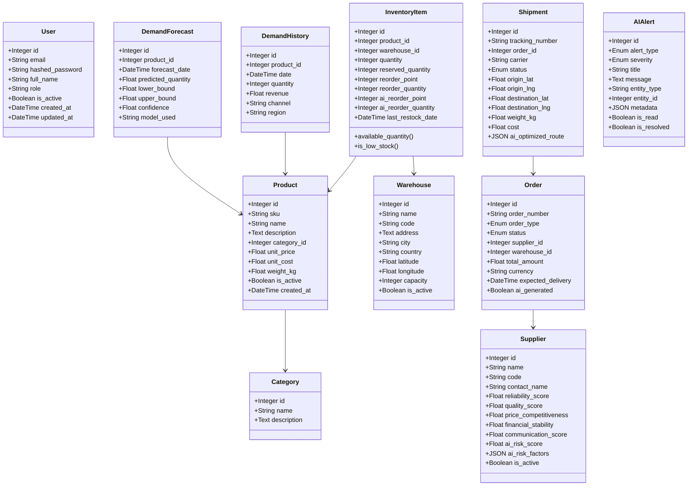

# ERP-SCM Data Model Specification

## 1. Overview

This document specifies the complete data model for ERP-SCM, including all tables, columns, data types, constraints, relationships, and migration strategies. The model is implemented using SQLAlchemy 2.0 ORM with PostgreSQL 16 as the target database.

---

## 2. Core Design Principles

1. **UUID Primary Keys**: All entities use UUID v4 primary keys for global uniqueness across tenants and services
2. **Soft Deletes**: All business entities use `is_deleted` flag instead of hard DELETE
3. **Audit Columns**: Every table includes `created_at`, `updated_at`, `created_by`, `updated_by`
4. **Multi-Tenancy**: Every table includes `tenant_id` with mandatory index
5. **Optimistic Locking**: High-contention tables (inventory) include a `version` column
6. **JSONB for Flexibility**: Semi-structured data stored in JSONB columns (metadata, parameters, configurations)

---

## 3. Current Implementation (SQLAlchemy Models)

The existing implementation in `/backend/app/models/models.py` defines the following core entities:



---

## 4. Extended Data Model (Full Enterprise)

### 4.1 Procurement Domain

```sql
-- Purchase Requisitions
CREATE TABLE purchase_requisitions (
    id UUID PRIMARY KEY DEFAULT gen_random_uuid(),
    tenant_id UUID NOT NULL,
    req_number VARCHAR(50) NOT NULL UNIQUE,
    requester_id UUID NOT NULL REFERENCES users(id),
    status VARCHAR(20) NOT NULL DEFAULT 'draft',
    priority VARCHAR(20) NOT NULL DEFAULT 'medium',
    justification TEXT,
    total_estimated DECIMAL(15,2) DEFAULT 0,
    needed_by TIMESTAMP,
    approved_at TIMESTAMP,
    approved_by UUID REFERENCES users(id),
    created_at TIMESTAMP NOT NULL DEFAULT NOW(),
    updated_at TIMESTAMP NOT NULL DEFAULT NOW(),
    is_deleted BOOLEAN DEFAULT FALSE,
    CONSTRAINT chk_req_status CHECK (status IN ('draft','submitted','approved','rejected','converted')),
    CONSTRAINT chk_req_priority CHECK (priority IN ('low','medium','high','urgent'))
);

CREATE INDEX ix_requisitions_tenant_status ON purchase_requisitions(tenant_id, status) WHERE NOT is_deleted;

-- RFQ Events
CREATE TABLE rfq_events (
    id UUID PRIMARY KEY DEFAULT gen_random_uuid(),
    tenant_id UUID NOT NULL,
    rfq_number VARCHAR(50) NOT NULL UNIQUE,
    requisition_id UUID REFERENCES purchase_requisitions(id),
    title VARCHAR(255) NOT NULL,
    description TEXT,
    status VARCHAR(20) NOT NULL DEFAULT 'draft',
    submission_deadline TIMESTAMP,
    decision_date TIMESTAMP,
    created_by UUID NOT NULL REFERENCES users(id),
    created_at TIMESTAMP NOT NULL DEFAULT NOW(),
    updated_at TIMESTAMP NOT NULL DEFAULT NOW(),
    is_deleted BOOLEAN DEFAULT FALSE
);

-- Contracts
CREATE TABLE contracts (
    id UUID PRIMARY KEY DEFAULT gen_random_uuid(),
    tenant_id UUID NOT NULL,
    supplier_id UUID NOT NULL REFERENCES suppliers(id),
    contract_number VARCHAR(50) NOT NULL UNIQUE,
    contract_type VARCHAR(50) NOT NULL,
    start_date DATE NOT NULL,
    end_date DATE NOT NULL,
    total_value DECIMAL(15,2),
    status VARCHAR(20) NOT NULL DEFAULT 'draft',
    terms JSONB,
    renewal_alert_date DATE,
    created_at TIMESTAMP NOT NULL DEFAULT NOW(),
    is_deleted BOOLEAN DEFAULT FALSE
);

-- 3-Way Match
CREATE TABLE three_way_matches (
    id UUID PRIMARY KEY DEFAULT gen_random_uuid(),
    tenant_id UUID NOT NULL,
    po_id UUID NOT NULL REFERENCES orders(id),
    receipt_id UUID NOT NULL,
    invoice_id UUID NOT NULL,
    match_status VARCHAR(20) NOT NULL DEFAULT 'pending',
    po_amount DECIMAL(15,2) NOT NULL,
    receipt_amount DECIMAL(15,2) NOT NULL,
    invoice_amount DECIMAL(15,2) NOT NULL,
    variance DECIMAL(15,2),
    matched_at TIMESTAMP,
    matched_by UUID REFERENCES users(id),
    CONSTRAINT chk_match_status CHECK (match_status IN ('pending','matched','exception','approved'))
);
```

### 4.2 Warehouse Domain

```sql
-- Zones
CREATE TABLE zones (
    id UUID PRIMARY KEY DEFAULT gen_random_uuid(),
    warehouse_id UUID NOT NULL REFERENCES warehouses(id),
    name VARCHAR(100) NOT NULL,
    zone_type VARCHAR(50) NOT NULL,
    temperature_min DECIMAL(5,1),
    temperature_max DECIMAL(5,1),
    is_hazmat BOOLEAN DEFAULT FALSE,
    is_active BOOLEAN DEFAULT TRUE
);

-- Bins
CREATE TABLE bins (
    id UUID PRIMARY KEY DEFAULT gen_random_uuid(),
    aisle_id UUID NOT NULL REFERENCES aisles(id),
    code VARCHAR(50) NOT NULL,
    bin_type VARCHAR(50) NOT NULL DEFAULT 'standard',
    max_weight_kg DECIMAL(10,2),
    max_volume_m3 DECIMAL(10,3),
    is_occupied BOOLEAN DEFAULT FALSE,
    current_product_id UUID REFERENCES products(id),
    current_quantity INTEGER DEFAULT 0,
    UNIQUE(aisle_id, code)
);

-- Pick Waves
CREATE TABLE pick_waves (
    id UUID PRIMARY KEY DEFAULT gen_random_uuid(),
    tenant_id UUID NOT NULL,
    warehouse_id UUID NOT NULL REFERENCES warehouses(id),
    strategy VARCHAR(20) NOT NULL DEFAULT 'wave',
    status VARCHAR(20) NOT NULL DEFAULT 'planned',
    order_count INTEGER DEFAULT 0,
    task_count INTEGER DEFAULT 0,
    created_at TIMESTAMP NOT NULL DEFAULT NOW(),
    started_at TIMESTAMP,
    completed_at TIMESTAMP,
    CONSTRAINT chk_pick_strategy CHECK (strategy IN ('wave','batch','zone','cluster'))
);
```

### 4.3 Manufacturing Domain

```sql
-- Bills of Material
CREATE TABLE boms (
    id UUID PRIMARY KEY DEFAULT gen_random_uuid(),
    tenant_id UUID NOT NULL,
    product_id UUID NOT NULL REFERENCES products(id),
    bom_number VARCHAR(50) NOT NULL UNIQUE,
    version INTEGER NOT NULL DEFAULT 1,
    status VARCHAR(20) NOT NULL DEFAULT 'draft',
    yield_percentage DECIMAL(5,2) DEFAULT 100.00,
    effective_from DATE,
    effective_to DATE,
    created_at TIMESTAMP NOT NULL DEFAULT NOW(),
    is_deleted BOOLEAN DEFAULT FALSE
);

-- BOM Lines
CREATE TABLE bom_lines (
    id UUID PRIMARY KEY DEFAULT gen_random_uuid(),
    bom_id UUID NOT NULL REFERENCES boms(id) ON DELETE CASCADE,
    component_product_id UUID NOT NULL REFERENCES products(id),
    quantity_per DECIMAL(10,4) NOT NULL,
    uom VARCHAR(20) NOT NULL DEFAULT 'EA',
    sequence INTEGER NOT NULL DEFAULT 0,
    is_phantom BOOLEAN DEFAULT FALSE,
    scrap_percentage DECIMAL(5,2) DEFAULT 0
);

-- Production Orders
CREATE TABLE production_orders (
    id UUID PRIMARY KEY DEFAULT gen_random_uuid(),
    tenant_id UUID NOT NULL,
    po_number VARCHAR(50) NOT NULL UNIQUE,
    bom_id UUID NOT NULL REFERENCES boms(id),
    routing_id UUID REFERENCES routings(id),
    production_type VARCHAR(20) NOT NULL DEFAULT 'discrete',
    status VARCHAR(20) NOT NULL DEFAULT 'planned',
    planned_quantity INTEGER NOT NULL,
    completed_quantity INTEGER DEFAULT 0,
    scrapped_quantity INTEGER DEFAULT 0,
    planned_start TIMESTAMP,
    planned_end TIMESTAMP,
    actual_start TIMESTAMP,
    actual_end TIMESTAMP,
    total_cost DECIMAL(15,2) DEFAULT 0,
    created_at TIMESTAMP NOT NULL DEFAULT NOW(),
    CONSTRAINT chk_prod_type CHECK (production_type IN ('discrete','process','repetitive')),
    CONSTRAINT chk_prod_status CHECK (status IN ('planned','released','in_progress','completed','cancelled'))
);
```

### 4.4 Quality Domain

```sql
-- Quality Plans
CREATE TABLE quality_plans (
    id UUID PRIMARY KEY DEFAULT gen_random_uuid(),
    tenant_id UUID NOT NULL,
    plan_name VARCHAR(255) NOT NULL,
    product_id UUID REFERENCES products(id),
    inspection_type VARCHAR(20) NOT NULL,
    sampling_method VARCHAR(50) NOT NULL DEFAULT 'AQL',
    aql_level DECIMAL(5,2),
    inspection_criteria JSONB NOT NULL DEFAULT '[]',
    is_active BOOLEAN DEFAULT TRUE,
    CONSTRAINT chk_insp_type CHECK (inspection_type IN ('incoming','in_process','final'))
);

-- NCRs
CREATE TABLE ncrs (
    id UUID PRIMARY KEY DEFAULT gen_random_uuid(),
    tenant_id UUID NOT NULL,
    ncr_number VARCHAR(50) NOT NULL UNIQUE,
    inspection_id UUID REFERENCES inspections(id),
    severity VARCHAR(20) NOT NULL,
    description TEXT NOT NULL,
    root_cause TEXT,
    disposition VARCHAR(20),
    status VARCHAR(20) NOT NULL DEFAULT 'open',
    assigned_to UUID REFERENCES users(id),
    created_at TIMESTAMP NOT NULL DEFAULT NOW(),
    closed_at TIMESTAMP,
    CONSTRAINT chk_ncr_severity CHECK (severity IN ('critical','major','minor'))
);

-- CAPAs
CREATE TABLE capas (
    id UUID PRIMARY KEY DEFAULT gen_random_uuid(),
    tenant_id UUID NOT NULL,
    capa_number VARCHAR(50) NOT NULL UNIQUE,
    ncr_id UUID NOT NULL REFERENCES ncrs(id),
    capa_type VARCHAR(20) NOT NULL,
    corrective_action TEXT NOT NULL,
    preventive_action TEXT,
    status VARCHAR(20) NOT NULL DEFAULT 'open',
    due_date DATE NOT NULL,
    completed_date DATE,
    owner_id UUID NOT NULL REFERENCES users(id),
    CONSTRAINT chk_capa_type CHECK (capa_type IN ('corrective','preventive','both'))
);
```

### 4.5 Fleet Domain

```sql
-- Vehicles
CREATE TABLE vehicles (
    id UUID PRIMARY KEY DEFAULT gen_random_uuid(),
    tenant_id UUID NOT NULL,
    registration_number VARCHAR(20) NOT NULL UNIQUE,
    vin VARCHAR(17),
    make VARCHAR(50) NOT NULL,
    model VARCHAR(50) NOT NULL,
    year INTEGER NOT NULL,
    vehicle_type VARCHAR(50) NOT NULL,
    capacity_kg DECIMAL(10,2),
    capacity_m3 DECIMAL(10,2),
    odometer_km DECIMAL(12,1) DEFAULT 0,
    status VARCHAR(20) NOT NULL DEFAULT 'active',
    next_service_date DATE,
    insurance_expiry DATE,
    registration_expiry DATE,
    created_at TIMESTAMP NOT NULL DEFAULT NOW()
);

-- Trips
CREATE TABLE trips (
    id UUID PRIMARY KEY DEFAULT gen_random_uuid(),
    tenant_id UUID NOT NULL,
    vehicle_id UUID NOT NULL REFERENCES vehicles(id),
    driver_id UUID NOT NULL REFERENCES drivers(id),
    shipment_id UUID REFERENCES shipments(id),
    status VARCHAR(20) NOT NULL DEFAULT 'planned',
    planned_departure TIMESTAMP,
    actual_departure TIMESTAMP,
    planned_arrival TIMESTAMP,
    actual_arrival TIMESTAMP,
    distance_km DECIMAL(10,2),
    fuel_consumed_liters DECIMAL(8,2),
    route_waypoints JSONB,
    CONSTRAINT chk_trip_status CHECK (status IN ('planned','in_progress','completed','cancelled'))
);
```

---

## 5. Enum Reference

| Enum | Values |
|---|---|
| `OrderStatus` | draft, pending, confirmed, processing, shipped, delivered, cancelled |
| `OrderType` | purchase, sales |
| `ShipmentStatus` | pending, picked_up, in_transit, out_for_delivery, delivered, returned |
| `AlertSeverity` | low, medium, high, critical |
| `AlertType` | low_stock, demand_spike, supplier_risk, delivery_delay, anomaly, price_change, quality_issue |
| `ProductionType` | discrete, process, repetitive |
| `InspectionType` | incoming, in_process, final |
| `NCRSeverity` | critical, major, minor |
| `PickStrategy` | wave, batch, zone, cluster |

---

## 6. Migration Strategy

Migrations are managed using Alembic with the following conventions:

1. **Naming**: `{YYYY}_{MM}_{DD}_{HH}{MM}_{description}.py`
2. **Reversibility**: Every migration must have both `upgrade()` and `downgrade()`
3. **Data migrations**: Separate from schema migrations
4. **Zero-downtime**: Additive-only in production (add columns, never remove in the same release)
