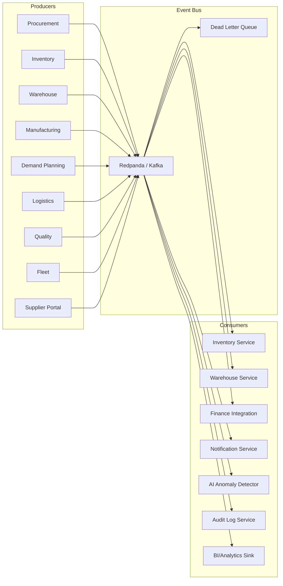

# ERP-SCM Event Catalog

## 1. Overview

ERP-SCM uses an event-driven architecture with Redpanda (Kafka-compatible) as the event backbone. All events follow the CloudEvents v1.0 specification and use the naming convention `erp.scm.<domain>.<entity>.<action>`.

---

## 2. Event Envelope

Every event published by ERP-SCM conforms to this CloudEvents envelope:

```json
{
  "specversion": "1.0",
  "id": "550e8400-e29b-41d4-a716-446655440000",
  "source": "erp-scm/procurement-service",
  "type": "erp.scm.procurement.po.created",
  "subject": "po-12345",
  "time": "2026-02-23T10:30:00Z",
  "datacontenttype": "application/json",
  "tenantid": "tenant-uuid-here",
  "correlationid": "corr-uuid-here",
  "data": {
    // domain-specific payload
  }
}
```

---

## 3. Event Flow Architecture



---

## 4. Complete Event Catalog

### 4.1 Procurement Events

| Event Type | Trigger | Key Payload Fields | Consumers |
|---|---|---|---|
| `erp.scm.procurement.requisition.created` | New requisition submitted | requisition_id, requester_id, total, items[] | Notification, Audit |
| `erp.scm.procurement.requisition.approved` | Requisition approved | requisition_id, approved_by, approved_at | Procurement (PO creation), Notification |
| `erp.scm.procurement.requisition.rejected` | Requisition rejected | requisition_id, rejected_by, reason | Notification |
| `erp.scm.procurement.rfq.created` | RFQ published | rfq_id, suppliers[], deadline | Supplier Portal, Notification |
| `erp.scm.procurement.rfq.response_received` | Supplier submits bid | rfq_id, supplier_id, total_price | Procurement |
| `erp.scm.procurement.rfq.awarded` | RFQ winner selected | rfq_id, winning_supplier_id | Procurement, Supplier Portal |
| `erp.scm.procurement.po.created` | Purchase order created | po_id, supplier_id, items[], total | Inventory (reserve), Warehouse (schedule receiving), Finance, Supplier Portal |
| `erp.scm.procurement.po.approved` | PO approved | po_id, approved_by | Supplier Portal, Logistics |
| `erp.scm.procurement.po.cancelled` | PO cancelled | po_id, reason | Inventory (release reserve), Supplier Portal |
| `erp.scm.procurement.match.completed` | 3-way match successful | po_id, receipt_id, invoice_id, amount | Finance (AP) |
| `erp.scm.procurement.match.exception` | 3-way match failed | po_id, variance, reason | Procurement, Finance |
| `erp.scm.procurement.contract.expiring` | Contract nearing expiry | contract_id, supplier_id, days_remaining | Procurement, Notification |

### 4.2 Inventory Events

| Event Type | Trigger | Key Payload Fields | Consumers |
|---|---|---|---|
| `erp.scm.inventory.stock.adjusted` | Stock level changed | inventory_item_id, product_id, warehouse_id, delta, reason, new_qty | AI Anomaly Detector, BI |
| `erp.scm.inventory.stock.reserved` | Stock reserved for order | inventory_item_id, order_id, quantity | Warehouse |
| `erp.scm.inventory.stock.released` | Stock reservation released | inventory_item_id, order_id, quantity | Warehouse |
| `erp.scm.inventory.low_stock` | Stock below reorder point | product_id, warehouse_id, current_qty, reorder_point | Procurement (auto-PO), Notification |
| `erp.scm.inventory.reorder.ai_updated` | AI updated reorder params | product_id, old_point, new_point, old_eoq, new_eoq | Audit |
| `erp.scm.inventory.cycle_count.completed` | Cycle count finished | count_id, warehouse_id, items_counted, variances | Audit, Finance |
| `erp.scm.inventory.valuation.updated` | Inventory valuation recalculated | warehouse_id, total_value, method | Finance, BI |

### 4.3 Warehouse Events

| Event Type | Trigger | Key Payload Fields | Consumers |
|---|---|---|---|
| `erp.scm.warehouse.goods.received` | Goods receipt completed | receipt_id, po_id, items[], warehouse_id | Inventory (adjust), Quality (inspect), Procurement (match) |
| `erp.scm.warehouse.putaway.completed` | Items stored in bins | receipt_id, bin_assignments[] | Inventory |
| `erp.scm.warehouse.pick_wave.created` | Pick wave initiated | wave_id, strategy, order_count, task_count | Notification |
| `erp.scm.warehouse.pick_wave.completed` | All picks done | wave_id, items_picked, accuracy | Packing |
| `erp.scm.warehouse.packed` | Order packed | order_id, box_count, total_weight | Logistics (label) |
| `erp.scm.warehouse.shipped` | Order shipped | order_id, shipment_id, tracking_number | Inventory (decrement), Logistics, Customer |
| `erp.scm.warehouse.return.received` | Return received | rma_id, items[], disposition | Inventory, Quality |

### 4.4 Manufacturing Events

| Event Type | Trigger | Key Payload Fields | Consumers |
|---|---|---|---|
| `erp.scm.manufacturing.production_order.created` | New production order | po_id, bom_id, quantity, planned_start | Inventory (reserve materials) |
| `erp.scm.manufacturing.production_order.released` | Released to shop floor | po_id, work_orders[] | MES, Notification |
| `erp.scm.manufacturing.operation.started` | Work order started | work_order_id, work_center_id, operator | MES |
| `erp.scm.manufacturing.operation.completed` | Work order completed | work_order_id, qty_completed, qty_scrapped | Inventory (WIP), Quality |
| `erp.scm.manufacturing.production_order.completed` | All operations done | po_id, total_completed, total_scrapped, actual_cost | Inventory (finished goods), Quality (final insp) |
| `erp.scm.manufacturing.mrp.completed` | MRP run finished | run_id, planned_pos[], planned_prod_orders[] | Procurement, Manufacturing |
| `erp.scm.manufacturing.bom.updated` | BOM version changed | bom_id, product_id, version | Manufacturing |

### 4.5 Demand Planning Events

| Event Type | Trigger | Key Payload Fields | Consumers |
|---|---|---|---|
| `erp.scm.demand_planning.forecast.generated` | AI forecast created | product_id, horizon, model, confidence | Inventory, MRP |
| `erp.scm.demand_planning.forecast.approved` | Planner approved forecast | product_id, period, approved_values | MRP |
| `erp.scm.demand_planning.consensus.finalized` | Consensus plan locked | plan_id, period, final_values | MRP, Finance |
| `erp.scm.demand_planning.accuracy.calculated` | Accuracy metrics computed | product_id, mape, mad, bias | BI, Notification |

### 4.6 Logistics Events

| Event Type | Trigger | Key Payload Fields | Consumers |
|---|---|---|---|
| `erp.scm.logistics.shipment.created` | Shipment record created | shipment_id, order_id, carrier, origin, destination | Fleet, Notification |
| `erp.scm.logistics.shipment.dispatched` | Shipment picked up | shipment_id, carrier, tracking_number | Inventory (in-transit), Customer |
| `erp.scm.logistics.shipment.in_transit` | Status update in transit | shipment_id, location, eta | Customer |
| `erp.scm.logistics.shipment.delivered` | Delivery confirmed | shipment_id, delivered_at, pod_url | Order (close), Customer |
| `erp.scm.logistics.shipment.delayed` | ETA exceeded | shipment_id, expected_at, new_eta, reason | Notification, AI Anomaly |
| `erp.scm.logistics.route.optimized` | Route optimization run | route_id, stops, distance_saved_km, time_saved_hrs | Fleet, BI |
| `erp.scm.logistics.freight_audit.exception` | Invoice audit mismatch | invoice_id, carrier, billed, audited, variance | Finance |

### 4.7 Quality Events

| Event Type | Trigger | Key Payload Fields | Consumers |
|---|---|---|---|
| `erp.scm.quality.inspection.completed` | Inspection finished | inspection_id, disposition, defects_found | Inventory, Procurement |
| `erp.scm.quality.inspection.failed` | Lot rejected | inspection_id, product_id, reject_reason | Procurement (vendor), NCR |
| `erp.scm.quality.ncr.created` | NCR opened | ncr_id, severity, description | Notification, Quality |
| `erp.scm.quality.ncr.closed` | NCR resolved | ncr_id, resolution, closed_at | Quality, BI |
| `erp.scm.quality.capa.created` | CAPA initiated | capa_id, ncr_id, due_date, owner | Notification |
| `erp.scm.quality.capa.overdue` | CAPA past due date | capa_id, due_date, days_overdue | Notification, Quality |
| `erp.scm.quality.spc.out_of_control` | SPC point outside limits | product_id, characteristic, value, ucl, lcl | Notification, Quality |

### 4.8 Fleet Events

| Event Type | Trigger | Key Payload Fields | Consumers |
|---|---|---|---|
| `erp.scm.fleet.trip.started` | Trip begins | trip_id, vehicle_id, driver_id | Logistics |
| `erp.scm.fleet.trip.completed` | Trip ends | trip_id, distance_km, fuel_consumed | BI, Fleet |
| `erp.scm.fleet.maintenance.due` | Service threshold reached | vehicle_id, maintenance_type, due_date | Notification, Fleet |
| `erp.scm.fleet.maintenance.completed` | Service done | vehicle_id, maintenance_id, cost | Fleet, BI |
| `erp.scm.fleet.driver.alert` | Driver behavior event | driver_id, alert_type, severity, location | Fleet, Notification |
| `erp.scm.fleet.vehicle.location_update` | GPS update | vehicle_id, lat, lng, speed, heading | Logistics (track) |

### 4.9 Supplier Portal Events

| Event Type | Trigger | Key Payload Fields | Consumers |
|---|---|---|---|
| `erp.scm.supplier_portal.po.acknowledged` | Supplier acks PO | po_id, supplier_id, confirmed_delivery | Procurement |
| `erp.scm.supplier_portal.asn.submitted` | ASN submitted | asn_id, po_id, expected_delivery, items[] | Warehouse (schedule receiving) |
| `erp.scm.supplier_portal.invoice.submitted` | Invoice submitted | invoice_id, po_id, amount | Procurement (3-way match) |

---

## 5. Topic Configuration

| Topic | Partitions | Retention | Replication |
|---|---|---|---|
| `erp.scm.procurement` | 12 | 30 days | 3 |
| `erp.scm.inventory` | 24 | 14 days | 3 |
| `erp.scm.warehouse` | 12 | 14 days | 3 |
| `erp.scm.manufacturing` | 6 | 30 days | 3 |
| `erp.scm.demand-planning` | 6 | 90 days | 3 |
| `erp.scm.logistics` | 12 | 30 days | 3 |
| `erp.scm.quality` | 6 | 90 days | 3 |
| `erp.scm.fleet` | 12 | 14 days | 3 |
| `erp.scm.supplier-portal` | 6 | 30 days | 3 |
| `erp.scm.dlq` | 3 | 90 days | 3 |

---

## 6. Consumer Groups

| Group ID | Services | Topics Consumed |
|---|---|---|
| `scm-inventory-consumers` | inventory-service | procurement, warehouse, manufacturing |
| `scm-warehouse-consumers` | warehouse-service | procurement, inventory, supplier-portal |
| `scm-procurement-consumers` | procurement-service | warehouse, quality, supplier-portal |
| `scm-notification-consumers` | notification-service | All topics |
| `scm-audit-consumers` | audit-service | All topics |
| `scm-ai-consumers` | AI anomaly detector | inventory, demand-planning, logistics |
| `scm-bi-consumers` | BI/Analytics sink | All topics |
