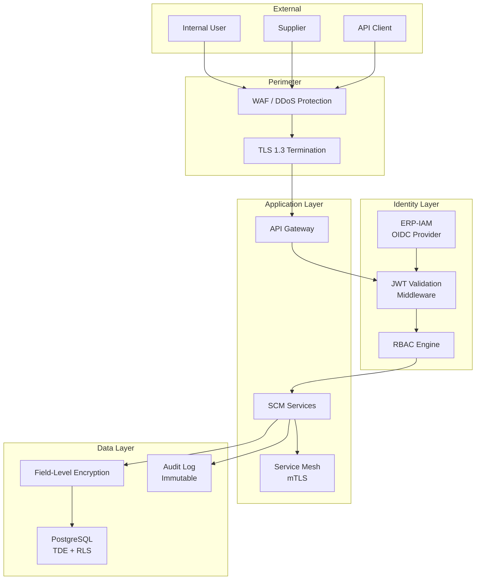
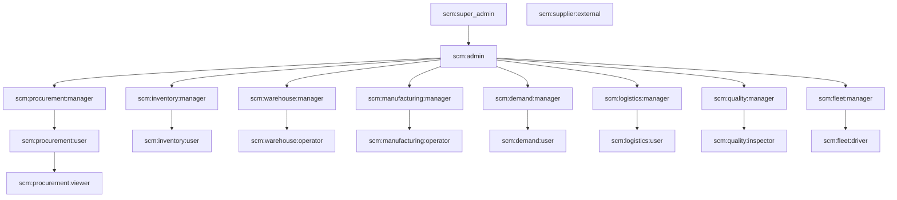

# ERP-SCM Security Architecture

## 1. Overview

ERP-SCM implements defense-in-depth security across all layers -- authentication, authorization, data protection, network security, and audit logging. The security model integrates with ERP-IAM for identity federation while maintaining service-level access controls.

---

## 2. Security Architecture



---

## 3. Authentication

### 3.1 User Authentication

- **Protocol**: OpenID Connect (OIDC) via ERP-IAM
- **Token Format**: JWT (JSON Web Tokens) with RS256 signing
- **Token Lifetime**: Access token 24 hours (configurable via `ACCESS_TOKEN_EXPIRE_MINUTES`)
- **Refresh**: Sliding window refresh tokens (7-day lifetime)

### 3.2 JWT Claims

```json
{
  "sub": "user-uuid",
  "email": "user@company.com",
  "tenant_id": "tenant-uuid",
  "roles": ["scm:procurement:manager", "scm:inventory:user"],
  "permissions": ["procurement.po.create", "procurement.po.approve"],
  "iat": 1708704000,
  "exp": 1708790400,
  "iss": "erp-iam"
}
```

### 3.3 Service-to-Service Authentication

- **mTLS**: Short-lived X.509 certificates (24-hour rotation)
- **Service Tokens**: Machine-to-machine OAuth2 client credentials flow
- **Internal header**: `X-Service-Name` for service identification within the mesh

### 3.4 Supplier Portal Authentication

- Separate identity namespace for external users
- Email-based registration with admin approval
- MFA enforced for supplier users (TOTP)
- Session timeout: 30 minutes of inactivity

---

## 4. Authorization (RBAC)

### 4.1 Role Hierarchy



### 4.2 Permission Matrix

| Permission | Admin | Proc Mgr | Proc User | WMS Mgr | WMS Op | MFG Mgr | Supplier |
|---|---|---|---|---|---|---|---|
| `procurement.requisition.create` | Y | Y | Y | - | - | - | - |
| `procurement.po.approve` | Y | Y | - | - | - | - | - |
| `procurement.po.create` | Y | Y | Y | - | - | - | - |
| `inventory.stock.adjust` | Y | - | - | Y | Y | - | - |
| `warehouse.pick.execute` | Y | - | - | Y | Y | - | - |
| `manufacturing.bom.create` | Y | - | - | - | - | Y | - |
| `manufacturing.mrp.run` | Y | - | - | - | - | Y | - |
| `quality.inspection.record` | Y | - | - | - | - | - | - |
| `supplier_portal.po.acknowledge` | - | - | - | - | - | - | Y |
| `supplier_portal.asn.submit` | - | - | - | - | - | - | Y |
| `ai.forecast.generate` | Y | - | - | - | - | - | - |
| `admin.settings.modify` | Y | - | - | - | - | - | - |

### 4.3 Row-Level Security

PostgreSQL RLS policies ensure tenant data isolation:

```sql
ALTER TABLE products ENABLE ROW LEVEL SECURITY;

CREATE POLICY tenant_isolation ON products
    USING (tenant_id = current_setting('app.current_tenant')::uuid);
```

---

## 5. Data Protection

### 5.1 Encryption at Rest

| Layer | Method |
|---|---|
| Database | PostgreSQL TDE (Transparent Data Encryption) with AES-256 |
| Object Storage | S3 server-side encryption (AES-256) |
| Backups | Encrypted with separate key |

### 5.2 Encryption in Transit

| Layer | Method |
|---|---|
| External traffic | TLS 1.3 (minimum TLS 1.2) |
| Internal service mesh | mTLS with auto-rotated certificates |
| Database connections | SSL required |

### 5.3 Field-Level Encryption

Sensitive fields encrypted at the application layer before database storage:

| Table | Field | Reason |
|---|---|---|
| `suppliers` | `contact_name`, `email`, `phone` | PII |
| `drivers` | `license_number`, `phone` | PII |
| `portal_users` | `email`, `full_name` | External PII |
| `contracts` | `terms` (financial data) | Business sensitive |

### 5.4 Secret Management

- Application secrets stored in HashiCorp Vault or AWS Secrets Manager
- Database credentials rotated every 90 days
- API keys for carrier integrations stored encrypted, never in code
- `.env` files excluded from version control via `.gitignore`

---

## 6. API Security

### 6.1 Rate Limiting

| Endpoint Category | Rate Limit |
|---|---|
| Authentication | 10 requests/minute per IP |
| Standard API | 1000 requests/minute per tenant |
| AI/ML endpoints | 100 requests/minute per tenant |
| Bulk operations | 10 requests/minute per tenant |
| Supplier portal | 500 requests/minute per supplier |

### 6.2 Input Validation

- All inputs validated via Pydantic schemas (strict mode)
- SQL injection prevention via SQLAlchemy parameterized queries
- XSS prevention via React's default escaping + CSP headers
- File upload validation: type, size (max 10MB), virus scan

### 6.3 CORS Configuration

```python
CORS_ORIGINS = [
    "https://scm.company.com",
    "https://portal.company.com",
    # Development only:
    "http://localhost:5173",
    "http://localhost:3000",
]
```

---

## 7. Audit Logging

### 7.1 Audit Event Structure

Every write operation generates an immutable audit record:

```json
{
  "id": "audit-uuid",
  "timestamp": "2026-02-23T10:30:00Z",
  "actor_id": "user-uuid",
  "actor_email": "user@company.com",
  "tenant_id": "tenant-uuid",
  "action": "procurement.po.approved",
  "resource_type": "purchase_order",
  "resource_id": "po-uuid",
  "changes": {
    "status": {"from": "pending", "to": "approved"}
  },
  "ip_address": "192.168.1.100",
  "user_agent": "Mozilla/5.0...",
  "correlation_id": "corr-uuid"
}
```

### 7.2 Retention

- Audit logs retained for 7 years (regulatory compliance)
- Stored in append-only table with no UPDATE/DELETE permissions
- Archived to cold storage after 1 year

---

## 8. Compliance

| Standard | Applicability | Status |
|---|---|---|
| **SOC 2 Type II** | All services | Planned |
| **ISO 27001** | Information security | Planned |
| **GDPR** | PII handling, data residency | Implemented (encryption, consent, right to erasure) |
| **ISO 9001** | Quality management module | Supported via QMS features |
| **DOT/FMCSA** | Fleet management (US) | Supported via compliance tracking |
| **DVLA** | Fleet management (UK) | Supported via compliance tracking |

---

## 9. Vulnerability Management

- Dependency scanning: Dependabot + Snyk on every PR
- Container scanning: Trivy on Docker images
- SAST: Bandit (Python), ESLint security plugin (TypeScript)
- Penetration testing: Annual third-party assessment
- Bug bounty program for external researchers
