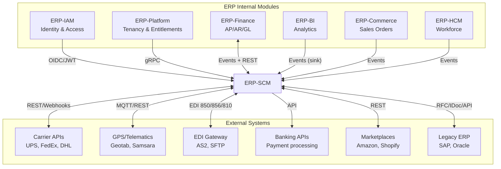
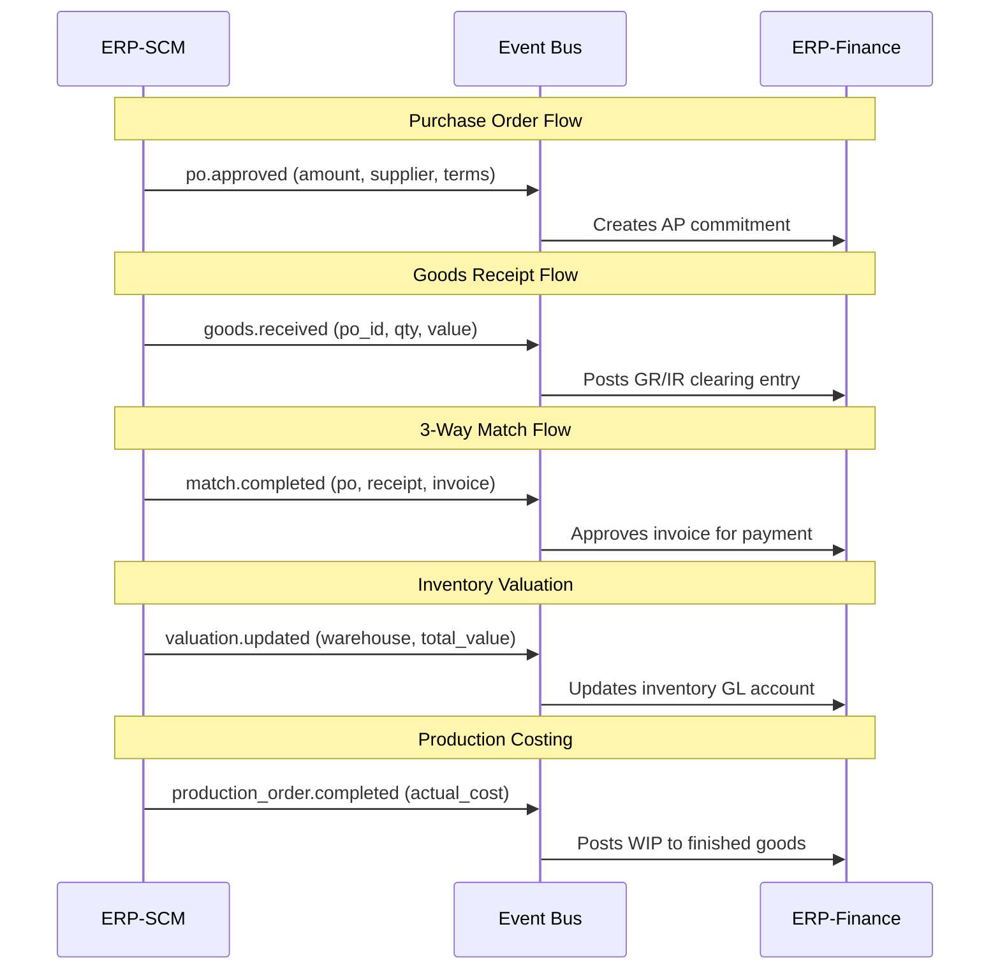
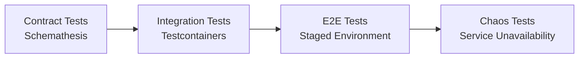

# ERP-SCM Integration Guide

## 1. Overview

ERP-SCM integrates with both internal ERP modules and external third-party systems. This document details all integration points, protocols, data formats, and configuration requirements.

---

## 2. Integration Architecture



---

## 3. Internal ERP Module Integrations

### 3.1 ERP-IAM Integration

| Aspect | Detail |
|---|---|
| **Protocol** | OIDC + JWT |
| **Direction** | SCM consumes IAM tokens |
| **Authentication** | JWT validation using IAM's public keys (JWKS endpoint) |
| **User sync** | User profiles synced via `erp.iam.user.created/updated` events |
| **Role mapping** | IAM roles mapped to SCM permissions at service level |

**Configuration**:
```yaml
iam:
  issuer: "https://iam.erp.company.com"
  jwks_uri: "https://iam.erp.company.com/.well-known/jwks.json"
  audience: "erp-scm"
  token_expiry_minutes: 1440
```

### 3.2 ERP-Platform Integration

| Aspect | Detail |
|---|---|
| **Protocol** | gRPC |
| **Direction** | SCM queries Platform for entitlements |
| **Functions** | Tenant validation, feature flag resolution, subscription tier checks |
| **Caching** | Entitlement results cached in Redis for 5 minutes |

### 3.3 ERP-Finance Integration

This is the most complex internal integration, handling the financial lifecycle of procurement and inventory:



**Key Integration Events**:

| SCM Event | Finance Action |
|---|---|
| `po.approved` | Create AP commitment (accrual) |
| `goods.received` | Post GR/IR clearing |
| `match.completed` | Release invoice for payment |
| `match.exception` | Create AP exception |
| `inventory.valuation.updated` | Update inventory GL |
| `production_order.completed` | Transfer WIP to FG account |
| `scrap.recorded` | Write-off to scrap expense |

### 3.4 ERP-Commerce Integration

| Event | Direction | Purpose |
|---|---|---|
| `erp.commerce.order.created` | Commerce -> SCM | New sales order triggers inventory reservation and fulfillment |
| `erp.scm.warehouse.shipped` | SCM -> Commerce | Tracking info pushed back to sales order |
| `erp.scm.inventory.stock.adjusted` | SCM -> Commerce | Available-to-promise (ATP) updates |

### 3.5 ERP-HCM Integration

| Event | Direction | Purpose |
|---|---|---|
| `erp.hcm.employee.created` | HCM -> SCM | New warehouse operators, drivers synced |
| `erp.hcm.employee.terminated` | HCM -> SCM | Access revocation, driver deactivation |
| SCM labor hours | SCM -> HCM | Warehouse labor hours for payroll |

---

## 4. External System Integrations

### 4.1 Carrier APIs

Supported carriers with real-time integration:

| Carrier | API Type | Capabilities |
|---|---|---|
| UPS | REST API v2 | Rate quotes, label generation, tracking, address validation |
| FedEx | REST API | Rating, shipping, tracking, pickup scheduling |
| DHL | REST API | Express, eCommerce, freight rates, tracking |
| USPS | Web Tools API | Domestic rates, tracking, address verification |

**Integration Pattern**:
```python
class CarrierAdapter:
    """Abstract carrier integration"""

    async def get_rates(self, origin, destination, weight, dimensions) -> List[Rate]:
        """Get shipping rate quotes"""

    async def create_shipment(self, shipment_details) -> ShipmentConfirmation:
        """Create shipment and get label"""

    async def track(self, tracking_number) -> List[TrackingEvent]:
        """Get tracking updates"""

    async def cancel(self, shipment_id) -> bool:
        """Cancel a shipment"""
```

### 4.2 GPS/Telematics

| Provider | Protocol | Data Points |
|---|---|---|
| Geotab | REST API + Data Feed | Position, speed, engine hours, diagnostics |
| Samsara | REST API + Webhooks | GPS, ELD, driver behavior, temperature |
| Generic | MQTT | lat, lng, speed, heading, timestamp |

**MQTT Topic Structure**:
```
fleet/{vehicle_id}/location  -> {lat, lng, speed, heading, timestamp}
fleet/{vehicle_id}/diagnostics -> {fuel_level, odometer, engine_temp}
fleet/{vehicle_id}/alerts -> {type, severity, description}
```

### 4.3 EDI Integration

| Transaction Set | Direction | Purpose |
|---|---|---|
| EDI 850 | Outbound | Purchase Order |
| EDI 855 | Inbound | PO Acknowledgement |
| EDI 856 | Inbound | Advanced Shipping Notice |
| EDI 810 | Inbound | Invoice |
| EDI 820 | Outbound | Payment Order |
| EDI 997 | Both | Functional Acknowledgement |

**Transport**: AS2 (Applicability Statement 2) over HTTPS, or SFTP for batch processing.

### 4.4 Barcode/RFID Integration

| Technology | Use Case | Standard |
|---|---|---|
| 1D Barcode | Product identification, PO scanning | Code 128, GS1-128 |
| 2D Barcode | Bin labels, batch tracking | QR Code, Data Matrix |
| RFID | Warehouse receiving, cycle counting | EPC Gen2 (UHF) |

**Integration**: Hardware-agnostic via web-based scanning (camera API) or dedicated scanner SDK via WebSocket bridge.

---

## 5. Webhook Configuration

ERP-SCM supports both inbound and outbound webhooks:

### 5.1 Outbound Webhooks

Configurable per tenant to push events to external systems:

```json
{
  "webhook_id": "wh-uuid",
  "url": "https://external-system.com/webhook",
  "events": ["erp.scm.procurement.po.created", "erp.scm.logistics.shipment.delivered"],
  "secret": "hmac-shared-secret",
  "active": true,
  "retry_policy": {
    "max_retries": 3,
    "backoff_seconds": [10, 60, 300]
  }
}
```

### 5.2 Inbound Webhooks

Carrier tracking and supplier portal notifications received via authenticated endpoints:

```
POST /v1/webhooks/carrier/{carrier_code}
POST /v1/webhooks/supplier/{supplier_code}
```

Verification via HMAC-SHA256 signature in `X-Webhook-Signature` header.

---

## 6. Data Exchange Formats

| Format | Use Case |
|---|---|
| JSON | REST APIs, event payloads, webhook bodies |
| CSV | Bulk data import/export, reports |
| XML | EDI translation, legacy system integration |
| Parquet | Analytics data export to BI warehouse |
| PDF | Purchase orders, invoices, COAs, shipping labels |

---

## 7. Integration Testing



Each integration point has:
1. **Contract tests**: Verify API schema compatibility
2. **Integration tests**: Run against real dependencies (Testcontainers)
3. **Fallback tests**: Verify graceful degradation when external service is unavailable
4. **Load tests**: Verify throughput under carrier API rate limits
