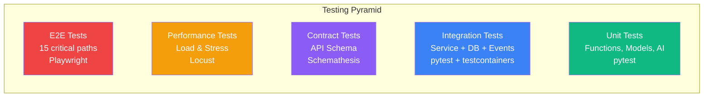

# ERP-SCM Testing Strategy

## 1. Overview

ERP-SCM employs a comprehensive multi-layer testing strategy to ensure reliability, correctness, and performance across all nine service domains and the AI/ML layer. Testing encompasses unit, integration, contract, end-to-end, performance, and ML validation testing.

---

## 2. Testing Pyramid



---

## 3. Unit Testing

### 3.1 Scope & Coverage

| Component | Target Coverage | Focus Areas |
|---|---|---|
| AI/ML Models | 90%+ | Forecasting accuracy, risk scoring, anomaly detection thresholds |
| Business Logic | 85%+ | Inventory calculations, BOM explosion, 3-way matching |
| API Routes | 80%+ | Input validation, response schemas, error handling |
| Schemas | 100% | Pydantic model serialization/deserialization |
| Utilities | 90%+ | Date formatting, currency conversion, Haversine distance |

### 3.2 Test Structure

```
backend/tests/
├── unit/
│   ├── test_demand_forecaster.py
│   ├── test_supplier_risk.py
│   ├── test_anomaly_detector.py
│   ├── test_route_optimizer.py
│   ├── test_insights_engine.py
│   ├── test_inventory_calculations.py
│   ├── test_bom_explosion.py
│   ├── test_three_way_match.py
│   └── test_schemas.py
├── integration/
│   ├── test_procurement_flow.py
│   ├── test_warehouse_flow.py
│   ├── test_manufacturing_flow.py
│   └── test_event_publishing.py
├── e2e/
│   ├── test_procure_to_pay.py
│   ├── test_order_to_cash.py
│   └── test_plan_to_produce.py
└── conftest.py
```

### 3.3 AI/ML Unit Test Examples

```python
class TestDemandForecaster:
    def test_exponential_smoothing_produces_positive_values(self):
        """Forecasts should never be negative"""
        forecaster = DemandForecaster()
        data = np.array([10, 12, 8, 15, 11, 9, 13, 14, 10, 12])
        result = forecaster._exponential_smoothing(data, alpha=0.3, beta=0.1, horizon=30)
        assert all(v >= 0 for v in result)

    def test_random_forest_with_insufficient_data_returns_mean(self):
        """RF should fallback to mean when data < 10 points"""
        forecaster = DemandForecaster()
        X = np.random.rand(5, 12)
        y = np.array([10, 12, 8, 15, 11])
        result = forecaster._random_forest_forecast(X, y, horizon=10)
        assert len(result) == 10
        expected_mean = np.mean(y)
        assert all(abs(v - expected_mean) < 0.01 for v in result)

    def test_forecast_confidence_bounds(self):
        """Upper bound should always exceed lower bound"""
        # ... test with mock DB session

    def test_eoq_calculation_positive(self):
        """EOQ and reorder point should always be >= 1"""
        forecaster = DemandForecaster()
        # ... test with various demand patterns


class TestSupplierRiskAnalyzer:
    def test_risk_score_range(self):
        """Risk score must be between 0 and 1"""
        # ... mock supplier with known scores
        assert 0 <= result["overall_risk_score"] <= 1

    def test_risk_level_classification(self):
        """Verify correct risk level for each score range"""
        analyzer = SupplierRiskAnalyzer()
        assert analyzer._score_to_level(0.15) == "low"
        assert analyzer._score_to_level(0.35) == "moderate"
        assert analyzer._score_to_level(0.55) == "elevated"
        assert analyzer._score_to_level(0.75) == "high"
        assert analyzer._score_to_level(0.90) == "critical"

    def test_trend_calculation_improving(self):
        """Recent scores better than older should show improving"""
        # ... test with performance records


class TestRouteOptimizer:
    def test_haversine_distance_known_pair(self):
        """NYC to LA should be approximately 3,940 km"""
        optimizer = RouteOptimizer()
        dist = optimizer.haversine_distance(40.7128, -74.0060, 34.0522, -118.2437)
        assert 3900 < dist < 4000

    def test_single_stop_returns_zero_distance(self):
        """Single stop route should have 0 distance"""
        optimizer = RouteOptimizer()
        result = optimizer.optimize_route([{"id": "A", "lat": 0, "lng": 0}])
        assert result["total_distance_km"] == 0

    def test_optimized_route_shorter_than_original(self):
        """Optimization should not increase total distance"""
        # ... test with known multi-stop routes
```

### 3.4 Running Unit Tests

```bash
cd /Users/AbiolaOgunsakin1/ERP/ERP-SCM/backend
pytest tests/ -v --cov=app --cov-report=html
```

---

## 4. Integration Testing

### 4.1 Database Integration

Tests run against a real PostgreSQL instance using testcontainers:

```python
@pytest.fixture(scope="session")
def postgres_container():
    with PostgresContainer("postgres:16") as pg:
        yield pg

@pytest.fixture
def db_session(postgres_container):
    engine = create_engine(postgres_container.get_connection_url())
    Base.metadata.create_all(engine)
    session = Session(engine)
    yield session
    session.rollback()
    session.close()
```

### 4.2 Event Bus Integration

Verify events are published correctly:

```python
async def test_po_creation_publishes_event(db_session, event_bus_mock):
    service = ProcurementService(db_session, event_bus_mock)
    po = await service.create_purchase_order(po_data)

    event_bus_mock.publish.assert_called_once_with(
        "erp.scm.procurement.po.created",
        match_has_entries({
            "po_id": str(po.id),
            "supplier_id": str(po.supplier_id),
        })
    )
```

### 4.3 Cross-Service Flow Tests

```python
async def test_procure_to_receive_flow(services):
    """Test complete P2P flow: PO -> Goods Receipt -> Inventory Update"""
    # 1. Create PO
    po = await services.procurement.create_po(po_data)
    assert po.status == "pending"

    # 2. Simulate goods receipt
    receipt = await services.warehouse.receive_goods(po.id, receipt_lines)
    assert receipt.status == "completed"

    # 3. Verify inventory updated
    inv = await services.inventory.get_stock(product_id, warehouse_id)
    assert inv.quantity == original_qty + received_qty
```

---

## 5. Contract Testing

API contracts verified using Schemathesis against the OpenAPI specification:

```bash
schemathesis run http://localhost:8000/docs/openapi.json \
  --hypothesis-max-examples=100 \
  --stateful=links
```

---

## 6. End-to-End Testing

### 6.1 Critical Path Tests

| Test | Description | Steps |
|---|---|---|
| Procure-to-Pay | Complete procurement lifecycle | Requisition -> RFQ -> PO -> Receive -> Match -> Pay |
| Order-to-Cash | Sales order fulfillment | Order -> Pick -> Pack -> Ship -> Deliver |
| Plan-to-Produce | Manufacturing cycle | Forecast -> MRP -> Production Order -> Completion |
| Quality Loop | Inspection to CAPA | Receive -> Inspect -> NCR -> CAPA -> Close |
| Fleet Trip | Complete trip lifecycle | Assign -> Start -> Track -> Complete -> Report |

### 6.2 E2E Test Example (Playwright)

```typescript
test('complete procurement workflow', async ({ page }) => {
  // Login
  await page.goto('/');
  await page.fill('[data-testid="email"]', 'admin@scm.io');
  await page.fill('[data-testid="password"]', 'admin123');
  await page.click('[data-testid="login-btn"]');

  // Navigate to procurement
  await page.click('text=Orders');
  await page.click('text=New Purchase Order');

  // Fill PO form
  await page.selectOption('[data-testid="supplier"]', { label: 'Acme Parts' });
  await page.click('[data-testid="add-item"]');
  // ... fill items
  await page.click('[data-testid="submit-po"]');

  // Verify PO created
  await expect(page.locator('[data-testid="po-status"]')).toHaveText('Pending');
});
```

---

## 7. Performance Testing

### 7.1 Load Test Scenarios

```python
# locustfile.py
class SCMUser(HttpUser):
    wait_time = between(1, 5)

    @task(10)
    def view_dashboard(self):
        self.client.get("/api/ai/dashboard/kpis")

    @task(5)
    def list_inventory(self):
        self.client.get("/api/inventory?page=1&page_size=50")

    @task(3)
    def create_order(self):
        self.client.post("/api/orders", json={...})

    @task(1)
    def run_forecast(self):
        self.client.post("/api/ai/forecast/1?horizon_days=30")
```

### 7.2 Performance Targets

| Metric | Target | Method |
|---|---|---|
| API p50 latency | < 50ms | Locust load test |
| API p95 latency | < 200ms | Locust load test |
| API p99 latency | < 500ms | Locust load test |
| MRP run (10K SKUs) | < 60s | Dedicated benchmark |
| Forecast generation | < 5s per SKU | Benchmark test |
| Route optimization (20 stops) | < 2s | Benchmark test |
| Concurrent users | 500 | Stress test |
| Throughput | > 2000 req/s | Stress test |

---

## 8. ML Model Validation

| Model | Metric | Acceptance Criteria | Validation Method |
|---|---|---|---|
| Demand Forecast (ES) | MAPE | < 20% | Walk-forward cross-validation |
| Demand Forecast (RF) | MAPE | < 15% | Walk-forward cross-validation |
| Demand Forecast (Ensemble) | MAPE | < 15% | Walk-forward cross-validation |
| Supplier Risk | Precision@k | > 0.8 | Hold-out evaluation |
| Anomaly Detection | F1-score | > 0.75 | Labeled anomaly dataset |
| Route Optimization | Distance reduction | > 10% vs naive | Benchmark route sets |

### 8.1 Model Drift Detection

```python
def test_forecast_model_not_drifted():
    """Ensure production model accuracy hasn't degraded"""
    recent_forecasts = get_recent_forecasts(days=30)
    actuals = get_actual_demand(days=30)
    mape = calculate_mape(recent_forecasts, actuals)
    assert mape < 0.20, f"Model MAPE {mape:.2%} exceeds 20% threshold"
```

---

## 9. Test Environment Management

| Environment | Purpose | Data | Refresh |
|---|---|---|---|
| Local | Developer testing | Seed data | On demand |
| CI | Automated test runs | Generated test data | Per pipeline run |
| Staging | Pre-production validation | Anonymized production subset | Weekly |
| Performance | Load testing | Scaled synthetic data | Per test cycle |
