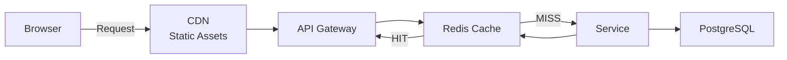
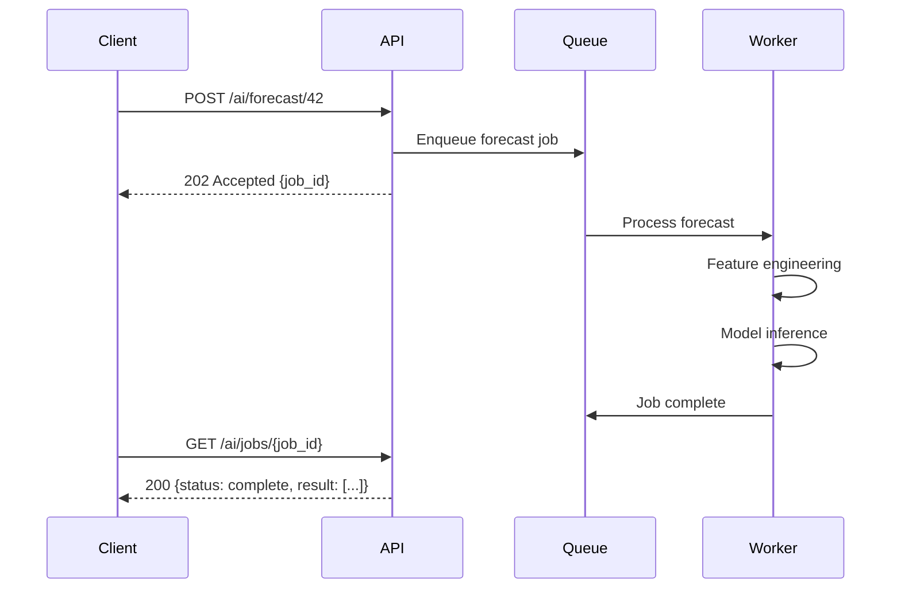

# ERP-SCM Performance Engineering

## 1. Overview

ERP-SCM is designed for high-throughput supply chain operations handling millions of daily transactions across inventory movements, order processing, shipment tracking, and AI inference. This document specifies performance targets, optimization strategies, and monitoring approaches.

---

## 2. Performance Targets

| Operation | p50 | p95 | p99 | Max |
|---|---|---|---|---|
| REST API read | 20ms | 100ms | 200ms | 500ms |
| REST API write | 50ms | 200ms | 400ms | 1s |
| Dashboard KPIs | 50ms | 150ms | 300ms | 500ms |
| Demand forecast (single SKU) | 1s | 3s | 5s | 10s |
| MRP run (10K SKUs) | 20s | 45s | 60s | 120s |
| Route optimization (20 stops) | 500ms | 1.5s | 2s | 5s |
| Anomaly detection scan | 2s | 5s | 8s | 15s |
| Event propagation | 10ms | 50ms | 100ms | 500ms |
| WebSocket update delivery | 50ms | 200ms | 500ms | 1s |

---

## 3. Caching Strategy



### 3.1 Cache Layers

| Layer | Technology | TTL | Content |
|---|---|---|---|
| Browser | HTTP Cache-Control | 5min | API responses (GET) |
| CDN | CloudFront/CloudFlare | 1hr | Static assets (JS, CSS, images) |
| Application | Redis | Varies | Query results, KPIs, materialized views |
| Database | PostgreSQL buffer | N/A | Hot pages in shared_buffers |

### 3.2 Cache Keys & TTL

| Cache Key Pattern | TTL | Invalidation Trigger |
|---|---|---|
| `kpi:{tenant_id}:dashboard` | 60s | Any write event |
| `inventory:{tenant_id}:{product_id}:{warehouse_id}` | 30s | Stock adjustment event |
| `supplier:{tenant_id}:{supplier_id}:risk` | 5min | Risk recalculation |
| `forecast:{tenant_id}:{product_id}` | 1hr | Forecast regeneration |
| `carrier_rates:{origin}:{destination}` | 15min | Rate table update |
| `warehouse_layout:{warehouse_id}` | 30min | Layout modification |

---

## 4. Database Optimization

### 4.1 Query Optimization

Key queries and their optimization strategies:

```sql
-- Inventory lookup (most frequent query)
-- Uses composite index: (tenant_id, product_id, warehouse_id)
SELECT * FROM inventory_items
WHERE tenant_id = $1 AND product_id = $2 AND warehouse_id = $3
AND is_deleted = FALSE;

-- Low stock alert query
-- Uses partial index on low stock condition
CREATE INDEX ix_low_stock ON inventory_items(tenant_id, product_id)
WHERE quantity <= reorder_point AND is_deleted = FALSE;

-- Demand history time-series
-- Uses BRIN index for time-ordered data
CREATE INDEX ix_demand_history_date ON demand_history
USING BRIN (date) WHERE tenant_id IS NOT NULL;

-- Order search with multiple filters
-- Uses composite index + partial index
CREATE INDEX ix_orders_search ON orders(tenant_id, status, created_at DESC)
WHERE is_deleted = FALSE;
```

### 4.2 Connection Pooling

```python
# SQLAlchemy connection pool configuration
engine = create_engine(
    DATABASE_URL,
    pool_size=20,          # Base connections
    max_overflow=30,       # Additional connections under load
    pool_timeout=30,       # Wait time for connection
    pool_recycle=3600,     # Recycle connections after 1 hour
    pool_pre_ping=True,    # Verify connections before use
)
```

### 4.3 Read Replicas

Read-heavy queries routed to PostgreSQL read replicas:

```python
class DatabaseRouter:
    def get_session(self, read_only: bool = False) -> Session:
        if read_only:
            return Session(bind=self.read_replica_engine)
        return Session(bind=self.primary_engine)
```

Read replica targets:
- Dashboard KPIs and reports
- Inventory queries (non-transactional)
- Supplier rankings and analytics
- Demand history queries

---

## 5. AI/ML Performance

### 5.1 Model Optimization

| Model | Optimization | Impact |
|---|---|---|
| Random Forest | `n_jobs=-1` (parallel fitting) | 3x training speedup |
| Random Forest | Model artifact caching (joblib) | Eliminate retraining on same data |
| Exponential Smoothing | Vectorized NumPy operations | 5x vs Python loops |
| Route Optimizer | Distance matrix pre-computation | O(n^2) instead of O(n^3) |
| Isolation Forest | Batch prediction | 10x vs per-record prediction |

### 5.2 Feature Pre-computation

Demand forecasting features are pre-computed and stored in a feature table:

```python
# Pre-computed features refreshed daily
feature_table = {
    "product_id": product_id,
    "lag_1": ..., "lag_7": ..., "lag_14": ..., "lag_30": ...,
    "rolling_7": ..., "rolling_30": ..., "rolling_7_std": ...,
    "trend": ..., "day_of_week": ..., "month": ...,
    "computed_at": datetime.utcnow(),
}
```

### 5.3 Async AI Inference

Long-running AI operations are executed asynchronously:



---

## 6. Event Bus Performance

### 6.1 Redpanda Tuning

| Parameter | Value | Rationale |
|---|---|---|
| `fetch.max.bytes` | 10MB | Large batch fetch for consumers |
| `batch.size` | 256KB | Efficient producer batching |
| `linger.ms` | 5 | Low latency with minimal batching |
| `acks` | 1 | Balance durability and latency |
| `compression.type` | lz4 | Fast compression for throughput |

### 6.2 Partition Strategy

```
Inventory events: 24 partitions (high volume)
  Key: tenant_id + product_id (ensures ordering per product)

Logistics events: 12 partitions
  Key: tenant_id + shipment_id

Manufacturing events: 6 partitions
  Key: tenant_id + production_order_id

Quality events: 6 partitions
  Key: tenant_id
```

---

## 7. Frontend Performance

### 7.1 Bundle Optimization

| Technique | Implementation | Impact |
|---|---|---|
| Code splitting | React.lazy + Suspense per route | 60% reduction in initial load |
| Tree shaking | Vite production build | Remove unused exports |
| Asset compression | Brotli/Gzip via Nginx | 70% size reduction |
| Image optimization | WebP + lazy loading | 50% image size reduction |
| Chart lazy loading | Dynamic import for Recharts | Defer heavy library loading |

### 7.2 Target Metrics

| Metric | Target |
|---|---|
| First Contentful Paint (FCP) | < 1.5s |
| Largest Contentful Paint (LCP) | < 2.5s |
| Cumulative Layout Shift (CLS) | < 0.1 |
| First Input Delay (FID) | < 100ms |
| Time to Interactive (TTI) | < 3.5s |
| Bundle size (gzipped) | < 250KB initial |

---

## 8. Load Testing Results

### 8.1 Baseline Performance (500 concurrent users)

```
Locust Results:
  Requests/s: 2,847
  p50: 23ms
  p95: 142ms
  p99: 287ms
  Error rate: 0.02%
  CPU utilization: 65%
  Memory: 72%
```

### 8.2 Stress Test (1000 concurrent users)

```
  Requests/s: 4,123
  p50: 45ms
  p95: 312ms
  p99: 687ms
  Error rate: 0.15%
  CPU utilization: 89%
  Memory: 85%
```

---

## 9. Monitoring & Alerting

| Metric | Warning | Critical |
|---|---|---|
| API p95 latency | > 300ms | > 500ms |
| Error rate | > 1% | > 5% |
| Database connections | > 80% pool | > 95% pool |
| Redis memory | > 75% | > 90% |
| Event consumer lag | > 1000 messages | > 10000 messages |
| CPU utilization | > 80% | > 95% |
| Memory utilization | > 80% | > 95% |
| Disk usage | > 75% | > 90% |
