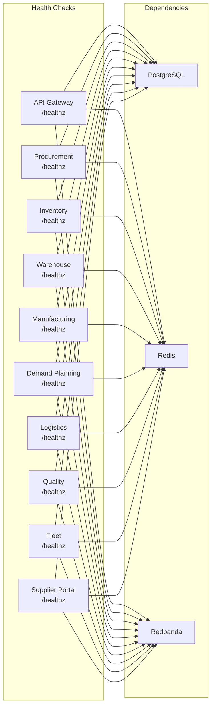

# ERP-SCM Operations Runbook

## 1. Overview

This runbook provides operational procedures for ERP-SCM service teams, including incident response, common troubleshooting scenarios, scaling procedures, and routine maintenance tasks.

---

## 2. Service Health Dashboard



### Quick Health Check

```bash
# Check all services
for port in 8000 8001 8002 8003 8004 8005 8006 8007 8008 8009; do
  echo "Port $port: $(curl -s http://localhost:$port/healthz | jq -r '.status')"
done

# Check API health
curl -s http://localhost:8000/api/health | jq
```

---

## 3. Incident Response

### 3.1 Severity Levels

| Level | Definition | Response Time | Examples |
|---|---|---|---|
| **SEV-1** | System-wide outage | 15 minutes | All services down, data loss |
| **SEV-2** | Major feature unavailable | 30 minutes | Procurement service down, no AI |
| **SEV-3** | Degraded performance | 2 hours | Slow responses, intermittent errors |
| **SEV-4** | Minor issue | Next business day | UI glitch, cosmetic issue |

### 3.2 SEV-1: Complete Service Outage

```
1. ASSESS
   - Check Grafana dashboard: https://grafana.internal/d/scm-overview
   - Run: kubectl get pods -n erp-scm
   - Check database: psql -h pg-primary -U scm_app -c "SELECT 1"
   - Check event bus: rpk cluster status

2. TRIAGE
   - Database down? -> Jump to section 4.1
   - Event bus down? -> Jump to section 4.2
   - All pods CrashLooping? -> Jump to section 4.3
   - Ingress/networking? -> Jump to section 4.4

3. COMMUNICATE
   - Post to #scm-incidents Slack channel
   - Update status page
   - Notify VP Engineering if not resolved in 30 min

4. RESOLVE & DOCUMENT
   - Apply fix
   - Verify health checks pass
   - Write incident postmortem within 48 hours
```

### 3.3 SEV-2: Single Service Down

```
1. Identify affected service
   kubectl get pods -n erp-scm | grep -v Running

2. Check pod logs
   kubectl logs -n erp-scm deployment/<service-name> --tail=100

3. Check recent deployments
   kubectl rollout history deployment/<service-name> -n erp-scm

4. Restart if needed
   kubectl rollout restart deployment/<service-name> -n erp-scm

5. If OOMKilled: increase memory limits
   kubectl patch deployment <service-name> -n erp-scm \
     -p '{"spec":{"template":{"spec":{"containers":[{"name":"app","resources":{"limits":{"memory":"2Gi"}}}]}}}}'
```

---

## 4. Common Troubleshooting

### 4.1 Database Issues

**Symptom**: Slow queries, connection timeouts

```bash
# Check active connections
psql -c "SELECT count(*) FROM pg_stat_activity WHERE datname='scm';"

# Find long-running queries
psql -c "SELECT pid, now() - pg_stat_activity.query_start AS duration, query
FROM pg_stat_activity WHERE state != 'idle' ORDER BY duration DESC LIMIT 10;"

# Kill a stuck query
psql -c "SELECT pg_cancel_backend(<pid>);"

# Check table bloat
psql -c "SELECT relname, n_dead_tup, last_vacuum, last_autovacuum
FROM pg_stat_user_tables ORDER BY n_dead_tup DESC LIMIT 10;"

# Force vacuum
psql -c "VACUUM ANALYZE inventory_items;"
```

### 4.2 Event Bus Issues

**Symptom**: Events not being processed, consumer lag growing

```bash
# Check consumer lag
rpk group describe scm-inventory-consumers

# Check topic health
rpk topic describe erp.scm.inventory

# Reset consumer offset (CAUTION: will reprocess events)
rpk group seek scm-inventory-consumers --to end

# Check dead letter queue
rpk topic consume erp.scm.dlq --num 10
```

### 4.3 AI/ML Model Issues

**Symptom**: Forecasts not generating, anomaly detection not running

```bash
# Check model metadata
psql -c "SELECT model_name, model_type, trained_at, is_active
FROM ai_model_metadata ORDER BY trained_at DESC;"

# Check forecast generation logs
kubectl logs -n erp-scm deployment/demand-planning-service --tail=200 | grep -i forecast

# Force model retraining
curl -X POST http://localhost:8005/v1/demand-planning/models/retrain \
  -H "Authorization: Bearer $TOKEN"

# Check anomaly detection last run
psql -c "SELECT MAX(created_at) FROM ai_alerts;"
```

### 4.4 Inventory Discrepancy

**Symptom**: System inventory doesn't match physical count

```bash
# Check recent stock movements for a product
psql -c "SELECT * FROM stock_movements
WHERE inventory_item_id = '<id>'
ORDER BY created_at DESC LIMIT 20;"

# Check for failed event processing (missed adjustments)
rpk topic consume erp.scm.inventory --offset start --num 100 | grep '<product_id>'

# Run reconciliation
curl -X POST http://localhost:8002/v1/inventory/reconcile \
  -H "Authorization: Bearer $TOKEN" \
  -d '{"warehouse_id": "<id>", "product_id": "<id>"}'
```

---

## 5. Routine Operations

### 5.1 Daily Tasks

| Task | Schedule | Command/Action |
|---|---|---|
| Review AI alerts | 8:00 AM | Dashboard > AI Alerts |
| Check event consumer lag | 8:00 AM | `rpk group list` |
| Verify backup completion | 9:00 AM | Check backup logs |
| Review error rates | Ongoing | Grafana SCM dashboard |

### 5.2 Weekly Tasks

| Task | Day | Procedure |
|---|---|---|
| Database statistics update | Monday | `ANALYZE` on all tables |
| Review slow query log | Tuesday | Check pg_stat_statements |
| AI model accuracy check | Wednesday | Review MAPE dashboard |
| Security scan review | Thursday | Check Trivy/Snyk reports |
| Capacity planning review | Friday | Review resource utilization trends |

### 5.3 Monthly Tasks

| Task | Procedure |
|---|---|
| Database vacuum | `VACUUM FULL` during maintenance window |
| Certificate rotation | Rotate mTLS certificates |
| Dependency updates | Review and apply security patches |
| Disaster recovery drill | Failover test to standby region |
| Performance baseline | Run load test and compare to previous month |

---

## 6. Scaling Procedures

### 6.1 Horizontal Scaling

```bash
# Scale a specific service
kubectl scale deployment warehouse-service -n erp-scm --replicas=5

# Enable HPA
kubectl apply -f - <<EOF
apiVersion: autoscaling/v2
kind: HorizontalPodAutoscaler
metadata:
  name: warehouse-service-hpa
  namespace: erp-scm
spec:
  scaleTargetRef:
    apiVersion: apps/v1
    kind: Deployment
    name: warehouse-service
  minReplicas: 2
  maxReplicas: 8
  metrics:
  - type: Resource
    resource:
      name: cpu
      target:
        type: Utilization
        averageUtilization: 70
EOF
```

### 6.2 Database Scaling

```bash
# Add read replica
kubectl scale statefulset pg-replicas -n erp-scm --replicas=3

# Increase connection pool
kubectl set env deployment/gateway-service -n erp-scm \
  DB_POOL_SIZE=30 DB_MAX_OVERFLOW=50
```

---

## 7. Emergency Procedures

### 7.1 Rollback Deployment

```bash
# Check rollout history
kubectl rollout history deployment/<service> -n erp-scm

# Rollback to previous version
kubectl rollout undo deployment/<service> -n erp-scm

# Rollback to specific revision
kubectl rollout undo deployment/<service> -n erp-scm --to-revision=3
```

### 7.2 Database Point-in-Time Recovery

```bash
# Restore to specific timestamp
pg_restore --target-time="2026-02-23 10:00:00 UTC" \
  --target-action=promote \
  --recovery-target-timeline=latest
```

### 7.3 Circuit Breaker Override

```bash
# Disable circuit breaker for specific integration (emergency only)
curl -X POST http://localhost:8000/admin/circuit-breaker/override \
  -H "Authorization: Bearer $ADMIN_TOKEN" \
  -d '{"service": "carrier-api", "action": "force_close"}'
```

---

## 8. Contact Escalation

| Level | Contact | Channel |
|---|---|---|
| L1 On-call | SCM SRE team | PagerDuty + #scm-ops Slack |
| L2 Service owner | Backend engineering lead | #scm-engineering Slack |
| L3 Architecture | Chief Architect | Direct call |
| L4 Executive | VP Engineering | Direct call |
