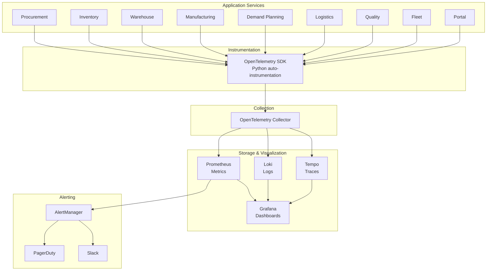

# ERP-SCM Observability Guide

## 1. Overview

ERP-SCM implements the three pillars of observability -- metrics, logs, and traces -- using OpenTelemetry as the unified instrumentation framework. This enables real-time monitoring, alerting, and debugging across all nine microservices.

---

## 2. Observability Architecture



---

## 3. Metrics

### 3.1 Standard Metrics (All Services)

| Metric | Type | Labels | Description |
|---|---|---|---|
| `http_requests_total` | Counter | method, path, status | Total HTTP requests |
| `http_request_duration_seconds` | Histogram | method, path | Request latency |
| `http_request_size_bytes` | Histogram | method, path | Request body size |
| `http_response_size_bytes` | Histogram | method, path | Response body size |
| `db_query_duration_seconds` | Histogram | operation, table | Database query latency |
| `db_connection_pool_size` | Gauge | state | Connection pool status |
| `event_published_total` | Counter | topic, type | Events published |
| `event_consumed_total` | Counter | topic, group | Events consumed |
| `event_consumer_lag` | Gauge | topic, partition, group | Consumer lag |

### 3.2 Business Metrics

| Metric | Type | Service | Description |
|---|---|---|---|
| `scm_orders_total` | Counter | Procurement | Total orders created |
| `scm_orders_amount` | Histogram | Procurement | Order value distribution |
| `scm_inventory_value` | Gauge | Inventory | Total inventory value per warehouse |
| `scm_low_stock_items` | Gauge | Inventory | Count of items below reorder point |
| `scm_pick_wave_duration_seconds` | Histogram | Warehouse | Pick wave completion time |
| `scm_production_orders_active` | Gauge | Manufacturing | Active production orders |
| `scm_forecast_mape` | Gauge | Demand Planning | Current MAPE per product |
| `scm_shipments_active` | Gauge | Logistics | Active shipments |
| `scm_fleet_vehicles_active` | Gauge | Fleet | Active vehicles |
| `scm_ai_alerts_open` | Gauge | AI | Open AI alerts by severity |
| `scm_supplier_risk_score` | Gauge | Procurement | Supplier risk scores |

### 3.3 AI/ML Metrics

| Metric | Type | Description |
|---|---|---|
| `scm_ml_inference_duration_seconds` | Histogram | Model inference latency |
| `scm_ml_training_duration_seconds` | Histogram | Model training time |
| `scm_ml_forecast_accuracy_mape` | Gauge | Forecast accuracy (MAPE) |
| `scm_ml_anomalies_detected_total` | Counter | Anomalies detected |
| `scm_ml_model_version` | Info | Current active model version |

---

## 4. Structured Logging

### 4.1 Log Format

All services emit structured JSON logs:

```json
{
  "timestamp": "2026-02-23T10:30:00.123Z",
  "level": "INFO",
  "service": "procurement-service",
  "trace_id": "abc123def456",
  "span_id": "789ghi",
  "correlation_id": "corr-uuid",
  "tenant_id": "tenant-uuid",
  "user_id": "user-uuid",
  "message": "Purchase order created",
  "data": {
    "po_id": "po-uuid",
    "supplier_id": "sup-uuid",
    "total_amount": 15000.00
  }
}
```

### 4.2 Log Levels

| Level | Usage |
|---|---|
| `ERROR` | Unrecoverable errors, failed operations |
| `WARN` | Degraded conditions, fallback behavior |
| `INFO` | Business events, state changes |
| `DEBUG` | Detailed diagnostic information (development only) |

### 4.3 Sensitive Data Handling

PII fields are automatically masked in logs:

```python
MASKED_FIELDS = ["email", "phone", "password", "license_number", "contact_name"]

def mask_log_data(data: dict) -> dict:
    masked = data.copy()
    for field in MASKED_FIELDS:
        if field in masked:
            masked[field] = "***MASKED***"
    return masked
```

---

## 5. Distributed Tracing

### 5.1 Trace Propagation

Traces propagate across services via W3C TraceContext headers:

```
traceparent: 00-<trace-id>-<span-id>-01
tracestate: erp-scm=<service-name>
```

### 5.2 Key Trace Spans

```mermaid
gantt
    title Example: Procure-to-Pay Trace
    dateFormat X
    axisFormat %L ms

    section API Gateway
    Auth & Route       :0, 5
    section Procurement
    Create PO          :5, 50
    Validate Items     :5, 20
    Calculate Total    :20, 30
    Save to DB         :30, 45
    Publish Event      :45, 50
    section Inventory
    Reserve Stock      :50, 80
    Check Availability :50, 60
    Update Quantities  :60, 75
    Publish Event      :75, 80
    section Warehouse
    Schedule Receiving :80, 100
    Assign Dock        :80, 90
    Create Tasks       :90, 100
```



---

## 6. Grafana Dashboards

### 6.1 SCM Overview Dashboard

Panels:
- Service health matrix (green/yellow/red per service)
- Request rate and error rate time series
- p50/p95/p99 latency graphs
- Active alerts panel
- Event bus throughput and consumer lag

### 6.2 Business KPI Dashboard

Panels:
- Orders created per hour (bar chart)
- Inventory value by warehouse (stacked area)
- Shipment status distribution (pie chart)
- AI forecast accuracy trend (line chart)
- Supplier risk score distribution (histogram)
- Production schedule adherence (gauge)

### 6.3 AI/ML Dashboard

Panels:
- Model inference latency by model type
- MAPE trend over time per product category
- Anomalies detected per type per day
- Route optimization savings (distance, time)
- Model retraining frequency and duration

---

## 7. Alerting Rules

### 7.1 Infrastructure Alerts

| Alert | Condition | Severity | Channel |
|---|---|---|---|
| High Error Rate | error_rate > 5% for 5min | Critical | PagerDuty |
| High Latency | p95 > 500ms for 10min | Warning | Slack |
| Pod Restart Loop | restarts > 3 in 15min | Critical | PagerDuty |
| Database Connection Pool Exhausted | pool_usage > 90% | Critical | PagerDuty |
| Disk Space Low | usage > 85% | Warning | Slack |
| Consumer Lag High | lag > 10000 for 5min | Warning | Slack |

### 7.2 Business Alerts

| Alert | Condition | Severity | Channel |
|---|---|---|---|
| Low Stock Critical | stockout detected | Critical | Slack + Email |
| Forecast Accuracy Degraded | MAPE > 25% for 7 days | Warning | Slack |
| Supplier Risk Elevated | risk_score > 0.8 | Warning | Email |
| Late Deliveries Spike | late_rate > 10% | Warning | Slack |
| MRP Run Failed | mrp_status = error | Critical | PagerDuty |

---

## 8. SLA Monitoring

| SLA | Target | Measurement |
|---|---|---|
| API Availability | 99.95% | (total_time - downtime) / total_time |
| API Response Time (p95) | < 200ms | Prometheus histogram percentile |
| Event Processing Latency | < 100ms | Producer timestamp to consumer ack |
| Data Freshness | < 5 minutes | Dashboard KPI refresh interval |
| Incident Response (SEV-1) | < 15 minutes | PagerDuty acknowledgement time |
