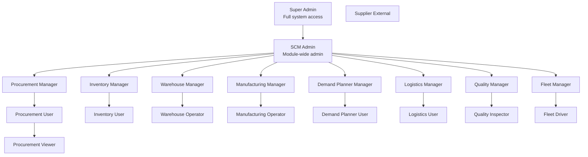
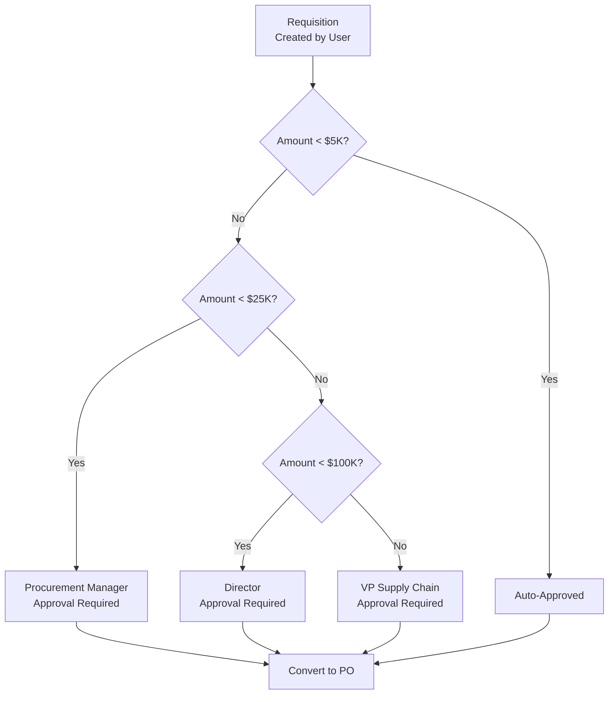

# ERP-SCM Roles & Permissions Matrix

## 1. Overview

ERP-SCM implements a granular role-based access control (RBAC) system integrated with ERP-IAM. This document defines all roles, their permission sets, and the authorization enforcement architecture.

---

## 2. Role Hierarchy



---

## 3. Role Definitions

| Role Code | Role Name | Description | User Type |
|---|---|---|---|
| `scm:super_admin` | Super Admin | Full access to all features, settings, and administration | Internal |
| `scm:admin` | SCM Admin | Full access to all SCM features | Internal |
| `scm:procurement:manager` | Procurement Manager | Manage all procurement activities, approve POs | Internal |
| `scm:procurement:user` | Procurement User | Create requisitions, RFQs, POs | Internal |
| `scm:procurement:viewer` | Procurement Viewer | View-only access to procurement data | Internal |
| `scm:inventory:manager` | Inventory Manager | Manage stock, run analysis, approve adjustments | Internal |
| `scm:inventory:user` | Inventory User | View stock, record movements | Internal |
| `scm:warehouse:manager` | Warehouse Manager | Manage warehouse operations, create pick waves | Internal |
| `scm:warehouse:operator` | Warehouse Operator | Execute picks, packing, receiving | Internal |
| `scm:manufacturing:manager` | Manufacturing Manager | Manage BOMs, production orders, MRP | Internal |
| `scm:manufacturing:operator` | Manufacturing Operator | Report shop floor activity | Internal |
| `scm:demand:manager` | Demand Planner Manager | Manage forecasts, consensus plans | Internal |
| `scm:demand:user` | Demand Planner User | View forecasts, review accuracy | Internal |
| `scm:logistics:manager` | Logistics Manager | Manage shipments, carriers, routes | Internal |
| `scm:logistics:user` | Logistics User | View tracking, create shipments | Internal |
| `scm:quality:manager` | Quality Manager | Manage quality plans, NCRs, CAPAs | Internal |
| `scm:quality:inspector` | Quality Inspector | Record inspection results | Internal |
| `scm:fleet:manager` | Fleet Manager | Manage vehicles, drivers, maintenance | Internal |
| `scm:fleet:driver` | Fleet Driver | View assigned trips, log activities | Internal |
| `scm:supplier:external` | Supplier Portal User | External supplier collaboration | External |

---

## 4. Complete Permission Matrix

### 4.1 Procurement Permissions

| Permission | Super | Admin | Proc Mgr | Proc User | Proc View | Others |
|---|---|---|---|---|---|---|
| `procurement.requisition.view` | Y | Y | Y | Y | Y | - |
| `procurement.requisition.create` | Y | Y | Y | Y | - | - |
| `procurement.requisition.approve` | Y | Y | Y | - | - | - |
| `procurement.rfq.view` | Y | Y | Y | Y | Y | - |
| `procurement.rfq.create` | Y | Y | Y | Y | - | - |
| `procurement.rfq.evaluate` | Y | Y | Y | - | - | - |
| `procurement.po.view` | Y | Y | Y | Y | Y | - |
| `procurement.po.create` | Y | Y | Y | Y | - | - |
| `procurement.po.approve` | Y | Y | Y | - | - | - |
| `procurement.po.cancel` | Y | Y | Y | - | - | - |
| `procurement.contract.view` | Y | Y | Y | Y | Y | - |
| `procurement.contract.manage` | Y | Y | Y | - | - | - |
| `procurement.match.execute` | Y | Y | Y | Y | - | - |
| `procurement.scorecard.view` | Y | Y | Y | Y | Y | - |
| `procurement.scorecard.manage` | Y | Y | Y | - | - | - |

### 4.2 Inventory Permissions

| Permission | Super | Admin | Inv Mgr | Inv User | WMS Mgr | WMS Op |
|---|---|---|---|---|---|---|
| `inventory.view` | Y | Y | Y | Y | Y | Y |
| `inventory.adjust` | Y | Y | Y | - | Y | Y |
| `inventory.approve_adjustment` | Y | Y | Y | - | - | - |
| `inventory.cycle_count.manage` | Y | Y | Y | - | Y | - |
| `inventory.cycle_count.execute` | Y | Y | Y | Y | Y | Y |
| `inventory.analysis.run` | Y | Y | Y | - | - | - |
| `inventory.reorder.configure` | Y | Y | Y | - | - | - |
| `inventory.ai.optimize` | Y | Y | Y | - | - | - |

### 4.3 Warehouse Permissions

| Permission | Super | Admin | WMS Mgr | WMS Op |
|---|---|---|---|---|
| `warehouse.layout.view` | Y | Y | Y | Y |
| `warehouse.layout.manage` | Y | Y | Y | - |
| `warehouse.receiving.execute` | Y | Y | Y | Y |
| `warehouse.putaway.execute` | Y | Y | Y | Y |
| `warehouse.pick_wave.create` | Y | Y | Y | - |
| `warehouse.pick.execute` | Y | Y | Y | Y |
| `warehouse.pack.execute` | Y | Y | Y | Y |
| `warehouse.ship.execute` | Y | Y | Y | Y |
| `warehouse.return.process` | Y | Y | Y | Y |
| `warehouse.labor.manage` | Y | Y | Y | - |

### 4.4 Manufacturing Permissions

| Permission | Super | Admin | Mfg Mgr | Mfg Op |
|---|---|---|---|---|
| `manufacturing.bom.view` | Y | Y | Y | Y |
| `manufacturing.bom.manage` | Y | Y | Y | - |
| `manufacturing.production_order.view` | Y | Y | Y | Y |
| `manufacturing.production_order.create` | Y | Y | Y | - |
| `manufacturing.mrp.run` | Y | Y | Y | - |
| `manufacturing.schedule.manage` | Y | Y | Y | - |
| `manufacturing.shopfloor.report` | Y | Y | Y | Y |
| `manufacturing.work_center.manage` | Y | Y | Y | - |

### 4.5 AI & Analytics Permissions

| Permission | Super | Admin | Demand Mgr | Demand User |
|---|---|---|---|---|
| `ai.forecast.generate` | Y | Y | Y | - |
| `ai.forecast.view` | Y | Y | Y | Y |
| `ai.forecast.approve` | Y | Y | Y | - |
| `ai.anomaly.detect` | Y | Y | Y | - |
| `ai.alerts.view` | Y | Y | Y | Y |
| `ai.alerts.resolve` | Y | Y | Y | - |
| `ai.insights.view` | Y | Y | Y | Y |
| `ai.dashboard.view` | Y | Y | Y | Y |
| `ai.models.manage` | Y | Y | - | - |

### 4.6 Supplier Portal Permissions

| Permission | Supplier |
|---|---|
| `portal.po.view` | Y (own POs only) |
| `portal.po.acknowledge` | Y |
| `portal.asn.submit` | Y |
| `portal.invoice.submit` | Y |
| `portal.payment.view` | Y (own payments only) |
| `portal.documents.upload` | Y |
| `portal.profile.manage` | Y (own profile only) |

---

## 5. Data Scope Rules

| Role | Data Scope |
|---|---|
| Super Admin | All tenants (platform-level) |
| SCM Admin | Single tenant, all data |
| Department managers | Single tenant, own domain data |
| Operators/Users | Single tenant, assigned warehouse/work center |
| Supplier External | Single tenant, own supplier data only |

---

## 6. Approval Workflow Authorization



---

## 7. Permission Enforcement

Permissions are enforced at three levels:

1. **API Gateway**: JWT token validation and role extraction
2. **Service Level**: FastAPI dependency injection for permission checks
3. **Database Level**: PostgreSQL RLS policies for tenant isolation

```python
# FastAPI permission dependency
def require_permission(permission: str):
    def checker(current_user: User = Depends(get_current_user)):
        if permission not in current_user.permissions:
            raise HTTPException(status_code=403, detail="Insufficient permissions")
        return current_user
    return checker

# Usage in route
@router.post("/purchase-orders")
async def create_po(
    po_data: POCreate,
    user: User = Depends(require_permission("procurement.po.create")),
    db: Session = Depends(get_db),
):
    ...
```
