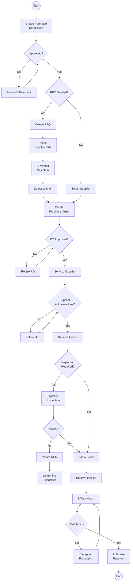
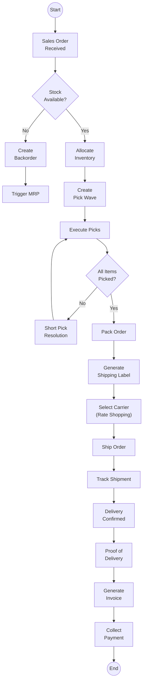
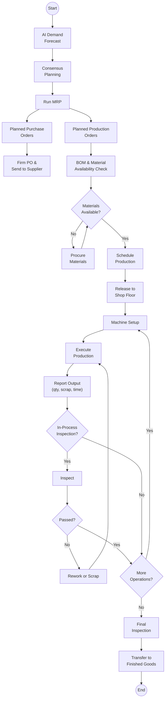
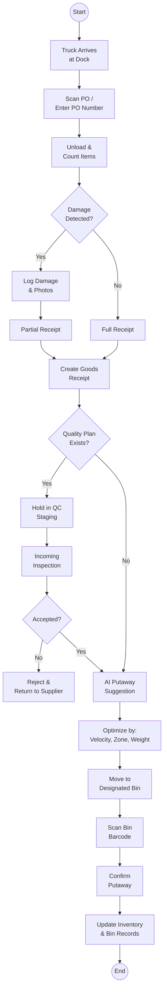
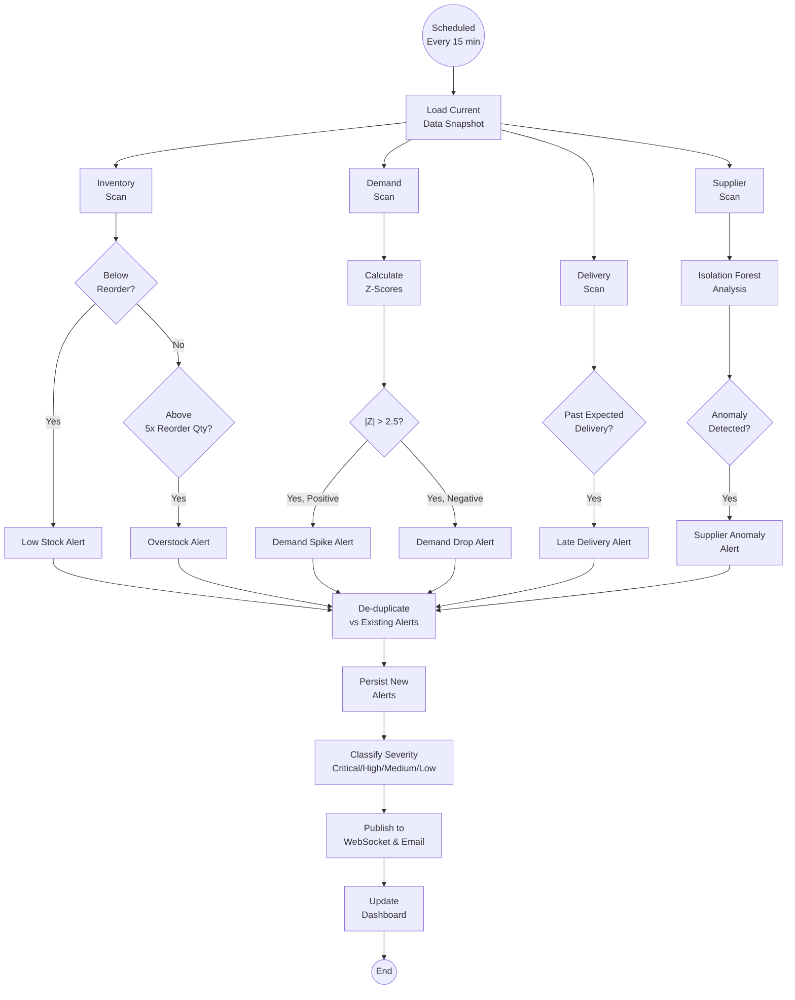
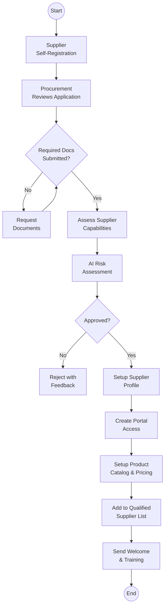
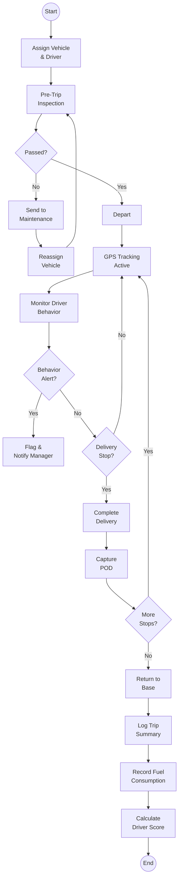
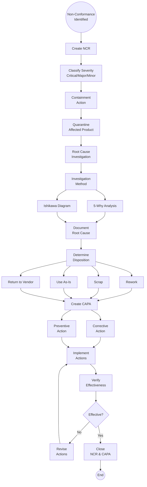

# ERP-SCM Workflow Diagrams

## 1. Overview

This document captures the key business workflows in ERP-SCM as visual diagrams, showing the sequence of actions, decision points, and system interactions for each major process.

---

## 2. Procure-to-Pay (P2P) Workflow

---

## 3. Order-to-Cash (O2C) Workflow

---

## 4. Plan-to-Produce Workflow

---

## 5. Warehouse Receiving & Putaway Workflow

---

## 6. AI Anomaly Detection Workflow

---

## 7. Supplier Onboarding Workflow

---

## 8. Fleet Trip Execution Workflow

---

## 9. Quality NCR-to-CAPA Workflow

