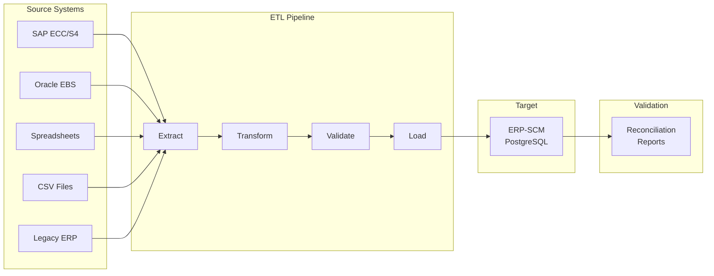
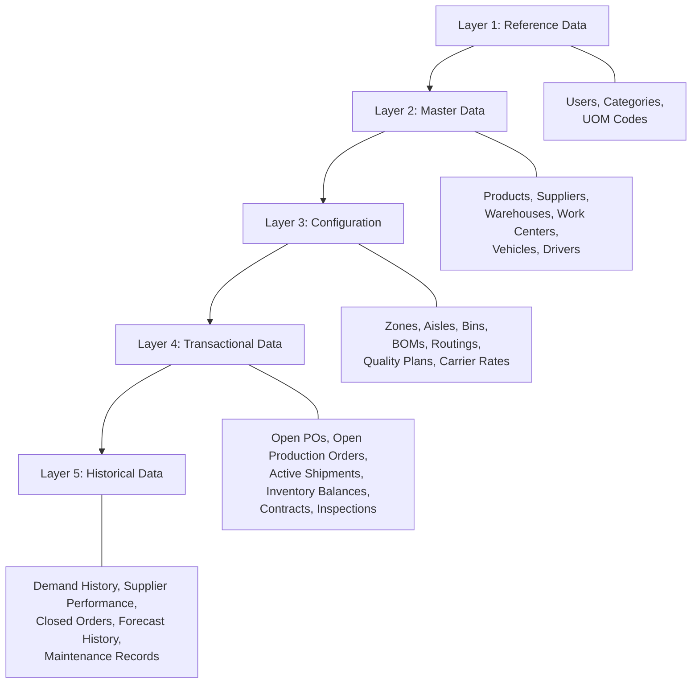

# ERP-SCM Data Migration Guide

## 1. Overview

This guide provides comprehensive procedures for migrating data into ERP-SCM from legacy systems (SAP, Oracle, spreadsheets, or other ERPs). It covers data mapping, extraction strategies, transformation rules, validation, and cutover planning.

---

## 2. Migration Architecture



---

## 3. Data Entity Migration Order

Data must be loaded in dependency order:



---

## 4. Data Mapping Templates

### 4.1 Product Migration

| Source Field (SAP) | Source Field (Oracle) | Target Field | Type | Transform |
|---|---|---|---|---|
| MATNR | ITEM_NUMBER | `products.sku` | VARCHAR(100) | Trim, uppercase |
| MAKTX | DESCRIPTION | `products.name` | VARCHAR(255) | Trim |
| MTART | ITEM_TYPE | `products.category_id` | FK | Map via category lookup |
| STPRS | UNIT_COST | `products.unit_cost` | FLOAT | Convert currency |
| VERPR | LIST_PRICE | `products.unit_price` | FLOAT | Convert currency |
| BRGEW | UNIT_WEIGHT | `products.weight_kg` | FLOAT | Convert if lbs |
| LVORM | INACTIVE_FLAG | `products.is_active` | BOOLEAN | Invert flag |

### 4.2 Supplier Migration

| Source Field | Target Field | Type | Transform |
|---|---|---|---|
| LIFNR / VENDOR_NUMBER | `suppliers.code` | VARCHAR(50) | Prefix with "SUP-" |
| NAME1 / VENDOR_NAME | `suppliers.name` | VARCHAR(255) | Trim |
| STRAS / ADDRESS_LINE1 | `suppliers.address` | TEXT | Concatenate address lines |
| ORT01 / CITY | `suppliers.city` | VARCHAR(100) | Standardize |
| LAND1 / COUNTRY | `suppliers.country` | VARCHAR(100) | ISO 3166 mapping |
| On-time % | `suppliers.reliability_score` | FLOAT | Divide by 100 |
| Quality rating | `suppliers.quality_score` | FLOAT | Normalize to 0-1 |

### 4.3 Inventory Balance Migration

| Source Field | Target Field | Transform |
|---|---|---|
| LABST (unrestricted) | `inventory_items.quantity` | Direct |
| INSME (in quality) | Separate QC hold record | Create hold record |
| SPEME (blocked) | `inventory_items.reserved_quantity` | Map to reserved |
| LGORT / WAREHOUSE | `inventory_items.warehouse_id` | Lookup warehouse |
| MATNR / ITEM | `inventory_items.product_id` | Lookup product |
| MENGE / REORDER_POINT | `inventory_items.reorder_point` | Direct |

---

## 5. Validation Rules

### 5.1 Pre-Load Validation

| Check | Rule | Severity |
|---|---|---|
| Referential integrity | All FK references exist in target | BLOCK |
| Unique constraints | No duplicate SKUs, codes, numbers | BLOCK |
| Required fields | All NOT NULL fields populated | BLOCK |
| Data type validation | Values match target column types | BLOCK |
| Range validation | Quantities >= 0, scores 0-1 | WARN |
| Business rule validation | BOM circular references | BLOCK |

### 5.2 Post-Load Reconciliation

```sql
-- Verify product count
SELECT 'products' AS entity,
       (SELECT count(*) FROM source_products) AS source_count,
       (SELECT count(*) FROM products WHERE is_deleted = FALSE) AS target_count;

-- Verify inventory value
SELECT 'inventory_value' AS metric,
       (SELECT sum(quantity * unit_cost) FROM source_inventory) AS source_value,
       (SELECT sum(i.quantity * p.unit_cost)
        FROM inventory_items i JOIN products p ON i.product_id = p.id) AS target_value;

-- Verify supplier count
SELECT 'suppliers' AS entity,
       (SELECT count(*) FROM source_suppliers) AS source_count,
       (SELECT count(*) FROM suppliers WHERE is_active = TRUE) AS target_count;
```

---

## 6. Migration Execution Plan

### Phase 1: Preparation (Weeks 1-2)
- Document source system data models
- Create data mapping templates
- Build ETL scripts
- Set up migration test environment
- Extract sample data (10%)

### Phase 2: Pilot Migration (Weeks 3-4)
- Run migration with sample data
- Execute validation checks
- Document issues and fixes
- Refine ETL scripts
- User acceptance testing on migrated data

### Phase 3: Full Migration Dry Run (Week 5)
- Extract 100% of data
- Run full ETL pipeline
- Complete reconciliation
- Performance testing on migrated data
- Document migration duration

### Phase 4: Production Cutover (Week 6)
- Freeze source system (no new transactions)
- Final data extract
- Run production migration
- Reconciliation sign-off
- Enable ERP-SCM for users
- Parallel run period (2 weeks)

---

## 7. Rollback Plan

If migration fails during cutover:

1. **Immediate**: Revert DNS/routing to legacy system
2. **Data**: PostgreSQL PITR to pre-migration snapshot
3. **Communication**: Notify all users of rollback
4. **Analysis**: Document failure root cause
5. **Retry**: Schedule next cutover window after fixes

---

## 8. Bulk Import API

For ongoing data imports, ERP-SCM provides a bulk import API:

```http
POST /v1/admin/bulk-import
Content-Type: multipart/form-data

{
  "entity_type": "products",
  "file": <CSV file>,
  "options": {
    "mode": "upsert",
    "batch_size": 1000,
    "validate_only": false
  }
}
```

**Response**:
```json
{
  "job_id": "import-uuid",
  "status": "processing",
  "total_rows": 15000,
  "processed": 0,
  "succeeded": 0,
  "failed": 0,
  "errors": []
}
```
