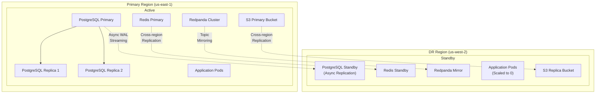

# ERP-SCM Disaster Recovery Plan

## 1. Overview

This document defines the disaster recovery (DR) strategy for ERP-SCM, including backup procedures, recovery objectives, failover mechanisms, and testing schedules. The plan ensures business continuity across all supply chain operations.

---

## 2. Recovery Objectives

| Metric | Target | Description |
|---|---|---|
| **RTO** (Recovery Time Objective) | 30 minutes | Maximum acceptable downtime |
| **RPO** (Recovery Point Objective) | 5 minutes | Maximum acceptable data loss |
| **MTTR** (Mean Time to Recovery) | 15 minutes | Average recovery time target |

---

## 3. DR Architecture



---

## 4. Backup Strategy

### 4.1 PostgreSQL

| Backup Type | Frequency | Retention | Storage |
|---|---|---|---|
| WAL archiving | Continuous | 7 days | S3 (encrypted) |
| Full pg_dump | Daily at 02:00 UTC | 30 days | S3 (encrypted) |
| Logical backup | Weekly (Sunday 03:00 UTC) | 90 days | S3 Glacier |
| Annual archive | Yearly (Jan 1) | 7 years | S3 Glacier Deep Archive |

### 4.2 Redis

| Backup Type | Frequency | Retention |
|---|---|---|
| RDB snapshot | Every 15 minutes | 7 days |
| AOF persistence | Continuous (1s fsync) | Current |

### 4.3 Event Bus (Redpanda)

| Protection | Method | RPO |
|---|---|---|
| Topic replication | Factor 3 within cluster | 0 |
| Cross-region mirroring | Async topic mirror | < 1 minute |

### 4.4 Object Storage

| Protection | Method |
|---|---|
| Versioning | Enabled (all buckets) |
| Cross-region replication | Real-time async replication |
| Lifecycle policy | 30-day soft-delete recovery |

---

## 5. Failure Scenarios & Recovery Procedures

### 5.1 Single Service Failure

**Impact**: One SCM domain unavailable (e.g., procurement service)
**Detection**: Health check failure, pod restart
**Recovery**:
```bash
# Automatic: Kubernetes restarts the pod
# If persistent:
kubectl rollout restart deployment/procurement-service -n erp-scm

# Check status
kubectl get pods -n erp-scm -l app=procurement-service
```
**RTO**: < 2 minutes (automatic)

### 5.2 Database Primary Failure

**Impact**: All write operations fail
**Detection**: PostgreSQL health check, connection errors
**Recovery**:
```bash
# Patroni/Stolon auto-failover promotes replica
# Verify:
kubectl exec -n erp-scm pg-0 -- patronictl list

# Manual promotion if auto-failover fails:
kubectl exec -n erp-scm pg-replica-1 -- pg_ctl promote
```
**RTO**: < 30 seconds (automatic failover)

### 5.3 Full Region Failure

**Impact**: Complete system outage
**Detection**: Multi-service health check failures, external monitoring
**Recovery**:
```bash
# 1. Activate DR region
kubectl config use-context dr-us-west-2

# 2. Scale up standby application pods
kubectl scale deployment --all -n erp-scm --replicas=2

# 3. Promote database standby to primary
kubectl exec -n erp-scm pg-standby-0 -- pg_ctl promote

# 4. Update DNS to point to DR region
aws route53 change-resource-record-sets --hosted-zone-id $ZONE_ID \
  --change-batch file://dr-dns-switch.json

# 5. Verify services
for svc in procurement inventory warehouse manufacturing; do
  curl -s https://scm-dr.company.com/v1/$svc/healthz
done
```
**RTO**: < 30 minutes

### 5.4 Data Corruption

**Impact**: Incorrect data in one or more tables
**Detection**: Data validation checks, user reports
**Recovery**:
```bash
# Point-in-Time Recovery to before corruption
pg_restore --target-time="2026-02-23T09:00:00Z" \
  --dbname=scm_recovery \
  --host=pg-recovery

# Extract clean data
pg_dump --table=affected_table scm_recovery > clean_data.sql

# Apply to production (after review)
psql -h pg-primary -d scm < clean_data.sql
```
**RTO**: 1-4 hours depending on scope

---

## 6. DR Testing Schedule

| Test Type | Frequency | Duration | Participants |
|---|---|---|---|
| Backup restoration | Monthly | 2 hours | DBA + SRE |
| Single service failover | Monthly | 30 minutes | SRE |
| Database failover | Quarterly | 1 hour | DBA + SRE |
| Full region failover | Annually | 4 hours | All engineering |
| Tabletop exercise | Semi-annually | 2 hours | Engineering + Business |

---

## 7. Communication Plan

### During an Incident

| Time | Action | Who |
|---|---|---|
| T+0 | Incident detected | Monitoring system |
| T+2 min | On-call paged | PagerDuty |
| T+5 min | Initial assessment posted | On-call engineer |
| T+10 min | Status page updated | SRE team |
| T+15 min | Stakeholder notification | Engineering manager |
| T+30 min | Executive brief (if SEV-1) | VP Engineering |

### Post-Recovery

| Action | Timeline |
|---|---|
| Status page updated: resolved | Immediately after recovery |
| Root cause identified | 24 hours |
| Postmortem published | 48 hours |
| Action items tracked | 72 hours |
| Follow-up review | 2 weeks |

---

## 8. Business Continuity Priorities

If partial recovery is necessary, restore services in this order:

| Priority | Service | Justification |
|---|---|---|
| 1 | Inventory Service | Core data for all operations |
| 2 | Procurement Service | Active POs and supplier communication |
| 3 | Warehouse Service | Daily operations (receiving, shipping) |
| 4 | Logistics Service | Shipment tracking |
| 5 | Supplier Portal | External stakeholder access |
| 6 | Manufacturing Service | Production operations |
| 7 | Quality Service | Inspection workflows |
| 8 | Fleet Service | Vehicle operations |
| 9 | Demand Planning | Planning can wait 24hrs |
