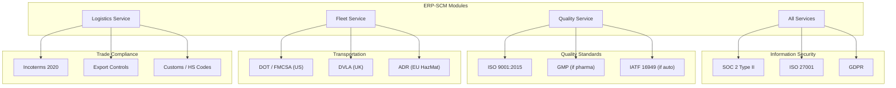
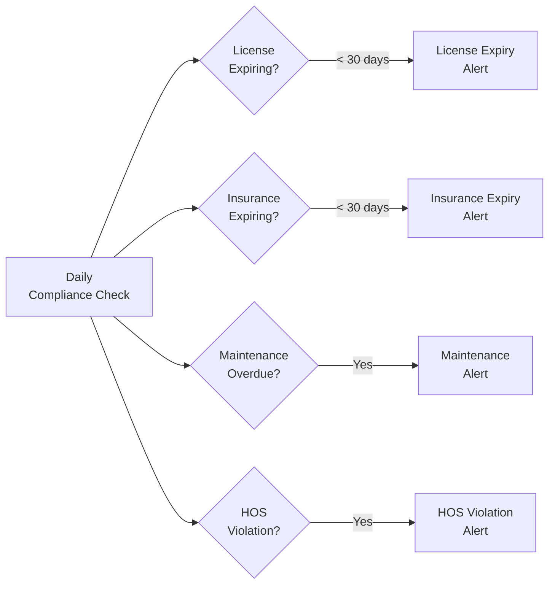

# ERP-SCM Compliance & Regulatory Guide

## 1. Overview

ERP-SCM operates in regulated environments across manufacturing, logistics, and fleet management. This document details the compliance requirements, how ERP-SCM addresses them, and the audit evidence the system generates.

---

## 2. Compliance Framework Map



---

## 3. SOC 2 Type II Compliance

### 3.1 Trust Service Criteria Coverage

| Criteria | ERP-SCM Controls |
|---|---|
| **Security** | JWT auth, RBAC, encryption at rest/transit, WAF, vulnerability scanning |
| **Availability** | HA deployment, auto-scaling, DR plan, 99.95% SLA |
| **Processing Integrity** | Input validation, 3-way matching, audit trails, idempotency |
| **Confidentiality** | Field-level encryption, data classification, access logging |
| **Privacy** | GDPR compliance, data minimization, consent management |

### 3.2 Audit Evidence Generated

| Evidence | Source | Frequency |
|---|---|---|
| Access logs | API Gateway | Continuous |
| Authentication logs | ERP-IAM | Continuous |
| Change management records | Git + CI/CD | Per deployment |
| Vulnerability scan reports | Trivy, Snyk, Bandit | Per PR + weekly |
| Incident response records | PagerDuty + postmortems | Per incident |
| Backup verification | DR test reports | Monthly |

---

## 4. GDPR Compliance

### 4.1 Data Subject Categories

| Category | Data Elements | Lawful Basis |
|---|---|---|
| Internal Users | Name, email, role | Legitimate interest (employment) |
| Supplier Contacts | Name, email, phone, address | Contractual necessity |
| Drivers | Name, license, GPS location | Contractual necessity + legal obligation |
| Portal Users | Name, email | Consent |

### 4.2 Data Protection Measures

| Requirement | Implementation |
|---|---|
| Data minimization | Only collect fields required for business function |
| Encryption | AES-256 at rest, TLS 1.3 in transit, field-level for PII |
| Right to access (Art. 15) | Data export API: `GET /v1/admin/data-export/{subject_id}` |
| Right to erasure (Art. 17) | Anonymization API: `POST /v1/admin/data-erasure/{subject_id}` |
| Data portability (Art. 20) | JSON/CSV export of all personal data |
| Breach notification (Art. 33) | 72-hour notification process documented |
| DPA with processors | Contracts with cloud providers, carriers |

### 4.3 Data Retention Schedule

| Data Category | Retention Period | Post-Retention Action |
|---|---|---|
| Active business data | Duration of service + 1 year | Archive |
| Financial records (POs, invoices) | 7 years | Archive to cold storage |
| Audit logs | 7 years | Archive to cold storage |
| Personal data (inactive users) | 2 years after deactivation | Anonymize |
| GPS/telemetry data | 90 days | Aggregate and delete |
| AI model training data | 3 years | Re-evaluate necessity |

---

## 5. ISO 9001:2015 (Quality Management)

### 5.1 QMS Module Support

| ISO 9001 Clause | ERP-SCM Feature |
|---|---|
| 7.1.5 Monitoring & measuring | Inspection plans, SPC charts, measurement recording |
| 8.4 Control of externally provided | Supplier quality management, incoming inspection, vendor scorecards |
| 8.5.1 Production control | Production orders, work instructions, process parameters |
| 8.5.2 Identification & traceability | Lot/batch/serial tracking, BOM traceability |
| 8.6 Release of products | Final inspection, disposition decisions |
| 8.7 Nonconforming outputs | NCR management, quarantine, disposition |
| 10.2 Corrective action | CAPA workflows, root cause analysis, effectiveness verification |
| 10.3 Continual improvement | Forecast accuracy tracking, supplier score trends, SPC monitoring |

### 5.2 Document Control

| Document Type | Management Method |
|---|---|
| Quality plans | Version-controlled in quality-service |
| Inspection procedures | Linked to quality plans |
| NCR records | Immutable audit trail |
| CAPA records | Workflow-enforced lifecycle |
| Certificates of Analysis | Document management in object storage |
| Calibration records | Integration with equipment management |

---

## 6. Transportation & Fleet Compliance

### 6.1 DOT/FMCSA Compliance (US)

| Regulation | ERP-SCM Feature |
|---|---|
| Hours of Service (HOS) | ELD integration, trip logging with timestamps |
| Driver Qualification (Part 391) | License tracking, medical certificate expiry alerts |
| Vehicle Inspection (Part 396) | Pre-trip inspection checklists, maintenance records |
| Drug & Alcohol Testing | Testing schedule tracking, result recording |
| DVIR (Driver Vehicle Inspection Report) | Digital DVIR with defect reporting |

### 6.2 DVLA Compliance (UK)

| Requirement | ERP-SCM Feature |
|---|---|
| Vehicle registration | Registration number, VIN, tax/MOT dates |
| Driver licensing | License class, endorsements, penalty points |
| Tachograph data | Digital tachograph integration |
| Insurance | Policy tracking, expiry alerts |

### 6.3 Compliance Alerts



---

## 7. Trade Compliance

### 7.1 Incoterms Management

ERP-SCM supports all Incoterms 2020 rules:

| Group | Terms | Managed By |
|---|---|---|
| E (Departure) | EXW | Procurement / Logistics |
| F (Main Carriage Unpaid) | FCA, FAS, FOB | Logistics |
| C (Main Carriage Paid) | CFR, CIF, CPT, CIP | Logistics |
| D (Arrival) | DAP, DPU, DDP | Logistics |

Each PO and shipment records the applicable Incoterm, which drives:
- Cost allocation between buyer and seller
- Risk transfer point
- Insurance responsibility
- Customs clearance responsibility

---

## 8. Audit Trail

Every compliance-relevant action generates an immutable audit record:

```json
{
  "audit_id": "uuid",
  "timestamp": "2026-02-23T10:30:00Z",
  "tenant_id": "uuid",
  "actor": "user-uuid",
  "action": "quality.inspection.completed",
  "resource": "inspection/uuid",
  "result": "lot_accepted",
  "details": {
    "sample_size": 50,
    "defects_found": 1,
    "acceptance_number": 3,
    "disposition": "accept"
  },
  "ip_address": "10.0.1.50",
  "signature": "hmac-sha256:abcdef..."
}
```

Audit records are:
- Stored in an append-only table (no UPDATE or DELETE)
- HMAC-signed for tamper detection
- Retained for 7 years
- Exportable for external audit review
