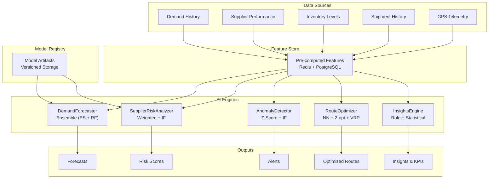
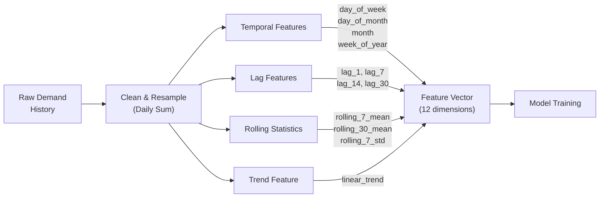
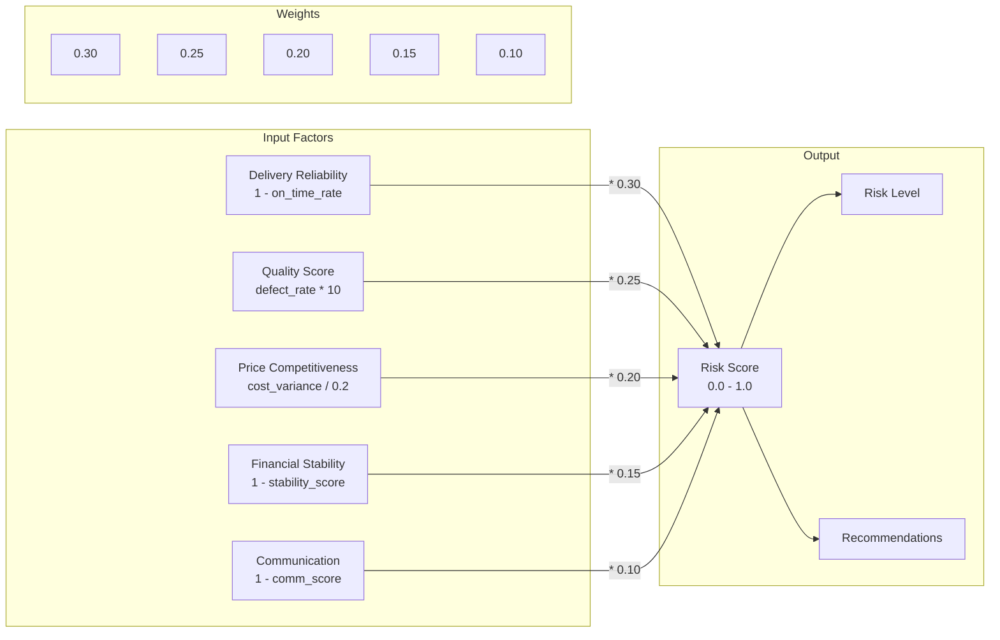
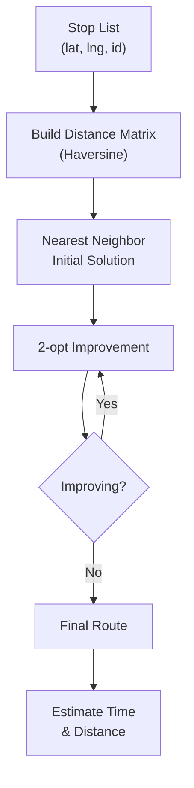

# ERP-SCM AI/ML Technical Specifications

## 1. Overview

ERP-SCM embeds five AI/ML engines as first-class citizens: Demand Forecaster, Supplier Risk Analyzer, Anomaly Detector, Route Optimizer, and Insights Engine. This document provides detailed specifications for each model including algorithms, features, training procedures, validation methods, and production deployment.

---

## 2. AI Architecture



---

## 3. Model 1: Demand Forecaster

### 3.1 Algorithm Specification

| Attribute | Value |
|---|---|
| **Primary Model** | Exponential Smoothing (Holt-Winters double) |
| **Secondary Model** | Random Forest Regressor |
| **Ensemble Method** | Weighted average (40% ES, 60% RF) |
| **Forecast Horizon** | 30 days (configurable up to 365) |
| **Granularity** | Daily |
| **Minimum Data** | 7 days (fallback to baseline with < 7 days) |
| **Confidence Level** | 95% (Z = 1.96) |

### 3.2 Feature Engineering



| Feature | Formula | Purpose |
|---|---|---|
| `day_of_week` | `date.dayofweek` (0-6) | Weekly seasonality |
| `day_of_month` | `date.day` (1-31) | Monthly patterns |
| `month` | `date.month` (1-12) | Annual seasonality |
| `week_of_year` | `date.isocalendar().week` | Annual position |
| `lag_1` | `demand[t-1]` | Previous day signal |
| `lag_7` | `demand[t-7]` | Same day last week |
| `lag_14` | `demand[t-14]` | Two weeks ago |
| `lag_30` | `demand[t-30]` | One month ago |
| `rolling_7` | `mean(demand[t-7:t])` | Short-term trend |
| `rolling_30` | `mean(demand[t-30:t])` | Medium-term trend |
| `rolling_7_std` | `std(demand[t-7:t])` | Recent volatility |
| `trend` | `range(0, len(data))` | Linear trend component |

### 3.3 Exponential Smoothing Parameters

```python
alpha = 0.3   # Level smoothing (higher = more reactive)
beta = 0.1    # Trend smoothing (lower = more stable trend)

# Update equations:
level[t] = alpha * y[t] + (1 - alpha) * (level[t-1] + trend[t-1])
trend[t] = beta * (level[t] - level[t-1]) + (1 - beta) * trend[t-1]

# Forecast:
forecast[t+h] = level[t] + h * trend[t]
```

### 3.4 Random Forest Configuration

```python
RandomForestRegressor(
    n_estimators=100,      # Number of trees
    max_depth=10,          # Maximum tree depth
    random_state=42,       # Reproducibility
    n_jobs=-1,             # Parallel training
)
```

### 3.5 Confidence Intervals

```python
std = np.std(recent_demand[-30:])  # Recent volatility
confidence = min(0.95, max(0.5, 1 - (std / (mean + 1e-6))))
lower_bound = max(0, forecast - 1.96 * std)
upper_bound = forecast + 1.96 * std
```

### 3.6 EOQ Calculation

```python
annual_demand = avg_daily_demand * 365
ordering_cost = 50.0  # Fixed cost per order
holding_cost = unit_cost * 0.25  # 25% of unit cost annually
eoq = ceil(sqrt(2 * annual_demand * ordering_cost / holding_cost))

# Safety stock
z_score = 1.65  # 95% service level
safety_stock = z_score * std_daily * sqrt(lead_time_days)
reorder_point = ceil(avg_daily * lead_time_days + safety_stock)
```

---

## 4. Model 2: Supplier Risk Analyzer

### 4.1 Weighted Composite Scoring



### 4.2 Isolation Forest for Anomaly Detection

```python
IsolationForest(
    contamination=0.1,   # Expected 10% anomalous suppliers
    random_state=42,
    n_estimators=100,
)

# Input features per supplier:
features = [
    reliability_score,
    quality_score,
    price_competitiveness,
    financial_stability,
    communication_score,
]

# Output: -1 (anomaly) or 1 (normal)
```

### 4.3 Trend Calculation

```python
# Compare recent 3-period average vs older 3-period average
recent_avg = mean(scores[:3])
older_avg = mean(scores[3:6])
diff = recent_avg - older_avg

if diff > 0.05: return "improving"
elif diff < -0.05: return "declining"
else: return "stable"
```

---

## 5. Model 3: Anomaly Detector

### 5.1 Detection Strategies

| Strategy | Algorithm | Parameters | Targets |
|---|---|---|---|
| Inventory | Rule-based comparison | qty <= reorder_point | All active inventory items |
| Overstock | Rule-based comparison | qty > reorder_qty * 5 | All active inventory items |
| Demand | Z-score analysis | z_threshold = 2.5 | Products with >= 14 days history |
| Delivery | Rule-based date comparison | expected_delivery < now | In-progress orders |
| Supplier | Isolation Forest | contamination = 0.1 | Active suppliers (min 5) |

### 5.2 Z-Score Demand Detection

```python
# For each product with >= 14 days of demand history:
quantities = demand_history[-90:]  # 90-day lookback
mean_q = np.mean(quantities)
std_q = np.std(quantities)

# Check last 7 days
for value in quantities[-7:]:
    z_score = (value - mean_q) / std_q
    if z_score > 2.5:  # Demand spike
        create_alert(severity=HIGH, type=DEMAND_SPIKE)
    elif z_score < -2.5:  # Demand drop
        create_alert(severity=MEDIUM, type=ANOMALY)
```

---

## 6. Model 4: Route Optimizer

### 6.1 Algorithm Pipeline



### 6.2 Haversine Distance

```python
def haversine(lat1, lon1, lat2, lon2):
    R = 6371.0  # Earth radius in km
    dlat = radians(lat2 - lat1)
    dlon = radians(lon2 - lon1)
    a = sin(dlat/2)**2 + cos(radians(lat1)) * cos(radians(lat2)) * sin(dlon/2)**2
    return R * 2 * asin(sqrt(a))
```

### 6.3 Speed Estimation

| Distance Range | Speed (km/h) | Context |
|---|---|---|
| > 1000 km | 80 | Long-haul highway |
| 100-1000 km | 60 | Regional highway |
| < 100 km | 40 | Urban delivery |

Weight penalty: `weight_factor = 1 + (weight_kg / 10000) * 0.1`

### 6.4 OR-Tools VRP Extension

For multi-vehicle problems with capacity constraints:

```python
from ortools.constraint_solver import routing_enums_pb2, pywrapcp

manager = pywrapcp.RoutingIndexManager(num_stops, num_vehicles, depot_index)
routing = pywrapcp.RoutingModel(manager)

# Add capacity constraint
routing.AddDimensionWithVehicleCapacity(
    callback, 0, vehicle_capacities, True, "Capacity"
)

# Solve
search_parameters = pywrapcp.DefaultRoutingSearchParameters()
search_parameters.first_solution_strategy = (
    routing_enums_pb2.FirstSolutionStrategy.PATH_CHEAPEST_ARC
)
```

---

## 7. Model 5: Insights Engine

The Insights Engine is primarily rule-based with statistical analysis:

| Insight Category | Detection Method | Threshold |
|---|---|---|
| Dead stock | Zero demand in 90 days | quantity > 0 |
| Overstock | Quantity > 3x reorder quantity | Per item |
| Underperforming suppliers | Reliability < 70% | Per supplier |
| Supplier concentration | Single supplier > 50% of orders | Per tenant |
| High cancellation rate | Cancel rate > 5% | Per tenant |
| Trending demand (up) | 30-day vs prior 30-day > +30% | Per product |
| Trending demand (down) | 30-day vs prior 30-day < -30% | Per product |
| Late delivery rate | Late deliveries > 10% | Per tenant |

### Supply Chain Health Score

```python
scores = {
    "inventory_health": 100 - (low_stock_pct * 5),
    "supplier_health": min(100, avg_supplier_score * 125),
    "fulfillment_health": min(100, fulfillment_rate),
    "logistics_health": min(100, active_shipments / pending_orders * 100),
}
overall = mean(scores.values())
grade = "A" if overall >= 90 else "B" if overall >= 80 else "C" if overall >= 70 else "D" if overall >= 60 else "F"
```

---

## 8. Model Retraining & Monitoring

### 8.1 Retraining Schedule

| Model | Trigger | Default Schedule |
|---|---|---|
| Demand Forecast | Per-SKU on request or schedule | Every 24 hours |
| Supplier Risk | On new performance data | Monthly |
| Anomaly Detection | On schedule | Every 15 minutes (detection run) |
| Route Optimizer | Per-request (no persistent model) | N/A |
| Insights Engine | On schedule | Every 60 seconds (KPIs) |

### 8.2 Model Drift Detection

```python
# Automated MAPE monitoring
current_mape = calculate_mape(recent_forecasts, actuals)
if current_mape > MAPE_THRESHOLD:  # Default: 0.20
    trigger_alert("Forecast accuracy degraded", severity="WARNING")
    schedule_retraining(model="demand_forecaster")
```

### 8.3 A/B Testing Framework

New models can be deployed alongside production models:

```python
class ModelRouter:
    def predict(self, product_id, features):
        if is_in_experiment(product_id, "new_prophet_model"):
            prediction_a = self.model_a.predict(features)  # Current
            prediction_b = self.model_b.predict(features)  # Candidate
            log_experiment(product_id, prediction_a, prediction_b)
            return prediction_a  # Always serve current in production
        return self.model_a.predict(features)
```
