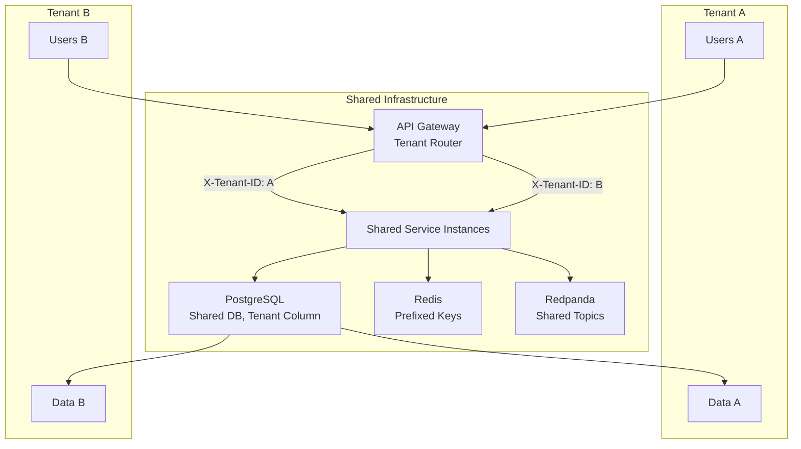
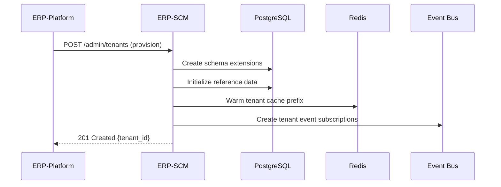

# ERP-SCM Multi-Tenancy Architecture

## 1. Overview

ERP-SCM implements multi-tenancy at every layer -- API, application, database, caching, and event bus -- to securely isolate tenant data while sharing infrastructure for cost efficiency. This document specifies the tenancy model, isolation mechanisms, and operational considerations.

---

## 2. Tenancy Model



**Model**: Shared database with tenant discriminator column (`tenant_id` UUID on every table).

---

## 3. Tenant Isolation Layers

### 3.1 API Layer

Every request must include the `X-Tenant-ID` header, validated against the JWT claims:

```python
async def validate_tenant(
    request: Request,
    current_user: User = Depends(get_current_user),
) -> UUID:
    tenant_id = request.headers.get("X-Tenant-ID")
    if not tenant_id:
        raise HTTPException(400, "X-Tenant-ID header required")

    tenant_uuid = UUID(tenant_id)
    if tenant_uuid not in current_user.tenant_ids:
        raise HTTPException(403, "Access to this tenant not authorized")

    return tenant_uuid
```

### 3.2 Database Layer

**Row-Level Security (RLS)**:

```sql
-- Enable RLS on all business tables
ALTER TABLE products ENABLE ROW LEVEL SECURITY;
ALTER TABLE inventory_items ENABLE ROW LEVEL SECURITY;
ALTER TABLE orders ENABLE ROW LEVEL SECURITY;
-- ... all tables

-- Create tenant isolation policy
CREATE POLICY tenant_isolation ON products
    USING (tenant_id = current_setting('app.current_tenant')::uuid);

-- Set tenant context at the start of each request
SET app.current_tenant = '<tenant-uuid>';
```

**ORM Enforcement**:

```python
class TenantAwareQuery:
    """Automatically filters all queries by tenant_id"""

    def __init__(self, session: Session, tenant_id: UUID):
        self.session = session
        self.tenant_id = tenant_id

    def query(self, model):
        return (
            self.session.query(model)
            .filter(model.tenant_id == self.tenant_id)
        )
```

### 3.3 Cache Layer

Redis keys are prefixed with the tenant ID:

```
Pattern: scm:{tenant_id}:{resource}:{key}

Examples:
  scm:tenant-abc:kpi:dashboard
  scm:tenant-abc:inventory:product-123:warehouse-456
  scm:tenant-xyz:supplier:sup-789:risk
```

### 3.4 Event Bus Layer

Events include `tenantid` in the CloudEvents envelope:

```json
{
  "specversion": "1.0",
  "type": "erp.scm.procurement.po.created",
  "tenantid": "tenant-abc-uuid",
  "data": { ... }
}
```

Consumers filter events by tenant when processing cross-tenant topics.

---

## 4. Tenant Provisioning



### Provisioning Steps

1. Validate tenant ID from ERP-Platform
2. Verify entitlement (subscription tier and feature set)
3. Initialize default data: categories, UOM codes, default warehouse
4. Create admin user for the tenant
5. Configure tenant-specific settings (currency, timezone, etc.)
6. Warm caches for initial dashboard load

---

## 5. Tenant Resource Limits

| Resource | Starter | Professional | Enterprise |
|---|---|---|---|
| Products | 1,000 | 50,000 | Unlimited |
| Suppliers | 50 | 500 | Unlimited |
| Warehouses | 1 | 10 | Unlimited |
| Users | 5 | 50 | Unlimited |
| AI Forecast calls/day | 100 | 5,000 | Unlimited |
| API requests/minute | 100 | 1,000 | 10,000 |
| Storage (documents) | 1 GB | 50 GB | 1 TB |
| Event retention | 7 days | 30 days | 90 days |

---

## 6. Cross-Tenant Operations

Certain platform-level operations span tenants:

| Operation | Scope | Access |
|---|---|---|
| Platform admin | All tenants | `scm:super_admin` role only |
| Aggregate analytics | All tenants (anonymized) | Platform analytics service |
| Model training | Federated across tenants | AI service (no data leakage) |
| System health | Infrastructure level | SRE team |

**Data leak prevention**:
- No API endpoint returns data from multiple tenants
- Aggregate analytics only exposes statistical summaries
- AI models are trained per-tenant (no cross-tenant feature sharing)
- Logs are tagged with tenant ID and can be filtered

---

## 7. Tenant Data Export & Deletion

### 7.1 Data Export

```http
POST /v1/admin/tenant-export
Authorization: Bearer <admin_token>
X-Tenant-ID: <tenant_id>

{
  "format": "json",  // json, csv, sql
  "entities": ["all"],  // or specific: ["products", "orders", "suppliers"]
  "include_history": true
}
```

### 7.2 Tenant Deletion

Complete removal of all tenant data:

```http
DELETE /v1/admin/tenants/{tenant_id}
Authorization: Bearer <platform_admin_token>
X-Confirm: "DELETE-TENANT-{tenant_id}"
```

This triggers:
1. Soft-delete all records (immediate)
2. Purge Redis cache with tenant prefix
3. Remove event subscriptions
4. Schedule hard-delete after 30-day grace period
5. Purge from backups after retention period
