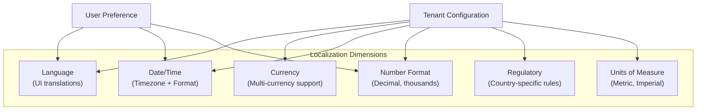

# ERP-SCM Localization & Internationalization

## 1. Overview

ERP-SCM supports multi-language interfaces, multi-currency operations, regional date/number formatting, and country-specific regulatory compliance across all nine service domains. This document specifies the i18n/L10n architecture and configuration.

---

## 2. Supported Dimensions



---

## 3. Language Support

### 3.1 Supported Languages

| Code | Language | Status |
|---|---|---|
| `en-US` | English (US) | GA (default) |
| `en-GB` | English (UK) | GA |
| `es-ES` | Spanish | GA |
| `fr-FR` | French | GA |
| `de-DE` | German | GA |
| `pt-BR` | Portuguese (Brazil) | GA |
| `zh-CN` | Chinese (Simplified) | Planned |
| `ja-JP` | Japanese | Planned |
| `ar-SA` | Arabic (RTL) | Planned |

### 3.2 Frontend i18n

Translation files organized by module:

```
frontend/src/locales/
├── en-US/
│   ├── common.json
│   ├── procurement.json
│   ├── inventory.json
│   ├── warehouse.json
│   ├── manufacturing.json
│   ├── demand.json
│   ├── logistics.json
│   ├── quality.json
│   ├── fleet.json
│   └── portal.json
├── es-ES/
│   └── ... (same structure)
└── fr-FR/
    └── ... (same structure)
```

Example translation file (`en-US/procurement.json`):

```json
{
  "procurement": {
    "title": "Procurement",
    "requisition": {
      "title": "Purchase Requisitions",
      "create": "New Requisition",
      "status": {
        "draft": "Draft",
        "submitted": "Submitted",
        "approved": "Approved",
        "rejected": "Rejected"
      }
    },
    "po": {
      "title": "Purchase Orders",
      "create": "New Purchase Order",
      "three_way_match": "3-Way Match"
    }
  }
}
```

### 3.3 Backend Translations

API error messages and email templates are translatable:

```python
from app.i18n import t

# Usage
raise ValidationError(
    t("errors.inventory.insufficient_stock", locale=user.locale,
      product=product.name, available=available_qty, requested=requested_qty)
)
# "Insufficient stock for {product}: {available} available, {requested} requested"
```

---

## 4. Multi-Currency Support

### 4.1 Currency Configuration

Each tenant has a base currency with support for transaction currencies:

| Field | Description |
|---|---|
| `base_currency` | Tenant's reporting currency (e.g., USD) |
| `transaction_currency` | Currency of individual transactions |
| `exchange_rate_source` | API provider for rates (ECB, Open Exchange) |
| `rate_refresh_interval` | How often to update rates (default: daily) |

### 4.2 Currency Handling

```python
class MoneyField:
    amount: Decimal  # Stored in transaction currency
    currency: str    # ISO 4217 code
    base_amount: Decimal  # Converted to tenant base currency
    exchange_rate: Decimal  # Rate at time of transaction
    rate_date: date  # Date of exchange rate
```

### 4.3 Supported Currencies

| Code | Currency | Symbol |
|---|---|---|
| USD | US Dollar | $ |
| EUR | Euro | EUR |
| GBP | British Pound | GBP |
| JPY | Japanese Yen | JPY |
| CNY | Chinese Yuan | CNY |
| CAD | Canadian Dollar | CA$ |
| AUD | Australian Dollar | A$ |
| BRL | Brazilian Real | R$ |
| INR | Indian Rupee | INR |
| NGN | Nigerian Naira | NGN |

---

## 5. Date, Time & Number Formatting

### 5.1 Date Formats

| Locale | Date Format | Example |
|---|---|---|
| `en-US` | MM/DD/YYYY | 02/23/2026 |
| `en-GB` | DD/MM/YYYY | 23/02/2026 |
| `de-DE` | DD.MM.YYYY | 23.02.2026 |
| `ja-JP` | YYYY/MM/DD | 2026/02/23 |
| `iso` | YYYY-MM-DD | 2026-02-23 |

### 5.2 Number Formats

| Locale | Decimal | Thousands | Example |
|---|---|---|---|
| `en-US` | `.` | `,` | 1,234,567.89 |
| `de-DE` | `,` | `.` | 1.234.567,89 |
| `fr-FR` | `,` | ` ` | 1 234 567,89 |

### 5.3 Timezone Handling

- All timestamps stored in UTC in the database
- Converted to tenant/user timezone for display
- Timezone specified per tenant and optionally per user

```python
from zoneinfo import ZoneInfo

def localize_datetime(dt_utc, timezone_str):
    tz = ZoneInfo(timezone_str)
    return dt_utc.astimezone(tz)
```

---

## 6. Units of Measure

### 6.1 UOM System

| System | Weight | Distance | Volume | Temperature |
|---|---|---|---|---|
| Metric | kg | km | m3, L | Celsius |
| Imperial | lbs | miles | ft3, gal | Fahrenheit |

### 6.2 UOM Conversion

```python
UOM_CONVERSIONS = {
    ("kg", "lbs"): 2.20462,
    ("lbs", "kg"): 0.453592,
    ("km", "miles"): 0.621371,
    ("miles", "km"): 1.60934,
    ("liters", "gallons"): 0.264172,
    ("gallons", "liters"): 3.78541,
    ("celsius", "fahrenheit"): lambda c: c * 9/5 + 32,
    ("fahrenheit", "celsius"): lambda f: (f - 32) * 5/9,
}
```

---

## 7. Regional Compliance Configuration

| Country | Tax System | Fleet Compliance | Import/Export |
|---|---|---|---|
| US | Sales tax (state-level) | DOT/FMCSA, ELD | Export controls, HTS codes |
| UK | VAT (20%) | DVLA, MOT | UK customs post-Brexit |
| EU | VAT (country-specific) | ADR (hazmat) | EU customs, CE marking |
| Brazil | ICMS, IPI, PIS/COFINS | ANTT | Siscomex |
| Nigeria | VAT (7.5%) | FRSC | NCS import duty |

### 7.1 Tenant Regional Settings

```json
{
  "tenant_id": "uuid",
  "regional_settings": {
    "country": "US",
    "locale": "en-US",
    "base_currency": "USD",
    "timezone": "America/New_York",
    "date_format": "MM/DD/YYYY",
    "number_format": {
      "decimal_separator": ".",
      "thousands_separator": ","
    },
    "uom_system": "imperial",
    "tax_system": "us_sales_tax",
    "fleet_compliance": "dot_fmcsa",
    "incoterms_default": "FOB"
  }
}
```

---

## 8. RTL (Right-to-Left) Support

For Arabic and Hebrew locales:
- CSS `direction: rtl` applied to layout container
- Tailwind CSS logical properties (start/end instead of left/right)
- Icon mirroring for directional icons
- Number rendering remains LTR within RTL context
