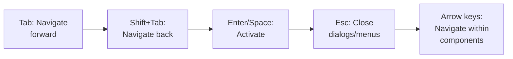

# ERP-SCM Accessibility Guide

## 1. Overview

ERP-SCM is designed to meet WCAG 2.1 Level AA accessibility standards across all user interfaces, ensuring the supply chain management platform is usable by people with diverse abilities. This document specifies accessibility requirements, implementation guidelines, and testing procedures.

---

## 2. Accessibility Standards

| Standard | Level | Status |
|---|---|---|
| WCAG 2.1 | Level AA | Target |
| Section 508 | Compliance | Target |
| EN 301 549 | EU Accessibility | Target |
| ARIA 1.2 | Best practices | Implemented |

---

## 3. Key Accessibility Features

### 3.1 Keyboard Navigation



All interactive elements must be fully operable via keyboard:

| Component | Keyboard Behavior |
|---|---|
| Navigation menu | Tab through items, Enter to select, arrows within |
| Data tables | Tab to table, arrow keys between cells, Enter to edit |
| Modals/dialogs | Focus trap, Esc to close, Tab cycles within |
| Dropdown menus | Enter to open, arrows to select, Enter to confirm |
| Date pickers | Arrows to navigate dates, Enter to select |
| Gantt chart | Arrow keys to move between tasks, Enter to open detail |
| Map views | Tab to markers, Enter for popup, arrows to pan |
| Forms | Tab between fields, Enter to submit |

### 3.2 Screen Reader Support

All components include proper ARIA attributes:

```html
<!-- Navigation -->
<nav aria-label="Main navigation">
  <ul role="menubar">
    <li role="menuitem" aria-current="page">Dashboard</li>
    <li role="menuitem">Procurement</li>
  </ul>
</nav>

<!-- KPI Card -->
<div role="region" aria-label="Total Products KPI">
  <span aria-hidden="true"><!-- icon --></span>
  <p id="kpi-label" class="text-xs">Total Products</p>
  <p aria-labelledby="kpi-label" class="text-2xl font-bold">156</p>
</div>

<!-- Data Table -->
<table aria-label="Purchase Orders">
  <thead>
    <tr>
      <th scope="col" aria-sort="descending">PO Number</th>
      <th scope="col">Supplier</th>
      <th scope="col">Status</th>
    </tr>
  </thead>
  <tbody>
    <tr>
      <td>PO-2026-0001</td>
      <td>Acme Parts</td>
      <td><span role="status">Confirmed</span></td>
    </tr>
  </tbody>
</table>

<!-- Chart with accessible alternative -->
<div role="img" aria-label="Supply chain health scores: Inventory 85%, Supplier 78%, Fulfillment 94%, Logistics 67%">
  <!-- Recharts visualization -->
</div>
<table class="sr-only">
  <caption>Supply Chain Health Scores</caption>
  <!-- Tabular data as screen reader alternative -->
</table>

<!-- Alert notifications -->
<div role="alert" aria-live="polite">
  Low stock alert: Widget A quantity is 5 units below reorder point
</div>
```

### 3.3 Color & Contrast

| Element | Foreground | Background | Contrast Ratio | WCAG Level |
|---|---|---|---|---|
| Body text | `#f8fafc` | `#0f172a` | 17.4:1 | AAA |
| Secondary text | `#94a3b8` | `#0f172a` | 6.1:1 | AA |
| Primary button | `#ffffff` | `#3b82f6` | 4.6:1 | AA |
| Error text | `#fca5a5` | `#1e293b` | 7.2:1 | AA |
| Success indicator | `#6ee7b7` | `#1e293b` | 8.1:1 | AA |
| Warning indicator | `#fcd34d` | `#1e293b` | 10.4:1 | AAA |

**Color-blind considerations**:
- Never use color alone to convey information
- Status badges include text labels alongside colors
- Charts use patterns/icons in addition to colors
- Alert severity uses icons (triangle, circle) plus text

### 3.4 Focus Management

```css
/* Visible focus indicator */
:focus-visible {
  outline: 2px solid #3b82f6;
  outline-offset: 2px;
  border-radius: 4px;
}

/* Skip to content link */
.skip-link:focus {
  position: fixed;
  top: 0;
  left: 0;
  background: #3b82f6;
  color: white;
  padding: 8px 16px;
  z-index: 9999;
}
```

### 3.5 Motion & Animation

- All animations respect `prefers-reduced-motion` media query
- Loading spinners have `aria-busy="true"` and descriptive text
- Auto-refresh intervals are user-configurable
- Map animations can be paused

```css
@media (prefers-reduced-motion: reduce) {
  * {
    animation-duration: 0.01ms !important;
    transition-duration: 0.01ms !important;
  }
}
```

---

## 4. Component-Specific Guidelines

### 4.1 Warehouse Floor Plan

The interactive warehouse floor plan must provide:
- Keyboard-navigable zone selection
- ARIA tree structure for zone > aisle > bin hierarchy
- Text-based alternative listing bin contents
- High-contrast mode for bin occupancy visualization

### 4.2 Gantt Chart (Production Scheduler)

- Tab navigation between work orders
- Arrow key navigation within timeline
- Screen reader announcement of work order details on focus
- Accessible legend explaining color meanings
- Tabular alternative view of schedule data

### 4.3 Map Views (Logistics Tracker, Fleet Monitor)

- Tab-navigable shipment/vehicle markers
- Screen reader announces marker details on focus
- Keyboard-accessible zoom and pan controls
- List view alternative for all map data
- Route details in text format

---

## 5. Supplier Portal Accessibility

The supplier portal (light theme) has additional requirements:
- Higher contrast ratios for the light background design
- Print-friendly styles for POs and invoices
- Large click targets for mobile/tablet use (minimum 44x44px)
- Clear form error messages with programmatic association

---

## 6. Testing Procedures

### 6.1 Automated Testing

| Tool | Purpose | Integration |
|---|---|---|
| axe-core | WCAG rule checking | CI pipeline + Playwright |
| Lighthouse | Accessibility score | CI pipeline |
| ESLint jsx-a11y | JSX accessibility rules | Pre-commit hook |
| Pa11y | Page-level accessibility testing | Nightly CI run |

### 6.2 Manual Testing

| Test | Frequency | Tester |
|---|---|---|
| Keyboard-only navigation | Per release | QA team |
| Screen reader testing (NVDA, VoiceOver) | Per release | Accessibility specialist |
| Color contrast verification | Per UI change | Design team |
| Cognitive load assessment | Quarterly | UX researcher |

### 6.3 Accessibility Checklist

- [ ] All images have alt text (or aria-hidden for decorative)
- [ ] All form inputs have associated labels
- [ ] All interactive elements are keyboard accessible
- [ ] Tab order follows logical reading order
- [ ] Focus is visible on all interactive elements
- [ ] Color is not the sole means of conveying information
- [ ] Error messages are programmatically associated with inputs
- [ ] Page titles are descriptive and unique
- [ ] Heading hierarchy is logical (h1 > h2 > h3)
- [ ] Dynamic content changes are announced to screen readers
- [ ] Skip navigation link is present
- [ ] Text can be resized to 200% without loss of content
