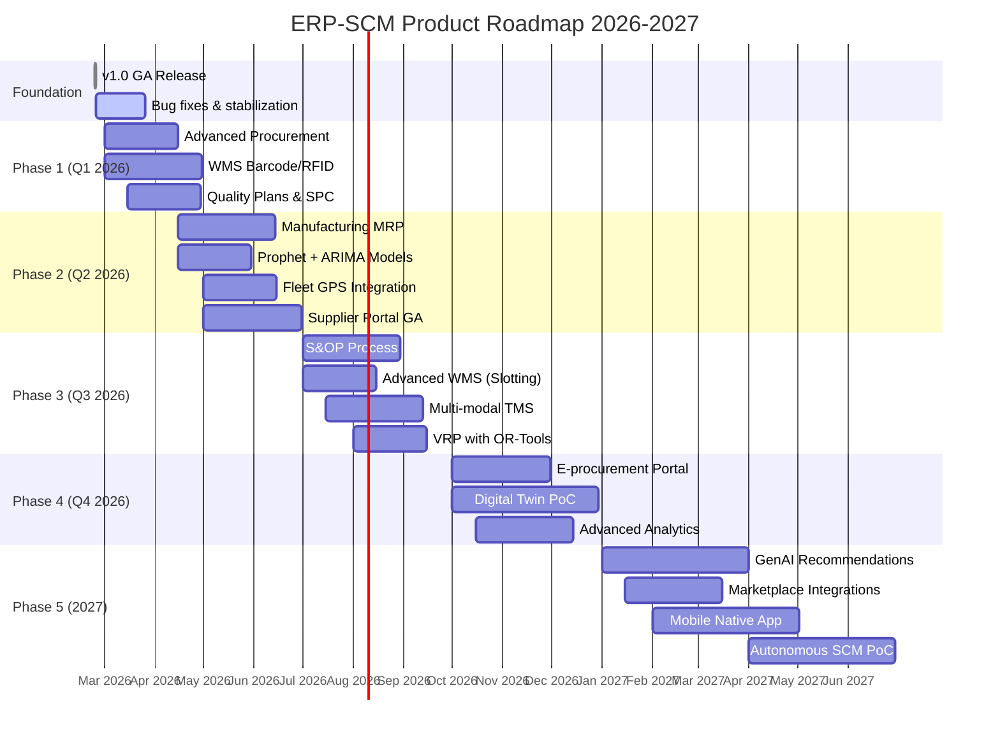

# ERP-SCM Product Roadmap

## 1. Overview

This document outlines the strategic product roadmap for ERP-SCM, detailing planned features, enhancements, and capabilities across short-term (0-6 months), medium-term (6-12 months), and long-term (12-24 months) horizons.

---

## 2. Roadmap Timeline

---

## 3. Phase 1: Foundation Hardening (Q1 2026)

### 3.1 Advanced Procurement
- **Blanket order management** with scheduled releases
- **Contract lifecycle management** with renewal alerts
- **RFQ/RFP workflow** with multi-round bidding
- **Spend analytics dashboard** with category breakdown
- **Approval matrix engine** (amount-based, multi-level)

### 3.2 WMS Barcode/RFID
- **Web-based barcode scanning** via camera API
- **GS1-128 barcode generation** for shipping labels
- **RFID reader integration** via WebSocket bridge
- **Mobile-responsive receiving interface**
- **Scan-to-confirm pick** accuracy validation

### 3.3 Quality Plans & SPC
- **Quality plan templates** (incoming, in-process, final)
- **AQL sampling tables** (ANSI/ASQ Z1.4)
- **SPC control charts** (X-bar, R-chart, p-chart)
- **ISO 9001 compliance tracker** with document links
- **Supplier quality scorecards**

---

## 4. Phase 2: Operational Depth (Q2 2026)

### 4.1 Manufacturing MRP
- **Multi-level BOM explosion** with phantom component support
- **Full MRP run engine** (net requirements, planned orders, pegging)
- **Finite capacity scheduling** with Gantt UI
- **Work center management** with efficiency tracking
- **WIP costing** and production variance reporting
- **Scrap and yield management**

### 4.2 Prophet + ARIMA Forecasting Models
- **Facebook Prophet** integration for seasonality detection
- **ARIMA/SARIMA** for stationary time series
- **Model selection engine** that auto-picks best model per SKU
- **Promotional lift modeling** for planned events
- **New product introduction** forecasting using analogues

### 4.3 Fleet GPS Integration
- **Real-time GPS tracking** via Geotab/Samsara/MQTT
- **Driver behavior monitoring** (speed, braking, idle)
- **Geofencing** for warehouse/depot boundaries
- **ELD integration** for HOS compliance
- **Fuel consumption analytics** with efficiency benchmarking

### 4.4 Supplier Portal GA
- **PO acknowledgement** and confirmation workflow
- **ASN submission** with line item detail
- **Invoice submission** and 3-way match status
- **Payment status tracking**
- **Self-service onboarding** with document upload
- **Messaging/Q&A** between buyer and supplier

---

## 5. Phase 3: Planning Excellence (Q3 2026)

### 5.1 S&OP Process
- **Multi-step consensus planning** workflow
- **Sales overlay** with pipeline integration
- **Marketing overlay** with promotional calendar
- **Finance overlay** with budget constraints
- **Executive approval** dashboard
- **What-if scenario** simulation

### 5.2 Advanced WMS
- **Slotting optimization** based on velocity and ergonomics
- **Labor management** with productivity metrics
- **Task interleaving** (receive + putaway + pick in one trip)
- **Cross-docking rules** engine
- **Kitting and assembly** work orders

### 5.3 Multi-Modal TMS
- **Ocean freight** rate management
- **Air freight** integration
- **Rail intermodal** support
- **Drayage** coordination
- **Freight consolidation** optimizer

### 5.4 VRP with OR-Tools
- **Multi-vehicle routing** with capacity constraints
- **Time window constraints** for delivery appointments
- **Vehicle type matching** (refrigerated, hazmat)
- **Dynamic re-routing** on GPS updates
- **CO2 emission** calculation per route

---

## 6. Phase 4: Digital Transformation (Q4 2026)

### 6.1 E-Procurement Portal
- **Catalog-based ordering** for indirect materials
- **Punchout catalogs** (cXML)
- **Self-service procurement** for department users
- **Automated approval** for low-value orders
- **Contract compliance** monitoring

### 6.2 Digital Twin PoC
- **Supply chain simulation** engine
- **Disruption scenario modeling** (port closure, supplier failure)
- **Inventory optimization** simulation
- **Network design** optimization
- **Monte Carlo risk analysis**

### 6.3 Advanced Analytics
- **Executive dashboard** with drill-down capabilities
- **Predictive analytics** for demand patterns
- **Prescriptive recommendations** for inventory positioning
- **Supplier risk heat maps**
- **Cost-to-serve analysis**

---

## 7. Phase 5: AI-Native SCM (2027)

### 7.1 Generative AI Recommendations
- **Natural language insights** ("Your inventory turnover improved 15% this month because...")
- **Automated action suggestions** with one-click execution
- **Conversational supply chain assistant** (chat interface)
- **Automated PO creation** from forecasts + rules
- **Smart alert summarization**

### 7.2 Marketplace Integrations
- **Amazon Seller Central** integration
- **Shopify** inventory sync
- **Walmart Marketplace** connection
- **eBay** order import
- **Unified multi-channel** inventory management

### 7.3 Mobile Native App
- **iOS and Android** native apps (React Native)
- **Warehouse scanning** via phone camera
- **Driver trip management** mobile interface
- **Push notifications** for alerts
- **Offline-first** for warehouse operations

### 7.4 Autonomous SCM PoC
- **Autonomous replenishment** (AI-generated POs without human approval for routine items)
- **Self-healing supply chain** (auto-reroute on disruption)
- **Predictive maintenance** for fleet (ML-based failure prediction)
- **Automated quality disposition** based on historical patterns

---

## 8. Technical Debt Roadmap

| Item | Priority | Target |
|---|---|---|
| Migrate from SQLite to PostgreSQL (production) | P0 | Q1 2026 |
| Add Alembic migrations for all tables | P0 | Q1 2026 |
| Implement Redis caching layer | P1 | Q1 2026 |
| Add OpenTelemetry instrumentation | P1 | Q2 2026 |
| Microservice decomposition (from monolith) | P2 | Q2-Q3 2026 |
| Add comprehensive test coverage (>80%) | P1 | Q2 2026 |
| Implement event bus (Redpanda) | P1 | Q2 2026 |
| Frontend code splitting and optimization | P2 | Q3 2026 |

---

## 9. Success Metrics by Phase

| Phase | Key Metric | Target |
|---|---|---|
| Phase 1 | Feature completeness (procurement, WMS, quality) | 90% of P0 requirements |
| Phase 2 | Forecast accuracy (MAPE) | < 15% |
| Phase 3 | S&OP adoption rate | 80% of planning cycles |
| Phase 4 | Time-to-insight (analytics) | < 30 seconds |
| Phase 5 | Autonomous decision rate | 40% of routine orders |
