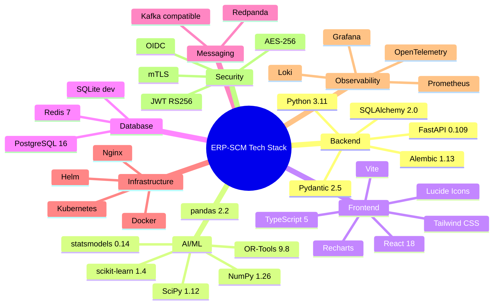

# ERP-SCM Appendix

## 1. Overview

This appendix compiles reference materials, configuration templates, code snippets, and supplementary information for the ERP-SCM module documentation set.

---

## 2. Document Index

| # | Document | Description | Key Audience |
|---|---|---|---|
| 01 | PRD | Product Requirements Document with competitive analysis | Product, Executive |
| 02 | Architecture | System architecture (C4, containers, deployment) | Engineering, Architecture |
| 03 | Technical Design | Internal design patterns, algorithms, API design | Backend Engineers |
| 04 | ERD | Complete entity-relationship diagram (80+ tables) | Database, Backend |
| 05 | API Reference | Full REST API specification with examples | All Engineers, Integrators |
| 06 | Use Cases | 30 detailed use cases across all SCM domains | Product, QA |
| 07 | User Stories | 25 user stories organized by epic | Product, Engineering |
| 08 | Figma Prompts | 9 detailed UI design prompts | Design, Frontend |
| 09 | Data Model | Database schema specification with DDL | Database, Backend |
| 10 | Event Catalog | Complete event catalog (60+ event types) | All Engineers |
| 11 | Security | Security architecture (auth, RBAC, encryption) | Security, Engineering |
| 12 | Integration Guide | Internal and external integration specifications | Integration, Partners |
| 13 | Deployment | Deployment guide (Docker, Kubernetes, CI/CD) | DevOps, SRE |
| 14 | Testing Strategy | Multi-layer testing approach and examples | QA, Engineering |
| 15 | Performance | Performance targets, optimization strategies | Engineering, SRE |
| 16 | Runbook | Operations runbook with troubleshooting procedures | SRE, Support |
| 17 | Observability | Metrics, logging, tracing specifications | SRE, Engineering |
| 18 | Configuration | Complete configuration reference | DevOps, Engineering |
| 19 | Changelog | Version history and release notes | All |
| 20 | Glossary | Domain terminology and abbreviations | All |
| 21 | Roles & Permissions | RBAC matrix with 20 roles and 50+ permissions | Security, Product |
| 22 | Workflow Diagrams | 9 business process workflow diagrams | Product, QA, Business |
| 23 | Data Migration | Migration guide from legacy systems | Implementation |
| 24 | Disaster Recovery | DR plan with RTO/RPO specifications | SRE, Architecture |
| 25 | Compliance | Regulatory compliance (SOC2, GDPR, ISO, DOT) | Legal, Security |
| 26 | AI/ML Specs | Detailed ML model specifications and algorithms | Data Science, Engineering |
| 27 | Multi-Tenancy | Tenant isolation architecture | Architecture, Engineering |
| 28 | Localization | i18n/L10n support (languages, currencies, UOM) | Frontend, Product |
| 29 | Accessibility | WCAG 2.1 AA compliance guide | Frontend, Design |
| 30 | Developer Guide | Local setup, coding conventions, contribution guide | All Engineers |
| 31 | Roadmap | Product roadmap through 2027 | Product, Executive |
| 32 | Appendix | Reference materials and supplementary information | All |

---

## 3. Technology Stack Quick Reference

---

## 4. Environment Variable Quick Reference

| Variable | Required | Default | Description |
|---|---|---|---|
| `DATABASE_URL` | Yes | `sqlite:///./scm.db` | Database connection string |
| `SECRET_KEY` | Yes | (default provided) | JWT signing key |
| `ALGORITHM` | No | `HS256` | JWT signing algorithm |
| `ACCESS_TOKEN_EXPIRE_MINUTES` | No | `1440` | Token expiry in minutes |
| `DEBUG` | No | `true` | Debug mode toggle |
| `CORS_ORIGINS` | No | `["localhost:5173","localhost:3000"]` | Allowed CORS origins |
| `REDIS_URL` | No | `redis://localhost:6379/0` | Redis connection |
| `KAFKA_BOOTSTRAP_SERVERS` | No | `localhost:9092` | Event bus servers |
| `AI_MODEL_RETRAIN_HOURS` | No | `24` | Model retrain interval |
| `DEMAND_FORECAST_HORIZON_DAYS` | No | `30` | Default forecast horizon |
| `ANOMALY_DETECTION_THRESHOLD` | No | `0.05` | Anomaly IF contamination |

---

## 5. API Endpoint Summary

### Total Endpoints: 80+

| Domain | Endpoints | Key Operations |
|---|---|---|
| Auth | 2 | Register, Login |
| Products | 5 | CRUD + Search |
| Inventory | 5 | CRUD + AI Optimize |
| Suppliers | 6 | CRUD + Risk Report + Rankings |
| Orders | 6 | CRUD + Approve + Cancel |
| Shipments | 6 | CRUD + Route Optimize + Consolidate |
| AI/Analytics | 7 | KPIs, Health, Insights, Forecast, Anomaly, Alerts |
| Procurement (ext) | 10 | Requisitions, RFQ, Contracts, 3-Way Match |
| Manufacturing | 7 | BOM, Production Orders, MRP, Schedule |
| Warehouse | 7 | Layout, Receiving, Picking, Packing, Shipping |
| Quality | 5 | Inspections, NCR, CAPA, SPC |
| Fleet | 6 | Vehicles, Drivers, Trips, Maintenance, Fuel |
| Supplier Portal | 5 | PO Ack, ASN, Invoice, Payment, Onboarding |
| Health/System | 3 | Health, Liveness, Capabilities |

---

## 6. Key Algorithms Quick Reference

| Algorithm | Location | Input | Output |
|---|---|---|---|
| Exponential Smoothing | `ai/demand_forecaster.py` | Time series, alpha, beta | 30-day forecast array |
| Random Forest Forecast | `ai/demand_forecaster.py` | 12-dim feature matrix | 30-day forecast array |
| EOQ Calculation | `ai/demand_forecaster.py` | Demand, costs | Reorder point + quantity |
| Supplier Risk Score | `ai/supplier_risk.py` | 5 weighted factors | 0-1 risk score + level |
| Isolation Forest | `ai/supplier_risk.py` | Supplier feature vectors | Anomaly labels |
| Z-Score Anomaly | `ai/anomaly_detector.py` | Demand time series | Alerts (spike/drop) |
| Haversine Distance | `ai/route_optimizer.py` | Two lat/lng pairs | Distance in km |
| Nearest Neighbor | `ai/route_optimizer.py` | Distance matrix | Initial route |
| 2-Opt Improvement | `ai/route_optimizer.py` | Initial route | Optimized route |
| Health Score | `ai/insights_engine.py` | KPIs | 0-100 score + A-F grade |

---

## 7. Mermaid Diagram Summary

This documentation set contains the following Mermaid diagrams:

| Document | Diagram Type | Description |
|---|---|---|
| 01-PRD | flowchart | Technical architecture overview |
| 02-Architecture | flowchart (x4) | C4 context, containers, AI layer, deployment |
| 02-Architecture | sequenceDiagram | Event flow between services |
| 02-Architecture | graph | RBAC role hierarchy |
| 03-Technical-Design | erDiagram | Core entity relationships |
| 03-Technical-Design | flowchart (x3) | Forecasting pipeline, risk scoring, saga pattern |
| 04-ERD | erDiagram | Complete 80+ table ERD |
| 04-ERD | flowchart | Domain relationship summary |
| 06-Use-Cases | graph | Use case actor diagram |
| 07-User-Stories | graph | Epic map |
| 10-Event-Catalog | flowchart | Event producer/consumer flow |
| 11-Security | flowchart (x2) | Security architecture, RBAC hierarchy |
| 12-Integration | flowchart (x2) | Integration architecture, finance flow |
| 13-Deployment | flowchart (x2) | K8s architecture, CI/CD pipeline |
| 14-Testing | graph | Testing pyramid |
| 15-Performance | flowchart | Caching strategy |
| 16-Runbook | flowchart | Service health dashboard |
| 17-Observability | flowchart | Observability architecture |
| 17-Observability | gantt | Example distributed trace |
| 18-Configuration | flowchart | Configuration hierarchy |
| 22-Workflows | flowchart (x8) | P2P, O2C, Plan-to-Produce, Receiving, Anomaly, Onboarding, Fleet, NCR-CAPA |
| 23-Data-Migration | flowchart (x2) | Migration architecture, entity load order |
| 24-Disaster-Recovery | flowchart | DR architecture, compliance alerts |
| 25-Compliance | flowchart | Compliance framework map |
| 26-AI-ML-Specs | flowchart (x4) | AI architecture, forecasting features, risk scoring, route optimization |
| 27-Multi-Tenancy | flowchart (x2) | Tenancy model, provisioning |
| 30-Developer-Guide | gitgraph | Git workflow |
| 31-Roadmap | gantt | Product roadmap timeline |
| 32-Appendix | mindmap | Technology stack |

**Total Mermaid diagrams: 45+**

---

## 8. Demo Credentials

| Environment | URL | Email | Password |
|---|---|---|---|
| Local (backend) | http://localhost:8000/docs | admin@scm.io | admin123 |
| Local (frontend) | http://localhost:5173 | admin@scm.io | admin123 |
| Docker | http://localhost:3000 | admin@scm.io | admin123 |

---

## 9. Key File Locations

| File | Path | Description |
|---|---|---|
| Main application | `/ERP-SCM/backend/app/main.py` | FastAPI app entry point |
| ORM Models | `/ERP-SCM/backend/app/models/models.py` | All SQLAlchemy models |
| Pydantic Schemas | `/ERP-SCM/backend/app/schemas/schemas.py` | All request/response schemas |
| Configuration | `/ERP-SCM/backend/app/core/config.py` | Settings with defaults |
| Demand Forecaster | `/ERP-SCM/backend/app/ai/demand_forecaster.py` | ES + RF ensemble |
| Supplier Risk | `/ERP-SCM/backend/app/ai/supplier_risk.py` | Risk scoring + IF |
| Anomaly Detector | `/ERP-SCM/backend/app/ai/anomaly_detector.py` | Z-score + rule-based |
| Route Optimizer | `/ERP-SCM/backend/app/ai/route_optimizer.py` | NN + 2-opt |
| Insights Engine | `/ERP-SCM/backend/app/ai/insights_engine.py` | KPIs + BI |
| Frontend App | `/ERP-SCM/frontend/src/App.tsx` | React root with routing |
| Dashboard | `/ERP-SCM/frontend/src/pages/Dashboard.tsx` | Main dashboard page |
| API Client | `/ERP-SCM/frontend/src/services/api.ts` | HTTP API client |
| Docker Compose | `/ERP-SCM/docker-compose.yml` | Local deployment |
| Requirements | `/ERP-SCM/backend/requirements.txt` | Python dependencies |

---

## 10. Contact & Support

| Resource | Channel |
|---|---|
| Engineering Questions | #scm-engineering Slack |
| Bug Reports | GitHub Issues |
| Feature Requests | GitHub Issues (label: enhancement) |
| Security Issues | security@company.com (responsible disclosure) |
| API Support | api-support@company.com |
| Documentation Issues | GitHub Issues (label: docs) |

---

## 11. Document Revision History

| Version | Date | Author | Changes |
|---|---|---|---|
| 1.0 | 2026-02-23 | ERP-SCM Team | Initial 32-document set |
