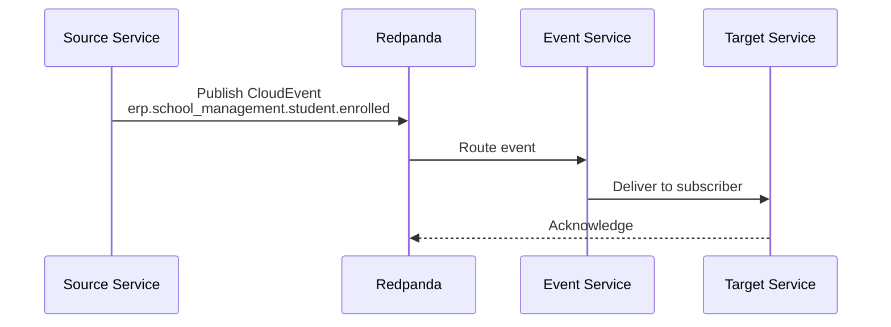

# ERP-School-Management -- Technical Writeup

**Product Name:** EduCore Pro
**Module:** ERP-School-Management
**Version:** 1.0.0
**Date:** 2026-02-23
**Classification:** Internal / Enterprise Architecture Team

---

## 1. Executive Summary

EduCore Pro is an enterprise-grade, globally distributed school management platform engineered as the Education Vertical within a broader ERP ecosystem. The system is designed to serve K-12 institutions, colleges, and multi-campus school groups across 29+ languages, 150+ currencies, and 10+ international curricula including British (GCSE/A-Level/Cambridge IGCSE), American (Common Core/AP), International Baccalaureate (PYP/MYP/DP), French, Nigerian (WAEC/NECO), Kenyan (KCPE/KCSE), South African (ZIMSEC), and Indian standards.

The platform is benchmarked against industry leaders -- PowerSchool, Blackbaud, Classe365, and Fedena -- and differentiates itself through a polyglot microservices architecture, blockchain-verified credentials, AI-powered analytics, gamification, IoT-enabled smart campus features, and a unified data platform (LumaDB) that consolidates operational and analytical workloads.

---

## 2. Technology Stack Overview

### 2.1 Backend Services (25 Microservices)

| Service | Language/Framework | Purpose |
|---|---|---|
| academic-service | NestJS (TypeScript) | Curriculum, grading, timetables, assessments |
| student-service | NestJS (TypeScript) | Student Information System (SIS), enrollment, guardians |
| auth-service | NestJS (TypeScript) | Authentication, MFA, OAuth, session management |
| finance-service | NestJS (TypeScript) | Fees, invoicing, payments, vendor management, assets |
| lms-service | NestJS (TypeScript) | Learning Management, courses, modules, lessons |
| analytics-service | NestJS (TypeScript) | Reporting, dashboards, data aggregation |
| communication-service | NestJS (TypeScript) | SMS, email, push notifications |
| ai-service | Python | Predictive analytics, student performance modeling |
| admin-service | NestJS (TypeScript) | School administration, system configuration |
| integration-service | NestJS (TypeScript) | Third-party integrations, data exchange |
| blockchain-service | NestJS (TypeScript) | Certificate issuance, credential verification |
| gamification-service | NestJS (TypeScript) | Badges, leaderboards, achievement tracking |
| notification-service | NestJS (TypeScript) | Multi-channel notification orchestration |
| placement-service | Rust | Career placement, job matching, internships |
| scholarship-service | Go | Scholarship management, financial aid processing |
| research-service | Rust | Research data management, paper tracking |
| aiops-service | NestJS (TypeScript) | AIOps monitoring, anomaly detection |
| event-service | NestJS (TypeScript) | Event sourcing, CloudEvents backbone |
| file-service | NestJS (TypeScript) | File upload, storage, document management |
| gateway-service | NestJS (TypeScript) | Internal API gateway for service mesh |
| search-service | NestJS (TypeScript) | Full-text search, Elasticsearch integration |
| migration-service | NestJS (TypeScript) | Data migration, schema versioning |
| subscription-service | NestJS (TypeScript) | Subscription tiers, license management |
| iot-service | NestJS (TypeScript) | Smart campus, sensor data, environmental monitoring |
| gateway (ERP) | NestJS (TypeScript) | ERP-level unified API gateway |

### 2.2 Frontend Applications (5 Apps)

| Application | Technology | Target Users |
|---|---|---|
| web | Next.js 14 | School admins, teachers, super admins |
| mobile | Flutter | Students, parents, staff |
| parent-app | Flutter | Parents/guardians |
| teacher-app | Flutter | Teachers |
| bus-app | Flutter | Bus drivers, transport managers |

### 2.3 Data & Infrastructure

| Component | Technology | Role |
|---|---|---|
| LumaDB | PostgreSQL 16 | Unified data platform (OLTP + OLAP) |
| Event Streaming | Redpanda (Kafka-compatible) | Async event backbone |
| BI/Reporting | Apache Superset | Business intelligence dashboards |
| Observability | Grafana + OpenTelemetry | Metrics, logs, traces |
| ORM | Prisma | Schema-first database access |
| Container Orchestration | Docker Compose / Kubernetes | Deployment management |
| Monorepo | Turborepo | Build orchestration |

---

## 3. Architecture Topology

```mermaid
graph TB
    subgraph "Client Layer"
        WEB["Next.js 14 Web App"]
        MOB["Flutter Mobile App"]
        PAR["Flutter Parent App"]
        TEA["Flutter Teacher App"]
        BUS["Flutter Bus Tracker"]
    end

    subgraph "API Layer"
        GW["ERP Gateway<br/>NestJS :8090"]
        GWSVC["Gateway Service"]
    end

    subgraph "Core Services"
        AUTH["Auth Service"]
        STU["Student Service"]
        ACA["Academic Service"]
        FIN["Finance Service"]
        LMS["LMS Service"]
        ADM["Admin Service"]
    end

    subgraph "Support Services"
        COMM["Communication"]
        NOTIF["Notification"]
        FILE["File Service"]
        SEARCH["Search Service"]
        INTEG["Integration"]
        SUB["Subscription"]
        MIG["Migration"]
        EVT["Event Service"]
    end

    subgraph "Innovation Services"
        AI["AI Service<br/>Python"]
        BC["Blockchain"]
        GAME["Gamification"]
        IOT["IoT Service"]
        AIOPS["AIOps"]
        PLACE["Placement<br/>Rust"]
        SCHOL["Scholarship<br/>Go"]
        RES["Research<br/>Rust"]
        ANA["Analytics"]
    end

    subgraph "Data Layer"
        LUMA["LumaDB<br/>PostgreSQL 16"]
        RP["Redpanda<br/>Event Streaming"]
    end

    subgraph "Observability"
        GF["Grafana"]
        OTEL["OpenTelemetry Collector"]
        SS["Apache Superset"]
    end

    WEB & MOB & PAR & TEA & BUS --> GW
    GW --> GWSVC
    GW --> AUTH & STU & ACA & FIN & LMS & ADM
    GW --> COMM & NOTIF & FILE & SEARCH & INTEG & SUB
    GW --> AI & BC & GAME & IOT & AIOPS & PLACE & SCHOL & RES & ANA

    AUTH & STU & ACA & FIN & LMS --> LUMA
    AUTH & STU & ACA & FIN --> RP
    RP --> OTEL
    OTEL --> GF
    LUMA --> SS
```

---

## 4. Multi-Tenancy Architecture

EduCore Pro implements a schema-per-school multi-tenancy model with tenant isolation enforced at the gateway level:

- **Tenant Identification**: Every business route requires the `X-Tenant-ID` header, which maps to a `school_id` in the database.
- **JWT Authentication**: Bearer tokens are issued by ERP-IAM using OIDC/JWT standards.
- **Entitlement Checks**: The gateway validates subscriptions and feature entitlements against ERP-Platform before routing requests.
- **Data Isolation**: Row-level security (RLS) policies ensure that queries never cross tenant boundaries. Every core table includes a `school_id` or `tenant_id` foreign key.

---

## 5. Multi-Curriculum Support

The academic-service implements a flexible curriculum engine supporting:

| Curriculum | Region | Grading System |
|---|---|---|
| WAEC | Nigeria | Letter (A1-F9) |
| NECO | Nigeria | Letter (A1-F9) |
| KCPE / KCSE | Kenya | Points-based |
| ZIMSEC | Southern Africa | Percentage |
| Cambridge IGCSE/AS/A-Level | Global | Letter (A*-U) |
| IB PYP/MYP/DP | Global | Points (1-7) |
| Common Core | USA | Standards-based |
| AP | USA | Score (1-5) |
| GCSE / A-Level | UK | Letter (9-1 / A*-E) |
| Custom | Any | Configurable |

Each curriculum defines its own `GradingScale` with `GradeLevel` entries that map raw scores to letter grades, GPA values, and descriptive labels. Schools can adopt multiple curricula simultaneously through the `SubjectCurriculum` model.

---

## 6. Event-Driven Architecture

All services communicate asynchronously through Redpanda (Kafka-compatible) using CloudEvents envelope format:

**Topic Naming Convention:** `erp.<module>.<entity>.<action>`

**Proto-defined envelope** (`events.proto`) includes:
- Event metadata (ID, type, timestamp, region)
- Device information (type, OS, browser, IP hash)
- Typed payloads: ProgressEvent, SessionEvent, AssessmentEvent, EngagementEvent

---

## 7. Database Schema Highlights

The system employs 27+ core tables across services. Key entities:

- **schools**: Multi-tenant root entity with subscription tier, timezone, currency configuration
- **users**: Role-based access (super_admin, admin, principal, teacher, staff, parent, student) with MFA support
- **students**: Comprehensive SIS with medical info, dietary profiles, enrollment tracking
- **academic_years / terms**: Flexible academic calendar (term, semester, quarter, trimester)
- **courses / sections / enrollments**: Full course lifecycle with section-level teacher assignment
- **assignments / submissions / grades**: Multi-type assessment engine (quiz, test, project, rubric, standards-based)
- **invoices / payments / fee_types**: Complete financial management with installment plans, 10+ payment methods
- **blockchain_credentials**: Immutable credential verification with IPFS storage

---

## 8. Performance & Scalability

- **Geo-Partitioning**: LMS data is partitioned by region (US, EU, APAC, LATAM, MEA) using YugabyteDB-compatible composite keys
- **Trigram Indexes**: `pg_trgm` extension enables fuzzy full-text search on student names and product catalogs
- **JSONB Columns**: Flexible schema extension through `settings`, `custom_fields`, `metadata` JSONB columns
- **Connection Pooling**: PgBouncer manages connection pools across 25 services
- **Build Performance**: Turborepo caches build artifacts with hash-based invalidation

---

## 9. Security Posture

- OIDC/JWT authentication via ERP-IAM
- MFA with TOTP and backup codes
- Password policies with forced rotation and account lockout
- OAuth2 social login (Google, Microsoft, Facebook)
- AIDD governance guardrails (`erp/aidd.guardrails.yaml`)
- Audit logging with trigger-based capture (entity snapshots, IP tracking)
- FERPA, GDPR, COPPA, NDPR compliance-ready

---

## 10. Competitive Positioning

| Feature | EduCore Pro | PowerSchool | Blackbaud | Classe365 | Fedena |
|---|---|---|---|---|---|
| Multi-curriculum | 10+ | 3 | 2 | 5 | 3 |
| Blockchain credentials | Yes | No | No | No | No |
| AI predictions | Yes | Limited | No | Basic | No |
| IoT smart campus | Yes | No | No | No | No |
| Gamification | Yes | No | No | Basic | No |
| Open API | REST + Events | REST | REST | REST | REST |
| Multi-language | 29+ | 10+ | 5+ | 20+ | 10+ |
| Multi-currency | 150+ | 10+ | 5+ | 30+ | 10+ |
| Mobile apps | 4 (Flutter) | 2 | 1 | 1 | 1 |
| Bus tracking | Real-time | Add-on | No | No | No |
