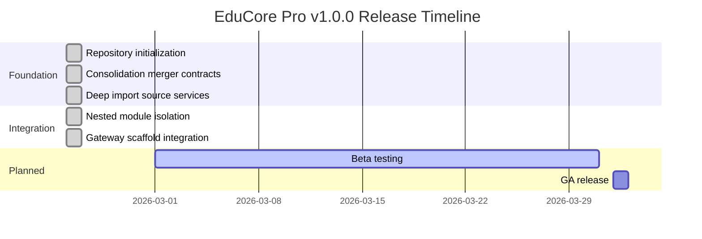

# ERP-School-Management -- Release Notes

**Product:** EduCore Pro
**Module:** ERP-School-Management
**Current Version:** 1.0.0
**Release Date:** 2026-02-23

---

## Version 1.0.0 -- Initial Release (2026-02-23)

### Overview

The inaugural release of EduCore Pro establishes the complete school management platform with 25 microservices, 5 frontend applications, and comprehensive data infrastructure. This release consolidates the School-Mgt-SaaS source codebase into the ERP module structure with full gateway integration.

### Release Timeline

### New Features

#### Core Platform
- **25 Microservices**: Full polyglot backend (NestJS, Go, Rust, Python)
- **5 Frontend Applications**: Next.js 14 web, Flutter mobile/parent/teacher/bus apps
- **ERP Gateway**: NestJS-based unified API gateway at port 8090
- **LumaDB Integration**: PostgreSQL 16 unified data platform
- **Redpanda Event Backbone**: Kafka-compatible async messaging
- **OpenTelemetry Observability**: Distributed tracing, metrics, logs

#### Academic Management
- Multi-curriculum support (10+ standards: WAEC, NECO, KCPE, KCSE, ZIMSEC, Cambridge IGCSE, IB, Common Core, AP, GCSE)
- Flexible grading scales (percentage, letter, GPA, points, descriptive)
- Academic year/term management with mid-break scheduling
- Timetable slot management with day-of-week scheduling
- Assessment engine (15+ types: quiz, test, exam, midterm, final, project, lab work, etc.)
- Student grade tracking with draft/submitted/published/locked workflow

#### Student Information System
- Comprehensive student profiles with medical and dietary information
- Guardian management with relationship types and emergency contact tracking
- Enrollment lifecycle (active, inactive, graduated, suspended, withdrawn, expelled)
- Incident management with severity levels and investigation tracking
- Academic progress tracking with GPA and cumulative calculations
- Transcript generation with official/unofficial designation

#### Finance & Billing
- Fee structure management with 13 fee types (tuition, registration, examination, etc.)
- Installment payment plans with configurable schedules
- 11 payment methods (cash, bank transfer, card, mobile money, Stripe, Paystack, Flutterwave)
- Vendor management with contact tracking and receivables
- Asset management with maintenance scheduling
- School feeding subscriptions and wallet system
- Financial aid (scholarships, bursaries, discounts)

#### Learning Management System
- Geo-partitioned course content (US, EU, APAC, LATAM, MEA regions)
- Module and lesson hierarchy with ordering
- 6 lesson types (video, text, quiz, interactive, assignment, live session)
- Enrollment progress tracking with time-on-task metrics
- Certificate generation with verification URLs
- Organization-based B2B LMS support

#### Communication & Notifications
- Multi-channel messaging (SMS, email, push, in-app)
- Announcement system with target audience filtering
- Payment reminder automation (upcoming, due, overdue, final notice)
- Communication preference management per guardian

#### Security & Authentication
- JWT/OIDC authentication via ERP-IAM
- Multi-factor authentication (TOTP with backup codes)
- OAuth2 social login (Google, Microsoft, Facebook)
- Session management with device tracking and revocation
- Account lockout after failed login attempts
- Biometric attendance (fingerprint, facial recognition)

#### Innovation Features
- Blockchain-verified certificates with IPFS storage
- AI-powered predictive analytics
- Gamification engine (badges, leaderboards)
- IoT smart campus integration
- AIOps monitoring and anomaly detection
- Career placement service (Rust)
- Research data management (Rust)

### Infrastructure
- Docker Compose configuration for all 25+ services
- Kubernetes manifests for production deployment
- Grafana dashboards for monitoring
- Apache Superset for business intelligence
- OpenTelemetry collector for distributed tracing
- Turborepo build orchestration

### Database Migrations
- `001_initial_schema.sql`: Complete schema with 27+ tables, indexes, triggers, audit functions, and views
- Auth service: Geo-partitioning migration
- LMS service: Partitioned init + lesson content migration

### Known Issues
- Placement service, scholarship service, event service, and AIOps service are running as placeholder containers pending full implementation
- GraphQL schema is planned but not yet implemented (REST-first approach)
- Bus tracking real-time WebSocket connections limited to single-node deployment

### Upgrade Path
This is the initial release. Future versions will follow semantic versioning (MAJOR.MINOR.PATCH).

### Commit History

| Hash | Date | Description |
|---|---|---|
| `dd07bd6` | 2026-02-23 | feat: integrate school management sources and nest gateway scaffold |
| `e6e68c6` | 2026-02-23 | chore: isolate imported source trees as nested modules |
| `67129e2` | 2026-02-23 | feat: deep import selected source service directories for consolidation |
| `b6ce87b` | 2026-02-23 | feat: apply consolidation merger contracts and module scaffolds |
| `c2638e3` | 2026-02-23 | chore: initialize ERP-School-Management |

---

## Roadmap: Upcoming Releases

### Version 1.1.0 (Planned Q2 2026)
- Library management module
- Transport route optimization with live GPS tracking
- Parent-teacher conference scheduling
- Hostel/dormitory management

### Version 1.2.0 (Planned Q3 2026)
- Full GraphQL API layer
- Advanced AI: dropout prediction, learning path recommendation
- WhatsApp Business API integration
- Multi-campus federation

### Version 2.0.0 (Planned Q4 2026)
- Complete Go and Rust service implementations
- Real-time collaboration (shared documents, whiteboards)
- Offline-first mobile with conflict resolution
- Advanced blockchain: decentralized identity (DID)
