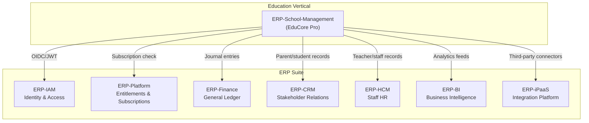
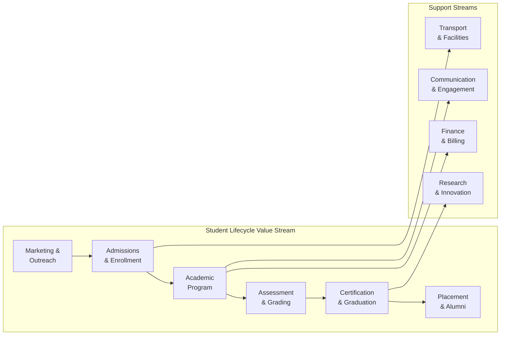
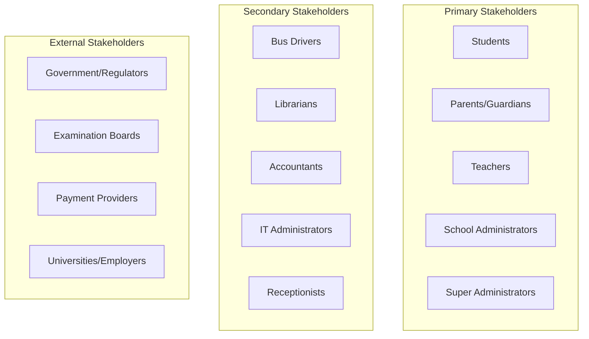
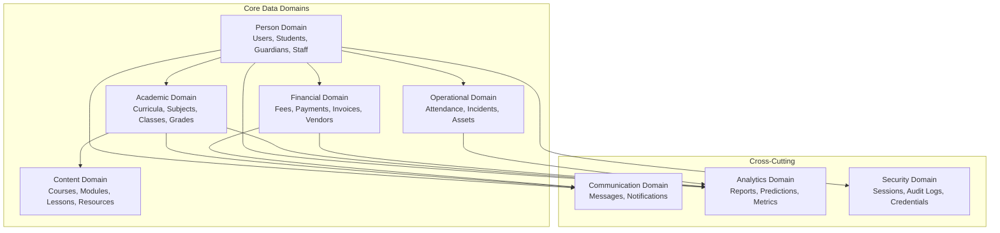
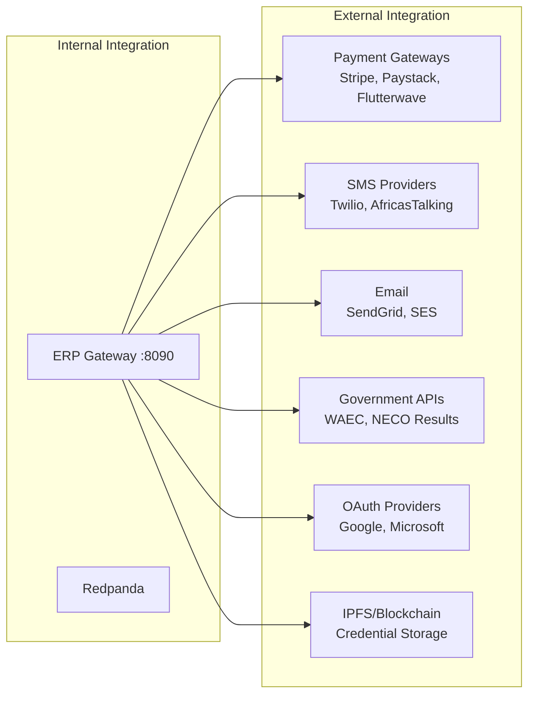
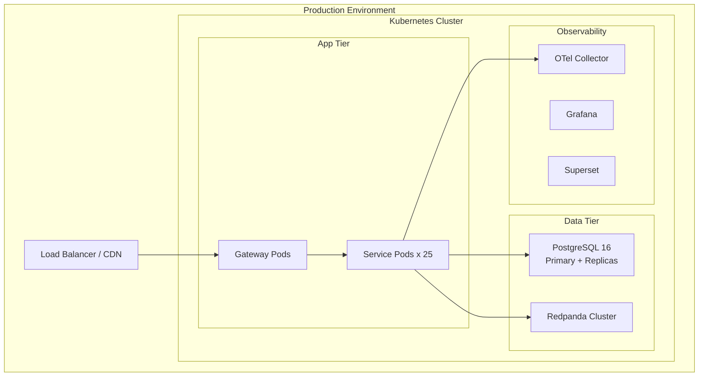

# ERP-School-Management -- Enterprise Architecture

**Product:** EduCore Pro
**Module:** ERP-School-Management
**Architecture Framework:** TOGAF-aligned
**Date:** 2026-02-23

---

## 1. Enterprise Context

EduCore Pro operates as the Education Vertical within a comprehensive ERP suite. It integrates with horizontal ERP modules (IAM, Platform, Finance, CRM) while providing domain-specific capabilities for educational institutions worldwide.



---

## 2. Business Architecture

### 2.1 Value Stream Map



### 2.2 Capability Map

| Capability Domain | Sub-Capabilities | Service Owner |
|---|---|---|
| Identity & Access | Authentication, Authorization, SSO, MFA | auth-service |
| Student Management | Registration, Enrollment, Profiles, Medical Records | student-service |
| Academic Management | Curriculum, Subjects, Classes, Timetabling, Scheduling | academic-service |
| Assessment & Grading | Tests, Exams, Assignments, Grade Books, Report Cards | academic-service |
| Learning Management | Course Content, Lessons, Progress Tracking, Certificates | lms-service |
| Financial Management | Fee Structures, Invoicing, Payments, Scholarships | finance-service |
| Communication | Messaging, Announcements, SMS/Email, Push Notifications | communication-service |
| Administration | School Config, Staff Management, Asset Management | admin-service |
| Analytics & BI | Dashboards, Reports, Predictive Models | analytics-service |
| AI & Machine Learning | Performance Prediction, Anomaly Detection, Recommendations | ai-service |
| Integration | Third-party APIs, Data Import/Export, Webhooks | integration-service |
| Blockchain | Credential Verification, Certificate Issuance | blockchain-service |
| Gamification | Badges, Points, Leaderboards, Achievements | gamification-service |
| IoT & Smart Campus | Sensor Data, Environmental Monitoring, Access Control | iot-service |
| Career Services | Placement, Internships, Job Matching | placement-service |
| Research | Paper Tracking, Research Data, Grants | research-service |
| Scholarship | Financial Aid, Bursary Management | scholarship-service |

### 2.3 Stakeholder Analysis



---

## 3. Information Architecture

### 3.1 Data Domains



### 3.2 Data Governance

| Aspect | Policy |
|---|---|
| Data Residency | Geo-partitioned by region (US, EU, APAC, LATAM, MEA) |
| Data Retention | Student records: 7 years post-graduation |
| Data Classification | PII (Name, DOB, Medical), Sensitive (Grades, Financial), Public (Course catalog) |
| Data Quality | Prisma schema validation, database constraints, trigger-based auditing |
| Master Data | Schools, Academic Years, Curricula managed centrally |

---

## 4. Technology Architecture

### 4.1 Technology Radar

| Quadrant | Technology | Status |
|---|---|---|
| Languages | TypeScript, Go, Rust, Python | Adopt |
| Frameworks | NestJS, Next.js 14, Flutter | Adopt |
| Data | PostgreSQL 16, Prisma ORM | Adopt |
| Streaming | Redpanda (Kafka-compatible) | Adopt |
| Observability | Grafana, OpenTelemetry | Adopt |
| BI | Apache Superset | Trial |
| Blockchain | Ethereum/IPFS | Trial |
| AI/ML | Python ML stack | Trial |
| IoT | MQTT/Sensor mesh | Assess |
| Build | Turborepo | Adopt |

### 4.2 Integration Architecture



### 4.3 Deployment Architecture



---

## 5. Application Architecture

### 5.1 Monorepo Structure

```
ERP-School-Management/
  apps/
    web/           -- Next.js 14 admin/teacher portal
    mobile/        -- Flutter student/parent app
    parent-app/    -- Flutter dedicated parent app
    teacher-app/   -- Flutter dedicated teacher app
    bus-app/       -- Flutter bus tracking app
  services/        -- 25 microservices
  packages/
    config/        -- Shared configuration
    database/      -- Database utilities
    logger/        -- Logging library
    superset-adapter/ -- BI integration
    types/         -- Shared TypeScript types
    ui/            -- Shared UI components
    utils/         -- Common utilities
  gateway/         -- ERP unified gateway
  infra/
    grafana/       -- Dashboard configurations
    infrastructure/ -- IaC templates
    k8s/           -- Kubernetes manifests
    otel/          -- OpenTelemetry config
    superset/      -- Superset configuration
  database/        -- Global migrations
  proto/           -- Protobuf contracts
  docs/            -- Architecture documentation
```

### 5.2 Service Communication Patterns

| Pattern | Implementation | Usage |
|---|---|---|
| Synchronous REST | HTTP via Gateway | User-facing queries, CRUD operations |
| Asynchronous Events | Redpanda CloudEvents | Cross-service notifications, audit logging |
| Proto Contracts | Protobuf | Event schema definition |
| Health Checks | GET /healthz | Kubernetes liveness/readiness probes |
| Capability Discovery | GET /v1/capabilities | Service feature negotiation |

---

## 6. Governance & Compliance

### 6.1 Regulatory Requirements

| Regulation | Scope | Implementation |
|---|---|---|
| FERPA | US student records | Role-based access, audit logs, data minimization |
| GDPR | EU data subjects | Geo-partitioning, right to erasure, consent management |
| COPPA | US children under 13 | Parental consent flow, data collection limits |
| NDPR | Nigerian data protection | Local data residency, DPO appointment |
| POPIA | South Africa | Lawful processing, purpose limitation |

### 6.2 Architecture Decision Records

All significant architectural decisions are tracked in `docs/ADR/` following the MADR format. Key decisions include:
- ADR-001: Adopt polyglot microservices architecture
- ADR-002: Select PostgreSQL as unified data platform
- ADR-003: Implement geo-partitioning for GDPR compliance
- ADR-004: Use Redpanda over Apache Kafka for event streaming

---

## 7. Enterprise Integration Contracts

### 7.1 ERP Suite Integration Points

| Integration | Protocol | Direction | Data Flow |
|---|---|---|---|
| ERP-IAM | OIDC/JWT | Bidirectional | Authentication tokens, user provisioning |
| ERP-Platform | REST | Inbound | Subscription entitlements, feature flags |
| ERP-Finance | Events | Outbound | Fee payments, journal entries |
| ERP-CRM | Events | Bidirectional | Parent/student contact records |
| ERP-HCM | Events | Bidirectional | Teacher/staff employment records |
| ERP-BI | REST/Events | Outbound | Analytics data feeds |

### 7.2 Runtime Contracts

- **Entitlements**: ERP-Platform subscription hub validates school tier
- **Identity**: ERP-Directory / ERP-IAM provides unified identity
- **Event Backbone**: Redpanda (upgrade path to NATS/Pulsar)
- **Guardrails**: AI development governance via `erp/aidd.guardrails.yaml`
