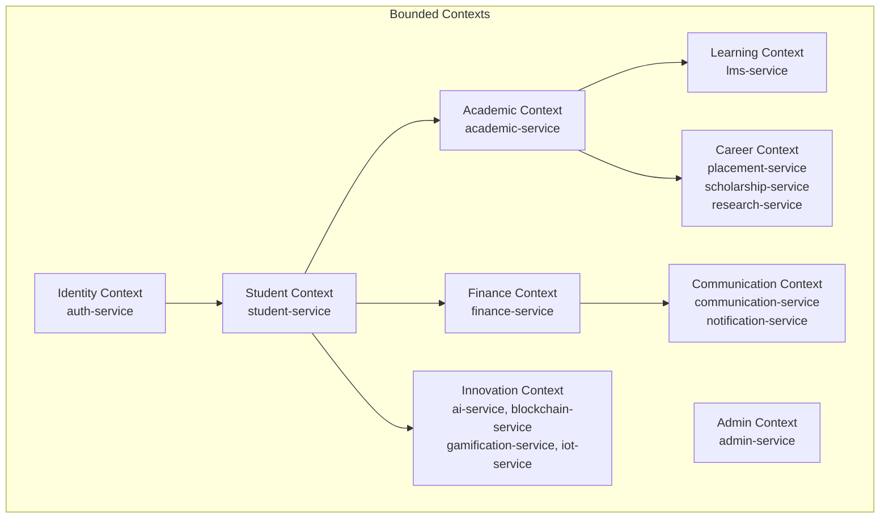
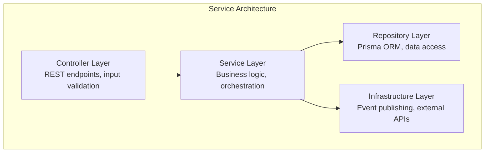
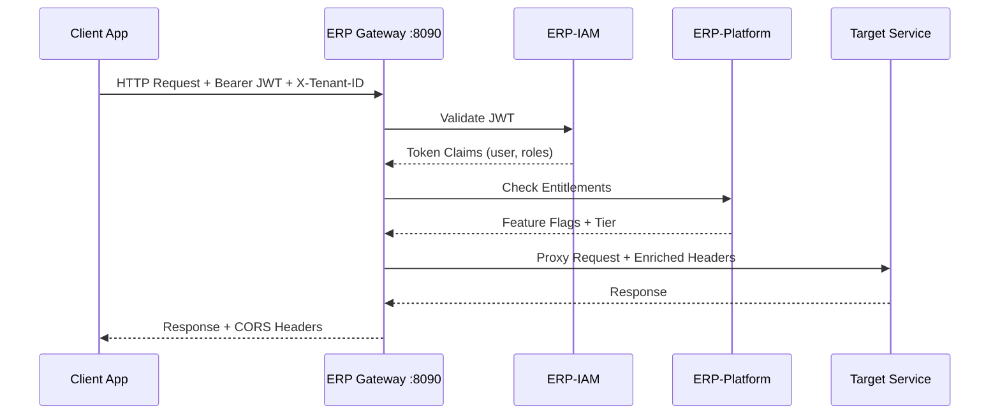
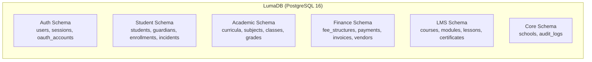
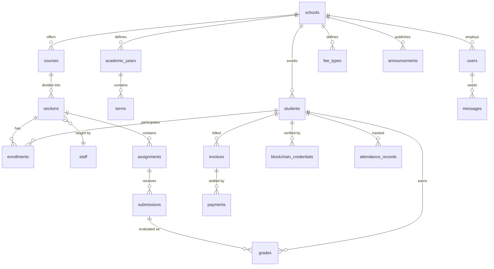
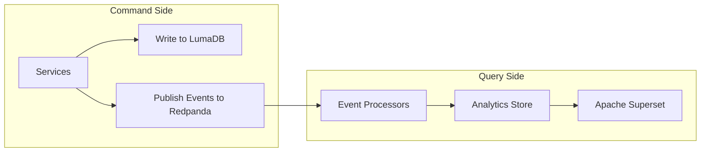
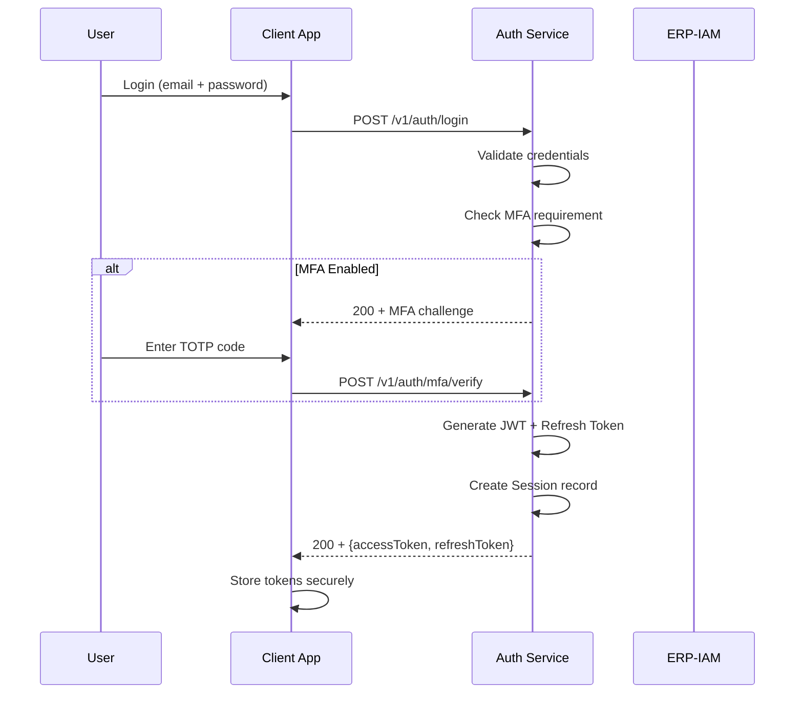
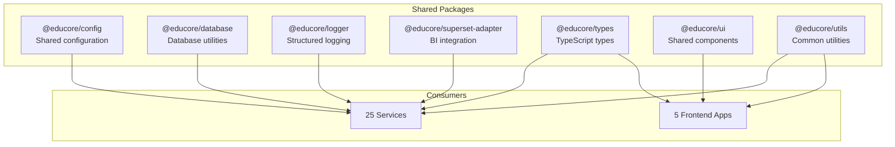

# ERP-School-Management -- Software Architecture

**Product:** EduCore Pro
**Version:** 1.0.0
**Date:** 2026-02-23

---

## 1. Architecture Style

EduCore Pro follows a **domain-driven microservices architecture** with event sourcing for cross-cutting concerns. The system is organized into bounded contexts aligned with educational domain capabilities.



---

## 2. Layered Architecture per Service

Each NestJS service follows a clean layered architecture:



### 2.1 NestJS Service Structure

```
services/<service-name>/
  src/
    main.ts                 -- Application bootstrap
    app.module.ts           -- Root module
    controllers/            -- HTTP request handlers
    services/               -- Business logic
    repositories/           -- Data access layer
    dto/                    -- Data transfer objects
    entities/               -- Domain entities
    guards/                 -- Authentication/authorization guards
    interceptors/           -- Request/response interceptors
    pipes/                  -- Validation pipes
    generated/prisma/       -- Generated Prisma client
  prisma/
    schema.prisma           -- Database schema
    migrations/             -- Database migrations
  Dockerfile                -- Container image definition
  package.json              -- Dependencies
  tsconfig.json             -- TypeScript configuration
```

### 2.2 Rust Service Structure (placement-service, research-service)

```
services/<service-name>/
  src/
    main.rs                 -- Entry point
    lib.rs                  -- Library root
    handlers/               -- HTTP handlers
    models/                 -- Domain models
    services/               -- Business logic
    db/                     -- Database access
  Cargo.toml                -- Dependencies
  Dockerfile                -- Container image
```

### 2.3 Go Service Structure (scholarship-service)

```
services/<service-name>/
  cmd/
    main.go                 -- Entry point
  internal/
    handlers/               -- HTTP handlers
    models/                 -- Domain models
    services/               -- Business logic
    repository/             -- Data access
  go.mod                    -- Dependencies
  Dockerfile                -- Container image
```

---

## 3. API Gateway Architecture

The ERP gateway implements the API Gateway pattern, serving as the single entry point for all client applications.



### Gateway Routing

| Route Pattern | Target | Description |
|---|---|---|
| `GET /healthz` | Gateway | Health check endpoint |
| `GET /v1/capabilities` | Gateway | Feature discovery |
| `ALL /v1/academic/*` | academic-service | Academic operations |
| `ALL /v1/students/*` | student-service | Student operations |
| `ALL /v1/auth/*` | auth-service | Authentication |
| `ALL /v1/finance/*` | finance-service | Financial operations |
| `ALL /v1/lms/*` | lms-service | Learning management |
| `ALL /v1/admin/*` | admin-service | Administration |
| `ALL /v1/events` | event-service | Event publishing |
| `ALL /v1/:service/*` | Dynamic routing | Catch-all service proxy |

---

## 4. Data Architecture

### 4.1 Database Per Service (Logical Separation)

All services share a single PostgreSQL instance (LumaDB) with logical schema separation. Each service's Prisma schema defines its own models.



### 4.2 Schema Relationships



### 4.3 CQRS Pattern (Analytics)



---

## 5. Authentication & Authorization Architecture

### 5.1 Authentication Flow



### 5.2 Role-Based Access Control

| Role | Access Level | Typical Operations |
|---|---|---|
| SUPER_ADMIN | Full system | Multi-school management, system configuration |
| SCHOOL_ADMIN | School-wide | School settings, staff management, reports |
| PRINCIPAL | School-wide (read-heavy) | Dashboards, approvals, reports |
| VICE_PRINCIPAL | Department-level | Department oversight, schedule management |
| TEACHER | Class-level | Gradebook, attendance, assignments, LMS content |
| STUDENT | Self + enrolled classes | View grades, submit assignments, access LMS |
| PARENT | Child's data | View grades, pay fees, communicate with teachers |
| ACCOUNTANT | Financial data | Fee management, payment processing, reports |
| LIBRARIAN | Library data | Catalog management, book loans |
| IT_ADMIN | Technical systems | User provisioning, system health |
| RECEPTIONIST | Front desk | Visitor management, basic student lookup |

---

## 6. Event Architecture

### 6.1 CloudEvents Envelope

```json
{
  "specversion": "1.0",
  "type": "erp.school_management.student.enrolled",
  "source": "/services/student-service",
  "id": "uuid-v4",
  "time": "2026-02-23T10:30:00Z",
  "datacontenttype": "application/json",
  "data": {
    "studentId": "uuid",
    "schoolId": "uuid",
    "gradeLevel": "Grade 10",
    "academicYearId": "uuid"
  }
}
```

### 6.2 Event Catalog

| Event Type | Producer | Consumers |
|---|---|---|
| `student.enrolled` | student-service | finance, academic, notification |
| `student.graduated` | academic-service | blockchain, placement, analytics |
| `grade.published` | academic-service | notification, analytics, ai |
| `payment.completed` | finance-service | notification, analytics |
| `attendance.marked` | academic-service | notification, analytics, ai |
| `assignment.submitted` | lms-service | academic, notification, gamification |
| `certificate.issued` | blockchain-service | notification, analytics |
| `assessment.graded` | academic-service | notification, analytics, gamification |

---

## 7. Shared Packages Architecture



---

## 8. Error Handling Strategy

### 8.1 Standard Error Response

```json
{
  "statusCode": 400,
  "error": "VALIDATION_ERROR",
  "message": "Invalid student enrollment data",
  "details": [
    {
      "field": "dateOfBirth",
      "constraint": "Must be a valid date in the past"
    }
  ],
  "traceId": "otel-trace-uuid",
  "timestamp": "2026-02-23T10:30:00Z"
}
```

### 8.2 Error Categories

| Category | HTTP Code | Handling |
|---|---|---|
| Validation | 400 | Return field-level details |
| Authentication | 401 | Redirect to login |
| Authorization | 403 | Log access attempt |
| Not Found | 404 | Return entity type |
| Conflict | 409 | Return conflicting field |
| Rate Limit | 429 | Return retry-after header |
| Internal | 500 | Log full trace, return generic message |

---

## 9. Scalability Patterns

| Pattern | Implementation |
|---|---|
| Horizontal Scaling | Kubernetes HPA on CPU/memory metrics |
| Database Read Replicas | PostgreSQL streaming replication |
| Event-Driven Decoupling | Redpanda for async processing |
| Caching | Redis (planned) for session and query caching |
| CDN | Static assets served via CDN |
| Connection Pooling | PgBouncer for database connections |
| Build Caching | Turborepo remote caching |
